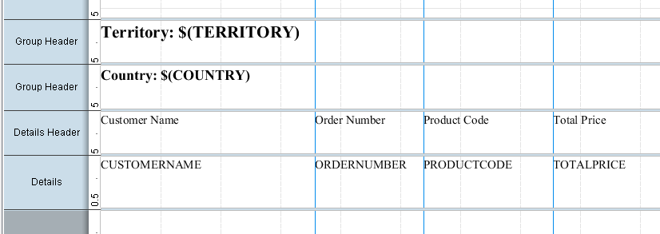

# Practice: Data Elements and Report Groups

> **Warning:**
>
> #### Workshop - Practice: Data Elements and Report Groups
>
> Build a grouped report on your own — this exercise mirrors the guided demonstration without the step-by-step help.
>
> **What you'll do**
>
> * Build a grouped report on your own, without step-by-step help.
> * Add data elements, a group, and group headers.
> * Check your result against the target layout.
>
> **Prerequisites:** Complete this section's guided demonstrations first
>
> **Estimated Time:** 20 minutes

---

> **Note:**
>
> #### **Practice: Data Elements and Report Groups**
>
> Build a grouped report on your own — this exercise mirrors the guided demonstration without the step-by-step help.

## Data Elements

Add the Customer Name, Order Number, Product Code, and Total Price data elements to the Details band.

1. Open the Exercise – sql query.prpt
Add the following Elements to the Details band:

* CUSTOMERNAME
* ORDERNUMBER
* PRODUCTCODE
* TOTALPRICE

## Align the Elements

1. To align the elements in the Details band.
2. Zoom the report canvas to 150%.
3. Add vertical guides, in the top ruler, click to add guides at 2.5 inches or 6 cm, 3.75 inches or 9.5 cm,  and 5.25 inches or 13.5 cm.
4. Align the CUSTOMERNAME to the first vertical guide.
5. Align ORDERNUMBER from the first to the second vertical guide.
6. Resize the other Elements.
7. Lasso to select all the Elements and Format > Align > Top (Hold down Shift).
8. Preview the report.
## Add Label Elements

To add label elements for the column headings:

1. Enable the Details Header band.
2. Resize the Details Header band to .05” below Report Header.
3. Add and resize the Order Number label, above the CUSTOMERNAME Element
4. Repeat the workflow to add the other Labels.
5. Resize the other Elements.
6. Lasso to select all the Elements and Format > Align > Top.
7. Preview the report.
## Report Groups

1. To create groups for Country and Territory and add message elements identifying the Country and Territory to the Group Header bands:
2. To add a group for Country.
3. To add a message element to identify the Country, on the Elements Palette, click the message icon, and then drag it to the top left corner of the Group Header band.
4. Replace the Message text with Country: $(COUNTRY).
5. Resize to the first vertical guide.
6. To add a group for Territory.
7. To add a message element to identify the Territory, on the Elements Palette, click the message icon, and then drag it to the top left corner of the Group Header band.
8. Replace the Message text with Territory: $(TERRITORY).
9. Resize to the second vertical guide.
10. Preview and Save the report: Exercise – data elements.prpt

