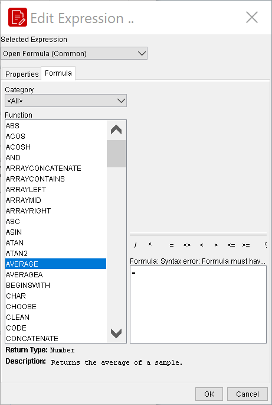
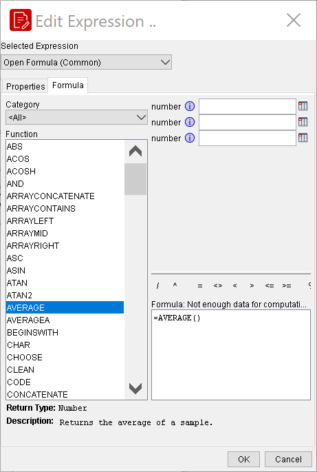

# Overview of Calculations

> **Note:**
>
> Formulas and functions bring logic into a report — from computed columns to formatting that reacts to the data.

There is much you can do with multiple data-driven elements in Report Designer. This section explains how to group, summarize, and associate multiple report elements.

## Using the Formula Editor (Expressions)

When adding conditional formatting or other constraints on data-driven report elements, you have the option of using a built-in Formula Editor to help you build an expression with a graphical interface. All element properties in Report Designer can have formulas. You can type in your own formula by hand, but it's much easier to use the built-in Formula Editor to build an expression.

The Formula Editor provides you with basic math and comparison operators so that you don't have to enter them manually. Also provided are concatenate and percent functions. Click the (Field Selector) to select fields in the report.

## Formula Editor

* Click on the element you want to add a condition or constraint to.
* In the Style pane, select the property you want to add a constraint to, then click the round green + icon on the right side of the field.
* Click the ... button.
The Formula Editor window appears.

* Select a function category from the drop-down box.
The default category is All.

* Select a function from the Functions list.
If you click on a function, a description of what it does will appear in the tan-coloured field at the bottom of the window.

* Double-click on a function to bring up the option fields.

* Erase the default values in the option fields, and replace them with your own settings. If you need to associate a column with a function, click the Select Field button to the right of the field, then select the data or function you want to use.
Follow proper SQL syntax in your options; all values must be in quotes, and all column names must be in uppercase letters and enclosed in square brackets.

* When you're done, click OK, then click Close.
You have applied a formula to a report element.

If you need more information on formula functions, conditions, and operators, refer to the OASIS OpenFormula reference:

http://www.oasis-open.org/committees/download.php/16826/openformula-spec-20060221.html.

Pentaho does not implement all OpenFormula functions, but the ones included in Report Designer are documented sufficiently on the OASIS Web site.

## Learn more

- [Pentaho Report Designer documentation](https://docs.pentaho.com/pba-report-designer) - the official reference for everything in this section.
