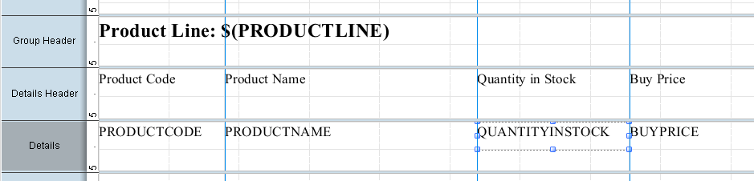
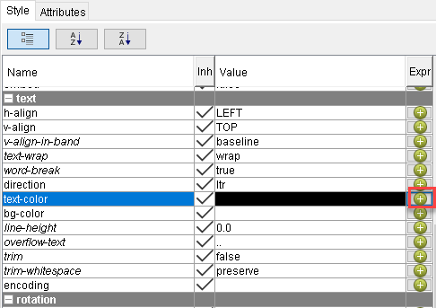
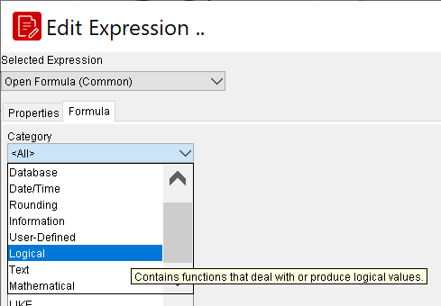
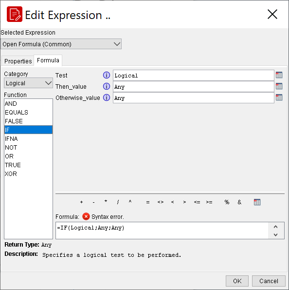

# Conditional Formatting

> **Warning:**
>
> #### Workshop - Conditional Formatting
>
> Use a formula to change an element's formatting based on the data it displays.
>
> **What you'll do**
>
> * Write a formula that reacts to the data in each row.
> * Drive an element's style from that formula.
> * Preview the report and watch the formatting change with the data.
>
> **Prerequisites:** Report Designer running, with the Pentaho sample data (HSQLDB) started
>
> **Estimated Time:** 15 minutes

---

> **Note:**
>
> #### **Conditional Formatting**
>
> Use a formula to change an element's formatting based on the data it displays.

## Conditional Formatting

In this demonstration you will use the Formula Editor to change the text colour of the Quantity in Stock depending on the value of the field.

* To select QUANTITYINSTOCK, on the canvas, in the Details band, click QUANTITYINSTOCK

* To access the Formula Editor for the text colour, on the Style pane, click the round green + icon to the right of text > text-color.

The Formula Editor provides a list of built-in functions to help you build a formula expression. Alternatively, you can type the formula directly in the Formula pane. For this example, you are using an If statement to format the text colour.

* To narrow the list of functions, from the Category drop-down list, select Logical.

* To begin composing an If statement, from the Function list, double-click on IF.

* To select Quantity in Stock, in the Formula Editor dialog:
* Click the Select Field icon to the right of the Test field.
* In the Select Field dialog, click QUANTITYINSTOCK.
* Click OK.
* To change the text colour to red if the Quantity in Stock is less than 1000:
* For Test, after [QUANTITYINSTOCK] type <1000.
* For Then value, type “RED” (including the quotation marks).
* For Otherwise value, type “BLACK” (including the quotation marks).
## =IF([QUANTITYINSTOCK]<1000;"RED";"BLACK")

![=IF([QUANTITYINSTOCK]<1000;"RED";"BLACK")](../_assets/images/mod5-07.png)

If there is an error in the text of the formula, text will appear to warn us. Otherwise, the formula editor will try to show us the result that our formula will return. When it is not possible to visualize the result that a formula will return, this is usually because the values used are calculated during the execution of the report.

* Close all windows.
* Preview and Save the report: Demo - conditional formatting.prpt
Functions

Functions have access to the data row and can access other functions or expressions or the data source. Functions are stateful, meaning they maintain their state during the report generation.

![=IF([QUANTITYINSTOCK]<1000;"RED";"BLACK")](../_assets/images/mod5-08.png)

## Lab files

<button data-launch="prd" data-path="files/Training Demo Report 5 conditional formatting.prpt">Open: Solution: conditional formatting</button>

