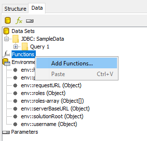
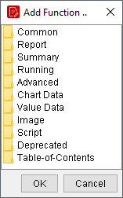
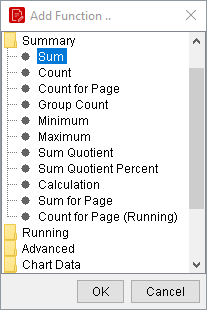
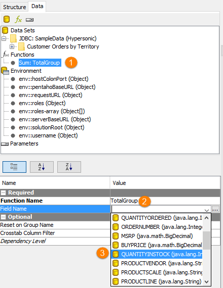
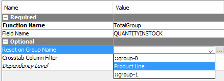
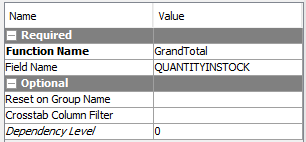
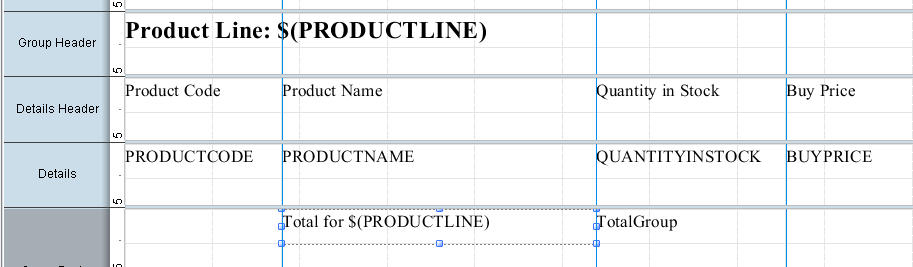
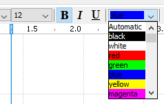
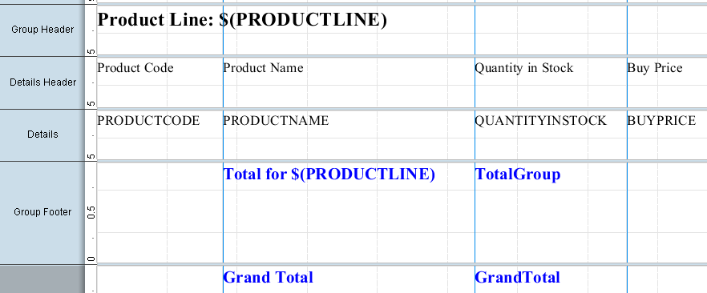

# Totals

> **Warning:**
>
> #### Workshop - Totals
>
> Add running and aggregate totals at group and report level.
>
> **What you'll do**
>
> * Add functions for group and report totals.
> * Place running totals in group footers.
> * Preview and sanity-check the numbers.
>
> **Prerequisites:** Report Designer running, with the Pentaho sample data (HSQLDB) started
>
> **Estimated Time:** 10 minutes

---

> **Note:**
>
> #### **Totals**
>
> Add running and aggregate totals at group and report level.

## Functions

Report functions are commonly used to calculate group and report level aggregations, such as totals and averages, but they can also be used to format report content or generate row level calculations. Functions can use values available in the dataset or use a value returned from another function. Functions are often parameterized by outputs of other functions. Functions are added from the Data pane.

* Open the Demo - conditional formatting.prpt
* On the Data pane, right-click Functions, and click Add Functions.

* To select the Sum function, from the Add Function dialog:
* Double-click Summary.
* Click Sum.
* Click OK.

* To customize the function, on the Data pane, click Sum: TotalGroupSumFunction( )

* Change the Function Name: TotalGroup
* To apply the sum function to Quantity in Stock, in the bottom pane, for Field Name, click in the Value column, and then from the drop-down list, select QUANTITYINSTOCK.
* To reset the sum function for each group, in the bottom pane, for Reset on Group Name, click in the Value column, and then from the drop-down list, select Product Line Group.

* To add another function to sum the Quantity in Stock for the entire report, on the Data pane, right-click Functions, and then click Add Functions.
* Repeat the workflow, renaming the function: GrandTotal

* Select Sum:TotalGroup, and drag it to the Group Footer band, directly below QUANTITYINSTOCK.
* Drag a message element to the canvas, and drop it in the Group Footer band directly below PRODUCTNAME.
* Edit the message element:
* Resize the element.
* Double-click in the centre of the message element to select it.
* Click the … button to open the editor.
* Replace the Message text with Total for $(PRODUCTLINE).
* Click OK.

* To format the elements in the Group Footer band, on the canvas:
* Click the Total for $(PRODUCTLINE) message element.
* Hold the Shift key and click the TotalGroup element.
* From the font size drop-down list, select 12.
* Cclick the Bold button.
* The font colour drop-down list, select blue.

* Select Sum:GrandTotal, and drag it to the Report Footer band, directly below TotalGroup function.
* From the Elements Palette, drag a Label element to the canvas, and drop it in the Report Footer band directly below Total for $(PRODUCTLINE).
* To edit the label element:
* Resize the element.
* Double-click in the centre of the label element to select it.
* Click the … button to open the editor.
* Replace the Label text with Grand Total.
* Click OK.

* Apply previous formatting options:
* Font  Size 12, Bold, Blue
* Preview and Save the report: Demo – totals.prpt

## Lab files

<button data-launch="prd" data-path="files/Training Demo Report 5-1 totals.prpt">Open: Solution: totals</button>

