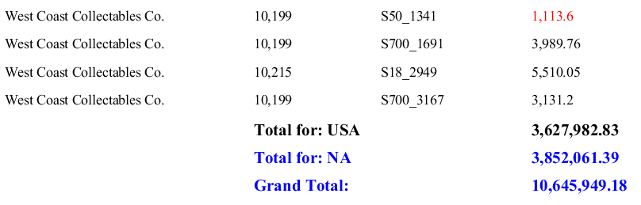

# Practice: Calculations

> **Warning:**
>
> #### Workshop - Practice: Calculations
>
> Two exercises: apply conditional formatting, then add totals — on your own this time.
>
> **What you'll do**
>
> * Apply conditional formatting on your own.
> * Add group and report totals.
> * Compare your output with the expected result.
>
> **Prerequisites:** Complete this section's guided demonstrations first
>
> **Estimated Time:** 20 minutes

---

> **Note:**
>
> #### **Practice: Calculations**
>
> Two exercises: apply conditional formatting, then add totals — on your own this time.

## Conditional Formatting

In this exercise you will use the Formula Editor to change the text color of the Total Price depending on the value of the field

## Open the Exercise – data elements.prpt

Select TOTALPRICE, in the Details band.

To access the Formula Editor for the text color, on the Style pane, click the round green + icon to the right of text > text-color.

From the Category drop-down list, select Logical.

Double-click on the IF statement and add the following Formula:

=IF([TOTALPRICE]<3000;"RED";IF([TOTALPRICE]>6000;"GREEN";"BLACK"))

Preview and Save the report: Exercise – conditional formatting.prpt

## Report & Group Totals

To create totals for country and territory, and a grand total for the report:

1. Open the Exercise – conditional formatting.prpt
2. In the Data pane, right-click Functions, and then click Add Functions.
3. Add the following Sum function:  TotalGroupSumFunction0.
4. Rename to: TotalforCountry
5. Click in the Value column, and then from the drop-down list, select TOTALPRICE
6. Reset on Group Name, click in the Value column, and then from the drop-down list, select COUNTRY.
7. Add another Sum function: TotalforTerritory
8. Click in the Value column, and then from the drop-down list, select TOTALPRICE
9. Reset on Group Name, click in the Value column, and then from the drop-down list, select TERRITORY
10. Add another Sum function: TotalforReport
11. Click in the Value column, and then from the drop-down list, select TOTALPRICE
## Add Totals to Report

1. From the Data pane, select Sum:TotalforCountry, and drag it to the Country Group Footer band (the first Group Footer band), directly below TOTALPRICE.
2. Drag a message element to the canvas, and drop it in the Country Group Footer band directly below ORDERNUMBER.
3. Replace the Message text with Total for $(COUNTRY).
4. Format the Total for $(COUNTRY)
5. Font Size 12, Bold
6. From the Data pane, select Sum:TotalforTerritory, and drag it to the Territory Group Footer band, directly below Sum: TotalforCountry
7. Drop a Message Element in the Territory Group Footer band, directly below Total for $(COUNTRY).
8. Replace the Message text with Total for $(TERRITORY).
9. Format: Total for $(TERRITORY)
10. Font Size 12, Bold, Blue
11. From the Data pane, select Sum:TotalforReport, and drag it to the Report Footer band, directly below Sum:TotalforTerritory.
12. Drop a Label Element in the Report Footer band directly below Total for $(TERRITORY).
13. Replace the Label text with Grand Total.
14. Format Grand total:
15. Font Size 12, Bold, Blue
16. Preview and Save the report: Exercise – totals.prpt

