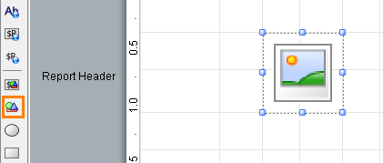
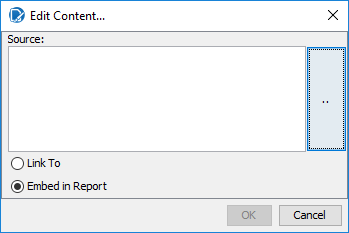
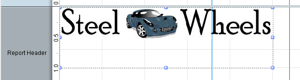
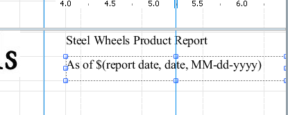
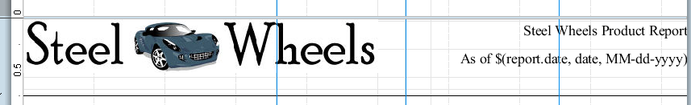
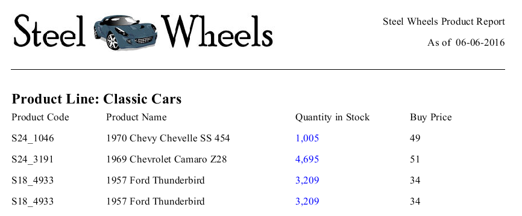
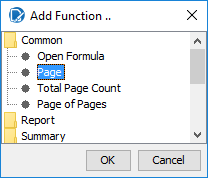
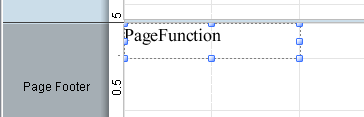

# Formatting Report Headers & Footers

> **Warning:**
>
> #### Workshop - Formatting Report Headers & Footers
>
> Add and style the report header and footer bands.
>
> **What you'll do**
>
> * Add report header and footer bands.
> * Insert images, dates, and page numbers.
> * Style the bands so every page frames cleanly.
>
> **Prerequisites:** Report Designer running, with the Pentaho sample data (HSQLDB) started
>
> **Estimated Time:** 15 minutes

---

> **Note:**
>
> #### **Formatting Report Headers & Footers**
>
> Add and style the report header and footer bands.

## Add an Image

1. Open the Demo – totals.prpt
2. Click the image icon, and then drag it to the Report Header band as shown below.

You will resize and position the image later.

3. To edit the image contents, on the canvas, double-click the image icon.

From the Edit Content dialog, you will specify the image you want to add. Notice you have the option to link to the image or to embed the image in the report. In this demonstration, you will embed the image in the report.

4. To select the Steel Wheels logo, in the Edit Content dialog:
5. Click the … button (browse).
6. Navigate to:
C:\Pentaho-Training\BA-2000\images\sw_logo.jpg.

7. Click Open.
8. Select Embed in Report.
9. Click OK.
10. To resize and position the Steel Wheels logo, in the Report Header band:
11. Click in the center of the Steel Wheels logo to select the image.
12. Drag the top left handle to the top left corner of the Report Header band.
13. Drag the bottom right handle toward the center of the Report Header band and drop it at approximately 1.0” on the vertical ruler and 3.5” on the horizontal ruler.

> **Under the hood:**
>
> #### Embed put the JPEG inside the bundle
>
> A `.prpt` is a zip. Choosing Embed copied `sw_logo.jpg` into it as
> `resources/image.jpeg` and pointed the image element at that entry,
> so the report carries its logo wherever it goes — preview, the
> server, an email attachment. Link keeps only the path: the engine's
> resource loader fetches it at run time, relative to the report's
> location, which on the server means a repository path.
>
> **Why it matters:** embed anything the report cannot function
> without; link only what changes independently of the report and is
> guaranteed to exist where the report runs.

14. Click the Label icon, and then drag it to the upper right corner of the Report Header band.
15. To edit the label element:
16. Double-click in the center of the label element to select it.
17. Click the … button to open the editor.
18. Replace the Label text with Steel Wheels Product Report.
19. Click OK.
20. Drag the left handle to the left and drop it at approximately 4.0” on the horizontal ruler.
21. Click the message icon, and then drag it to the upper right corner of the Report Header band and drop it just below the Steel Wheels Product Report label.
22. To edit the message field:
23. Double-click in the center of the message field to select it.
24. Click the … button to open the editor.
25. Replace the Message text with As of $(report.date, date, MM-dd-yyyy).
26. Click OK.

> **Under the hood:**
>
> #### `report.date` is a field the engine injects, not one from your query
>
> When processing starts the engine adds a set of environment fields
> to every row alongside your query columns — `report.date` is the run
> timestamp — and a message field reads them like any other field. The
> three-part syntax `$(report.date, date, MM-dd-yyyy)` names the
> field, tells the formatter to treat it as a date, and supplies the
> pattern. On the server the same mechanism exposes the user name,
> roles and locale as `env::` fields (see the Environment Variables
> reference).
>
> **Why it matters:** "As of" dates, user stamps and locale-aware
> formatting come from the engine, so a report can say who ran it and
> when without a single change to the SQL.

27. Highlight both Elements, and from the formatting toolbar, select right align
28. On the Elements Palette, click the horizontal-line icon, then drag it to the Report Header band and drop it below the Steel Wheels logo image.
29. To resize and position the horizontal-line, in the Report Header band:
30. Click the horizontal-line to select the line.
31. Drag the right handle to the far right of the Report Header band.
32. Drag the left handle to the far left of the Report Header band.
33. Drag the center handle up or down and drop the line at approximately 0.75” on the vertical ruler

34. Preview and Save the report: Training Demo Report 6-1 – headers

## Add Page Numbering

1. On the Data pane, right-click Functions, and then click Add Functions.
2. To select the Page function, from the Add Function dialog:
3. Double-click Common.
4. Click Page.
5. Click OK.

6. From the Data pane, select Page:PageFunction, then drag it to the Page Footer band and drop it in the top left corner.

> **Under the hood:**
>
> #### Page numbers come from the pagination pass
>
> `PageFunction` counts pages as the pageable output processor breaks
> them, and the `PageOfPagesFunction` used by the sample reports adds
> the total — a number only known once the pagination pass has laid
> out the entire report. That is why page functions only make sense in
> the Page Header and Page Footer bands, and why they show nothing
> useful in HTML single-page output, which has no pages at all.
>
> **Why it matters:** the same footer prints "Page 3 of 12" in PDF and
> in print, and the count stays right when a parameter changes the
> length of the report, because it is measured, not guessed.

7. Preview and Save the report: Demo – header.prpt

## Lab files

<button data-launch="prd" data-path="files/Training Demo Report 6-1 header.prpt">Open: Solution: headers & footers</button>

