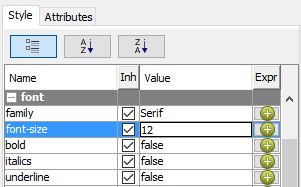
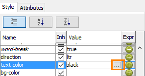
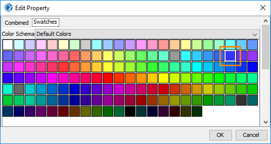
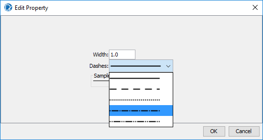
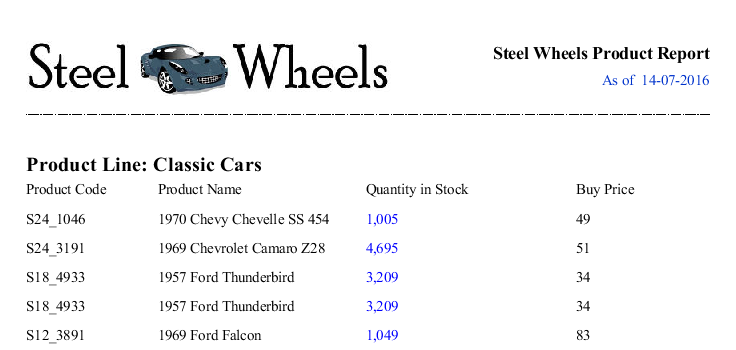
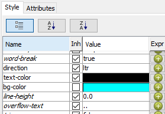
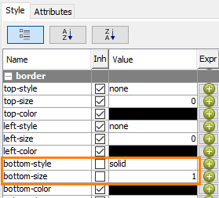
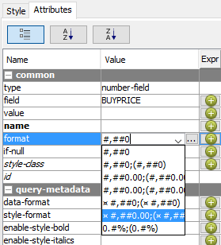
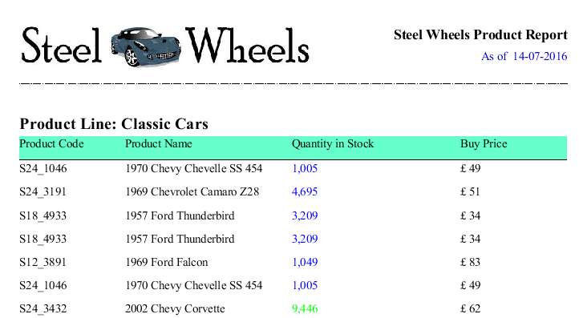
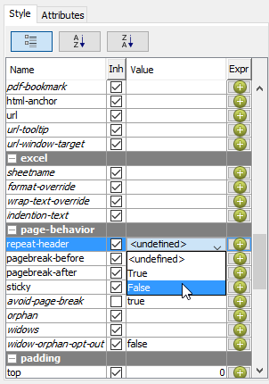

# Formatting the Report

> **Warning:**
>
> #### Workshop - Formatting the Report
>
> Apply fonts, colours, and spacing across the report body.
>
> **What you'll do**
>
> * Apply fonts, colours, and spacing across the report body.
> * Align and size elements consistently.
> * Preview the polished layout.
>
> **Prerequisites:** Report Designer running, with the Pentaho sample data (HSQLDB) started
>
> **Estimated Time:** 15 minutes

---

> **Note:**
>
> #### **Formatting the Report**
>
> Apply fonts, colours, and spacing across the report body.

## Formatting & Style Pane

Add various formatting features to the report.

1. Open the Demo – header.prpt
2. Select the Steel Wheels Product Report label element, in the Report Header band, and in the right pane, click the Structure tab.
3. To change the font size of the selected label element, on the Style pane:
4. Double-click the Value for font > font-size.
5. Change the value to 12.
6. Press Enter.

7. Change the value of Bold to: true
8. On the Structure pane, select the report date message field, click message-field:
As of $(report.date, date, MM-dd-yyyy).

9. In the Style pane, change the font color of the report date message field, click in the Value column for text > text-color, and then click the … button.

10. To select bright blue, from the Swatches tab.

11. Select the horizontal line, on the Report Header band.
12. To change the line stroke, on the Style pane:
13. Click in the Value column for object > stroke.
14. Click the … button.
15. Change the Width to 1.0.
16. From the Dashes drop-down list, select the dot-dash stroke.
17. Click OK.

18. Preview and Save the report: Training Demo Report 6-2 formatting

## Background

1. Expand Group > Group Body > Group: PRODUCTLINE > Details Body, and then click Details Header.
2. To set the background color for the Details Header band to aqua:
3. On the Style pane, click in the Value column for text > bg-color.
4. Click the … button.
5. In the Edit Properties dialog, from the Swatches tab, click an aqua swatch.
6. Click OK.

7. To add a border at the bottom of the Details Header band:
8. On the Structure pane, click Details Header.
9. On the Style pane, double-click in the Value column for border > bottom-size.
10. Change the value to 1.0.
11. Press Enter.
12. Click in the Value column for border > bottom-style.
13. Select Solid.

14. To format the Buy Price as currency with two decimal places:
15. On the Report Details band, click BUYPRICE to select the field.
16. On the Attributes pane, click in the Value column for common > format.
17. From the drop-down list, select □ #,###,00;( □ #,###.00).
18. Press Enter.

Note: The □ symbol displays the system’s currency symbol.

To repeat the header column fields across the report:

19. Highlight the Details Header band, in the Structure Pane.
20. Under the Style tab, scroll down to the Page Behavior section.
21. Select ‘False’ from the dropdown box.

22. Preview and Save the report: Demo – formatting.prpt
