# Report Parameters

> **Warning:**
>
> #### Workshop - Report Parameters
>
> Add a parameter, wire it into the query, and prompt the user at run time.
>
> **What you'll do**
>
> * Add a parameter and wire it into the query.
> * Prompt the user for values at run time.
> * Preview the report with different parameter values.
>
> **Prerequisites:** Report Designer running, with the Pentaho sample data (HSQLDB) started
>
> **Estimated Time:** 15 minutes

---

> **Note:**
>
> #### **Report Parameters**
>
> Add a parameter, wire it into the query, and prompt the user at run time.

## Parameters

By adding a parameter to the report you enable the person viewing the report to select which data displays in the report.

1. Open the Demo – formatting.prpt
2. To create a query that produces a list of valid Product Lines, from the Data pane, double-click JDBC: SampleData.

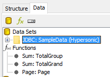

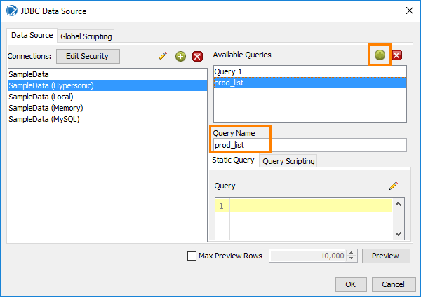

To add a query, in the JDBC Data Source window, click the Add Query icon to the right of Available Queries.

3. By default, the new query is named Query 2. For this demonstration, you will name the query prod_list. You will need to use the exact query name later.
4. To write the query, in the Query pane, type:
SELECT DISTINCT PRODUCTLINE FROM PRODUCTS

5. Preview and then click OK.

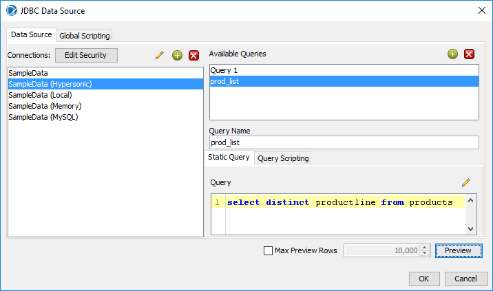

6. From the Data pane, right-click Parameters, and then click Add Parameter.

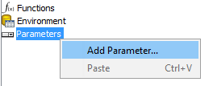

7. In the DataSources pane, click prod_list.
Complete or verify the following fields in the Add Parameter window, and then click OK.

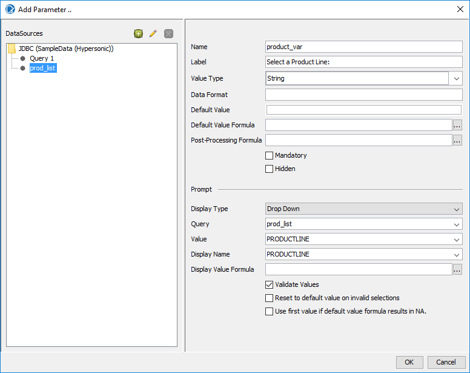

Now you must add a WHERE clause to the original query to use the value from the prompt.

8. To modify the original query, from the Data pane, double-click JDBC: SampleData.
9. From the Available Queries, click Query 1.
10. To add the WHERE clause, in the Query, above ORDER BY:
11. Press Return.
12. Type: WHERE productline IN (${product_var})
13. Click OK.

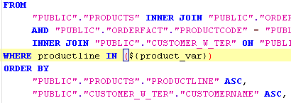

14. Preview and Save the report.

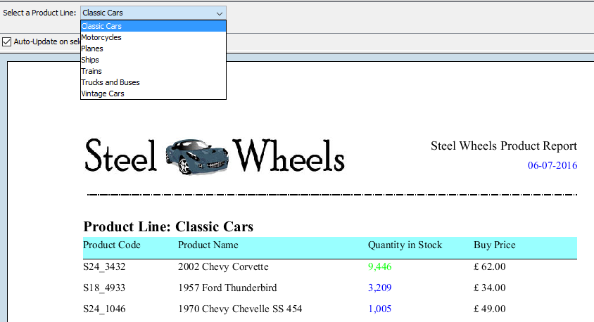

## Nested Prompts

1. To create a query that produces a list of distinct Countries, from the Data pane, double-click JDBC: SampleData.

2. To add a query, in the JDBC Data Source window, click the Add Query icon to the right of Available Queries.
3. To write the query, country_list, in the Query pane, type:
## SELECT DISTINCT country FROM customer_w_ter

1. Preview and then click OK.

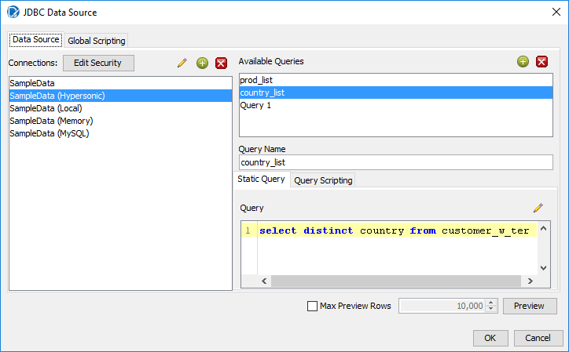

2. From the Data pane, right-click Parameters, and then click Add Parameter.
3. In the DataSources pane, click country_list.
4. Complete or verify the following fields in the Add Parameter window, and then click OK.

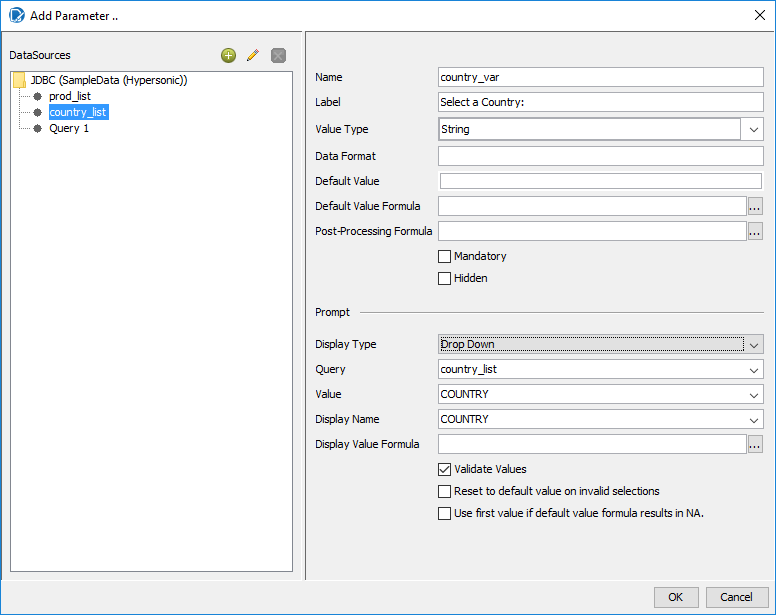

5. Now you must modify the WHERE clause to the original query to use the value from the prompt.
6. To modify the original query, from the Data pane, double-click JDBC: SampleData.
7. To modify the WHERE clause, in the Query, above ORDER BY:
8. Press Return.
9. Type: WHERE productline IN (${product_var})
10. Click OK.

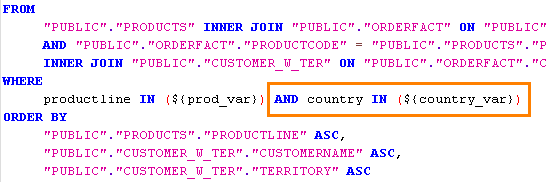

11. Preview and Save the Report: Demo - parameters prod & country.prpt
12. If you have time Group by Country and add a Message to the report.

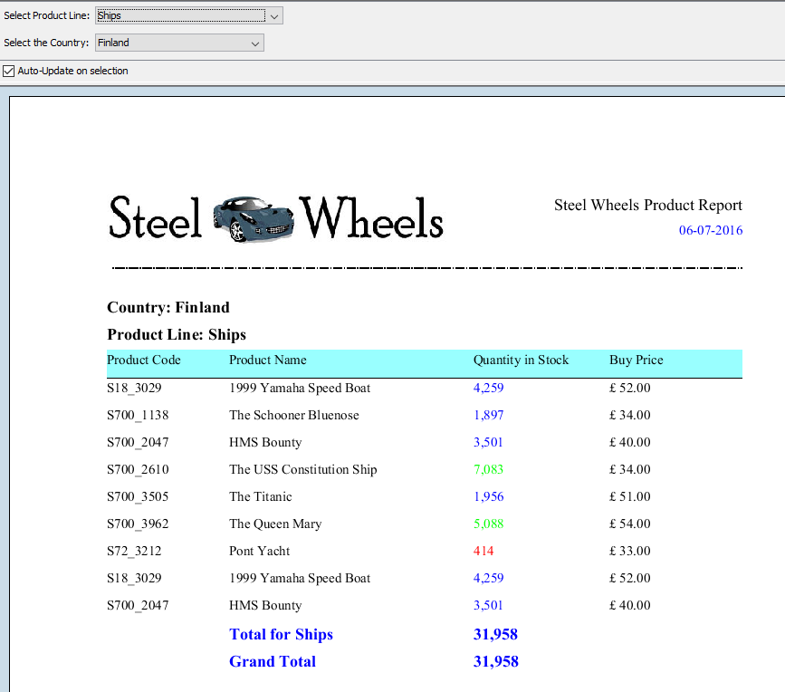

You may need to resize the filter panel to view the options.

## Lab files

<button data-launch="prd" data-path="files/Training Demo Report 7 parameters.prpt">Open: Solution: parameters</button>

<button data-launch="prd" data-path="files/Training Demo Report 7 parameters prod & country.prpt">Open: Solution: cascading parameters</button>

