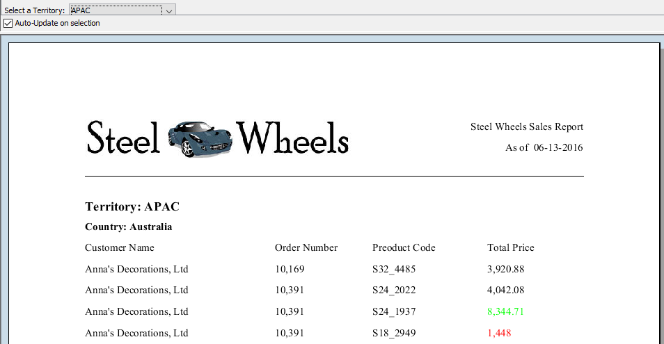

# Practice: Parameters

> **Warning:**
>
> #### Workshop - Practice: Parameters
>
> Build a parameterised report on your own.
>
> **What you'll do**
>
> * Build a parameterised report on your own.
> * Confirm the prompt filters the data correctly.
>
> **Prerequisites:** Complete this section's guided demonstrations first
>
> **Estimated Time:** 20 minutes

---

> **Note:**
>
> #### **Practice: Parameters**
>
> Build a parameterised report on your own.

## Report Parameters

To add a parameter for Territory:

**Open** `Exercise - formatting.prpt`

From the Data pane, double-click JDBC: SampleData (Hypersonic)

Click the Add Query icon to the right of Available Queries.

In the Query Name field, type territory_list.

To write the query, in the Query pane, type:

## SELECT DISTINCT territory FROM customer_w_ter

Click OK.

From the Data pane, right-click Parameters, and then click Add Parameter.

Complete or verify the following fields in the Add Parameter window, and then click OK.

From the Data pane, double-click JDBC: SampleData (Hypersonic).

From the Available Queries, click Query 1.

To add the WHERE clause, in the Query above the ORDER BY line:

## Type: WHERE territory IN (${territory_var})

Click OK.

Click the Preview button.

To select EMEA, from the Select a Territory: prompt, select EMEA.

Preview and Save the report: Exercise – parameters.prpt

