# Charts & Sub Reports

> **Warning:**
>
> #### Workshop - Charts & Sub Reports
>
> Add a chart to a report and embed a sub-report beside it.
>
> **What you'll do**
>
> * Add a chart that summarises the report data.
> * Embed a sub-report with its own query.
> * Preview the combined layout.
>
> **Prerequisites:** Report Designer running, with the Pentaho sample data (HSQLDB) started
>
> **Estimated Time:** 15 minutes

---

> **Note:**
>
> #### **Charts & Sub Reports**
>
> Add a chart to a report and embed a sub-report beside it.

## Add Parameter

By adding a parameter to the report, you can select the required data view.

1. To open the Sub Chart Demo Report:
2. From the Menu bar select File > Open.
3. Navigate to:
C\Pentaho-Training\BA-2000\reports\Sub Demo Report.prpt.

4. Click Open.
At this point, the Sub Demo Report already contains a query to return three fields from the Product table.

5. To review the query, from the Data pane, expand Data Sets, and then double-click Query 1.
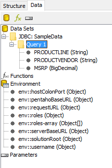

6. To change the page orientation to landscape:
7. From the Menu, select File > Page Setup.
8. Click the Landscape checkbox.
9. Click OK.
10. In the Resize Report Elements dialog, ensure Do not change the layout is selected, and then click OK.
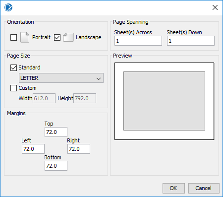

The default chart type is a Bar Chart. You can select a different chart type and specify the chart properties in the Edit Chart window.

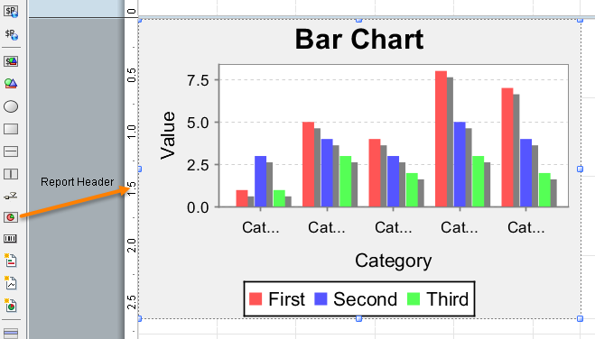

11. To edit the chart, in the Report Header band, double-click the Chart element.
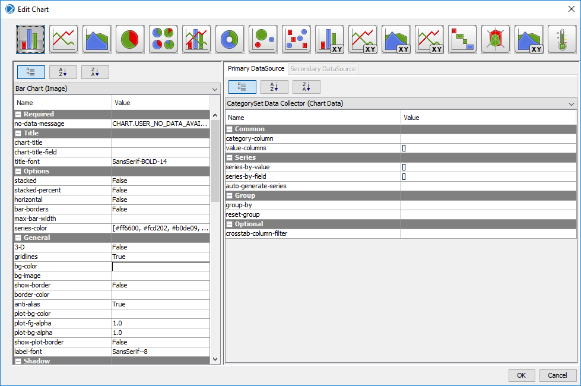

The properties available in the Edit Chart window are based on the type of chart selected.

12. To change the chart to a radar chart, click the Radar Chart button.
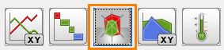

To create a basic radar chart, you specify category and value columns, and then specify the series-by value and series-by field on the Primary Data Source pane.

Notice the list of properties in the left pane for customizing the chart.

13. On the Primary Data Source pane, for category-column, click in the Value field, and then from the drop-down list, select PRODUCTVENDOR.
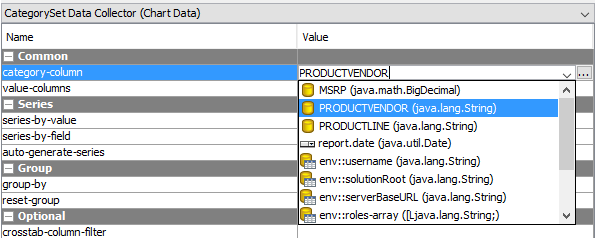

14. To select MSRP for the value column:
15. For value-columns, click in the Value field.
16. Click the … icon.
17. In the Edit Array window, from the Available Items, click MSRP.
18. Click in the arrow to move MSRP to the Selected Items list.
19. Click OK.
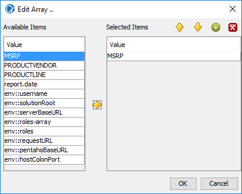

20. To select Product Line for the series-by field:
21. For series-by-field, click in the Value field.
22. Click the … icon.
23. In the Edit Array window, from the Available Items, click PRODUCTLINE.
24. Click the arrow to move PRODUCTLINE to the Selected Items list.
25. Click OK.
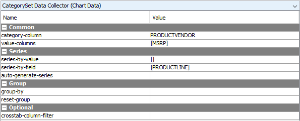

26. To create the chart, in the Edit Chart window, click OK.
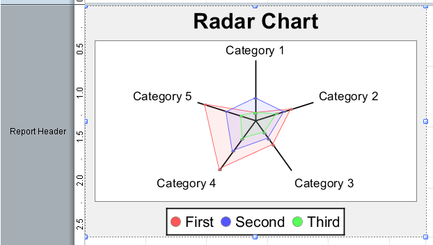

27. Preview the report.
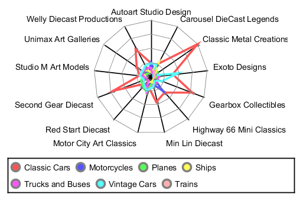

## Add Sub Report

1. To add a Sub-report:
2. From the Elements Palette, drag a Sub-report element to the right side of the Report Header band.
3. In the Insert Subreport dialog, click Inline.
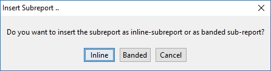

4. In the Select Data Source window, select Query 1, and click OK.
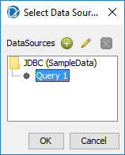

5. To reposition and resize the Sub-report element, from the open reports tabs, click the Sub Report Demo tab, and then reposition and resize the Sub-report element as shown below.
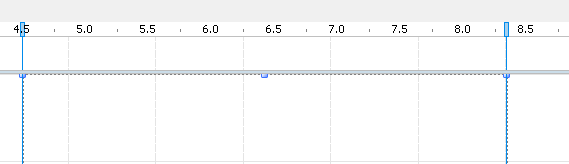

6. To return to the Sub-report, from the open reports tabs, click the <Untitled Subreport> tab.
7. To create the Sub-report, from the Data pane, drag PRODUCTVENDOR, PRODUCTLINE, and MSRP to the Details band as shown below.
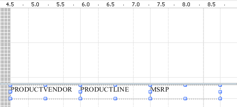

8. To create column headings, add Label elements and a Horizontal Line element to the Details Header band as shown. (You will need to enable the Band)
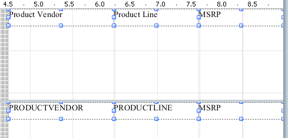

9. Adjust the height of the Bands.
10. Preview and Save the report: Demo – charts.prpt
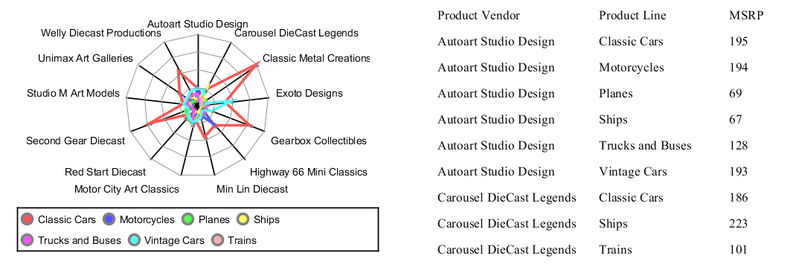

## Inline v Banded

Every master-report and sub-report prints its sections on a position relative to its original location on paper. For a master-report, the location is always the upper left corner of the first page (x=0, y=0). Therefore, all sections of that report will be printed on the left edge of the paper (x=0).

When you add sub-reports to a report, that sub-report can be located on any x-position on the paper. For banded sub-reports, usually that position is the same left-edge as the parent-report's location.

Inline sub-reports can be placed more freely on reports. The sub-report's left edge corresponds with the sub-report element's x- and y- position within its parent report. They can be at a position that is different from their parent report's left-edge position. When you add a new inner sub-report to such this sub-report, the inner sub-report's effective position is the offset of this report in its parent sub-report and all their offsets within their respective parents.

The dark-grey area on the left-hand side of your sub-report is not usable for elements contained in your sub-report. If you want to place elements there, you will have to re-position your sub-report within its parent report.

## Lab files

<button data-launch="prd" data-path="files/Training Demo Report 8 charts.prpt">Open: Solution: charts</button>

<button data-launch="prd" data-path="files/chart report.prpt">Open: Sample: chart report</button>

<button data-launch="prd" data-path="files/Order Details - sub report.prpt">Open: Sample: sub-report</button>

