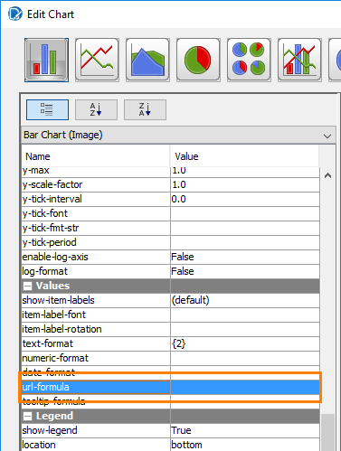
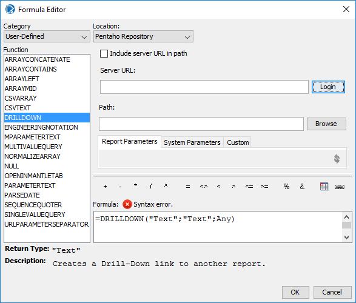
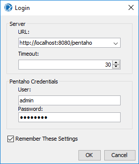
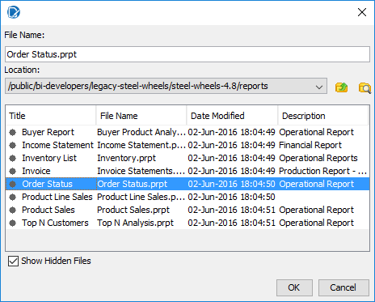
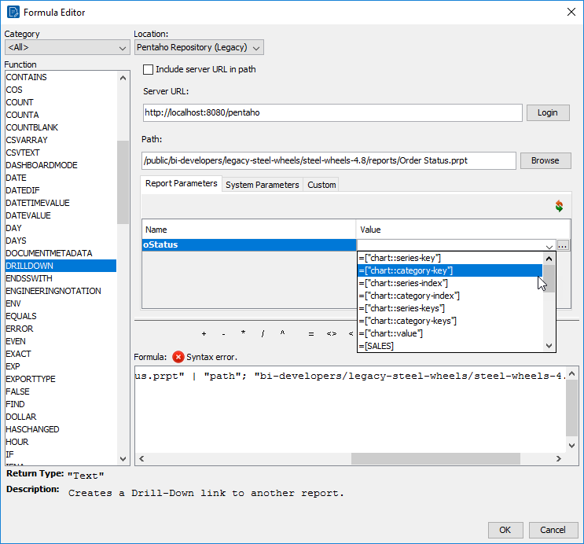

# Drilldown Charts

> **Warning:**
>
> #### Workshop - Drilldown Charts
>
> Make a chart clickable so it drills into detail data.
>
> **What you'll do**
>
> * Make a chart clickable.
> * Drill from the chart into the detail data.
>
> **Prerequisites:** Report Designer running, with the Pentaho sample data (HSQLDB) started
>
> **Estimated Time:** 15 minutes

---

> **Note:**
>
> #### **Drilldown Charts**
>
> Make a chart clickable so it drills into detail data.

## Driildown Charts

You can use OpenFormula to dynamically build drill linking within a chart and send the value that was clicked on by the user to the browser through a JavaScript alert() function. You can also link the chart values to other reports, creating a drill down chart.

1. To view the Order Status Report:
2. Open the User Console.
3. To view the BI Developer Examples folder, on the menu, click View > Show Hidden Files
4. From the Browse Files perspective, navigate to:
5. Public > BI Developer Examples > Steel Wheels (Legacy) > Steel Wheels (4.8) > Reporting folder.
6. From the Files pane, double-click Order Status.
7. View and then close the Order Status report.
Notice the Order Status Report uses a parameter for the Status. Since we will be drilling to this report  from a chart, we will need to know the value for the Status parameter.

8. Minimize the User Console and open Report Designer.
9. To open the report that has already been started for you:
10. From the Menu bar select File > Open.
11. Navigate to \pentahotraining\BA2000\reports.
12. Click Order Status Chart.
13. Click Open.
Notice the report already has a query defined, and the Report Header section has been enlarged.

14. Drag a Chart element to the Report Header band.
15. Resize the Chart element to fill the Report Header band.
16. In the Report Header band, double-click the Chart element.
17. On the Primary Data Source tab, for category-column, click in the Value field, and then from the drop-down list, select STATUS.
18. To select the value column:
19. For value-columns, click in the Value field.
20. Click the … icon.
21. In the Edit Array window, from the Available Items, click SALES.
22. Click in the arrow to move Sales to the Selected Items list.
23. Click OK
24. To open the formula editor, for Values > url-formula, click in the Value column, and then click the … icon.

25. To create link to the Order Status report:
26. From the Category drop-down list, select User-Defined.
27. From the Function list, double-click DRILLDOWN.
28. Click Login and then click OK to login to the server.

29. Click to select the Show Hidden Files checkbox.
30. Click Browse and navigate to:
Public > BI Developer Examples > Steel Wheels (Legacy) >  Steel Wheels (4.8) > Reporting folder.

31. Double-click Order Status.

32. Click OK.
Ensure that the Report Parameter tab is displayed.

33. Associate the oStatus report parameter (prompt) with a value:

Select =[“chart::category-key”] from the dropdown Value box.

34. Be sure to select Pentaho Repository (Legacy)
35. Click OK.
=DRILLDOWN("local-sugar"; NA(); {"oStatus"; ["chart::category-key"] | "::pentaho-path"; "/public/bi-developers/legacy-steel-wheels/steel-wheels-4.8/reports/Order Status.prpt"})

## Or if you use Pentaho  Repository

=DRILLDOWN("local-sugar"; NA(); {"::pentaho-path"; "/public/bi-developers/legacy-steel-wheels/steel-wheels-4.8/reports/Order Status.prpt" | "oStatus"; ["chart::category-key"]})

1. Can also add the following value for tooltip-formula:  =["chart::category-key"]
2. From the Menu bar select File > Preview > HTML.
3. Save the report: Training Demo Report 8-1 drillable chart
4. You will also require your credentials to log into Pentaho to view the report.

## Lab files

<button data-launch="prd" data-path="files/Training Demo Report 8-1 drilldown charts.prpt">Open: Solution: drilldown charts</button>

<button data-launch="prd" data-path="files/chart drillable.prpt">Open: Sample: drillable chart</button>

