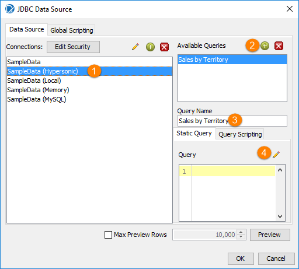
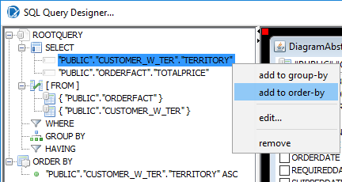
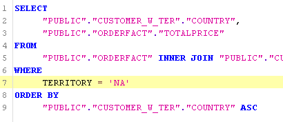
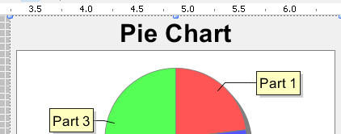
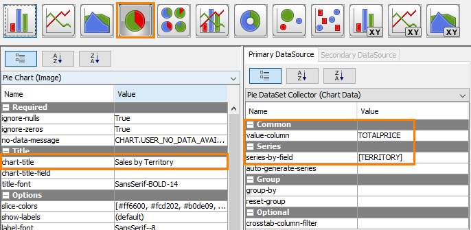
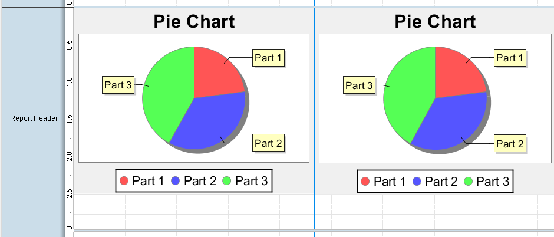
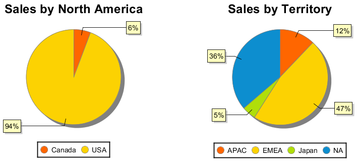

# Multiple Sub Reports

> **Warning:**
>
> #### Workshop - Multiple Sub Reports
>
> Compose a report from several sub-reports.
>
> **What you'll do**
>
> * Compose a report from several sub-reports.
> * Manage each sub-report's query and layout.
>
> **Prerequisites:** Report Designer running, with the Pentaho sample data (HSQLDB) started
>
> **Estimated Time:** 15 minutes

---

> **Note:**
>
> #### **Multiple Sub Reports**
>
> Compose a report from several sub-reports.

## Multiple Queries

1. From the Menu, select File > New.
2. Select Data > Add Datasource > JDBC
3. From the Connections list, click SampleData (Hypersonic).
4. To add a query that sums the total sales by territory, in the JDBC Data Source window, click the Add Query icon.
5. Rename the query:  Sales by Territory.
Open the SQL Query Designer window.

6. From the list of tables, double-click CUSTOMER_W_TER.
7. From the list of tables, double-click ORDERFACT.
8. To join the Customer with Territory table to the Order Fact table:
9. In the CUSTOMER_W_TER view, click and hold CUSTOMERNUMBER.
10. Point to CUSTOMERNUMBER in the ORDERFACT view.
11. Drop CUSTOMERNUMBER on top of CUSTOMERNUMBER in the ORDERFACT view.
12. To select only the Territory field, from the right pane:
13. Click the “CUSTOMER_W_TER” header.
14. From the context menu, click deselect all.
15. In the CUSTOMER_W_TER view, click the checkbox for TERRITORY.
16. To select and sum the Total Price field:
17. Click the “ORDERFACT” header.
18. From the context menu, click deselect all.
19. In the ORDERFACT view, click the checkbox for TOTALPRICE.
20. To Sort, right-click “CUSTOMER_W_TER.TERRITORY” and then from the context menu select add to order-by.

21. Close all windows.
22. Repeat the workflow to create a query: Sales by Country.
To add a WHERE clause to only return values for the NA territory, in the Query above the GROUP BY line:

23. Press Return.
24. Type: WHERE territory = ‘NA’.

## Add Sub Reports

In this part of the demonstration we add two sub-reports. The first sub-report is a pie chart showing the total sales by territory. The second is a pie chart showing the total sales by country.

1. To resize the Report Header band, on the Canvas, click the divider line at the bottom of the Report Header band and drag it down to approximately 3” on the vertical ruler.
2. To add a Sub-report:
3. From the Elements Palette, drag a Sub-report element to the right side of the Report Header band.
4. In the Insert Subreport dialog, click Inline.
5. In the Select Data Source window, select: Sales by Territory, and click OK.
6. Reposition and resize the Sub-report element, to fill the right side.
You will need to play around with the positioning and size of the sub report once the other sub report has been added.

7. From the open reports tabs, click the <Untitled Subreport> tab.
8. To add the chart element:
9. Resize the Report Header band to approximately 3 on the vertical ruler.
10. From the Elements Palette, drag a chart element to the Report Header band and position it in the top left corner.
11. Resize the Chart element to approximately 2.5 on the horizontal ruler, and 3.25 on the vertical ruler.

12. To create the pie chart:
13. In the Report Header band, double-click the chart element.
14. To change the chart to a pie chart.
15. Click in the Value column, and then from the drop-down list, select TOTALPRICE.
16. For the series-by-field column, click in the Value column, then click the … button, and then add TERRITORY.
17. In the chart-title field, type Total Sales by Territory.
18. Click OK.

19. Repeat the above steps to add a sub-report that includes a pie chart showing the Sales by North America to the right side of the Report Header band.

20. Preview and Save the report: Training Demo Report 8-2 - multiple sub reports.

## Lab files

<button data-launch="prd" data-path="files/Training Guided Demo Report 8-2 multiple sub.prpt">Open: Solution: multiple sub-reports</button>

<button data-launch="prd" data-path="files/Training Guided Demo Report 8-2a multiple sub.prpt">Open: Solution: multiple sub-reports (variant)</button>

<button data-launch="prd" data-path="files/Sub Report Activity.prpt">Open: Sample: sub-report activity</button>

<button data-launch="prd" data-path="files/Sub Chart Demo Report.prpt">Open: Sample: sub-chart demo</button>

