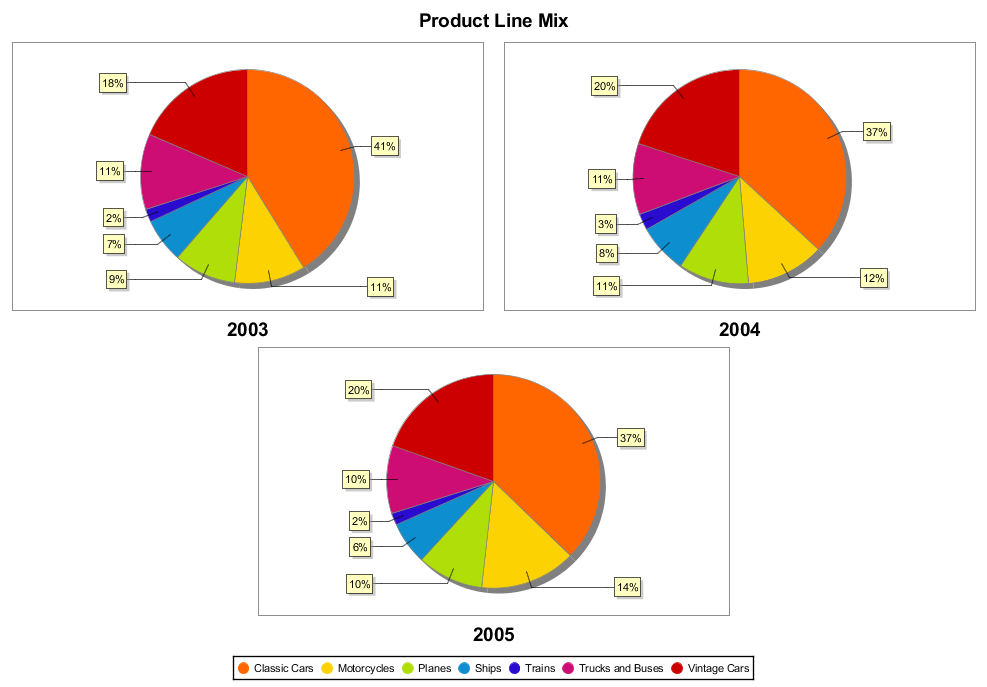
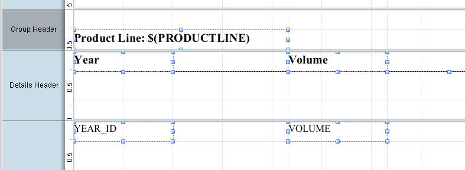
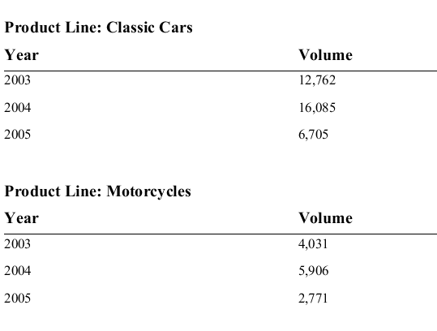

# Practice: Charts & Sub Reports

> **Warning:**
>
> #### Workshop - Practice: Charts & Sub Reports
>
> Four exercises covering charts, sub-reports, multiple sub-reports, and drillable charts.
>
> **What you'll do**
>
> * Add a chart to a report on your own.
> * Embed one, then several, sub-reports.
> * Make a chart drillable.
>
> **Prerequisites:** Complete this section's guided demonstrations first
>
> **Estimated Time:** 30 minutes

---

> **Note:**
>
> #### **Practice: Charts & Sub Reports**
>
> Four exercises covering charts, sub-reports, multiple sub-reports, and drillable charts.

## Chart

To add a multi-pie chart showing sales by year and product line:

* To open the Sub Report Activity chart report:
* From the Menu bar select File > Open.
* Navigate to \pentahotraining\BA2000\reports.
* Click Sub Report Activity.prpt.
* Click Open.
* To review the query, from the Data pane, expand Data Sets, and then double-click Query 1.
* After reviewing the query, click OK.
* To change the page orientation to landscape and adjust the page margins:
* From the Menu, select File > Page Setup.
* Click the Landscape checkbox.
* Change each margin to 18.
* Click OK.
* In the Resize Report Elements dialog, ensure Do not change the layout is selected, and then click OK.
* On the canvas, click the divider line at the bottom of the Report Header band and drag it down to approximately 7.0” below the Page Header.
* Drag a Chart element to the Report Header band, and resize the element to fill the entire Report Header band.
* In the Report Header band, double-click the Chart element.
* To change the chart to a multi pie chart.
* To select Product Line for the category-column, from the Value drop-down list, select PRODUCTLINE.
* To select Sales for the value-columns:
* For value-columns, click in the Value field.
* Click the … icon.
* In the Edit Array window, from the Available Items, click SALES.
* Click in the arrow to move SALES to the Selected Items list.
* Click OK.
* To select YEAR_ID for the series-by field:
* For series-by-field, click in the Value field.
* Click the … icon.
* In the Edit Array window, from the Available Items, click YEAR_ID.
* Click in the arrow to move YEAR_ID to the Selected Items.
* Click OK.
* In the chart-title field, type Product Line Mix.
* To create the chart, in the Edit Chart window, click OK.
* Preview and Save the report: Training Exercise Report 8-1 charts.

## Sub Report

To add a sub-report showing Volume for each year grouped by Product Line:

Open the report: Training Exercise Report 8-1 charts.

To add a Sub-report:

Drag a Sub-report element to the right side of the Report Footer band.

In the Insert Sub report dialog, click Inline.

In the Select Data Source Window, select Query 1, and click OK.

To reposition and resize the Sub-report element:

From the open reports tabs, click the Sub Report Activity tab.

Resize the Report Footer to be 3.0” below the Details band.

Reposition and resize the Sub report element to fill the entire Report Footer band.

To return to the Sub report, from the open reports tabs, click the <Untitled Subreport> tab.

To create the Sub-report, drag YEAR_ID and VOLUME to the Details band.

To create column headings, turn on the Details Header band and add Label elements and a Horizontal Line element to the Details Header band.

To group the sub-report by Product Line, use your knowledge to add a group for PRODUCTLINE, and add a message element to the Group Header band to identify the Product Line.

To change the YEAR_ID to a string field, on the Report Details band, click YEAR_ID, and then from the menu, select Format > Morph > text-field.

To return to the Sub Report Activity report, from the open reports tabs, click the Sub Report Activity tab.

Preview and save the Report: Training Exercise 8-1 sub report

## Multiple Sub Reports

To add additional sub-reports to the existing report:

* Open the Training Guided Demo 8-2 – multiple sub reports.
* To resize the Report Header band, on the Canvas, click the divider line at the bottom of the Report Header band and drag it down to approximately 4” on the vertical ruler.
* To add a sub-report summarizing the territory data:
* From the Elements Palette, drag a Sub-report element to the bottom left side of the Report Header band.
* In the Insert Subreport dialog, click Inline.
* In the Select Data Source window, select By Country, and click OK.
* Click the Training Demo 8-2 – multiple sub reports tab, and then reposition and resize the Sub-report element below the Total Sales for North America chart Sub-report, as illustrated below.
* To return to the Sub-report, from the open reports tabs, click the <Untitled Subreport> tab.
* To create the report:
* From the Data tab, expand Data Sets > JDBC SampleData > By Territory, and drag Territory to the top left corner of the Details band.
* From the Data tab, drag Total to the Details band and drop it to the right of Territory.
* From the Elements palette, drag two label elements to the Report Header band and create labels for the Territory and Total columns.
* Preview the report.
* Optionally, reposition and format the report elements.
* To return to the main report, from the open reports tabs, close the Untitled Subreport tab.
* Repeat the above steps to add a sub-report for the country data.
* Preview and Save the report: Training Exercise 8-2
## Sub Report

To add a sub-report showing Volume for each year grouped by Product Line:

* To open the report that has already been started for you:
* From the Menu bar select File > Open.
* Navigate to \pentahotraining\BA2000\reports.
* Click Chart Drillable.prpt.
* Click Open.
Notice that the report already has a query defined, and the Report Header section has been enlarged.

## Chart

* Drag a Chart element to the Report Header band.
* Resize the Chart element to fill the Report Header band.
* Double-click the Chart element.
* On the Primary Data Source tab, for category-column, click in the Value field, and then from the drop-down list, select PRODUCTLINE.
* To select the value column:
* For value-columns, click in the Value field.
* Click the … icon.
* In the Edit Array window, from the Available Items, click QUANTITY.
* Click in the arrow to move QUANTITY to the Selected Items list.
* Click OK
* To select the series-by-field column:
* For series-by-field, click in the Value field.
* Click the … icon.
* In the Edit Array window, from the Available Items, click CITY.
* Click in the arrow to move CITY to the Selected Items list.
* Click OK
* In the Edit Chart window, click OK.
* Preview and Save the report.
## 3D Chart

To enhance the chart by making it 3D and changing the x-axis label rotation:

* In the Report Header band, double-click the Chart element.
* From the properties list, for General > 3D, click in the Value column, and then from the drop-down list, select True.
* For X-Axis > x-axis-label-rotation, double-click in the Value column, and then type 45.
* In the Edit Chart window, click OK.
* Preview and Save the report: Training Exercise Demo 8-3
## Parameter

* To create a parameter for the state:
* Complete the following fields in the Add Parameter window, and then click OK.
* To modify the original query, from the Data tab, double-click JDBC: SampleData (Hypersonic)
* To select Query 1, from the Available Queries, click Query 1.
* To modify the WHERE clause for CUSTOMER_W_TER.STATE:
* Change the value from ‘NY’ to ${State} - remember to remove single quotes
* Click OK.
* Preview the chart and test the parameterization by entering the following values for the state parameter: NY, CA, and NJ.
* Preview and Save the report.
## Drill Link

* Double-click the Chart element.
* To open the formula editor, for Values > url-formula, click in the Value column, and then click the … icon.
* In the Formula pane, type the following formula on one line:
## =”javascript:alert('" & ["chart::series-key"] & "')"

Click OK.

* To create the chart, in the Edit Chart window, click OK.
* From the Menu bar select File > Preview > HTML.
* In the state parameter, type NJ, and then click OK.
* To drill down to show the cities, on the chart, click each data bar.
* To close the pop-up window.
* Close the browser preview tab.
* Close and Save the report: Training Exercise 8-3.
![=”javascript:alert('" & ["chart::series-key"] & "')"](../_assets/images/mod8-32.png)
