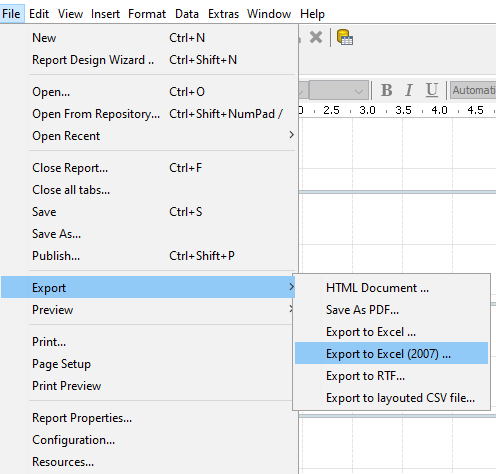

# Overview of Publishing

> **Note:**
>
> A report only matters once people can run it. This section covers publishing to the Pentaho Server and linking reports together.

You can easily publish your report to a variety of different output formats using the Preview As and Export functions. However, if you have a Pentaho Business Analytics server in production, you can publish the report directly to the server.

Once published, the report can be accessed from the User Console.

You also have the option to export your report in a number of formats:

## Learn more

- [Pentaho Report Designer documentation](https://docs.pentaho.com/pba-report-designer) - the official reference for everything in this section.
