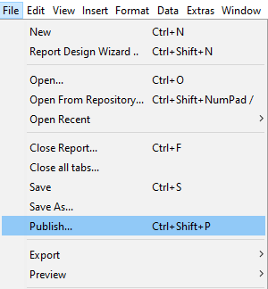
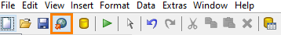
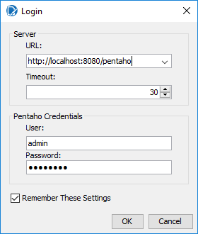
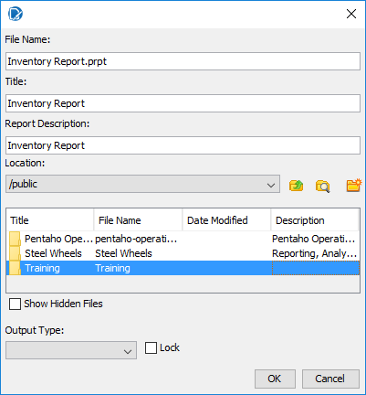
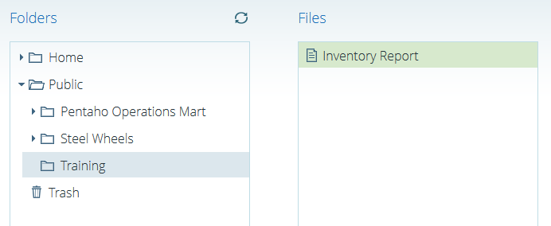
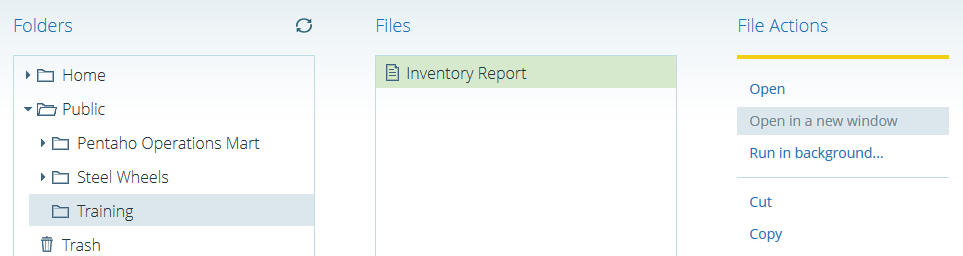

# Publishing Reports

> **Warning:**
>
> #### Workshop - Publishing Reports
>
> Publish a report to the BA repository and run it from the Pentaho User Console.
>
> **What you'll do**
>
> * Publish a finished report to the BA repository.
> * Run the published report from the Pentaho User Console.
>
> **Prerequisites:** Report Designer running, with the Pentaho sample data (HSQLDB) started
>
> **Estimated Time:** 20 minutes

---

> **Note:**
>
> #### **Publishing Reports**
>
> Publish a report to the BA repository and run it from the Pentaho User Console.

## Publish Report

1. Open the ..\reports\Inventory Report (Training Demo Report 5-2 – totals).
2. To login to the BA server, from the Menu, select File > Publish.

## Or

Click on the Publich icon in the mail toolbar.

1. Enter the BA server credentials:

## Password: password

1. To publish the report:
2. File Name field: Inventory Report.
3. Title field: Inventory Report.
4. Location field: Public > Training.
5. Click OK.

6. When the Launch the published report? dialog displays, click No.

7. To view the report in the User Console:
8. Sign on to the User Console.
9. Browse to the Public > Training folder.
10. From the Files list, double-click Inventory Report.

## Report Viewer

1. Browse to the Inventory Report in the User Console.
2. Select the option Open in a new window.

A new web browser window will open as shown in the preceding screenshot, showing only the report, without the PUC UI. What we should do is copy the URL and send it to the corresponding user. Refer to the following example:

http://localhost:8080/pentaho/api/repos/%3Apublic%3ATraining%3AInventory%20Report.prpt/viewer

## Hyperlinks

A Hyperlink lets us access an external resource, which could mean opening a website or a report, downloading a file from the Internet, and so on. It also lets us navigate internally; that is, go to specific positions within a web page, report, and so on.

A Hyperlink has two well-differentiated parts:

The link, which is the element that will contain the Hyperlink. Usually, when we hover over the link, the pointer changes to a hand, and if the link is a text, it will be blue and underlined.

The target, which is the element the Hyperlink will point to.

In PRD, Hyperlinks work similarly. For example, we can select an object (link) and use it to create a Hyperlink whose target is another report. But it doesn't stop there. PRD lets us send values to that report's Parameters, that is, we can obtain detailed information from the link we click on, and by doing so, simulate the drill down typical of an OLAP analysis.

PRD lets us create Hyperlinks in parts of our graphics, that is, we can take a pie chart and configure a Hyperlink so that when we click on a portion of the pie, a report opens with more information about the selected item.

PRD includes the following options for creating Hyperlinks:

Self: Lets us give values to the Parameters of the current report.

URL: Lets us access an external resource, such as a website, image, or file.

Pentaho Repository: Lets us link reports, xactions, and so on from the Pentaho repository. The Pentaho BA    Server must be running, as it will render the reports, xactions, and so on.

Manual Linking: Lets us configure a Hyperlink manually and navigate within the report using HTML anchors.
