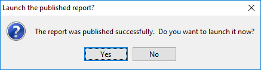

# Hyperlinks

> **Warning:**
>
> #### Workshop - Hyperlinks
>
> Link report elements to other reports and URLs.
>
> **What you'll do**
>
> * Link report elements to other reports and URLs.
> * Test the links in the published output.
>
> **Prerequisites:** Report Designer running, with the Pentaho sample data (HSQLDB) started
>
> **Estimated Time:** 15 minutes

---

> **Note:**
>
> #### **Hyperlinks**
>
> Link report elements to other reports and URLs.

## Hyperlinks

By adding a parameter to the report you enable the person viewing the report to select which data displays in the report.

* Open the \pentahotraining\BA2000\reports\Inventory Report.
* To open the report we are going to drill to:
* From the Menu bar select File > Open.
* Navigate to \pentahotraining\BA2000\reports.
* Click Inventory List – drill to.prpt.
* Click Open.
This report displays Product Code, Product Name, Product Line, Product Vendor, and Scale. It includes a parameter (ProdCodeParameter) which requires the user to select the Product Code.

* Preview the report.
* Select the productcode S10_1678, in the prompt.

The goal of this demonstration is to include a hyperlink in the Inventory Report that links to these details when the user clicks on the Product Code.

* To publish the Inventory List – drill to report to the Training folder:
* From the Menu bar, select File > Publish
* In the Login dialog, click OK.
* Complete the following fields, and then click OK.
* When the Launch the published report? dialog displays, click No.

Now you can return to the original Inventory Report and create the hyperlink.

## Define Hyperlink

If Inventory Report includes any parameters you created earlier, delete the WHERE clause in the query.

* In the Data Pane, double-click on Query1 and remove the parameters from the WHERE clause.

* Delete the prod_var parameter.
* Open the Inventory Report.
* To create the hyperlink for the Product Code, in the Details band, right-click PRODUCTCODE, and select Hyperlink.

* To set the Inventory List – drill-to report in the Path field:
* Click the Browse button.
* In the Server login dialog, click OK.
* Navigate to /steel-wheels/Training.
* Click Inventory List – Drill To Report.
* Click OK.
* From the Value drop-down list, select =[PRODUCTCODE], and then click OK.

## Preview the Report

* From the Menu bar select File > Preview > HTML.
* Click on the product code for S18_1589, in the report results, click S24_4620.

* Close and save the report: Demo – hyperlinks.prpt
The configuration of our Hyperlink has been saved in:

* Style.url
* Style.url-tooltip
* Style.url-window-target.

Note: You may need to switch to Pentaho Repository and add the PRODUCTCODE parameter:

=DRILLDOWN("local-sugar"; NA(); {"ProdCodeParameter"; [PRODUCTCODE] | "::pentaho-path"; "/public/Training/Inventory List - drill-to.prpt"})

## Lab files

<button data-launch="prd" data-path="files/Training Guided Demo Report 9-1 hyperlinks.prpt">Open: Solution: hyperlinks</button>

<button data-launch="prd" data-path="files/Inventory List HyperLink Report.prpt">Open: Sample: hyperlink report</button>

<button data-launch="prd" data-path="files/Inventory List - drill-to.prpt">Open: Sample: drill-to report</button>

