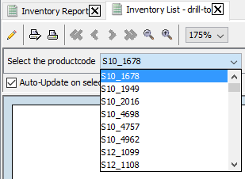
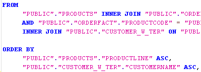
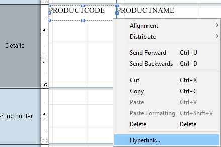
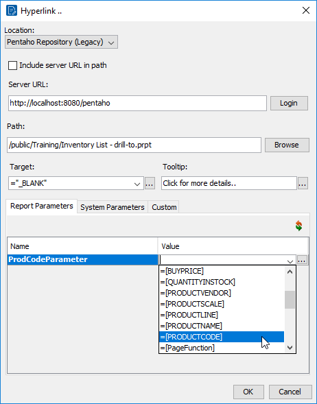
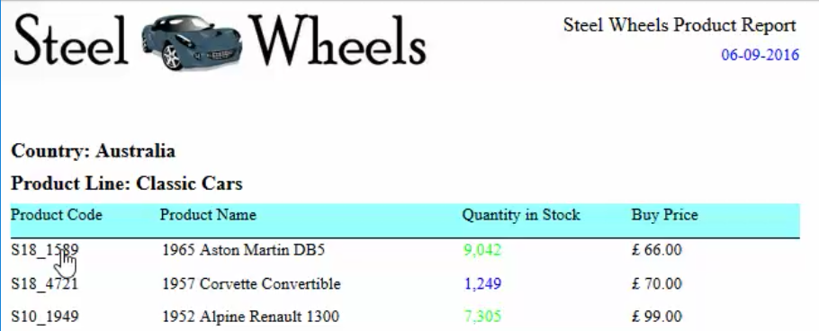
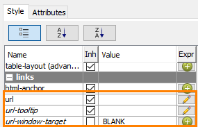

# Hyperlinks

> **Warning:**
>
> #### Workshop - Hyperlinks
>
> Link report elements to other reports and URLs.
>
> **What you'll do**
>
> * Link report elements to other reports and URLs.
> * Test the links in the published output.
>
> **Prerequisites:** Report Designer running, with the Pentaho sample data (HSQLDB) started
>
> **Estimated Time:** 15 minutes

---

> **Note:**
>
> #### **Hyperlinks**
>
> Link report elements to other reports and URLs.

## Hyperlinks

By adding a parameter to the report you enable the person viewing the report to select which data displays in the report.

1. Open the \pentahotraining\BA2000\reports\Inventory Report.
2. To open the report we are going to drill to:
3. From the Menu bar select File > Open.
4. Navigate to \pentahotraining\BA2000\reports.
5. Click Inventory List – drill to.prpt.
6. Click Open.
This report displays Product Code, Product Name, Product Line, Product Vendor, and Scale. It includes a parameter (ProdCodeParameter) which requires the user to select the Product Code.

7. Preview the report.
8. Select the productcode S10_1678, in the prompt.

The goal of this demonstration is to include a hyperlink in the Inventory Report that links to these details when the user clicks on the Product Code.

9. To publish the Inventory List – drill to report to the Training folder:
10. From the Menu bar, select File > Publish
11. In the Login dialog, click OK.
12. Complete the following fields, and then click OK.
13. When the Launch the published report? dialog displays, click No.

Now you can return to the original Inventory Report and create the hyperlink.

## Define Hyperlink

If Inventory Report includes any parameters you created earlier, delete the WHERE clause in the query.

1. In the Data Pane, double-click on Query1 and remove the parameters from the WHERE clause.

2. Delete the prod_var parameter.
3. Open the Inventory Report.
4. To create the hyperlink for the Product Code, in the Details band, right-click PRODUCTCODE, and select Hyperlink.

5. To set the Inventory List – drill-to report in the Path field:
6. Click the Browse button.
7. In the Server login dialog, click OK.
8. Navigate to /steel-wheels/Training.
9. Click Inventory List – Drill To Report.
10. Click OK.
11. From the Value drop-down list, select =[PRODUCTCODE], and then click OK.

## Preview the Report

1. From the Menu bar select File > Preview > HTML.
2. Click on the product code for S18_1589, in the report results, click S24_4620.

3. Close and save the report: Demo – hyperlinks.prpt
The configuration of our Hyperlink has been saved in:

4. Style.url
5. Style.url-tooltip
6. Style.url-window-target.

> **Under the hood:**
>
> #### A hyperlink is a style expression on href-target
>
> The dialog saved a formula, not a link: `href-target` (shown as
> `url` in the Style pane) now carries `=DRILLDOWN("local-sugar";
> NA(); {"::pentaho-path"; "...Inventory List - drill-to.prpt" |
> "ProdCodeParameter"; [PRODUCTCODE]})`, and `href-title` holds the
> tooltip. Because it is a style expression it is evaluated for every
> row, so each product code links to a URL carrying its own value as
> the target report's parameter. The HTML exporter writes it as
> `<a href>`, the PDF exporter as a link annotation, and Excel as a
> cell hyperlink.
>
> **Why it matters:** report-to-report navigation is a formula on a
> field. Change the target, add a parameter or make the link
> conditional, and it applies to every row without touching the data.

Note: You may need to switch to Pentaho Repository and add the PRODUCTCODE parameter:

=DRILLDOWN("local-sugar"; NA(); {"ProdCodeParameter"; [PRODUCTCODE] | "::pentaho-path"; "/public/Training/Inventory List - drill-to.prpt"})

## Lab files

<button data-launch="prd" data-path="files/Training Guided Demo Report 9-1 hyperlinks.prpt">Open: Solution: hyperlinks</button>

<button data-launch="prd" data-path="files/Inventory List HyperLink Report.prpt">Open: Sample: hyperlink report</button>

<button data-launch="prd" data-path="files/Inventory List - drill-to.prpt">Open: Sample: drill-to report</button>

