# Data Sources Reference

> **Note:**
>
> Reference material from the course manual (Appendix A).

## Appendix A – Data Sources

## Creating Queries with a Metadata Data Source

You must have a report file open in order to proceed, and your data source must be accessible before you can connect to it in Report Designer.

Follow this procedure to add a Metadata data source in Report Designer.

* Select the Data tab in the upper right pane.
By default, Report Designer starts in the Structure tab, which shares a pane with Data.

* Click the yellow cylinder icon in the upper left part of the Data pane, or right-click Data Sets.
A drop-down menu with a list of supported data source types will appear.

* Select Metadata from the drop-down menu.
The Metadata Data Source Editor window will appear.

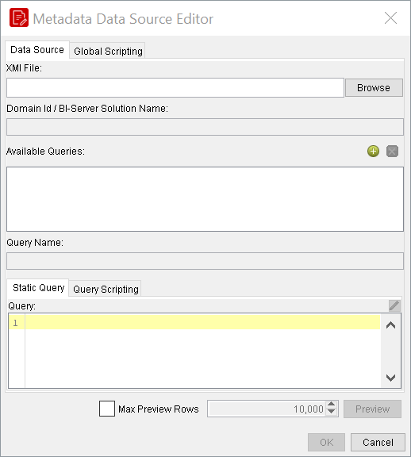

* Click Browse, navigate to your XMI metadata definition file, then click Open.
* Click the round green + icon to add a query, then type in a name for the new query in the Query Name field.
* Type in the name of the solution directory this metadata file pertains to into the Domain Id field.
If this XMI file was created with Pentaho Metadata Editor, then the domain ID has to be the root directory for this solution -- the directory one level above pentaho-solutions, typically.

If you created this XMI with Pentaho Data Integration, then the domain ID must be set to the full solution path to the XMI, which would be something like this:

/example-solution/resources/metadata/mymeta.xmi.

If the domain ID is not properly defined, you will be able to preview the report, but you will not be able to publish it to the BI Server.

* Click the pencil icon on the right above the Query field to start Metadata Query Editor, or type in your query directly into the Query field.
* Click OK when your query is complete.
## Reference:  Connect to Metadata Datasource

## Connect to Metadata Datasource

Follow this procedure to access the Metadata data source in Report Designer.

* Click on the Database icon on the Data tab, and select Metadata.

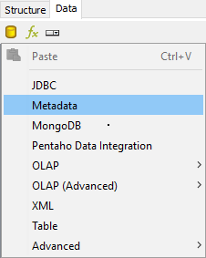

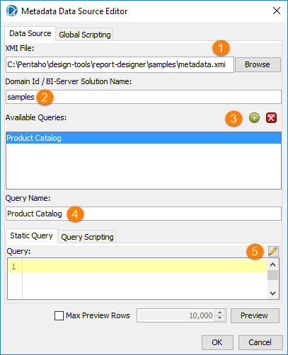

Configure the Metadata Source Editor with the following details:

* Browse to find the "metadata.xmi" file for the solution you are working with.  The metadata information is always in a metadata.xmi file, which is stored in each solution folder (assuming that metadata has been prepared for the folder).

Domain Id value is critical

The "Domain Id / BI-Server Solution Name" is always the name of the folder that your report will be stored in when it is delivered.  That's also the folder that contains the metadata.xmi file.  If you are delivering your report on a server, you must use the name of the folder on the server.  So that you can test your report on a locally hosted Pentaho User Console you should use the same folder name locally.

Each metadata data source can hold multiple queries.  The metadata is shared between all queries. You can use meaningful names for the queries in the metadata source.

* Create a new query click on the green plus in the upper right corner next to the "Available Queries" box. A new query named "Query1" gets added to the list of available queries.
* Change this to: Product Catalog.
* Select this query name and click the edit button
## Creating Queries with Metadata Query Editor

You must be in the Metadata Data Source Editor window to follow this process. You should also have established and tested a metadata data source connection.

Follow this process to design a metadata query:

The Metadata Query Editor window will appear. If the pencil icon is greyed out, then your data source is

misconfigured.

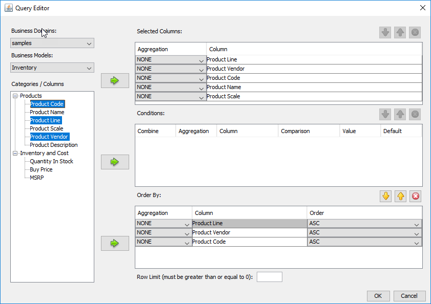

* Select ‘samples’ from the Business Domains: drop-down box in the upper left.
* Select ‘Inventory’ from the Business Models drop-down box.
* From Products Table, select the following fields:
* Product Line
* Product Vendor
* Product Code
* Product Name
* Product Scale
then click the arrow next to the Select Columns box.

You can select multiple columns by holding down the Ctrl key while clicking on columns.

* Repeat the above process for the column you want to order your results by by moving a column into the Order By box.
* Product Line
* Product Vendor
* Product Code
* Click OK to finalize the query.
You will return to the data source configuration window. Your newly formed query should appear in the Query field.

This field is editable, so you can modify the query before continuing.

* Click OK to close the Metadata Data Source Editor.
You now have a data source and at least one query that will return a data set that you can use for reporting.

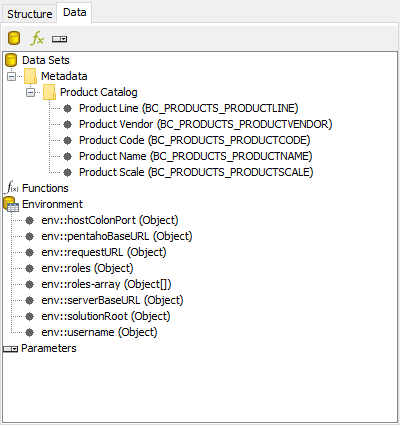

## Creating Queries with OLAP Data Source

Pentaho Report Designer is typically used with raw data sources, or with databases that have a metadata layer through a tool like Pentaho Metadata Editor. However, you can also use an MDX query to retrieve a data set from a multidimensional database. The sections below explain how to set up a Pentaho Analysis data source and add an MDX query in Pentaho Report Designer.

You must have a report file open in order to proceed, and your data source must be accessible before you can connect to it in Report Designer. You may need to obtain database connection information from your system administrator, such as the URL, port number, JDBC connection string, database type, and user credentials.

## Reference:  Connect to an OLAP Datasource

## Connect to SampleData (Hypersonic) Database

Follow this procedure to add a Pentaho Analysis (Mondrian) data source.

* Select the Data tab in the upper right pane. By default, Report Designer starts in the Structure tab, which shares a pane with Data.
* Click the yellow cylinder icon in the upper left part of the Data pane, or right-click Data Sets. A drop-down menu with a list of supported data source types will appear.
* Select OLAP from the drop-down menu, then select the following: Pentaho Analysis (Denormalized).
* The Mondrian Datasource Editor window will appear.
* If you want to provide parameters that contain different Mondrian connection authentication credentials, click the Edit Security button in the upper left corner of the window, then type in the fields or variables that contain the user credentials you want to store as a parameter with this connection. The role, username, and password will be available as a security parameter when you are creating your report.
* Click Browse, navigate to your Mondrian schema XML file:
C:\Pentaho-Training\BA-2000\datasources\mondrian\ steelwheelssales.mondrian.xml

* Click Open.
* To configure a connection:
* Above the Connections pane on the left, click the round green + icon to add a new data source.
* Select your database brand from the Connection Type list
* Select the access type in the Access list at the bottom
* Type in your database connection details into the fields in the Settings section on the right.
The Access list will change according to the connection type you select; the settings section will change depending on which item in the access list you choose.

Click the Test button to ensure that the connection settings are correct. If they are not, the ensuing error message should give you some clues as to which settings need to be changed. If the test dialogue says that the connection to the database is OK, then click the OK button to complete the data source configuration.

* If you installed the Pentaho sample data, several SampleData entries will appear in the list. You must have HSQLDB to view the sample data.
* Select SampleData (Hypersonic)
* In the subsequent Database Connection dialogue, type in a concise but reasonably descriptive name for this connection in the Connection Name field:
## Quantity of Products by Country

Now that your data source is configured, you must enter an MDX query before you can finish adding the data source. You can also create a dynamic query through scripts.

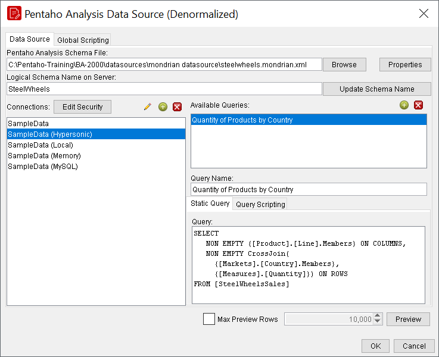

Here’s the MDX Query:

## SELECT

NON EMPTY {[Product].[Line].Members} ON COLUMNS,

## NON EMPTY CrossJoin(

{[Markets].[Country].Members},

## {[Measures].[Quantity]}) ON ROWS

## FROM [SteelWheelsSales]

## Creating Queries with XML Data Source

An XML data source uses an XML file to provide the dataset. The XML structure is not flat like a table, there are not rows and columns, it is more similar to a tree, where we can have several levels of data. For this reason it is necessary to use an XPath query to identify which nodes of the XML document must be considered as records.

## Reference:  Connect to an XML Datasource

## Connect to XML Datasource

Imagine in the report, we want to list all the orders, showing for each person the order status, the order date and value. Each record can be identified with the XML node labelled "orders". The selection of these specific xml tags is done with an XPath query:

## /document/order

XPath is a powerful query language to select data in an XML file. In this case the expression will select all the nodes of type "order" attributes of "document". The result from the data source prospective will be a set of records.

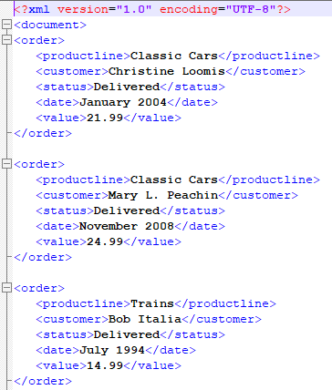

The XPath query can be defined inside the report, Report Designer will execute the XPath query to select the nodes / attributes. The advantage of keeping the XPath query inside the report is that we can use parameters to make the query dynamic.

You must have a report file open to proceed, and your data source must be accessible before you can connect to it in Report Designer. For database connections, you may need to first obtain necessary information from your system administrator, such as the URL, port number, JDBC connection string, database type, and user credentials.

Follow this procedure to add a data source in Report Designer.

Select the Data tab in the upper left pane. By default, Report Designer starts in the Structure tab, which shares a pane with Data.

Click the yellow cylinder icon in the upper left part of the Data pane, or right-click Data Sets. A drop-down menu with a list of supported data source types will appear.

Select XML from the drop-down menu. The XML Datasource Editor window will appear.

* Click Browse, navigate to your XML file:
**File:** `C:\Pentaho-Training\BA-2000\datasources\xml\orders.xml`

Click the round green + icon above the Available Queries field.

Enter: ‘orders’ into the Query Name field.

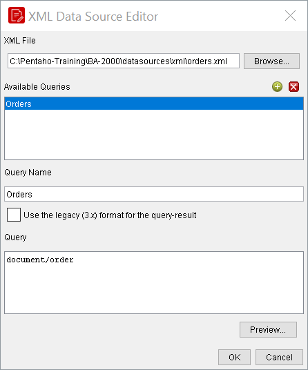

Enter the XQuery: document /order into the Query field, then click Preview to ensure that it is valid.

Click OK when your query is in order.

## Reference:  Writing a SQL Query

## Connecting to a Data Source

The first step in creating a new report is connecting to a data source.

* From the Welcome screen, click New Report. If it is not visible, choose Help > Welcome from the menu options.
* From the menu, select Data > Add Datasource > JDBC.
* In the JDBC Data Source window, from the Connections list, click SampleData.
## Write SQL Query

Territory, Country, Customer Name, Product Line, Order Number, and Total Price:

* To add a query, in the JDBC Data Source window, click the Add Query icon to the right of Available Queries.
* To open the SQL Query Designer window, click the Pencil icon to the right of Query.
* To add the Customer with Territory table to the query, from the list of tables, double-click CUSTOMER_W_TER.
* To add the Order Fact table to the query, from the list of tables, double-click ORDERFACT.
To join the CUSTOMER_W_TER with ORDERFACT table to the Order Fact table:

* Join on CUSTOMERNUMBER
From the CUSTOMER_W_TER table, select only:

* CUSTOMERNAME
COUNTRY

TERRITORY

From the ORDERFACT table, select only:

ORDERNUMBER

PRODUCTCODE

* TOTALPRICE
Sort (order-by) the results by:

CUSTOMER_W_TER.TERRITORY

CUSTOMER_W_TER.COUNTRY

* CUSTOMER_W_TER.CUSTOMERNAME
* Close the SQL Query Designer window
To view the query and available fields:

Click the Data tab.

Double-click Data Sets.

Expand JDBC: SampleData (hypersonic).

* Expand Query 1.
* To save the report, on the toolbar, click the Save button, and then save the report to the desktop or a local folder as Training Exercise Report 3-1.
## Transformations

A PDI transformation to obtain driving directions from MapQuest has already been created.

In this demonstration we will not create a new transformation, but we will review the existing transformation.

For more information on using Data Integration, see course DI1000: Pentaho Data Integration.

* From the Windows task bar, select Start > All Programs > Pentaho Enterprise Edition > Design Tools > Data Integration.
* To close the Repository Connection dialog, click Cancel. Do not connect to a repository.
* To open the existing transformation:
* From the Menu bar select File > Open.
* Navigate to \pentahotraining\BA2000\transformations.
* Click get_directions_from_mapquest_service.ktr.
* Click Open.

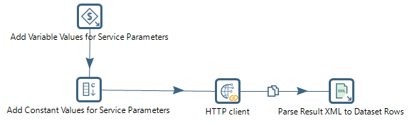

To retrieve directions from this service, the following values are required:

* key: A unique key to authorize use of the routing service.
* from: The starting location of a route request.
* to: The ending location of a route request.
* outFormat: The format the directions must be returned as either JSON or XML.
The transformation consists of 4 steps:

* The first step parameterizes the From and To addresses.
* The second step uses constants for additional service inputs.
* The third step calls the service for directions.
* The fourth step breaks down the XML into tabular results.
## Transformation Properties

The route – from and to addresses – have been set as named parameters.

* Double-click on the canvas, and select the Parameters tab.

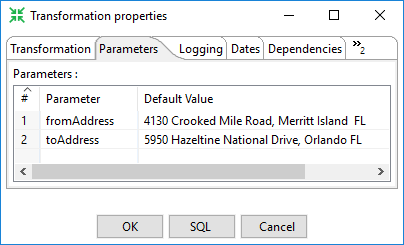

## Get Variables

This step allows you to get the value of a variable. This step can return rows or add values to input rows.

Note: You must specify the complete variable specification in the format ${variable}

Or  %%variable%% (as described in Variables) .

That means you can also enter complete strings in the variable column, not just a variable.

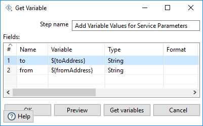

This step retrieves the values for the to and from  data stream fields.

## Add Constants

The Add constant values step is a simple and high performance way to add constant values to the stream.

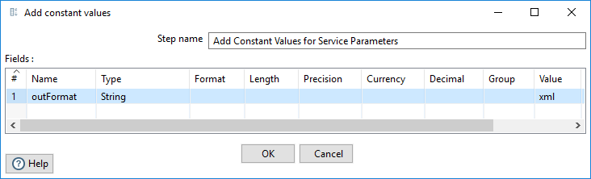

This step adds the outFormat field and sets the value to xml.

## HTTP Client

The HTTP client step performs a simple call to a base URL with options appended as shown below:

http://<URL>?param1=value1&param2=value2&..

The result is stored in a String field with the specified name.

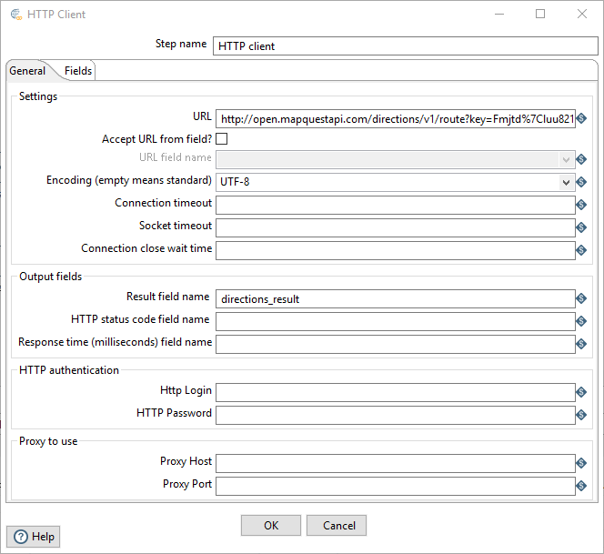

The step queries the URL, and returns the results in the stream field: directions_result

## Parse Result XML

This step provides the ability to read data from any type of XML file using XPath specifications.

Uses the directions_result field as an xml datasource.

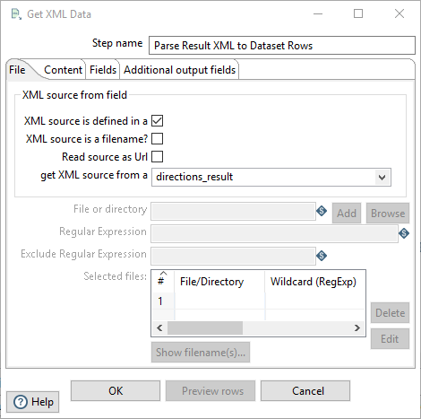

Based on the XPath, populates the fields:

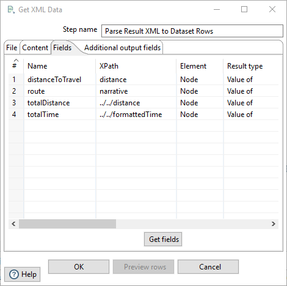

Exit Pentaho Data Integration.

## Configuring the Report

In this part of the demonstration we will open an existing report and add parameters for the ‘From’ address and ‘To’ address.

* Open the existing driving directions report:
* From the Menu bar select File > Open.
* Navigate to \pentahotraining\BA2000\reports.
* Click Driving Directions.prpt.
* Click Open.
Notice the report consists of several label elements and an image, but there is no data source defined.

* From the Data tab, right-click Parameters, and then click Add Parameter.
Complete the following fields in the Add Parameter window, and then click OK.

* From the Data tab, right-click Parameters, and then click Add Parameter.
Complete the following fields in the Add Parameter window, and then click OK.

## PDI as a Datasource

* From the Menu bar, select Data > Add Datasource > Pentaho Data Integration.

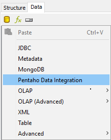

* In the Pentaho Data Integration Data Source window:
* Click the Add a new query button.
* Rename Query: Directions
* Browse to: get_directions_from_mapquest_service.ktr
* Select: Parse Result XML to Dataset Rows
* Click on: Edit Parameter

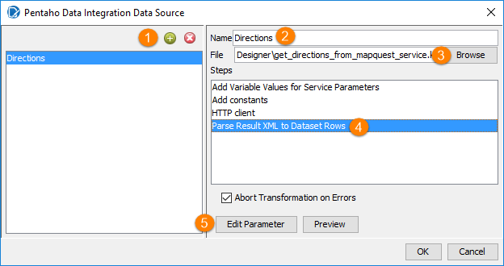

* To map the transformation parameters:
* Click in the Value field for the fromAddress, and then from the drop-down list, select FromParam.
* Click in the Value field for the toAddress, and then from the drop-down list, select toAddress.
* Click OK.

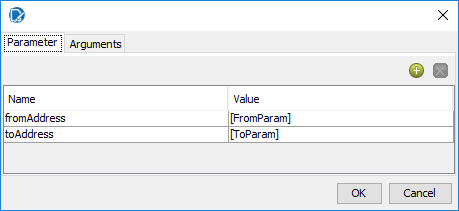

## Create the Report

The data tab shows the fields available from the PDI data source. Use the fields to build and publish the report.

* On the Data tab, expand Data Sets > Pentaho Data Integration > Directions.

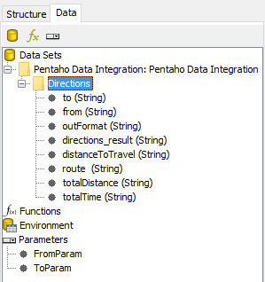

* Drag the from, to, route, distanceToTravel, totalDistance, and totalTime fields to the canvas as shown below. Use your knowledge to align the report elements and right-justify the distanceToTravel, totalDistance, and totalTime elements.

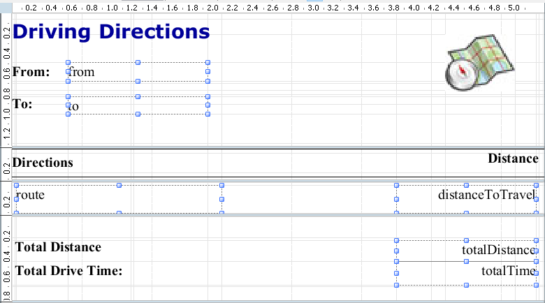

* Type the following parameter values, and then click Update:
* Resize the Elements to read information.
* Preview and Save the Report: Training Demo Report 10 – PDI

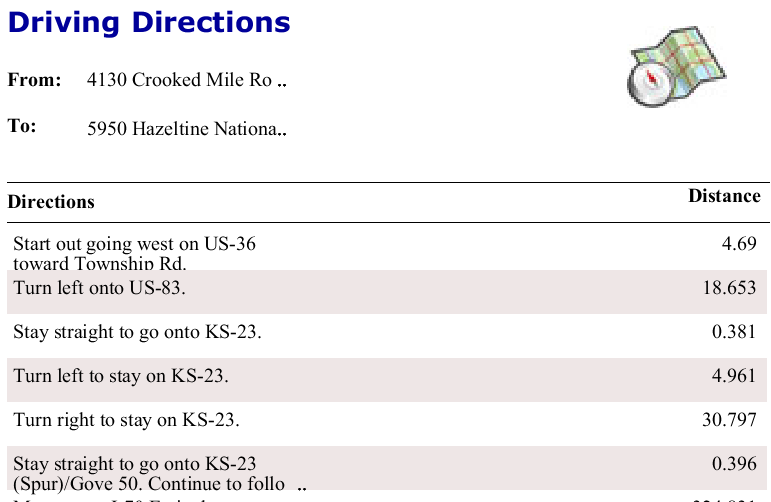
