# Charts Reference

> **Note:**
>
> Reference material from the course manual (Appendix B).

## Appendix B – Charts

## Bar Charts

Bar charts are useful for discovering trends over time by displaying data in thin, solid columns. Related data sets can be assembled in groups (series) for easy comparison. If you need to show time-oriented changes in data, or if you want to make comparisons between X and Y values that are not directly related in your data source, you must use an XY Bar chart instead.

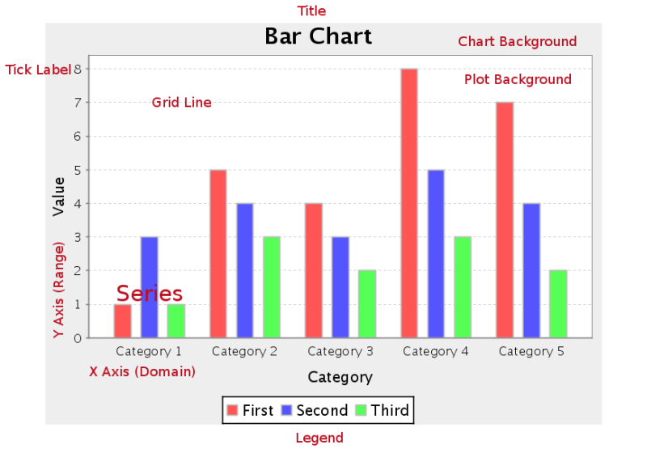

**File:** `..\sample charts\Bar Chart.prpt`

value-columns = [SALES]: This is the value that will be shown on the y axis

series-by-field = [PRODUCTLINE]: This is the item under analysis

category-column = YEAR_ID: This is the category by which the items will be grouped

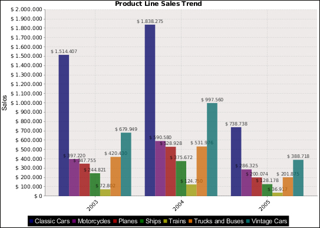

Suppose we want this chart to show stacked bars. All we have to do is double-click on the object Chart in the report and configure the following on the left-hand side:

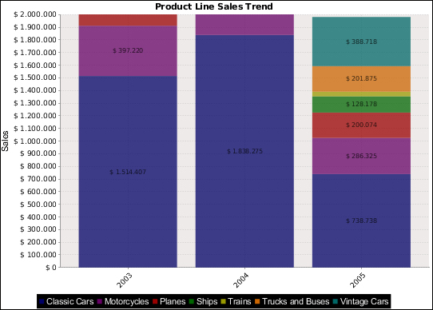

stacked = True

If we want the chart to show the bars horizontally, all we have to do is modify the following:

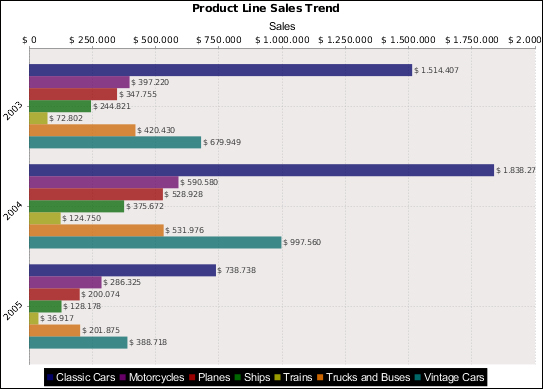

horizontal = True

## Line

Line charts are useful for discovering trends over time by displaying data in thin, usually horizontal lines. Related data sets can be assembled in groups (series) for easy comparison. If you need to make comparisons between X and Y values that are not directly related in your data source, you must use an XY line chart instead.

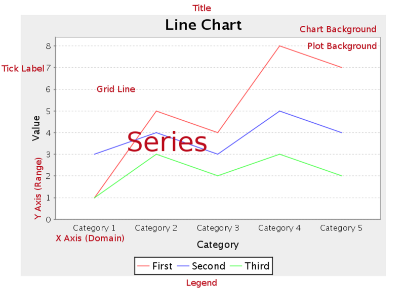

**File:** `..\sample charts\Line Chart.prpt`

value-columns = [SALES]: This is the value that will be shown on the y axis

series-by-field = [PRODUCTLINE]: This is the item under analysis

category-column = NewDate: This is the time period expressed in year and month

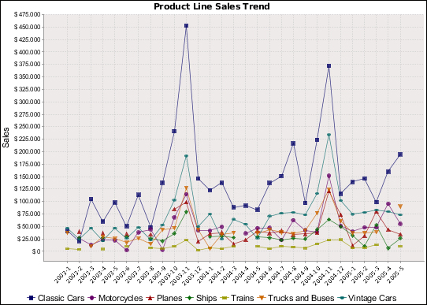

## Area

Area charts are useful for discovering trends over time, where the values you are comparing are typically hierarchical.

If one or more of the chart areas will dip below other areas, then the resulting chart may not be very useful, and you would be better served by a line or bar chart. Area charts are much like line charts, except the area between the lines and the X axis is filled in with either solid, non-overlapping; or transparent, overlapping colors. Related data sets can be assembled in groups (series) for easy comparison. If you need to make comparisons between X and Y values that are not directly related in your data source, you must use an XY area chart instead.

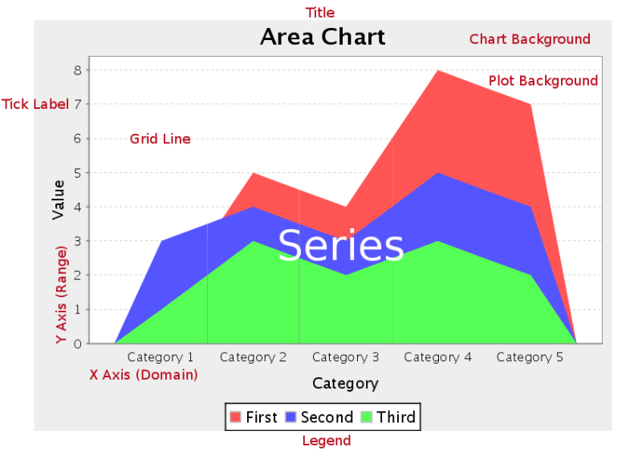

**File:** `..\sample chart\Area Chart.prpt`

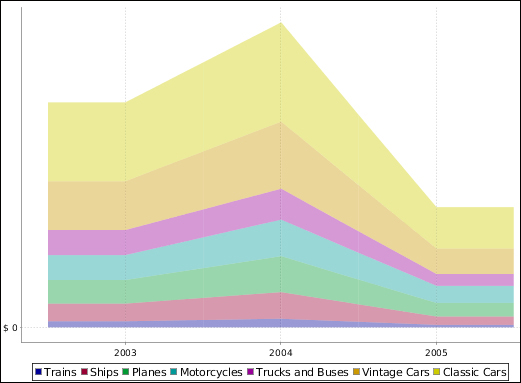

If you do not want the areas to stack, there is a way to make the areas not cover each other:

* Make them somewhat transparent by modifying the value of plot-fg-alpha
* In serie-color, choose a collection of colors that are very different from each other
* In lot-bg-color, choose a dark color, for example, dark gray
If we want our report to show the value of each angle on the edge of each area, we just configure the following:

```bash
show-item-labels = Show Labels
```

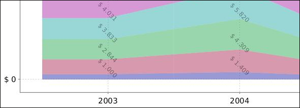

## Pie

Pie charts are useful for comparing multiple data points. A single pie slice can be "exploded" out from the rest of the chart to bring attention to the value it represents. If you need to compare related data sets in groups, you must use a pie grid chart instead.

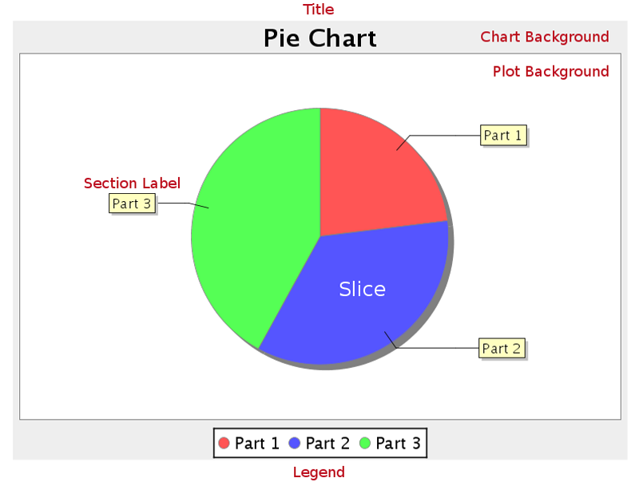

**File:** `..\sample charts\Pie.prpt`

value-columns = Sales

series-by-field = [Product]

As you can see, each portion of the pie is labeled with its Sales value and the percentage that this represents of the total pie. This is due to the following configuration:

label-format = {1} ({2})

Note: {0}, {1}, {2}, and {3} are variables that return different values according to the type of chart; in this case:

## {0} returns the name of the item

## {1} returns the value of the item

{2} returns the percentage of the total that the item represents

{3} returns the sum of the values of all items

If we remove the legend box present in the lower part of the chart (show-legend = False), we could configure label-format as follows:

label-format = Product: {0}

## Sales: {1}

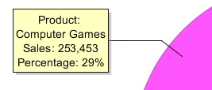

## Multi-Pie

Pie grid charts are useful for comparing multiple data points in a group. The group (series) items will display as multiple pie charts in one chart area.

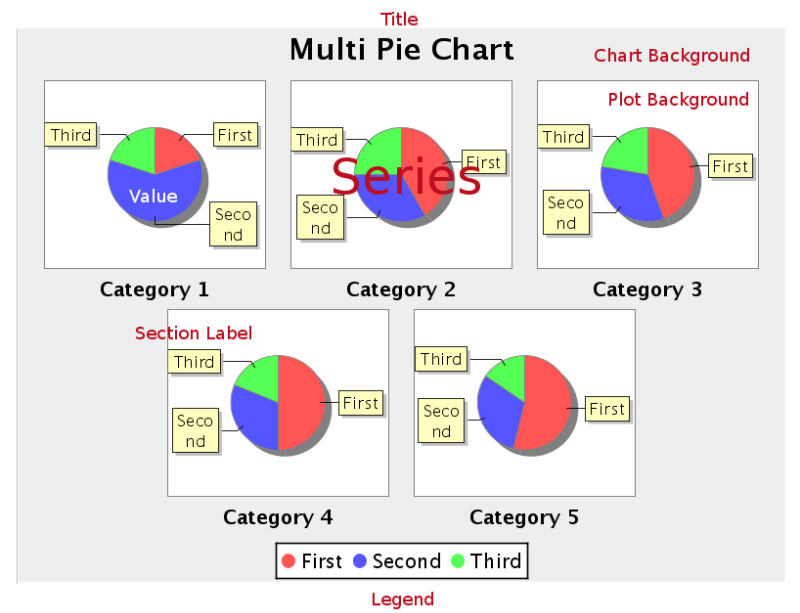

**File:** `..\sample charts\Multi Pie Chart.prpt`

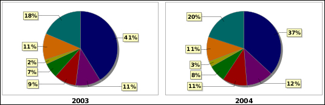

## Bar Line Combination

Bar Line charts are useful for spotting trends and comparing items against one another as well as showing comparisons between metrics. For instance, you might have bars that represent the number of employees per department, and a line that indicates productivity; or bars that represent software product sales, and a line that represents the number of evaluation downloads. You cannot have more than one line per bar line chart, so if you need to compare more than one set of metrics, you will have to create multiple charts to show them.

Note: Bar Line charts require two data sources -- one for the bars, one for the line. These are set through the Primary Datasource and Secondary Datasource tabs at the top of the right half of the Bar Line properties window. In order to properly show a relationship between the two data points, you should use the same data source for both the bars and the line.

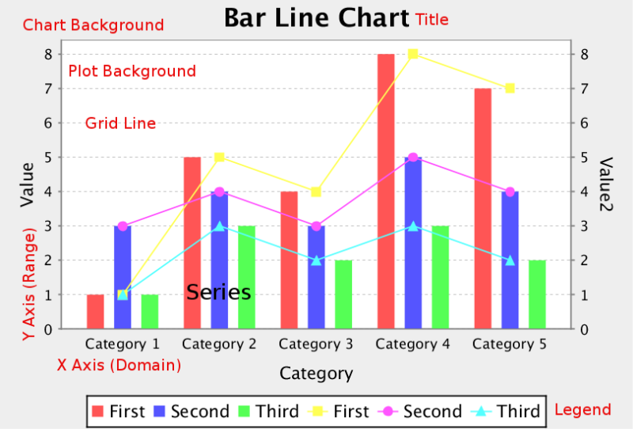

**File:** `..\sample charts\Bar Line Chart.prpt`

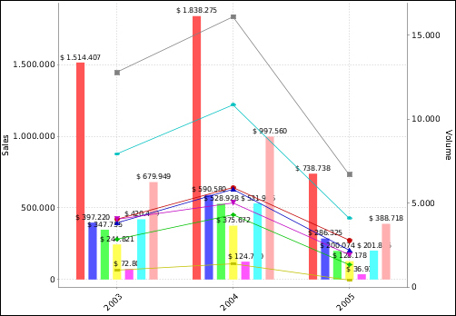

If we double-click on the object Chart, we will see to the right that the Secondary DataSource tab is now available. This implies that this type of chart has two data sources:

Primary DataSource: This is used in a bar chart and is configured as follows:

category-column = YEAR_ID

value-columns = [SALES]

series-by-field = [PRODUCTLINE]

Secondary DataSource: This is used in a line chart and is configured as follows:

category-column = YEAR_ID

value-columns = [VOLUME]

series-by-field = [PRODUCTLINE]

The scale to the left (vertical axis in this case) can be configured by editing the characteristics of Y-Axis, while the scale to the right can be configured by editing the characteristics of Y2-Axis.

## Ring

Note: This chart type is only available in Report Designer; it cannot be created through the BI Platform's ChartComponent.

Ring charts, like pie charts, are useful for comparing multiple data points. Pie charts are generally easier to read, so you should probably have a specific reason to choose a ring over a pie chart. A single ring slice can be "exploded" out from the rest of the chart to bring attention to the value it represents. If you need to compare related data sets in groups, you must use a pie grid chart instead.

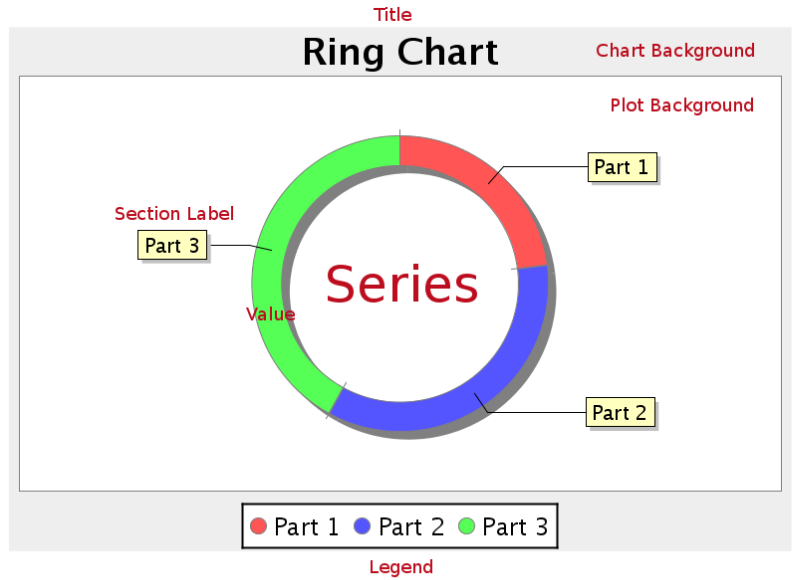

**File:** `..\sample charts\Pie.prpt`

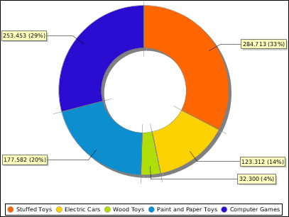

If we pay attention, we will see that the only difference to a pie chart is that a ring chart has one more field, section-depth.

## Bubble

Bubble charts are useful for spotting relationships between metrics and comparing specific data points. In  terms of functionality and purpose, a bubble chart is similar to a bar line chart, but offers more specific visual cues for certain data sets. Each bubble represents a plotted XY point at its center, and the Z axis controls the diameter of the bubble.

For example, a sales chart might have the top 5 bestselling product names for the X axis, number of units sold as the Y axis, and total sales revenue for each product for the Z axis.

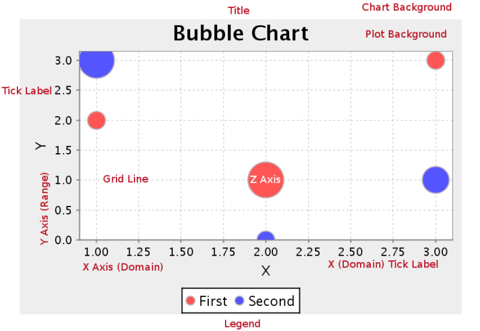

**File:** `..\sample charts\Bubble Chart by Line.prpt`

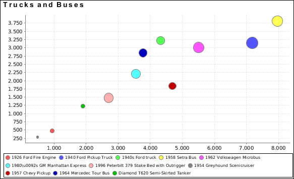

This type of chart presents data in three dimensions. The x and y axes represent the two different scales on which each point will be placed, and the z axis is represented by making each point larger. In this case, the points represent the Products, the y axis is the Cost, the x axis is the Sales, and the z axis (or dot size) represents the quantity ordered of this product.

## Scatter Plot

Note: This chart type is called XY Dot in the BI Platform's ChartComponent.

XY dot (scatter plot) charts are useful for showing trends for many individual exact data points over time. The plotted points show data trends in groupings; where the dots are most concentrated, the trend is most prevalent. If there are very few data points, an XY line or bar chart may be a more appropriate chart type than XY dot.

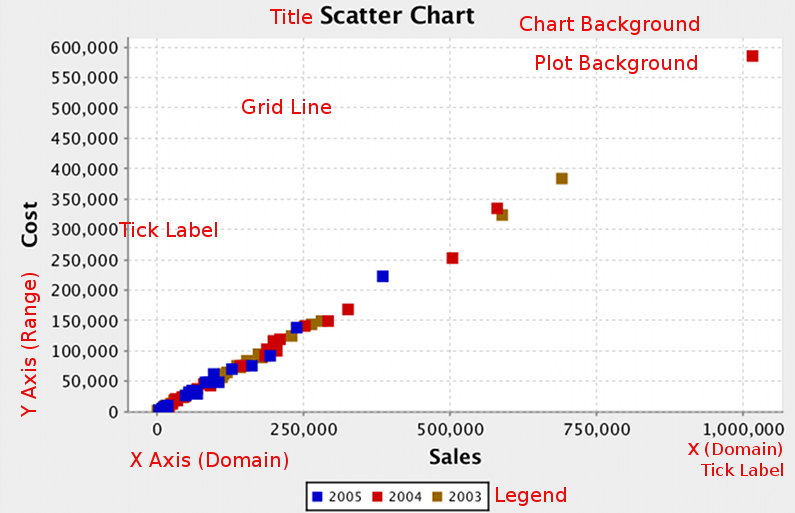

**File:** `..\sample charts\Scatter XY Collector.prpt`

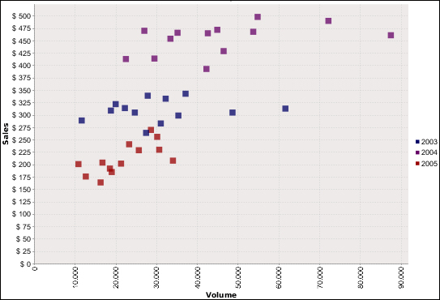

The example report analyzes the dispersion of products by year taking into account the values Sales and Volume.

## XY Bar

XY bar charts are useful for showing data trends over time, where values tend to change after reasonably long intervals.

An XY step chart is essentially a horizontal bar chart where the bars are segmented vertically whenever there is a change in value.

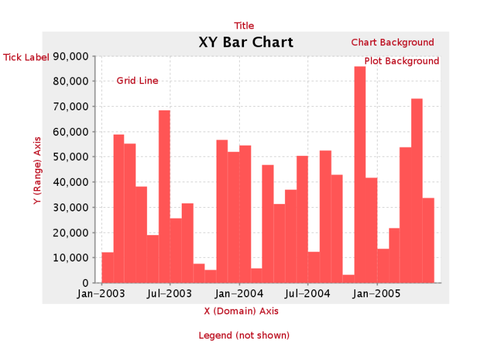

**File:** `..\sample charts\XY Bar Chart.prpt`

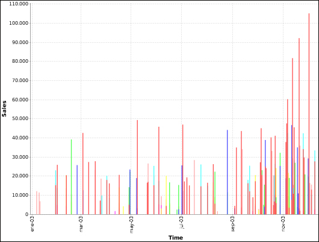

## XY Line

XY line charts are useful for showing how multiple data trends relate to one another over time. It is essentially multiple line charts interposed over one another, and using data sets that are closely related and similar enough to share the same Y axis scale.

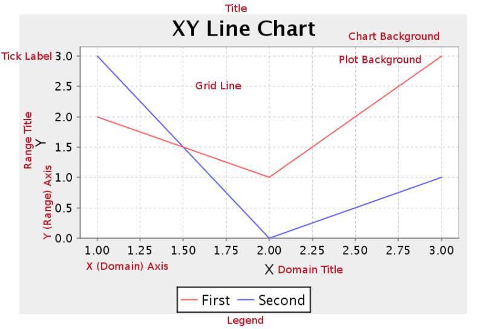

**File:** `..\sample charts\XY Line Chart.prpt`

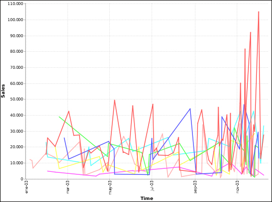

## XY Area

XY area charts are useful for comparing multiple related data sets over time, especially in zero-sum situations  where you want to show how much of a part each data set has of the total.

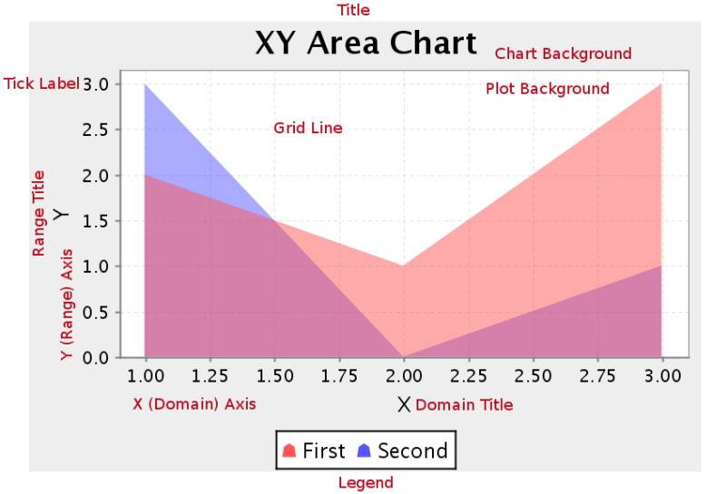

**File:** `..\sample charts\XY Area Chart.prpt`

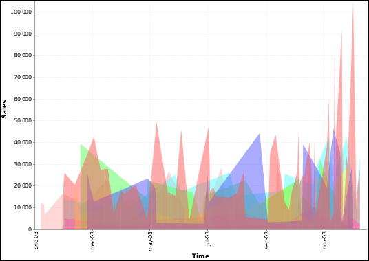

XY Extended Line (XY Step, XY StepArea, XY Difference)

There are three possible variations of the XY extended line chart: StepChart, StepAreaChart, and DifferenceChart.

Passing these values to the ext-chart-type parameter in Report Designer, or the chart-type variable in an action sequence will determine which chart you will create. All three types share the same properties.

XY extended line charts are useful for showing how multiple data points change over time while also showing how each compares against the others.

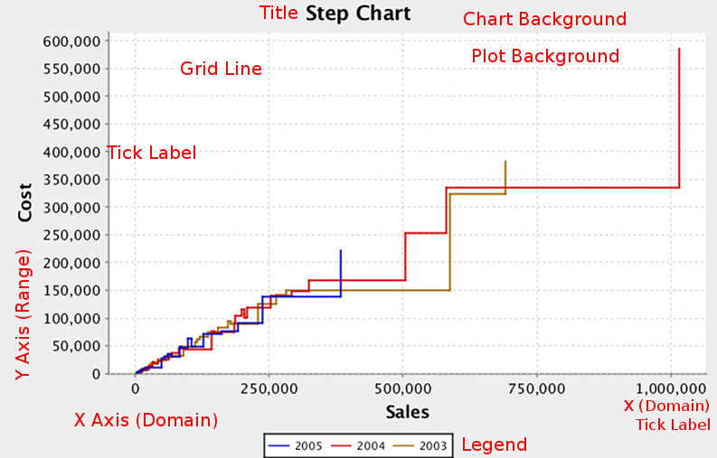


## Waterfall

Note: Waterfall charts are only available in Report Designer; you cannot create a waterfall chart with

ChartComponent.

A Waterfall chart is useful for showing the length of each specific portion of a trend.

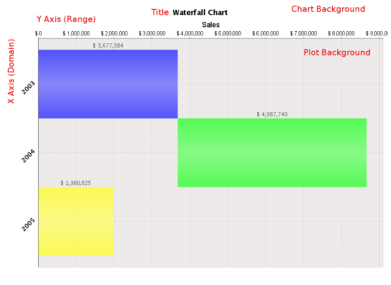

**File:** `..\sample charts\Waterfall Legacy.prpt`

This type of chart is generally used to show increases and decreases in the values under analysis. The first and last values of the chart are represented with a common bar. From the second bar onward, the bars are positioned relative to the right edge of the first bar. If the second value represents a positive value, the bar grows to the right and is green; however, if the value is negative, the bar decreases to the left and is red.

## Radar

Note: Radar charts are only available in Report Designer; you cannot create a radar chart with the BI Platform's ChartComponent.

A radar chart is useful for showing how two or more volume-related data points compare against one another, using a third related data point as a basis for comparison. For instance, you may want to show how sales dollar amounts compare among product lines across multiple territories.

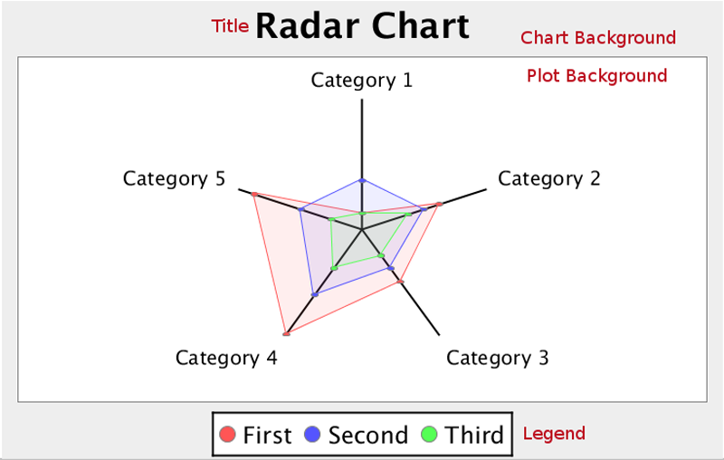

**File:** `..\sample charts\Radar Chart.prpt`

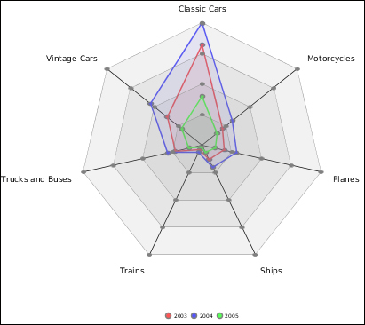

## Choosing the right chart type

There are 17 JFreeChart chart types built in, and the right one
depends on what the data is saying (from the official User Guide):

| You want to show… | Best chart types |
| --- | --- |
| The strength of a trend for one value over time | Line, Area, XY StepArea, XY Step, XY Line |
| A direct comparison of two or more related values | Pie, Ring, Bar, Line, Area, Radar |
| How one set of values affects another | Bar Line Combination, Waterfall |
| A large number of data points | XY Difference, Scatter Plot, Bubble, Multi-Pie |
| A trend across a few numbers, inline | Sparkline (input must be comma-separated values — use a function to build the CSV string if needed) |

Match the **data collector** to the chart family: CategorySet /
PivotCategorySet for category charts (Bar, Line, Area, Waterfall,
Radar), PieSet for Pie and Ring, TimeSeries / XYSeries / XYZSeries for
the XY family, Scatter, and Bubble.
