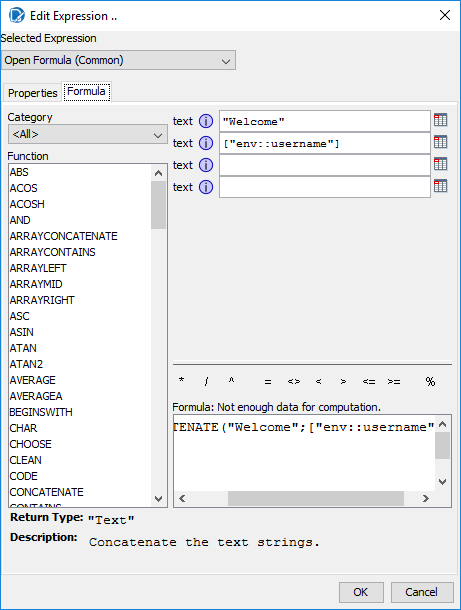
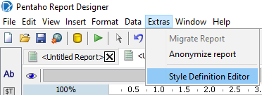
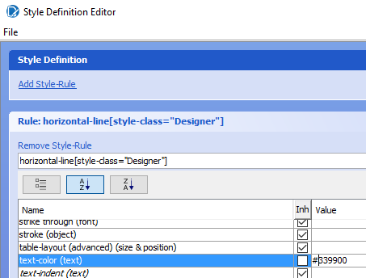
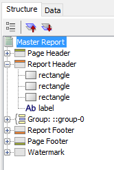
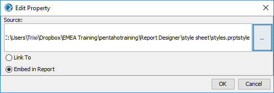
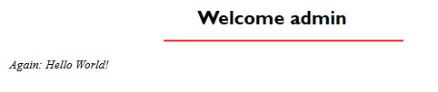

# Environment Variables Reference

> **Note:**
>
> Reference material from the course manual (Appendix C).

## Appendix B – Charts

## Environmental Variables

Environment variables are basically variables whose values depend on the environment in which they are being used. For example, an environment variable can return to the application using it as a description of the current operating system or the complete path where the application is being executed.

In Pentaho Report Designer (PRD) there exists a series of predefined environment variables that will help us interact with the BA Server that is executing them. Making use of these variables, we can modify the behavior and content of our reports.

* Create a new report.
* In the Page Header section, add a Label.
* Configure the Label:
Attributes.value =      =CONCATENATE("Welcome "; ["env::username"])

## Attributes.style-class =      =["env::username"]

## Style.family (font) = 16

## Style.bold = true

* In the Page Header, add a Horizontal Rule
* Configure the Horizontal Rule:
## Attributes.style-class =    =["env::username"]

## Style.stroke = solid, 2.0

* In the Report Header section, add a Label.
* Configure the Label:
Attributes.value = Again: Hello World!

## Attributes.style-class =    =["env::username"]

## Style sheet

PRD uses CSS3 to implement stylesheets, which allows, among other things, correct integration with the most popular web browsers.

The stylesheets' code in PRD is stored in an XML file with the extension .prptstyle. This file can be created, exported, and modified from the PRD UI using the Style Definition Editor. Also, this file can be embedded in our report or simply linked to it.

Using stylesheets in PRD will make the design of the final presentation of our reports easier and will save us a lot of manual configuration time, in addition to separating the presentation logic from the report logic. That is, we can create our stylesheets just once and then apply them to all of our reports. If, for example, our company changes its logo, colors, font face, and so on, we don't have to modify each and every report. We just modify the CSS assigned to the reports.

* To create a stylesheet, navigate to: Extras > Style Definition Editor in the Main Menu.

* Click on add Style-rule option, and configure a Rule:
## Rule =   horizontal-line[style-class="Designer"]

## Style.text-color= #339900

The CSS rule says that it will apply the style (green color) to all the horizontal lines that have the value Designer in their Attributes.style-class.

Note: Designer is the default user used when previewing reports in PRD.

* Click on add Style-rule option, and configure another Rule:
## Rule= horizontal-line[style-class="admin"]

## Style.text-color= #f02929

The CSS rule says that it will apply the style (red color) to all the horizontal lines that have the value Admin in their Attributes.style-class.

Note: Remember that Admin is the name of a Pentaho BA Server User.

* Click on add Style-rule option, and configure another Rule:
## Rule= report-header label[style-class="Designer"]

## Style.font-size= 18

## Style.bold= true

The CSS Rule says that it will apply the style (large and bold font) to all the labels in the Report Header section that have the value Designer in their Attributes.style-class.

* Click on add Style-rule option, and configure another Rule:
## Rule= report-header label[style-class="admin"]

## Style.italics= true

The CSS Rule says that it will apply the style (italic) to all the labels in the Report Header section that have the value Admin in their Attributes.style-class.

* Save the file. To do so, navigate to the option File | Save As.... Name it styles.prptstyle
## Report

* On our report, navigate to: Structure > Master report.

* Configure the following:
## Attributes.style-sheet-reference

Click on the

Search for your styles.prptstyle file and embed.

To try out the stylesheets we just created, run them through PRD, whose default user is Designer, and from the Pentaho BA Server, logging in with the user Admin.

Then, on one hand, preview the report in PRD.

On the other hand, publish the report (PDF) in Pentaho BA Server, in the same folder where we published previous reports. When asked if you want to execute the report now, click on the Yes option.

