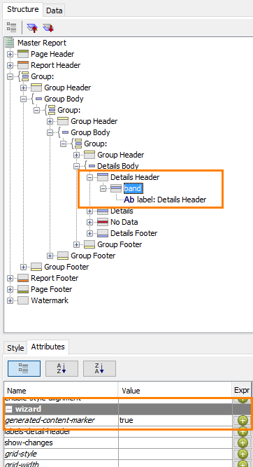
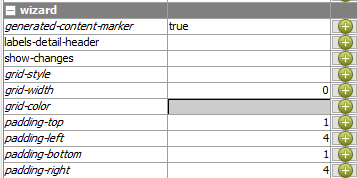
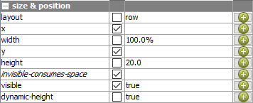
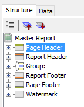
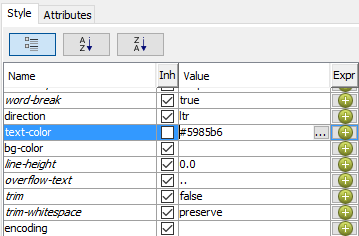
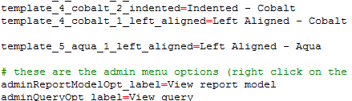

# Report Templates Reference

> **Note:**
>
> Reference material from the course manual (Appendix D).

## Appendix D – Report Templates

## Report Templates

Open the report ..\template\original_5_aqua_1_left_aligned.prpt

To view the generated-content-marker for the Details Header:

Click within the Details Header band.

On the Structure tab, click the band element under the Details Header.

On the Attributes tab, scroll to view the wizard > generated-content-marker attribute.

Notice the band element. Any formatting applied to a band will also apply to the elements used within it.

To view the Group Header band, on the Structure tab, expand the inner-most Group Header (directly above the Details Body).

Notice the band element, and also notice the generated-content-marker attribute on the Attributes tab.

To view the attributes for the Details band, on the canvas, in the Details band, click to select the ID element, and then on the Structure tab, click the Details band.

Notice the settings on the Attributes tab under query-metadata, and notice the padding and grid settings under wizard.

To view the style properties for the Details band, on the Style tab, scroll to view the size & position properties.

Notice the layout and width settings.

To select the Page Header band, on the Structure tab, click the Page Header band.

To change the text-color property to aqua, on the Style tab, click in the Value for text-color and replace the value with #009999.

Note that by changing the text-color for the Page Header band, elements within the band inherit the text-color.

To facilitate changing all bands and elements in the template from cobalt to aqua, copy the text-color value to the clipboard.

To change the text-color for the Report Header band, on the Structure tab, click the Report Header band, and then on the Style tab, replace the value for text-color with #009999.

To continue changing all the cobalt bands and elements to aqua, navigate down the bands and elements on the Structure tab and change any cobalt value for text-color and bg-color to #009999.

Important: Change only the cobalt values. Do not change any of the other color values.

Notice in some cases, the formatting is applied at the element level instead of the band level.

## Review and Save: 5_aqua_1_left_aligned.prpt

## Deploying the Template

To stop the Pentaho Server, from the Windows task bar, select Start > All Programs > Pentaho Enterprise Edition > Server Management > Stop BA Server

Copy:

## 5_aqua_1_left_aligned.png

## 5_aqua_1_left_aligned.prpt

..\pentahotraining\BA2000\templates to either:

..\pentaho\server\biserver-ee\pentaho-solutions\system\pentaho-interactive-reporting\ resources\templates (pre version 7)

..\pentaho\server\pentaho-server\pentaho-solutions\system\pentaho-interactive-reporting\resources\templates

## Open Notepad ++

To open the messages.properties file:

From the Menu bar, select File > Open.

Navigate to:

..\pentaho\server\biserver-ee\pentaho-solutions\system\pentaho-interactive-reporting\resources\messages. (pre version 7)

Open the messages.properties file.

To edit the messages.properties file:

Scroll to the end of the existing content.

On the keyboard, press Enter.

Type: template_5_aqua_1_left_aligned=Left Aligned - Aqua.

Press Enter.

Save the changes.

Close the text editor.

To start the BA Server, from the Windows task bar, select Start > All Programs > Pentaho Enterprise Edition > Server Management > Start BA Server

Launch the User Console and log in as admin.

From the User Console Home Perspective page, click Create New > Interactive Report.

In the Select Data Source window, click Orders, and then click OK.

To select a report template, in the Selection pane, click the General tab, and then click Select.

Click the right arrow to scroll through the available templates, and then click Left Aligned – Aqua.

For this demonstration it is not necessary to create an actual report.

Preview the template.

## Lab files

<button data-launch="prd" data-path="files/5_aqua_1_left_aligned.prpt">Open: Template: 5 aqua, left aligned</button>

<button data-launch="prd" data-path="files/original_5_aqua_1_left_aligned.prpt">Open: Template: original 5 aqua</button>

