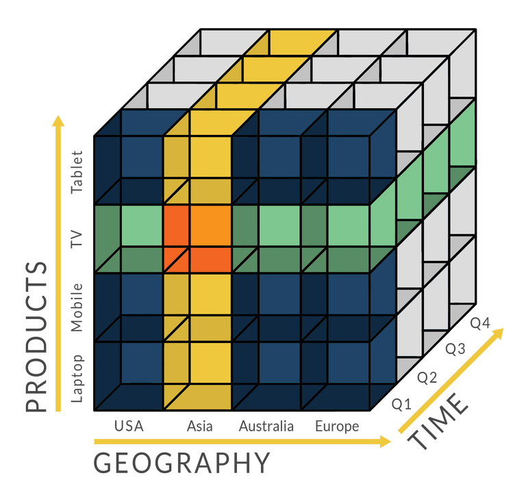
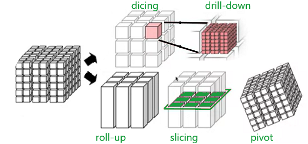
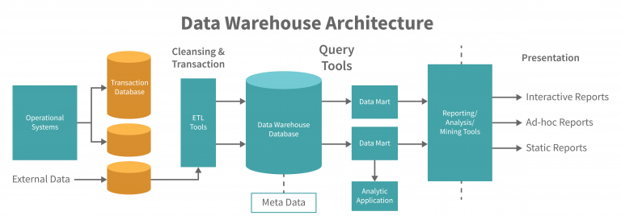
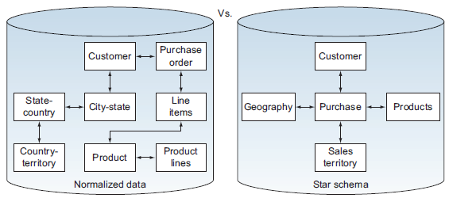
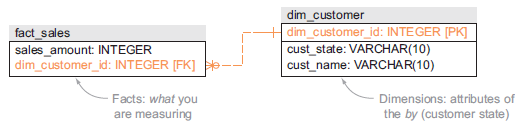
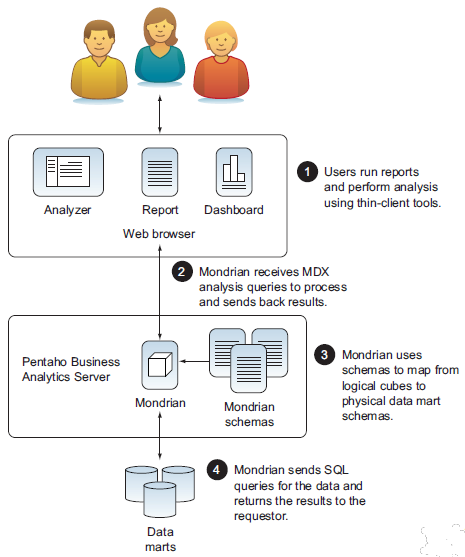

# Key Concepts & Terminology

> **Note:**
>
> #### Online Analytical Processing
>
> **What is OLAP?** Online Analytical Processing (OLAP) systems are specialized databases designed for analyzing large volumes of data quickly and efficiently. Unlike OLTP (Online Transaction Processing) systems that handle day-to-day transactions like order processing or inventory updates, OLAP systems focus exclusively on **reading and analyzing** data. This read-only approach, combined with pre-aggregated data and multidimensional structures, allows OLAP to provide consistently fast query performance for business intelligence and decision-making.

<figure><figcaption><p>OLAP Cube</p></figcaption></figure>

> **Note:**
>
> #### Key distinguishing features
>
> OLAP systems differ from traditional relational databases in four fundamental ways:
>
> 1. They use **multidimensional data structures** (often called "cubes") that organize data across business dimensions like time, geography, products, and customers.
> 2. They ensure consistently **fast data access** through pre-aggregation and optimized architectures.
> 3. They provide **intuitive interfaces** that let both technical analysts and business users explore data without IT assistance.
> 4. They support complex **cross-dimensional calculations**, such as current sales as a percentage of total sales across different time periods and regions.

## Core ideas

:::: tabs

### Multidimensional

> **Note:**
>
> #### Multidimensional
>
> Business users naturally think and communicate using business terms like "sales by region," "quarterly costs," and "customer segments." They don't think in terms of database tables, foreign keys, or SQL joins. Traditional relational databases force users to understand complex table relationships and translate their business questions into technical queries, creating a significant barrier to data access.
>
> OLAP removes this friction by aligning data structures with business language. Users can simply select "Products" and "Revenue," filter by "Region = Northeast" and "Time = Q3 2024," and get instant answers. The underlying complexity is completely hidden — business users explore data independently without waiting days for IT to write SQL.
>
> The traditional approach creates bottlenecks: a sales director asks a simple question, submits a request to IT, waits 2–3 days, receives a static report, realizes they need more, and starts over. By the time they get answers, the opportunity has passed. OLAP turns this into a self-service process.

<figure><figcaption><p>Data Cube Operations</p></figcaption></figure>

### Data Pipeline

> **Note:**
>
> #### Data Pipeline
>
> The data pipeline begins with **ETL processes** that extract operational data from source systems, transform it into dimensional structures, and load it into the data warehouse. Tools like **Pentaho Data Integration** orchestrate this flow — connecting to disparate sources (ERP, CRM, transactional databases), applying business rules and data-quality transformations, managing slowly changing dimensions, and conforming dimension attributes across sources.
>
> ETL typically employs **staging areas** as intermediate storage where raw extracted data lands before transformation, enabling delta-load processing that identifies only changed records since the last load rather than full reloads.
>
> **Data marts** serve as the foundational physical layer in ROLAP architecture — subject-specific dimensional models (star or snowflake schemas) optimized for a business domain like Sales, Finance, or Inventory. Each data mart contains fact tables with measures and foreign keys, surrounded by denormalized dimension tables.

<figure><figcaption><p>Data Pipeline</p></figcaption></figure>

> **Note:**
> **Mondrian** sits on top of this data-mart foundation as the **ROLAP engine**, with XML schemas that map each data mart's physical tables to logical business concepts — Cubes, Dimensions, Hierarchies, and Measures. When users query through OLAP client tools, Mondrian translates **MDX into SQL** that executes directly against the data mart's relational tables.

### Normalized v Star

> **Note:**
>
> #### Normalized vs. Star Schemas
>
> In normalized databases designed for OLTP, a simple question like "What were total sales by product category and region last quarter?" requires joining 10+ tables — Products, Subcategories, Categories, LineItems, Orders, Customers, Addresses, Cities, States, Countries, Regions. The resulting SQL is complex and hard to maintain.

<figure><figcaption><p>Normalized v Star Schema</p></figcaption></figure>

> **Note:**
> A **star schema** dramatically simplifies this structure. It organizes data into a central **fact table** (like OrderFacts) surrounded by **dimension tables** (DimProduct, DimGeography, DimDate, DimCustomer) — resembling a star. The fact table contains numeric measures (quantity, revenue, cost, profit) and foreign keys linking to dimensions. Each dimension table is **denormalized**, storing all related attributes in a single table.
>
> The same query that required 11 joins in a normalized schema needs only 3–4 joins in a star schema: faster queries, clearer structure, and easier understanding even for non-technical users. Star schemas also make pre-aggregated summary tables easy to maintain, so the OLAP engine can automatically query the appropriate level of detail.

<figure><figcaption></figcaption></figure>

### ROLAP Mondrian

> **Note:**
>
> #### ROLAP Mondrian
>
> [Mondrian](https://github.com/pentaho/mondrian) is an open-source **ROLAP** (Relational Online Analytical Processing) engine that provides access to data in a way that's intuitive to users. As an engine, Mondrian can run in a web container such as Tomcat or WildFly, or be embedded in an application. It requires only an optional configuration, a **schema** defining the logical structure of the data, and a database populated with data. Mondrian works with most databases that support JDBC.

<figure><figcaption><p>Mondrian - </p></figcaption></figure>

> **Note:**
> The **schema file** is Mondrian's most critical component — it defines the logical business structure of your data. Written in XML, the schema maps relational tables to multidimensional concepts users understand. This is where you define dimensions, hierarchies, measures, and calculated metrics. It teaches Mondrian how to translate business language into database queries.

```xml
<Dimension name="Product">
  <Hierarchy hasAll="true" primaryKey="product_key">
    <Table name="dim_product"/>
    <Level name="Category" column="category"/>
    <Level name="Product Name" column="product_name"/>
  </Hierarchy>
</Dimension>

<Dimension name="Time">
  <Hierarchy hasAll="true" primaryKey="date_key">
    <Table name="dim_date"/>
    <Level name="Year" column="year"/>
    <Level name="Quarter" column="quarter"/>
    <Level name="Month" column="month"/>
  </Hierarchy>
</Dimension>

<Measure name="Revenue" column="revenue" aggregator="sum"/>
<Measure name="Quantity" column="quantity" aggregator="sum"/>
```

> **Note:** This schema tells Mondrian there's a Sales cube based on the `sales_fact` table, with Product and Time dimensions and Revenue and Quantity measures that should be summed. When a user asks for "Revenue by Product Category and Year," Mondrian knows exactly which tables to query and how to aggregate.

::::

## The vocabulary you'll use

| Term | Meaning |
| --- | --- |
| **Cube** | The analytical space for a business process — a collection of dimensions and measures. |
| **Dimension** | A descriptive axis you analyse by (Time, Markets, Products, Customers). |
| **Hierarchy** | An ordered set of levels within a dimension (Territory → Country → State → City). |
| **Level** | One tier of a hierarchy, mapped to a database column. |
| **Measure** | A numeric value being analysed (Sales, Quantity), with an aggregator (sum, count…). |
| **Fact table** | The central table holding measures and foreign keys to dimensions. |
| **MDX** | Multidimensional Expressions — the query language Mondrian uses; it generates SQL from MDX. |
| **ROLAP** | Relational OLAP — the cube is queried by translating MDX into SQL against relational tables. |

Keep this page handy — every lab that follows uses these terms. Next: the **Schemas** module, where you'll see how these elements appear in a real Mondrian schema.
