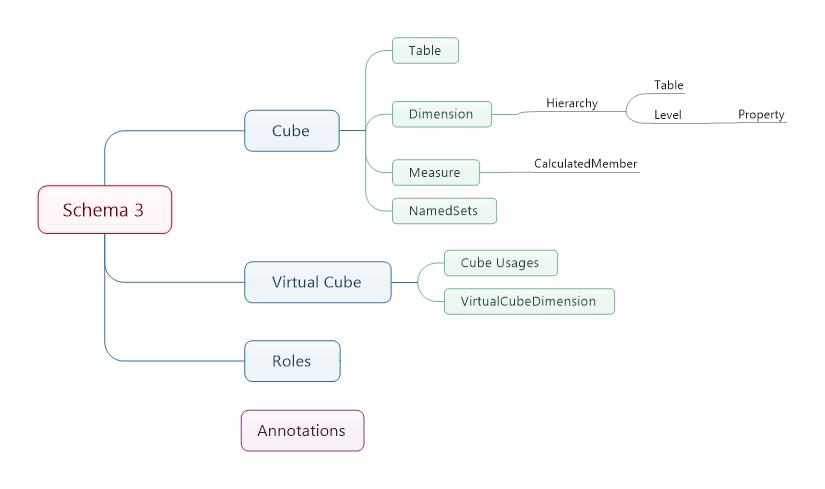
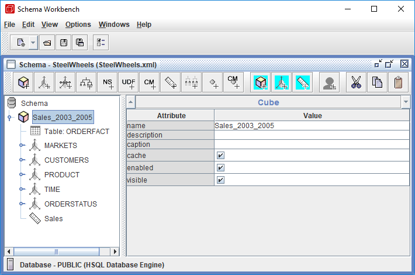
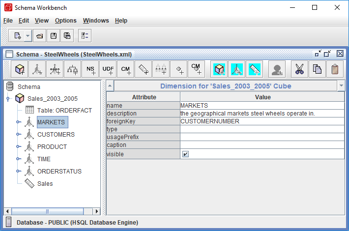
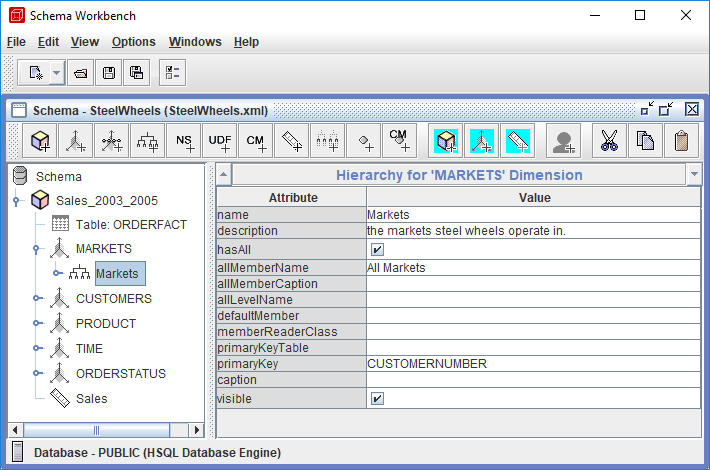
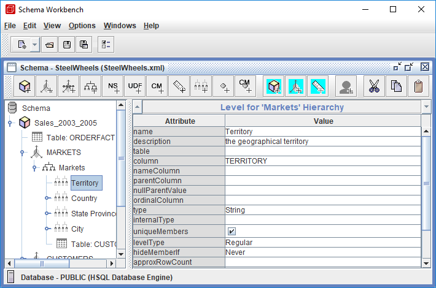
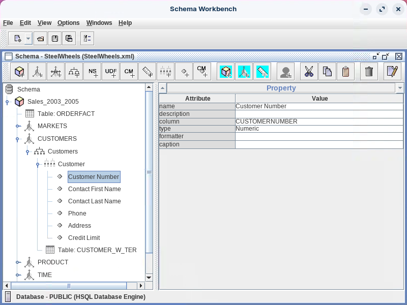
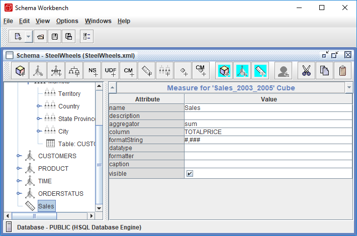
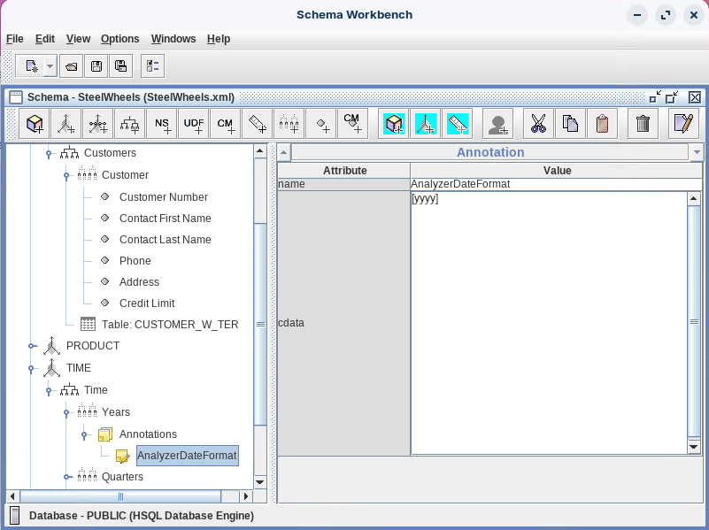

# Overview of Schemas

<div class="pcm-intro">

A schema defines a multidimensional **star / snowflake** database. It contains a **logical model** — cubes, hierarchies, and members — and a **mapping** of that model onto a **physical model** (a set of tables in a relational database). The logical model is what you write MDX against; the physical model is where the data actually lives.

</div>

> **Note:**
>
> #### Schema versions
>
> The logical model consists of the constructs used to write queries in MDX: **cubes, dimensions, hierarchies, levels, and members**. The physical model is the source of the data presented through the logical model — typically a **star schema**, a set of tables in a relational database.

<figure><figcaption><p>Mondrian 3 Schema</p></figcaption></figure>

<div class="pcm-embed-card" data-href="https://mondrian.pentaho.com/documentation/schema.php" data-title="Pentaho Mondrian Documentation"></div>
This page is your **reference** for the building blocks. The three labs that follow — **SteelWheels**, **Basic Model**, and **Standard Model** — put them to work.

## The building blocks

:::: tabs

### Schema

> **Note:**
>
> #### Schema element
>
> The `Schema` element is the **root container** of a Mondrian schema file — the outer wrapper that holds everything else. Every Mondrian schema XML file has exactly one `Schema` element.
>
> Every schema needs a `name`. It's recommended to add a `description` and to specify `metamodelVersion` to track the schema format. The Schema element contains all the building blocks — one or more `Cube` elements, optional shared `Dimension` elements, and `Role` elements for access control.

```xml
<Schema name="SteelWheels"
        caption="Steel Wheels"
        description="Optimizing the Sales process at Steel Wheels Inc"
        metamodelVersion="3.14"
        measuresCaption="Metrics"
        defaultRole="Associate"
        missingLink="warning">
```

<figure><figcaption><p>Schema Element</p></figcaption></figure>

> **Warning:** In Mondrian v3 the parser is **order-sensitive**. If child elements appear in the wrong order (for example, a cube after a role), Mondrian silently ignores them.

### Cube

> **Note:**
>
> #### Cube element
>
> A **cube** is the context for a report or interactive analysis session. It represents a collection of events describing a business process over the lifetime of the data mart. A cube is a complete set of **Dimensions, Hierarchies, Levels, and Measures** for analysing those events — collected in one place, ready for querying.

```xml
<Cube name="Sales 2003 to 2005">
  <Table name="ORDERFACT" />
  <Dimension> ... </Dimension>
  <Measure> ... </Measure>
</Cube>
```

<figure><figcaption><p>Cube Element</p></figcaption></figure>

| Attribute | Description |
| --- | --- |
| `name` | Cube name. |
| `description` | Description of the cube (localizable via `#{propertyname}`). |
| `caption` | A string displayed instead of the cube's name. |
| `cache` | Whether the fact-table data is cached by Mondrian (default: cached). |
| `enabled` | If `true`, the cube is realized; otherwise it is ignored. |
| `visible` | Whether the cube is visible in the user interface. |

### Dimension

> **Note:**
>
> #### Dimension
>
> A **Dimension** is a structural attribute of a cube — a list of related **Members** belonging to a similar category in the user's perception of the data. For example, months and quarters make up a Time dimension; cities, regions, and countries make up a Region dimension. A dimension acts as an index for identifying values in a multidimensional array, and is the business parameter you normally see in the rows and columns of a report.

<figure><figcaption><p>Dimension Element</p></figcaption></figure>

| Attribute | Description |
| --- | --- |
| `name` | Dimension name. |
| `foreignKey` | The column in the **fact** table that joins to this dimension. |
| `type` | `Standard` or `Time`. A **Time** dimension enables MDX time functions (YTD, QTD…). Default `Standard`. |
| `usagePrefix` | Prefix added to a dimension's column names in aggregate tables to avoid naming conflicts (private dimensions only). |
| `caption` / `visible` | Display name override / UI visibility (default `true`). |

### Hierarchy

> **Note:**
>
> #### Hierarchy
>
> A **hierarchy** organizes data at different levels of aggregation. Analysts use hierarchies to spot trends at one level, **drill down** to lower levels to find reasons, and **roll up** to higher levels to see broader effects. Each level must have a strict **one-to-many** relationship with the next: in `[Markets]`, each Country belongs to one Territory, each City to one State/Province.

<figure><figcaption><p>Hierarchy Element</p></figcaption></figure>

| Attribute | Description |
| --- | --- |
| `name` | Hierarchy name (defaults to the dimension name). |
| `hasAll` | Whether the hierarchy has an `(All)` member (grand total). Generally keep `true`. |
| `allMemberName` | Name of the all member (e.g. `All Markets`). |
| `defaultMember` | Default member when the hierarchy is not on an axis or slicer. |
| `primaryKey` | The column identifying members, referenced by rows in the fact table. |
| `primaryKeyTable` | The table containing `primaryKey` (required if the hierarchy joins multiple tables). |

```xml
<Hierarchy name="Yearly" hasAll="false" defaultMember="[Time].[1997].[Q1].[1]">
  ...
</Hierarchy>
```

### Level

> **Note:**
>
> #### Level
>
> A **Level** represents a column in a table — a collection of members the same distance from the root of the hierarchy.

<figure><figcaption><p>Level Element</p></figcaption></figure>

| Attribute | Description |
| --- | --- |
| `name` | Name of the level. |
| `table` | The table the column comes from (defaults to the hierarchy's table). |
| `column` | The column holding the unique identifier of this level. |
| `nameColumn` | The column holding the **display** identifier. |
| `ordinalColumn` | Column holding member ordinals for sorting. |
| `type` | Key column type: `String`, `Numeric`, `Integer`, `Boolean`, `Date`, `Time`, `Timestamp`. |
| `uniqueMembers` | Whether members are unique across all parents. The first level is always unique. |
| `levelType` | `Regular` or a time type (`TimeYears`, `TimeQuarters`, `TimeMonths`…) — affects YTD-style functions. |
| `hideMemberIf` | `Never`, `IfBlankName`, or `IfParentName` — controls ragged hierarchies. |

### Properties

> **Note:**
>
> #### Member properties
>
> Many dimensions (such as Customer) are large, so it is useful to **subset** them for viewing — by first/last name, address, income level, education, or marital status — before drilling into the data. Member **Properties** attach these extra attributes to a level without adding hierarchy levels.

<figure><figcaption><p>Properties</p></figcaption></figure>

| Attribute | Description |
| --- | --- |
| `name` | The name of the property. |
| `column` | The data column that determines the property's content. |
| `type` | `String`, `Numeric`, `Integer`, `Boolean`, `Date`, `Time`, `Timestamp`. |
| `dependsOnLevelValue` | Set `true` if the property is functionally dependent on the level value — lets Mondrian omit it from `GROUP BY` (a performance win on some databases). |

### Measures

> **Note:**
>
> #### Measures
>
> A **Measure** defines a value — almost always numeric — that appears in a cell. The `Measure` element defines a *stored* measure; Mondrian also supports *calculated* measures derived from other measures via an MDX formula. Both appear the same to a business user.

```xml
<Measure name="Unit Sales"  aggregator="sum"   column="unit_sales" />
<Measure name="Store Sales" aggregator="sum"   column="store_sales" />
<Measure name="Sales Count" aggregator="count" />
```

<figure><figcaption><p>Measures</p></figcaption></figure>

| Aggregator | Description |
| --- | --- |
| `sum` | Sums numeric values. The most common aggregator. |
| `count` | Counts non-null rows (or all rows if no column is given). |
| `distinct-count` | Counts distinct values of the column (nulls excluded). |
| `max` / `min` | Maximum / minimum value of a column. |
| `avg` | Average of a numeric column. |

### Annotations

> **Note:**
>
> #### Annotations
>
> Most element types (schema, cube, dimension, hierarchy, level, measure, calculated member) support **annotations** — user-defined properties that let tools attach metadata **without extending** the official Mondrian schema. Pentaho Analyzer uses several.

<figure><figcaption><p>Annotations</p></figcaption></figure>

```xml
<Cube name="Sales 2003 to 2005">
  <Annotations>
    <Annotation name="AnalyzerDateFormat">[yyyy]</Annotation>
  </Annotations>
</Cube>
```

| Annotation | Element | Description |
| --- | --- | --- |
| `AnalyzerBusinessGroup` | Level | Creates folders in the UI. |
| `AnalyzerBusinessGroupDescription` | Level | Description for the folders. |
| `AnalyzerDateFormat` | Level | Enables relative-date filters. |
| `AnalyzerHideInUI` | Measure, CalculatedMember | Hides the field in the UI. |
| `AnalyzerDisableDrillLinks` | Cube | Disables drill-through links on the cube. |

::::

> **Note:** A schema can also be browsed online in the [Mondrian schema documentation](https://mondrian.pentaho.com/documentation/schema.php).

Continue to **SteelWheels** to see these elements in a complete, real-world schema.
