# SteelWheels

> **Warning:**
>
> #### Workshop - Overview of SteelWheels Schema
>
> While relational databases excel at storing transactional data, analyzing that data across multiple dimensions—such as sales by product, by region, by time period—requires a different approach. OLAP (Online Analytical Processing) enables multidimensional analysis by organizing data into cubes with dimensions, hierarchies, and measures. Pentaho's Schema Workbench allows you to create Mondrian schemas that map your relational database structures into powerful OLAP cubes, transforming row-and-column data into intuitive, business-friendly analytical models.
>
> In this guided demonstration workshop, you'll explore the SteelWheels Mondrian schema—a comprehensive example built on the SampleData database that represents a typical sales analytics scenario. Using both JDBC Explorer and Schema Workbench, you'll examine how transactional sales data is transformed into a multidimensional cube with geographic hierarchies, customer dimensions, product categorizations, and time-based analysis. This hands-on exploration provides the foundation you need to understand dimensional modeling concepts before building your own schemas.
>
> **What you'll do**
>
> * Configure JDBC connections in Schema Workbench to access relational databases
> * Use JDBC Explorer to navigate physical database tables, columns, and relationships
> * Open and examine an existing Mondrian schema (SteelWheels.xml)
> * Explore the Sales_2003_2005 cube structure and its ORDERFACT fact table
> * Examine the Markets dimension with its four-level geographic hierarchy
> * Review the Customers dimension including member properties for rich attributes
> * Understand the Products and Time dimensions for product and temporal analysis
> * Identify degenerate dimensions like Order Status that exist within fact tables
> * Explore measures including Quantity and Sales with their aggregators and format strings
> * Review annotations that provide enhanced functionality and metadata
>
> **Prerequisites:** Schema Workbench installed and configured; Pentaho Server running with SampleData database accessible; Basic understanding of relational database concepts and dimensional modeling principles
>
> **Estimated time:** 45 minutes

<figure>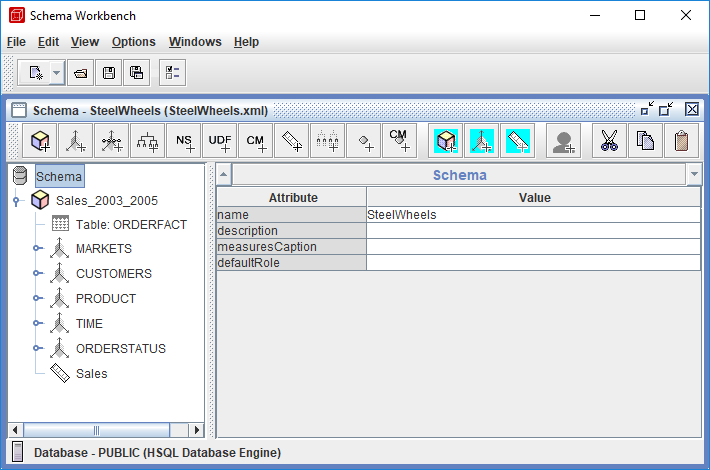<figcaption><p>SteelWheels Schema</p></figcaption></figure>

***

1. Start Schema Workbench:

> **Note:**
>
> #### Windows (PowerShell):
>
> ```powershell
> cd \
> cd Pentaho/design-tools/schema-workbench/
> ./workbench.bat
> ```

> **Note:**
>
> #### Linux:
>
> ```bash
> cd
> cd Pentaho/design-tools/schema-workbench/
> ./workbench.sh
> ```

2. Ensure Pentaho Server is running:

> **Danger:** **Ensure that the Pentaho Server is up and running (automatically started in Pentaho Lab):**
>
> ```bash
> cd
> cd /opt/pentaho/server/pentaho-server
> sudo ./start-pentaho.sh
> ```

<button data-launch="schema-workbench">Open Schema Workbench</button>

Follow the guide below to understand how a **Schema** is defined:

:::: tabs

### 1. JDBC Connection

> **Note:**
>
> #### JDBC Connection
>
> Before creating any schema components, you must configure a database connection by selecting **Options > Connection** from the menu and providing essential connection parameters including the connection name, database type (such as Hypersonic, MySQL, Oracle, or PostgreSQL), access method (Native JDBC), host name, database name, port number, and authentication credentials.
>
> Schema Workbench supports a vast range of relational databases through JDBC drivers, allowing you to connect to most common database systems.

> **Danger:** **If you're using the Pentaho Lab then the driver has already been copied to the /lib directory.**
>
> To create a JDBC connection you will need to copy the JDBC driver for your database into the PSW install directory ...\schema-workbench\lib.
>
> Restart the Pentaho Schema Workbench, to register the driver.

<div class="pcm-embed-card" data-href="https://www.loom.com/share/5d8aeb46632048b491c3a26eeaeb936f?hideEmbedTopBar=true&amp;hide_owner=true&amp;hide_share=true&amp;hide_title=true" data-title="Connecting to the Steel Wheels Sample Database in Schema Workbench" data-description="In this video, I demonstrate how to connect to the Steel Wheels sample database using Schema Workbench. I walk through the steps to set up the database connection, including specifying the connection name, type, hostname, database name, port, username, and password. I also emphasize the importance of testing the connection to ensure everything is set up correctly, which I successfully did. Now that the connection is established, I am ready to build the schema in the next demonstration. Please follow along as I create the schema in the upcoming video." data-thumb="../_assets/embeds/2631a0493553.png"></div>
1. To connect to the sampledata database, from the menu select Options > Connection.

<figure>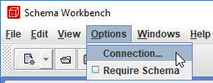<figcaption><p>JDBC Connection</p></figcaption></figure>

2. In the Database Connection dialog, type or choose the following:

| Field | Value |
| --- | --- |
| Connection name | hsqldb_sampledata (you cannot use reserved characters in the connection name) |
| Connection type | Hypersonic |
| Host Name | localhost |
| Database Name | sampledata |
| Port Number | 9001 |
| Username | pentaho_admin |
| Password | password |

3. Click Test.

<figure>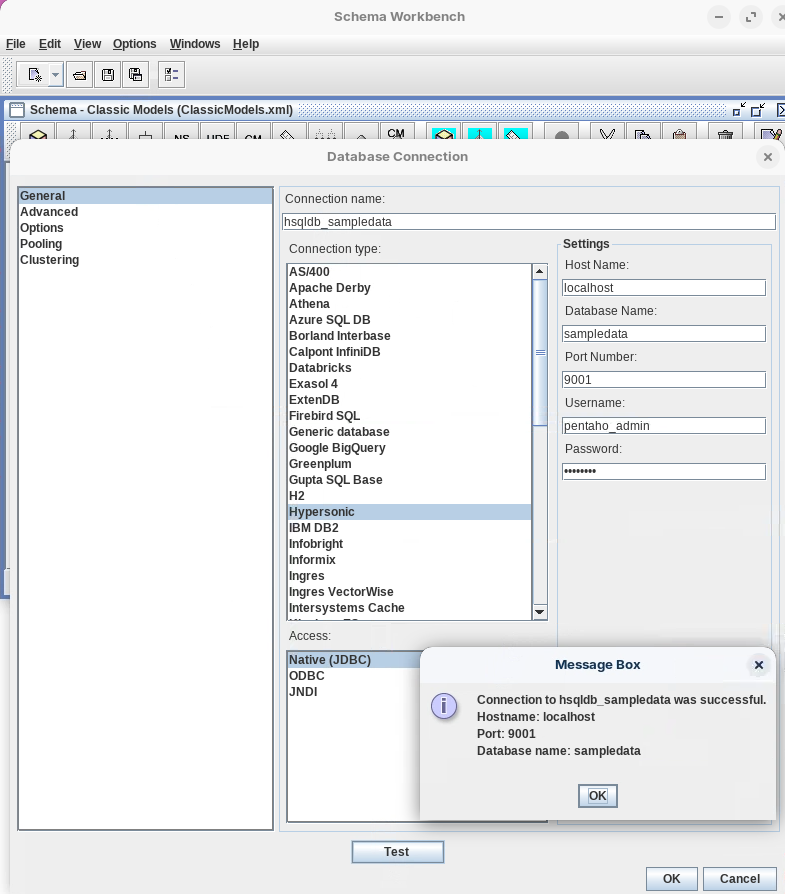<figcaption><p>JDBC Connection - hsqldb:sampledata</p></figcaption></figure>

4. Click OK to dismiss the Message Box dialog and click OK to close the Database Connection dialog.

***

> **Note:**
>
> #### JDBC Explorer

1. To view the SampleData database in JDBC Explorer, from the menu select File > New > JDBC Explorer.

<figure>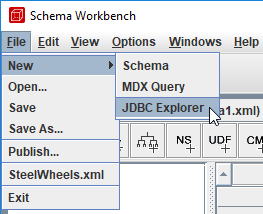<figcaption><p>JDBC Explorer</p></figcaption></figure>

2. To view the physical tables, expand PUBLIC.
3. To view the columns in the CUSTOMER_W_TER table, expand CUSTOMER_W_TER.

<figure>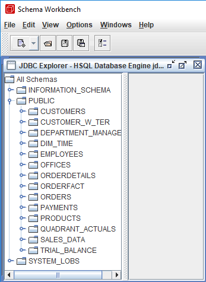<figcaption><p>JDBC Explorer - sampledata</p></figcaption></figure>

4. To close JDBC Explorer, in the top-right corner of the JDBC Explorer window, click the X icon.

### 2. SteelWheels Schema

> **Note:**
>
> #### Steel Wheels Schema
>
> The **SteelWheels** schema is a comprehensive Mondrian analysis schema built on the SampleData database that demonstrates enterprise-level dimensional modeling for sales analytics. The schema centers around the **Sales_2003_2005** cube, which uses the **ORDERFACT** fact table containing transactional sales data spanning three years.
>
> It features five well-designed dimensions:
>
> **Markets** dimension with a four-level geographic hierarchy (Territory, Country, State/Province, City) for location-based analysis;
>
> **Customers** dimension with customer-level details and six member properties providing rich customer attributes;
>
> **Products** dimension for product categorization and analysis;
>
> **Time** dimension enabling temporal analysis across years, quarters, and months;
>
> **Order Status** dimension, which serves as an example of a degenerate dimension existing within the fact table without a separate dimension table.
>
> The schema includes multiple measures such as **Quantity** and **Sales** with appropriate aggregators and format strings, making it an ideal reference model for understanding how complex business requirements are translated into functional OLAP cubes that support interactive reporting and analysis in Pentaho Analyzer.

1. From the menu, select File > Open.
2. Navigate to: Workshop--Busines-Analytics\PSW\schemas\.

<figure>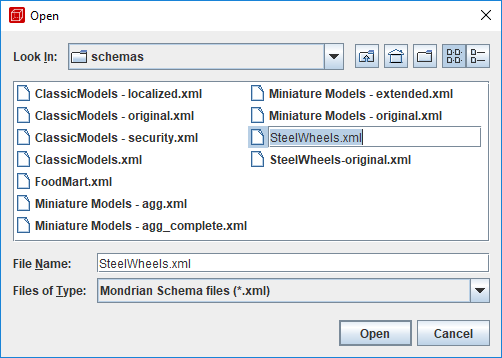<figcaption><p>Steel Wheels Schema</p></figcaption></figure>

3. Select: SteelWheels.xml.
4. Click: Open.
5. To view the schema, in the left pane, expand Sales_2003_2005.

<figure>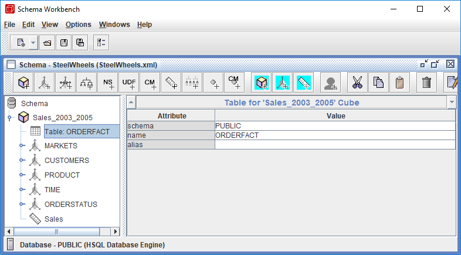<figcaption></figcaption></figure>

> **Note:** Notice the fact table, dimensions, and measures.

6. To view the fact table, in the left pane, click Table: ORDERFACT.
7. In the left pane, expand Markets.

<figure>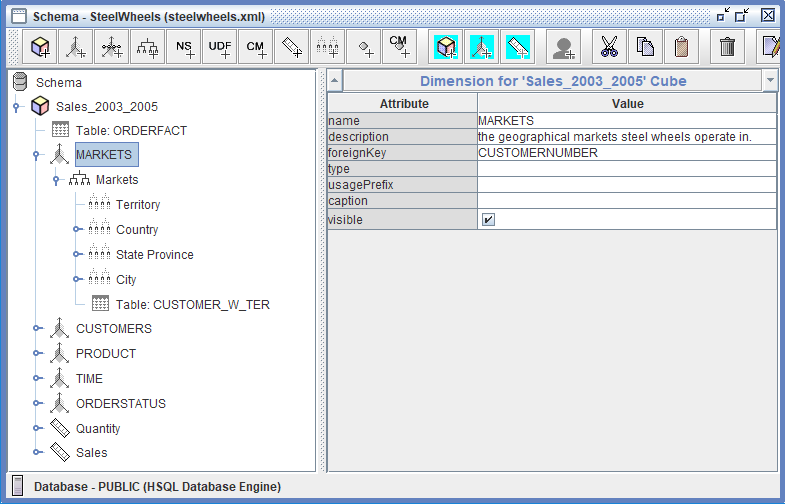<figcaption><p>Dimensions</p></figcaption></figure>

> **Note:** The Markets dimension consists of a hierarchy with four levels with the CUSTOMER_W_TER table.

8. To view the annotations for the Country level, in the left pane, expand Markets and click Data.Role.

<figure>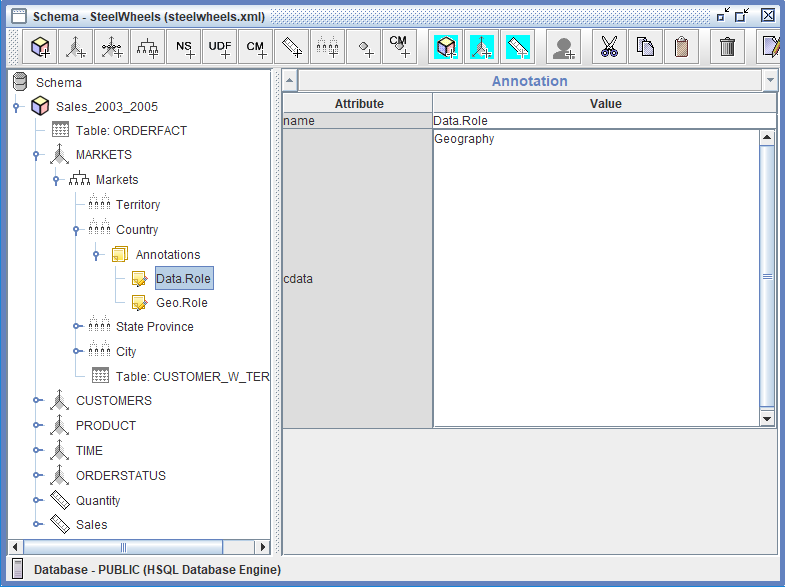<figcaption><p>Annotations</p></figcaption></figure>

9. In the left pane, expand Customers.

<figure>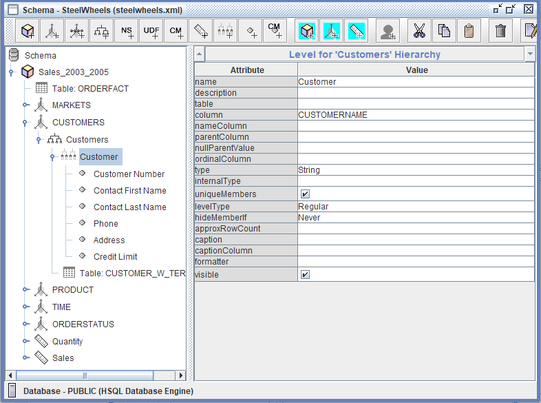<figcaption><p>Dimensions &#x26; Members</p></figcaption></figure>

> **Note:** The Customers dimension consists of a hierarchy with one level (Customer) and six member properties.

10. View the Product Dimension.
11. Expand the Time Dimension.

> **Note:** Date dimensions are among the most important dimensions of many Mondrian cubes. The usefulness of a cube often depends on the way the date dimension has been modelled. This section shows how to create a basic date dimension and how it can be augmented with properties to suit specific analysis needs.
>
> Time dimensions based on: year/quarter/month/week/day are coded differently in the schema due to MDX time-related functions.
>
> Time dimensions are identified with type=TimeDimension. The role of a level in a time dimension is indicated by the levelType attribute:
>
> * TimeYears
> * TimeQuarters
> * TimeMonths
> * TimeWeeks
> * TimeDays

<figure>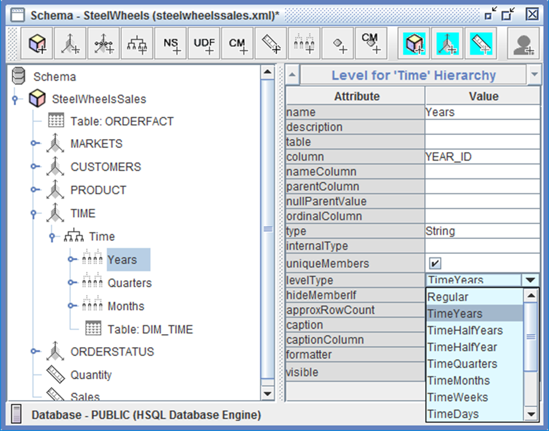<figcaption><p>TIME Dimension</p></figcaption></figure>

12. In the left pane, expand Order Status.

<figure>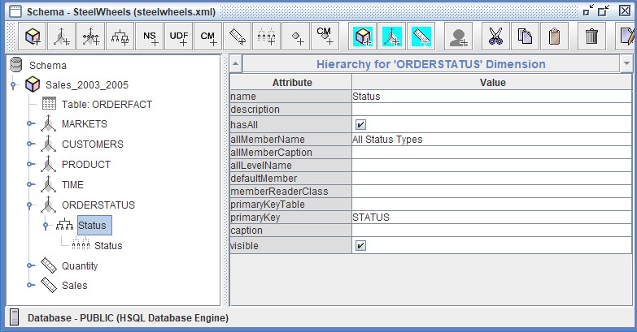<figcaption><p>Degenerate Dimensions</p></figcaption></figure>

> **Note:** Whereas a star dimension has one dimension table, and a snowflake dimension has two or more, a degenerate dimension has none. All of the columns that describe the dimension live in the fact table.
>
> For example, a degenerate dimension could be created for Order Status because there are only a few values in the Order Status column. Creating a dimension table is unnecessary because it only has a few values, adds no additional information, and incurs the cost of an additional join.

13. To view the Quantity measure, in the left pane, click Quantity.

<figure>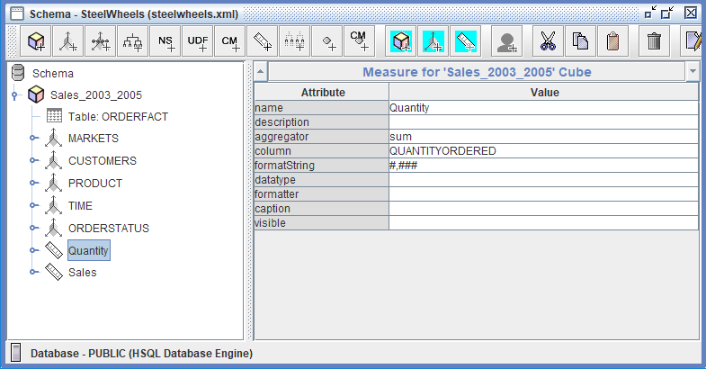<figcaption><p>Measures</p></figcaption></figure>

> **Note:** Notice the aggregator, column, and formatString.

14. (Optional) View the Sales measure.
15. To close the schema, in the top-right corner of the schema window, click the X icon.

::::

## Lab Files

Download the reference files for this lab:

* [SteelWheels Schema](../_assets/data/steelwheels.xml)
* [SteelWheels.xml](../_assets/data/steelwheels-original.xml)
