# Basic Model

> **Warning:**
>
> #### Workshop - Classic Model
> 
> Examining existing schemas teaches OLAP concepts, but real mastery comes from building Mondrian schemas yourself—connecting relational tables, defining hierarchies, configuring measures, and publishing to production.
> 
> In this workshop, you build a complete Mondrian schema called ClassicModelsOrders in Schema Workbench, then publish it to the Pentaho BA Server and test it in Analyzer.
> 
> **What you'll do**
> 
> * Create a JDBC connection in Schema Workbench and a matching connection in Pentaho Server
> * Create the Classic Models schema and add the ClassicModelsOrders cube
> * Add the ORDERFACT fact table as the source of measurable business events
> * Build the CUSTOMERS and PRODUCTS dimensions with hierarchies and levels
> * Define the Sales measure with sum aggregation and currency formatting
> * Validate the schema, review the generated XML, and publish to the BA Server
> * Test the schema by creating an Analysis Report in Pentaho Analyzer
> 
> **Prerequisites:** Schema Workbench and Pentaho Server installed and configured; access to the SampleData database; understanding of dimensional modeling concepts, fact tables, and dimension tables.
> 
> **Estimated time:** 90 minutes

***

1. Start Schema Workbench:

> **Note:**
>
> #### Windows (PowerShell)
>
> ```powershell
> cd \
> cd Pentaho/design-tools/schema-workbench/
> ./workbench.bat
> ```

> **Note:**
>
> #### Linux
>
> ```bash
> cd
> cd Pentaho/design-tools/schema-workbench/
> ./workbench.sh
> ```

2. Ensure Pentaho Server is running:

> **Danger:** Ensure that the Pentaho Server is up and running (automatically started in Pentaho Lab):
>
> ```bash
> cd
> cd /opt/pentaho/server/pentaho-server
> sudo ./start-pentaho.sh
> ```

<button data-launch="schema-workbench">Open Schema Workbench</button>

Follow the guide below to understand how the **Classic Models** schema is defined.

<figure>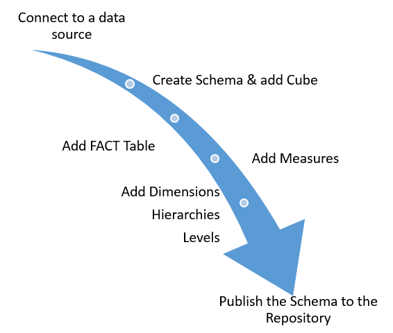<figcaption><p>Workflow to define a Schema</p></figcaption></figure>

:::: tabs

### 1. JDBC Connection

> **Note:**
>
> #### JDBC Connection
>
> A JDBC (Java Database Connectivity) connection in Schema Workbench establishes the link between the tool and your source database, enabling you to access physical tables and columns needed to build Mondrian schemas.

> **Danger:** If you're using the Pentaho Lab then the driver has already been copied to the `/lib` directory.
>
> To create a JDBC connection you will need to copy the JDBC driver for your database into the PSW install directory `...\schema-workbench\lib`.
>
> Restart Schema Workbench, and you will see your database in the Connection Type list.

<div class="pcm-embed-card" data-href="https://www.loom.com/share/5d8aeb46632048b491c3a26eeaeb936f?hideEmbedTopBar=true&amp;hide_owner=true&amp;hide_share=true&amp;hide_title=true" data-title="Connecting to the Steel Wheels Sample Database in Schema Workbench" data-description="In this video, I demonstrate how to connect to the Steel Wheels sample database using Schema Workbench. I walk through the steps to set up the database connection, including specifying the connection name, type, hostname, database name, port, username, and password. I also emphasize the importance of testing the connection to ensure everything is set up correctly, which I successfully did. Now that the connection is established, I am ready to build the schema in the next demonstration. Please follow along as I create the schema in the upcoming video." data-thumb="../_assets/embeds/6e7e98e7d845.png"></div>
***

1. To connect to the sampledata database, from the menu select **Options > Connection**.

<figure><figcaption><p>JDBC Connection</p></figcaption></figure>

2. In the **Database Connection** dialog, type or choose the following:

| Field | Value |
| --- | --- |
| Connection name | hsqldb_sampledata |
| Connection type | Hypersonic |
| Host Name | localhost |
| Database Name | sampledata |
| Port Number | 9001 |
| Username | pentaho_admin |
| Password | password |

3. Click **Test**.

<figure><figcaption><p>JDBC Connection - hsqldb_sampledata</p></figcaption></figure>

4. Click **OK** to dismiss the Message Box dialog and click **OK** to close the **Database Connection** dialog.

***

> **Note:**
>
> #### Pentaho Server JDBC
>
> The workflow above creates and defines a JDBC connection client-side, i.e. it enables Schema Workbench to connect to the Hypersonic data source. When you publish the schema to the Pentaho Repository, you need to ensure that the same connection is also defined - Manage Data Sources.

1. Log into the Pentaho Server Console (as Admin) > **Manage Data Sources**.

<figure>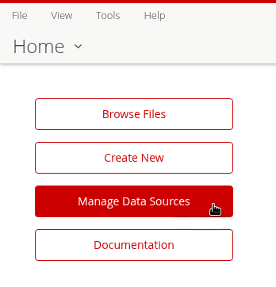<figcaption><p>Manage Data Sources</p></figcaption></figure>

2. From the drop-down cog wheel, select: **New Connection**.

<figure>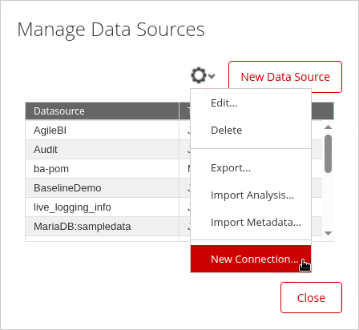<figcaption><p>New Connection</p></figcaption></figure>

3. In the **Database Connection** dialog, type or choose the following:

| Field | Value |
| --- | --- |
| Connection name | hsqldb_sampledata |
| Connection type | Hypersonic |
| Host Name | localhost |
| Database Name | sampledata |
| Port Number | 9001 |
| Username | pentaho_admin |
| Password | password |

4. Test the connection.

<figure>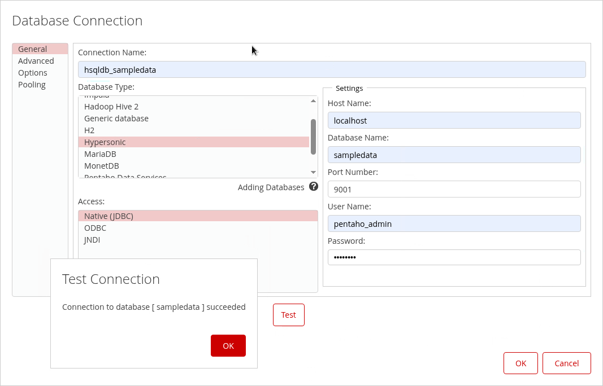<figcaption><p>Connection - hsqldb_sampledata</p></figcaption></figure>

5. Click **OK**.

> **Warning:** The connection must have the same name as the XMLA connection - Publish.

### 2. Schema / Cube

> **Note:**
>
> #### Classic Models Schema
>
> The **ClassicModelsOrders** cube is a foundational multidimensional structure built in Schema Workbench that demonstrates core OLAP design principles using sales order data from the SampleData database.
>
> At its center is the **ORDERFACT** fact table, which contains transactional sales data and serves as the source for quantitative measures such as **Sales** (aggregated as a sum of TOTALPRICE with currency formatting).
>
> The cube includes two primary dimensions: the **CUSTOMERS** dimension, which provides a hierarchical view from Territory down to individual Customer Names using the CUSTOMER_W_TER table, and the **PRODUCTS** dimension, which organizes product data from Product Line through Vendor using the PRODUCTS table.

<div class="pcm-embed-card" data-href="https://www.loom.com/share/edcdc7025caa49038a22df66e9e186e3?hideEmbedTopBar=true&amp;hide_owner=true&amp;hide_share=true&amp;hide_title=true" data-title="Creating a Schema in Schema Workbench 🛠️" data-description="In this video, I walk you through the process of creating a new schema file in Schema Workbench. I demonstrate how to name the schema &amp;#34;My Steel Wheels&amp;#34; and save it as an XML file on my file system. I also highlight the importance of using the right-click function to build your schema, cubes, measures, and dimensions effectively. As a next step, I will be adding a cube to this schema in the following demonstration. Please follow along and ensure you have your Schema Workbench ready for the next steps." data-thumb="../_assets/embeds/87739ebdeb4d.png"></div>
***

1. To create a new schema, from the menu choose **File > New > Schema**. Alternatively, from the toolbar, click the **New** button, and click **Schema**.

<figure>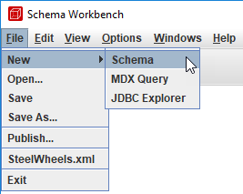<figcaption></figcaption></figure>

2. To name the schema, in the left pane, click: **Schema**.
3. In the name field, replace the existing value by typing: `Classic Models`, and then press **Enter**.

<figure>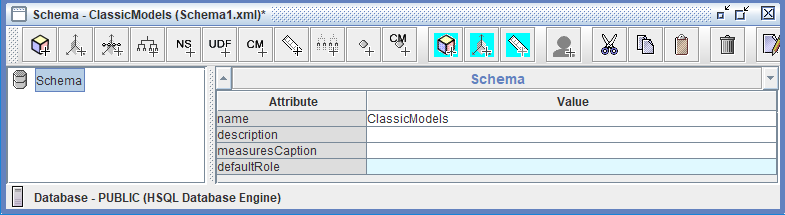<figcaption><p>Schema - ClassicModels</p></figcaption></figure>

***

> **Note:**
>
> #### Cube
>
> The **ClassicModelsOrders** cube is the primary organizational unit and multidimensional analytical space within the Classic Models schema, serving as a container that brings together all the essential components needed for business intelligence analysis.
>
> In Mondrian terminology, a cube represents a specific business process or subject area—in this case, order transactions—and acts as the central structure that connects the **ORDERFACT** fact table with its associated dimensions (CUSTOMERS and PRODUCTS) and measures (Sales). The cube defines the analytical boundaries and possibilities for users, determining which questions can be answered and which combinations of data can be explored.
>
> When published to the Pentaho BA Server, the ClassicModelsOrders cube becomes available as a data source in Analyzer, allowing business users to interactively slice, dice, drill down, and pivot the sales data across customer territories and product lines to gain insights and make data-driven decisions. Essentially, the cube transforms a flat relational database structure into a multidimensional model optimized for fast, intuitive analytical queries and exploration.

<div class="pcm-embed-card" data-href="https://www.loom.com/share/aa2efbf60ee8490fbeef871e6192370f?hideEmbedTopBar=true&amp;hide_owner=true&amp;hide_share=true&amp;hide_title=true" data-title="Adding a Cube to the Schema: Steel Wheels Sales Training" data-description="In this video, I demonstrate how to add a cube called &amp;#34;Steel Wheels Sales Training&amp;#34; to the schema I previously created. I walk through the steps of right-clicking the schema in the navigation pane, selecting &amp;#34;Add Cube,&amp;#34; and entering the cube name. It's important to note that I need to set a fact name for the cube to be valid, as indicated by the red X's and messages at the bottom of the screen. In the next demonstration, I will begin building the cube by adding the fact table. Please make sure to follow along and ensure all necessary attributes are set for a valid schema." data-thumb="../_assets/embeds/c4ac9d631c2f.png"></div>
1. To add a cube, on the toolbar, click **Add cube**.
2. In the name field, replace the existing value by typing: `ClassicModelsOrders`.

<figure>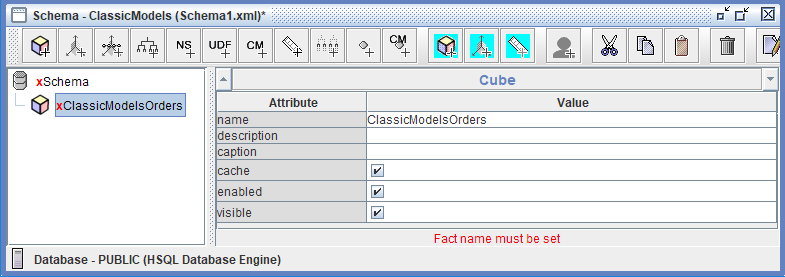<figcaption></figcaption></figure>

3. To save the schema, from the menu select **File > Save As**.

### 3. FACT

> **Note:**
>
> #### FACT Table
>
> The fact table holds the columns from which measures are calculated and contains references to the dimension tables.
>
> At its centre is the **ORDERFACT** fact table, which contains transactional sales data and serves as the source for quantitative measures such as **Sales** (aggregated as a sum of TOTALPRICE with currency formatting).
>
> The cube includes two primary dimensions: the **CUSTOMERS** dimension, which provides a hierarchical view from Territory down to individual Customer Names using the CUSTOMER_W_TER table, and the **PRODUCTS** dimension, which organizes product data from Product Line through Vendor using the PRODUCTS table.

<div class="pcm-embed-card" data-href="https://www.loom.com/share/7d8012bd48594ff9aceec25256c9ef24?hideEmbedTopBar=true&amp;hide_owner=true&amp;hide_share=true&amp;hide_title=true" data-title="Building a Cube with Order Fact Table in Steel Wheel Sales Training" data-description="In this video, I demonstrate how to build a cube using a star schema, starting with the order fact table at the center. I guide you through the process of adding the order fact table to the Steel Wheel Sales Training Cube, showing you how to navigate the interface and select the appropriate table from our sample database. Once the fact table is added, we will be ready to incorporate measures in the next demonstration. Please pay attention to the steps I outline, as they are crucial for the next phase of our project." data-thumb="../_assets/embeds/6409b6dc149b.png"></div>
***

1. To add the ORDERFACT table, in the left pane, right-click **ClassicModelsOrders**, and click **Add Table**.

<figure>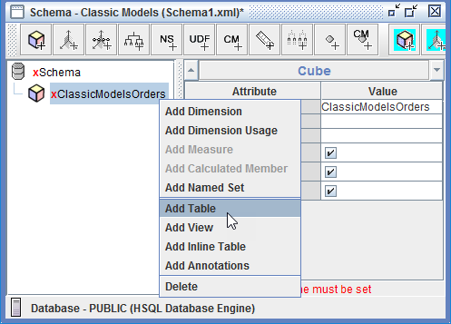<figcaption><p>Add table</p></figcaption></figure>

2. Click in the Value for name, select **PUBLIC > ORDERFACT**.

<figure>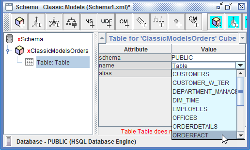<figcaption><p>Set ORDERFACT table</p></figcaption></figure>

3. Save the model.

### 4. Dimensions & Hierarchies

> **Note:**
>
> #### Dimensions & Hierarchies
>
> The **ClassicModelsOrders** cube contains two standard dimensions that enable multidimensional analysis of sales data. The **CUSTOMERS** dimension, linked to the fact table via the CUSTOMERNUMBER foreign key, provides a customer-focused analytical perspective through the "Customers" hierarchy, which includes two levels:
>
> **Territory** (the top level, representing geographic sales regions with unique members) and
>
> **Customer Name** (the detail level, displaying individual customer names).
>
> The **PRODUCTS** dimension, connected through the PRODUCTCODE foreign key, organizes product information through the "Products" hierarchy with two levels:
>
> **Product Line** (the top level, categorizing products into distinct product families with unique members such as Classic Cars, Motorcycles, and Planes) and
>
> **Vendor** (the detail level, identifying the specific manufacturer or supplier of each product). Both dimensions follow a hierarchical structure from general to specific, allowing users to drill down from high-level categories (Territory or Product Line) to granular details (Customer Name or Vendor), with each level defined by specific database columns, data types (String), and uniqueness properties that determine aggregation behavior and query performance.

<div class="pcm-embed-card" data-href="https://www.loom.com/share/3752f22898e6433e89cfc8c2872f5962?hideEmbedTopBar=true&amp;hide_owner=true&amp;hide_share=true&amp;hide_title=true" data-title="Adding Dimensions and Hierarchies in Schema Workbench" data-description="In this video, I demonstrate how to add a new dimension, specifically the Markets dimension, to our steel wheel sales training cube using Schema Workbench. I explain the process of selecting the foreign key, attaching the customer with territory table, and setting up the hierarchy within the dimension. I also highlight the importance of naming conventions and the all-member concept. As we move forward, I will be adding levels to this hierarchy in the next demonstration. Please pay attention to the steps outlined, as they are crucial for our logical star schema setup." data-thumb="../_assets/embeds/c24588870c31.png"></div>
***

1. To add a dimension, in the left pane, right-click **ClassicModelsOrders** Cube, and click **Add Dimension**.

<figure>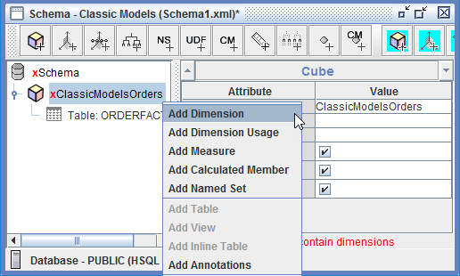<figcaption><p>Add Dimension</p></figcaption></figure>

2. To create the CUSTOMERS dimension, type or choose:

| Attribute | Value |
| --- | --- |
| name | CUSTOMERS |
| foreign key | CUSTOMERNUMBER |
| type | StandardDimension |

<figure>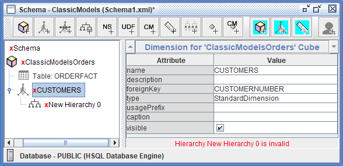<figcaption><p>CUSTOMER Dimension</p></figcaption></figure>

3. To view the Hierarchy, in the left pane, expand **CUSTOMERS**, and then click: **New Hierarchy 0**.

<figure>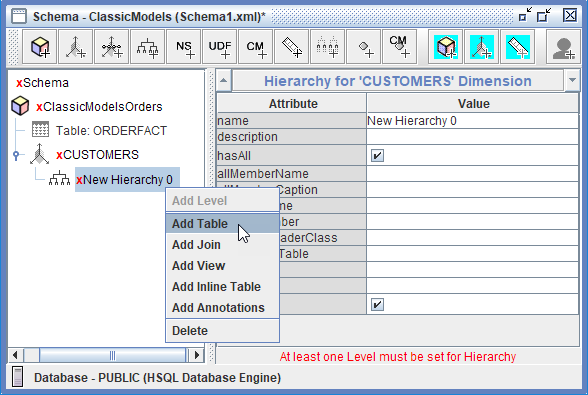<figcaption><p>Add table</p></figcaption></figure>

4. To add the CUSTOMER_W_TER table, right-click **New Hierarchy 0**, and click: **Add Table**.
5. Click in the Value for name, select **PUBLIC > CUSTOMER_W_TER**, and press **Tab**.

<figure>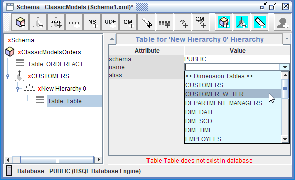<figcaption><p>Select Dimension table</p></figcaption></figure>

6. To name the hierarchy and set the primary key, click **New Hierarchy 0**.

<figure>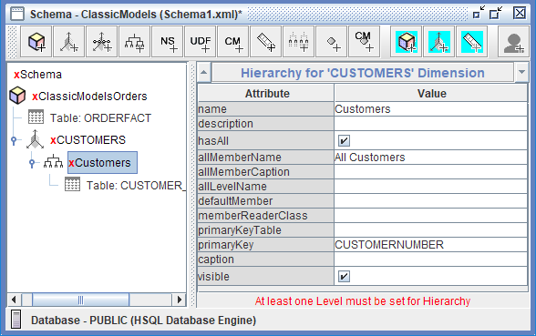<figcaption><p>CUSTOMER Hiearachy</p></figcaption></figure>

7. To create the Customer hierarchy, type or choose:

| Attribute | Value |
| --- | --- |
| name | Customers |
| hasAll | enable |
| allMemberName | All Customers |
| primaryKey | CUSTOMERNUMBER |
| visible | enable |

### 5. Levels

> **Note:**
>
> #### Levels
>
> Levels in the ClassicModelsOrders schema serve as the building blocks of hierarchical navigation, enabling users to analyze sales data at different levels of granularity and detail. They organize information from broad categories to specific details, allowing business users to start with high-level summaries (such as total sales by Territory or Product Line) and progressively drill down into finer details (individual Customer Names or specific Vendors) to investigate patterns, identify trends, and answer detailed business questions.
>
> Levels also define the aggregation behavior for measures, determining how sales figures are summarized and rolled up across the hierarchy—for instance, customer-level sales automatically aggregate to the Territory level, providing meaningful subtotals at each tier.
>
> This hierarchical structure mirrors natural business thinking, where executives might analyze performance by region while sales managers focus on individual customer performance, making OLAP cubes intuitive and aligned with real-world decision-making processes.

<div class="pcm-embed-card" data-href="https://www.loom.com/share/ce0e6919c4544c24adbb6cc2cc8f8f2e?hideEmbedTopBar=true&amp;hide_owner=true&amp;hide_share=true&amp;hide_title=true" data-title="BA3000 - M5L2S6b - Adding Levels to a Hierarchy" data-description="Use Loom to record quick videos of your screen and cam. Explain anything clearly and easily – and skip the meeting. An essential tool for hybrid workplaces." data-thumb="../_assets/embeds/395e37ee0a33.png"></div>
***

1. To add a level, in the left pane, right-click the Customer Hierarchy, and select **Add Level**.

<figure>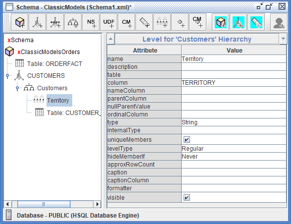<figcaption><p>Level - Territory</p></figcaption></figure>

2. To create the Territory level, type or choose:

| Attribute | Value |
| --- | --- |
| name | Territory |
| column | TERRITORY |
| type | String |
| uniqueMembers | enable |
| levelType | Regular |
| hideMemberIf | Never |

3. To add another level, in the left pane, right-click the Customer Hierarchy, and select **Add Level**.
4. To create the Customer Name level, type or choose:

| Attribute | Value |
| --- | --- |
| name | Customer Name |
| column | CUSTOMERNAME |
| type | String |
| uniqueMembers | don't enable, unless you know each Customer Name is unique. |
| levelType | Regular |
| hideMemberIf | Never |

<figure>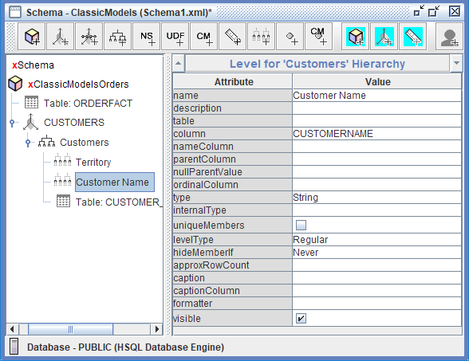<figcaption><p>Level - Customer Name</p></figcaption></figure>

5. To save the schema, on the toolbar, click **Save**.
6. To add another dimension, in the left pane, right-click **ClassicModelsOrders** Cube, and click **Add Dimension**.
7. To create the PRODUCTS dimension, type or choose:

| Attribute | Value |
| --- | --- |
| name | PRODUCTS |
| foreignKey | PRODUCTCODE |

8. To view the hierarchy, in the left pane, expand **PRODUCTS**, and then click **New Hierarchy 0**.
9. To add the PRODUCTS table, right-click **New Hierarchy 0**, and click **Add Table**.
10. Click in the Value for name, select **PUBLIC > PRODUCTS**, and press **Tab**.
11. To name the hierarchy and set the primary key, click **New Hierarchy 0**.
12. To create the Product hierarchy, type or choose:

| Attribute | Value |
| --- | --- |
| name | Products |
| allMemberName | All Products |
| primaryKey | PRODUCTCODE |

13. To add a level, in the left pane, right-click the Product Hierarchy, and select **Add Level**.

<figure>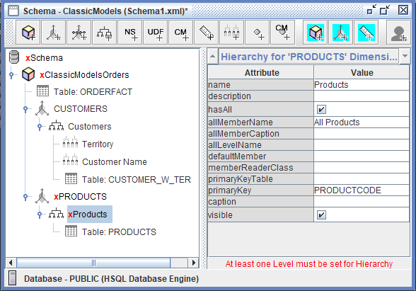<figcaption><p>Level - Products</p></figcaption></figure>

14. To create the Product Line level, type or choose:

| Attribute | Value |
| --- | --- |
| name | Product Line |
| column | PRODUCTLINE |
| type | String |
| uniqueMembers | enable |
| levelType | Regular |
| hideMemberIf | Never |

15. To add another level, in the left pane, right-click the Product Hierarchy, and select **Add Level**.

<figure>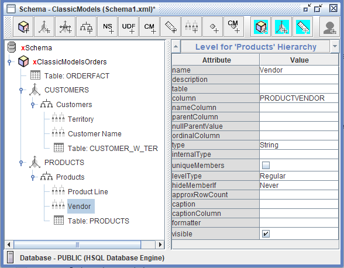<figcaption><p>Level - Vendor</p></figcaption></figure>

16. To create the Vendor level, type or choose:

| Attribute | Value |
| --- | --- |
| name | Vendor |
| column | PRODUCTVENDOR |
| type | String |
| levelType | Regular |
| hideMemberIf | Never |

17. To save the schema, on the toolbar, click **Save**.

### 6. Measures

> **Note:**
>
> #### Measures
>
> Measures in the ClassicModelsOrders cube are the quantitative, numeric facts that business users analyze and aggregate across different dimensional perspectives. The primary measure in this schema is **Sales**, which represents the total revenue from order transactions and is defined by mapping to the **TOTALPRICE** column in the ORDERFACT fact table. This measure uses the **sum** aggregator, meaning that sales values are added together when aggregated across any dimension—whether viewing total sales by Territory, Product Line, or any combination of dimensions.
>
> The measure is configured with a **formatString** of `$#,###.00`, ensuring that sales figures display as properly formatted currency with dollar signs, thousand separators, and two decimal places for cents, making reports immediately readable and professional for business users.
>
> The **Numeric** datatype ensures mathematical operations and aggregations are performed correctly. Measures are essential because they provide the "what we're measuring" in analytics—while dimensions answer "how we're grouping the data" (by customer, by product), measures answer "what values are we calculating and comparing" (sales revenue, quantities, counts), enabling users to track performance, identify trends, and make informed business decisions based on concrete numbers rather than subjective assessments.

<div class="pcm-embed-card" data-href="https://www.loom.com/share/9a3b097c1ccc4819b8474147a67d7189?hideEmbedTopBar=true&amp;hide_owner=true&amp;hide_share=true&amp;hide_title=true" data-title="Adding Measures to Your Cube in Schema Workbench 📊" data-description="In this video, I walk you through the process of adding measures to our cube, specifically focusing on the sales measure derived from the total price column in the order fact table. I demonstrate how to assign a business-friendly name, select the aggregation method as &amp;#34;sum,&amp;#34; and format the measure as US currency with two decimal places. Additionally, I emphasize the importance of specifying the data type as numeric to ensure accurate reporting. I also show how to use the JDBC Explorer to verify the data type in the database. Please make sure to follow these steps as we prepare to add dimensions in the next demonstration." data-thumb="../_assets/embeds/a04524faa102.png"></div>
***

1. To add a measure, in the left pane, right-click **ClassicModelsOrders**, and click **Add Measure**.

<figure>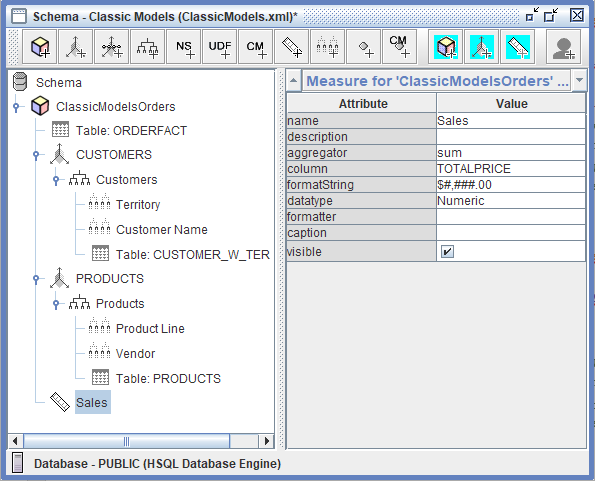<figcaption><p>Measures - Sales</p></figcaption></figure>

2. To create the Sales measure, type or choose:

| Attribute | Value |
| --- | --- |
| name | Sales |
| aggregator | sum |
| column | TOTALPRICE |
| formatString | $#,###.00 |
| dataType | Numeric |

3. To save the schema, on the toolbar, click **Save**.

> **Danger:** There should be no red crosses against any of the objects in the Schema.
>
> The minimum requirements for a schema to be published:
>
> * Cube - FACT Table
> * Dimension - Dimension Table
> * Hierarchy
> * Level
> * Measure

4. View the Schema XML.

<figure>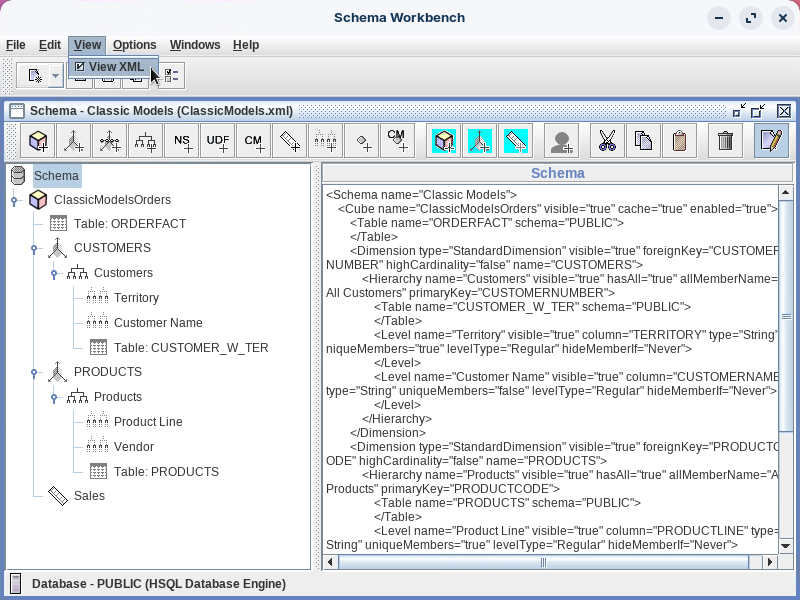<figcaption><p>View - Schema XML</p></figcaption></figure>

> **Note:** It's best practice to copy the XML - Backup / Versioning.

### 7. Publish

> **Note:**
>
> #### Publish
>
> The **Publish** workflow in the ClassicModelsOrders schema is the critical final step that deploys your completed Mondrian schema from Schema Workbench to the Pentaho BA Server, making it available as a data source for business users creating Analyzer reports and dashboards.

<div class="pcm-embed-card" data-href="https://www.loom.com/share/78f922d6f37d45dc81b56046eae090b0?hideEmbedTopBar=true&amp;hide_owner=true&amp;hide_share=true&amp;hide_title=true" data-title="Publishing a Schema to Pentaho BA Server" data-description="In this video, I walk you through the process of publishing a schema to the Pentaho server, which is essential for utilizing it as a data source in tools like Analyzer and Report Designer. I demonstrate how to access the publish feature, input the server URL, and enter your credentials—using &amp;#34;admin&amp;#34; and &amp;#34;password&amp;#34; as examples. It's important to ensure that the Pentaho data source is set to match your specific database connection, which I change to &amp;#34;sample data&amp;#34; in this instance. I also highlight the option to remember your settings for future publications. Please follow these steps to successfully publish your schema and make it available for use." data-thumb="../_assets/embeds/eb0e7dd530f4.png"></div>
***

1. To publish the schema, from the menu, select **File > Publish**.

<figure>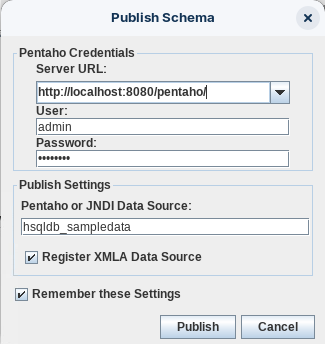<figcaption><p>Publish Schema</p></figcaption></figure>

2. To publish the schema, type or choose:

| Field | Value |
| --- | --- |
| Server URL | http://localhost:8080/pentaho/ |
| User | admin |
| Password | password |
| Pentaho or JNDI Data Source | hsqldb_sampledata |
| Register XMLA Data Source | enable |
| Remember these Settings | enable |

> **Note:** An XMLA (XML for Analysis) data source is a protocol for accessing multidimensional data, used primarily by SQL Server Analysis Services and Power BI semantic models through XMLA endpoints. This enables the use of various external tools for data modeling, management, monitoring, and reporting by treating these models as if they were on an Analysis Services instance.

3. Click: **Publish**.

***

> **Note:**
>
> #### Test Schema
>
> Finally, we will use the new schema as a data source to create a report using Analyzer.

<button data-launch="puc">Open Pentaho User Console</button>

1. Log into Pentaho User Console - Admin.
2. Refresh the Mondrian Schema Cache & Reporting Data Cache.

<figure>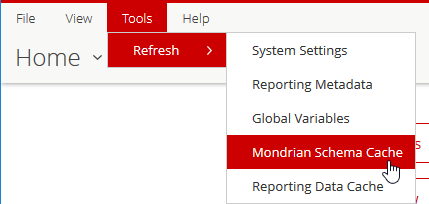<figcaption><p>Refresh the Caches</p></figcaption></figure>

3. From the User Console Home Perspective, click **Create New > Analysis Report**.
4. In the **Select Data Source** dialog, click **Classic Models: ClassicModelsOrders**.

<figure>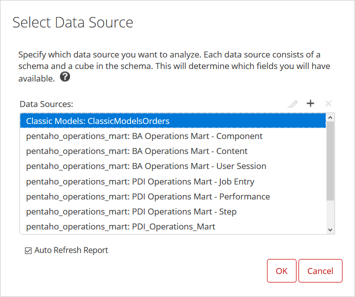<figcaption><p>Select Classic Models schema</p></figcaption></figure>

5. Drag **Sales** to the Measure drop zone.
6. Drag **Territory** and **Product Line** to the Rows drop zone.

<figure>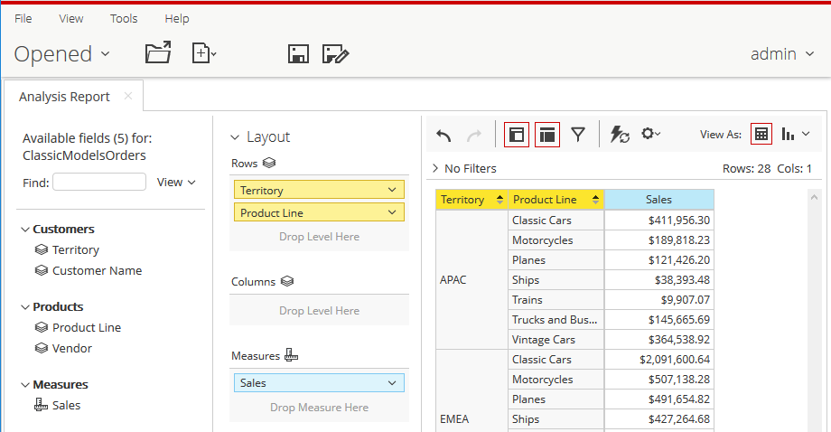<figcaption><p>Analyzer report</p></figcaption></figure>

7. Once tested, close the report.

> **Note:** From the View drop-down option select: **Schema** to display the schema as designed.

::::

## Lab Files

Download the reference files for this lab:

* [Classic Model - Workshop](../_assets/data/classicmodels-original.xml)
* [ClassicModels - original.xml](../_assets/data/classicmodels.xml)
