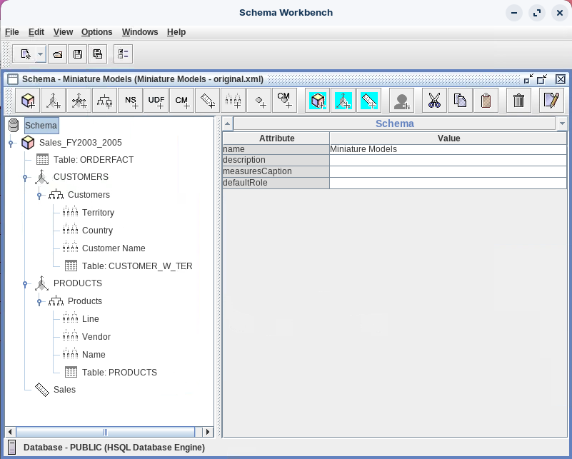
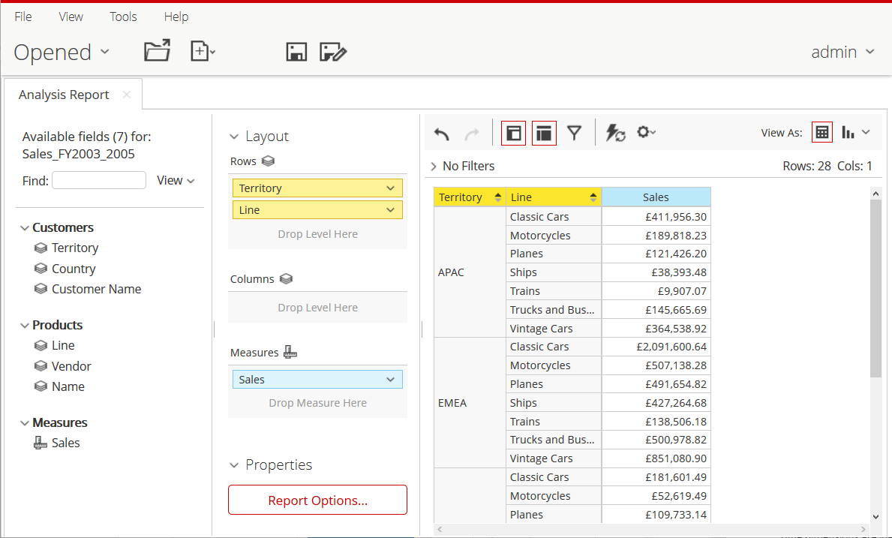

# Standard Model

> **Warning:**
>
> #### Workshop - Miniature Model
>
> Guided demonstrations provide valuable instruction, but true competency comes from independent practice where you apply learned concepts without step-by-step handholding. The transition from following instructions to creating schemas autonomously is critical for developing the confidence and problem-solving skills needed to tackle real-world dimensional modeling challenges. This workshop represents that crucial bridge—an opportunity to prove you've internalized the fundamentals while working with increased complexity.
>
> In this hands-on exercise, you'll independently build the Miniature Models schema, demonstrating your mastery of Mondrian schema development by creating a more sophisticated analytical model than the Classic Models example. Working at your own pace with structured instructions but without detailed guidance, you'll construct a Sales_FY2003_2005 cube featuring three-level hierarchies in both dimensions—adding an intermediate tier that mirrors the multi-level drill-down paths commonly found in production business intelligence environments where users navigate from continental regions through countries to specific customers, or from product categories through vendors to individual SKUs.
>
> **What you'll do**
>
> * Create the Miniature Models schema with proper naming and initial configuration
> * Build the Sales_FY2003_2005 cube targeting fiscal year 2003-2005 sales analysis
> * Configure the ORDERFACT fact table as your source of transactional measures
> * Define the Sales measure with sum aggregation and currency formatting
> * Create the Quantity Ordered measure with distinct-count aggregation
> * Build a three-level CUSTOMERS dimension hierarchy (Territory → Country → Customer Name)
> * Construct a three-level PRODUCTS dimension hierarchy (Line → Vendor → Product Name)
> * Configure foreign keys, primary keys, and all required level properties independently
> * Understand the difference between two-level and three-level dimensional navigation
> * Publish your completed schema to Pentaho BA Server
> * Validate your work by creating an Analysis Report in Pentaho Analyzer
>
> **Prerequisites:** Completion of Classic Models workshop; Schema Workbench and Pentaho Server installed and configured; Access to SampleData database; Solid understanding of cubes, dimensions, hierarchies, levels, and measures
>
> **Estimated time:** 75 minutes

<figure><figcaption><p>Schema - Miniature Models</p></figcaption></figure>

> **Note:** Start Schema Workbench.
>
> #### Windows (PowerShell)
>
> ```powershell
> cd \
> cd Pentaho/design-tools/schema-workbench/
> ./workbench.bat
> ```
>
> #### Linux
>
> ```bash
> cd
> cd Pentaho/design-tools/schema-workbench/
> ./workbench.sh
> ```

> **Danger:** Ensure that the Pentaho Server is up and running (automatically started in Pentaho Lab):
>
> ```bash
> cd
> cd /opt/pentaho/server/pentaho-server
> sudo ./start-pentaho.sh
> ```

<button data-launch="schema-workbench">Open Schema Workbench</button>

:::: tabs

### 1. JDBC Connection

> **Note:**
>
> #### Data Source (Reference)
>
> Schema Workbench reads table and column metadata directly from the database connection. Configure the `hsqldb_sampledata` connection first so the schema editor can resolve the ORDERFACT, CUSTOMER_W_TER, and PRODUCTS tables.

1. To create a new connection, from the menu select **Options** > **Connection**.
2. Enter the following details and **Test** the connection:

| Field | Value |
| ----- | ----- |
| Connection name | hsqldb_sampledata |
| Connection type | Hypersonic |
| Host Name | localhost |
| Database Name | sampledata |
| Port Number | 9001 |
| Username | pentaho_admin |
| Password | password |

### 2. Schema & Cube

> **Note:**
>
> #### Create Schema & add Cube
>
> A schema is the top-level container; the cube binds a fact table to its measures and dimensions. Press **Tab** after entering each value so Schema Workbench commits the change.

1. From the menu choose **File** > **New** > **Schema**. Alternatively, from the toolbar, click the **New** button, and click **Schema**.
2. In the name field, replace the existing value by typing: `Miniature Models`, and then press **Tab**.

> **Note:** Remember to press **Tab** after entering a new value.

3. On the schema toolbar, click **Add cube**.
4. In the name field, replace the existing value by typing: `Sales_FY2003_2005`, and then press **Tab**.
5. To save the schema, from the menu select **File** > **Save**.
6. In the Save dialog, type `MiniatureModels.xml`, and then click **Save**.

### 3. ORDERFACT

> **Note:**
>
> #### Add ORDERFACT Table
>
> The fact table holds the transactional rows the cube aggregates. ORDERFACT lives in the PUBLIC schema of the SampleData database.

1. To add the ORDERFACT table, in the left pane, right-click the **Sales_FY2003_2005** cube, and click **Add Table**.
2. Click in the **Value** for schema, select `PUBLIC`, and press **Tab**.
3. Click in the **Value** for name, select `ORDERFACT`, and press **Tab**.
4. To save the schema, on the toolbar, click **Save**.

### 4. CUSTOMERS Dimension

> **Note:**
>
> #### Customers Dimension, Hierarchy & Levels
>
> This is a three-level hierarchy: Territory → Country → Customer Name. The dimension joins ORDERFACT on `CUSTOMERNUMBER`, and the hierarchy reads from the CUSTOMER_W_TER table.

1. To add a CUSTOMERS dimension, in the left pane, right-click the **Sales_FY2003_2005** cube, and click **Add Dimension**.
2. To create the CUSTOMERS dimension, type or choose:

| Attribute | Value |
| --------- | ----- |
| name | CUSTOMERS |
| foreignKey | CUSTOMERNUMBER |

3. To add the CUSTOMER_W_TER table, right-click **New Hierarchy 0**, and click **Add Table**.
4. Click in the **Value** for schema, select `PUBLIC` and press **Tab**.
5. Click in the **Value** for name, select `CUSTOMER_W_TER`, and press **Tab**.
6. To name the hierarchy and set the primary key, click **New Hierarchy 0**.
7. To define the Customers hierarchy, type or choose:

| Attribute | Value |
| --------- | ----- |
| name | Customers |
| allMemberName | All Customers |
| primaryKey | CUSTOMERNUMBER |

8. To add a level, in the left pane, right-click the **Customers** hierarchy, and select **Add Level**.
9. To create the Territory level, type or choose:

| Attribute | Value |
| --------- | ----- |
| name | Territory |
| column | TERRITORY |
| type | String |
| uniqueMembers | Selected |
| levelType | Regular |
| hideMemberIf | Never |

10. To add another level, in the left pane, right-click the **Customers** hierarchy, and select **Add Level**.
11. To create the Country level, type or choose:

| Attribute | Value |
| --------- | ----- |
| name | Country |
| column | COUNTRY |
| type | String |
| levelType | Regular |
| hideMemberIf | Never |

12. To add another level, in the left pane, right-click the **Customers** hierarchy, and select **Add Level**.
13. To create the Customer level, type or choose:

| Attribute | Value |
| --------- | ----- |
| name | Customer Name |
| column | CUSTOMERNAME |
| type | String |
| levelType | Regular |
| hideMemberIf | Never |

14. To save the schema, on the toolbar, click **Save**.

### 5. PRODUCTS Dimension

> **Note:**
>
> #### Products Dimension, Hierarchy & Levels
>
> A second three-level hierarchy: Line → Vendor → Product Name. The dimension joins ORDERFACT on `PRODUCTCODE`, and the hierarchy reads from the PRODUCTS table.

1. To add another dimension, in the left pane, right-click the **Sales_FY2003_2005** cube, and click **Add Dimension**.
2. To create the PRODUCTS dimension, type or choose:

| Attribute | Value |
| --------- | ----- |
| name | PRODUCTS |
| foreignKey | PRODUCTCODE |

3. To view the hierarchy, in the left pane, expand **PRODUCTS**, and then click **New Hierarchy 0**.
4. To add the PRODUCTS table, right-click **New Hierarchy 0**, and click **Add Table**.
5. Click in the **Value** for schema, select `PUBLIC`, and press **Tab**.
6. Click in the **Value** for name, select `PRODUCTS`, and press **Tab**.
7. To name the hierarchy and set the primary key, click **New Hierarchy 0**.
8. To define the Product hierarchy, type or choose:

| Attribute | Value |
| --------- | ----- |
| name | Products |
| allMemberName | All Products |
| primaryKey | PRODUCTCODE |

9. To add a level, in the left pane, right-click the **Products** hierarchy, and select **Add Level**.
10. To create the Line level, type or choose:

| Attribute | Value |
| --------- | ----- |
| name | Line |
| column | PRODUCTLINE |
| type | String |
| uniqueMembers | Selected |
| levelType | Regular |
| hideMemberIf | Never |

11. To add another level, in the left pane, right-click the **Products** hierarchy, and select **Add Level**.
12. To create the Vendor level, type or choose:

| Attribute | Value |
| --------- | ----- |
| name | Vendor |
| column | PRODUCTVENDOR |
| type | String |
| levelType | Regular |
| hideMemberIf | Never |

13. To add another level, in the left pane, right-click the **Products** hierarchy, and select **Add Level**.
14. To create the Product Name level, type or choose:

| Attribute | Value |
| --------- | ----- |
| name | Product Name |
| column | PRODUCTNAME |
| type | String |
| levelType | Regular |
| hideMemberIf | Never |

15. To save the schema, on the toolbar, click **Save**.

### 6. Measures

> **Note:**
>
> #### Add Sales & Quantity Ordered Measures
>
> Measures are the aggregated numeric values the cube exposes. Sales sums `TOTALPRICE` as currency; Quantity Ordered counts distinct `QUANTITYORDERED` values.

1. To add a measure for Sales, in the left pane, right-click the **Sales_FY2003_2005** cube, and click **Add Measure**.
2. To create the Sales measure, type or choose:

| Attribute | Value |
| --------- | ----- |
| name | Sales |
| aggregator | sum |
| column | TOTALPRICE |
| formatString | $#,###.00 |
| datatype | Numeric |

3. Repeat to add the Quantity Ordered measure:

| Attribute | Value |
| --------- | ----- |
| name | Quantity Ordered |
| aggregator | distinct-count |
| column | QUANTITYORDERED |
| formatString | # |
| datatype | Integer |

4. To save the schema, on the toolbar, click **Save**.

### 7. Publish & Test

> **Note:**
>
> #### Publish the Schema
>
> Publishing pushes the schema to the Pentaho BA Server so it becomes available as an Analyzer data source.

1. To publish the schema, from the menu, select **File** > **Publish**.
2. To publish the schema, in the:
   * **User** field, type: `admin`.
   * **Password** field, type: `password`.
   * Click **Publish**.
3. To dismiss the Schema dialog, click **OK**.

> **Note:**
>
> #### Create a Report in Analyzer
>
> Validate the published schema by building a quick Analysis Report. The three-level hierarchies let you drill from Territory and Line downward.

<button data-launch="puc">Open Pentaho User Console</button>

1. Return to the User Console.
2. From the User Console Home Perspective, click **Create New** > **Analysis Report**.
3. In the Select Data Source dialog, click **Miniature Models: Sales_FY2003_2005**.
4. Drag **Sales** to the Measure drop zone.
5. Drag **Territory** and **Line** to the Rows drop zone.
6. Minimize the User Console and return to Schema Workbench.

<figure><figcaption></figcaption></figure>

> **Success:** The Miniature Models schema is published and the Sales_FY2003_2005 cube returns Sales aggregated by Territory and Line in Analyzer. You have built both three-level hierarchies independently.

::::

## Lab Files

Download the reference files for this lab:

* [MiniatureModels.xml](../_assets/data/miniaturemodels-original.xml)
