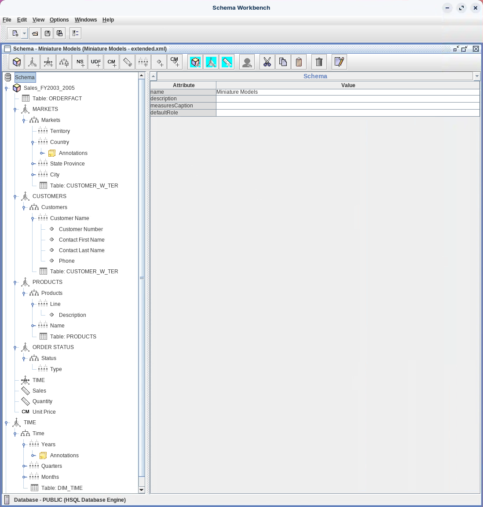
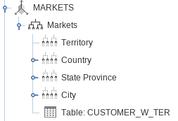
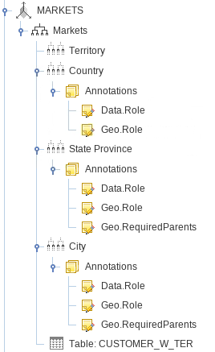
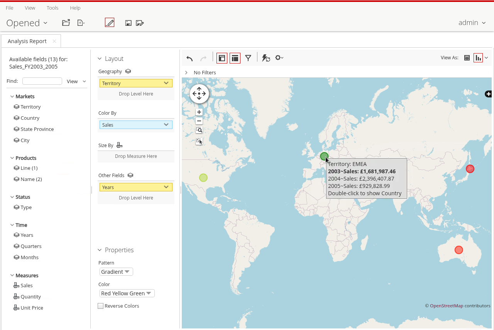
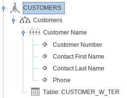
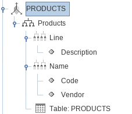
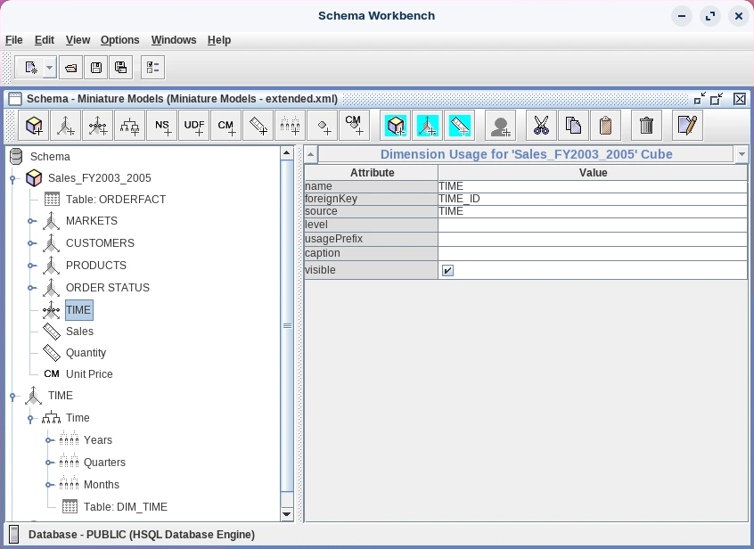
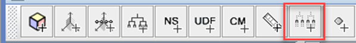
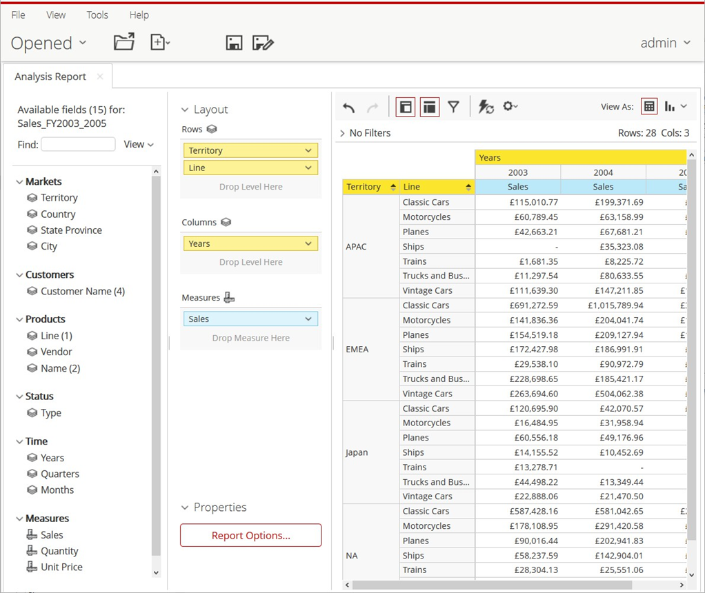
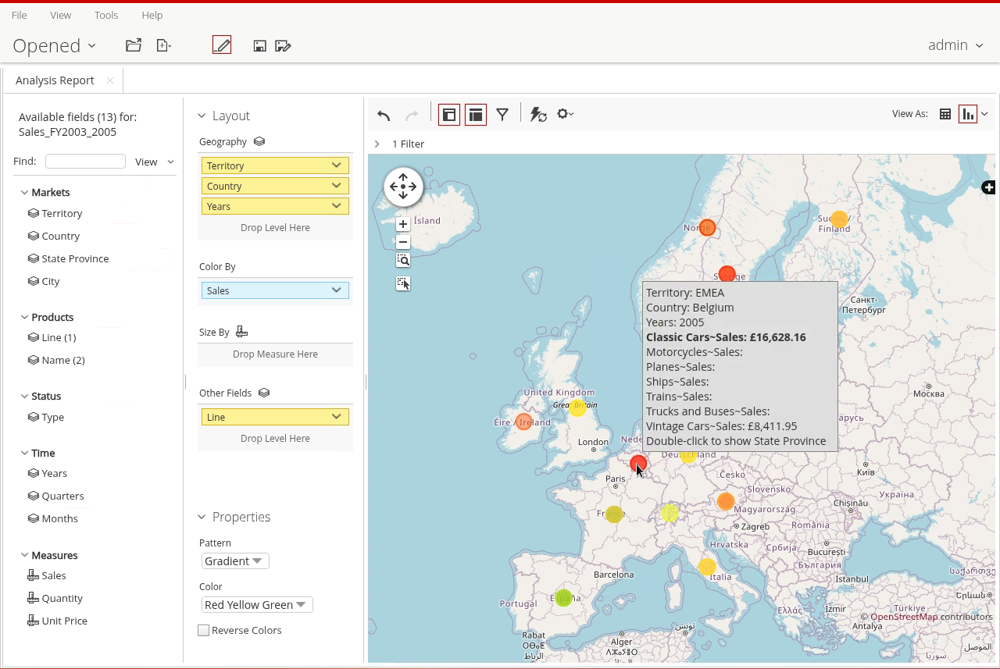

# Extended Model

> **Warning:**
>
> #### Workshop - Building a Multidimensional Data Model
>
> Creating basic cubes with simple dimensions establishes foundational skills, but production-grade OLAP schemas require advanced capabilities that transform analytical models from functional to powerful. Real-world business intelligence demands sophisticated dimensional features including shared dimensions for consistency across cubes, time intelligence for trend analysis, geographic annotations for mapping visualizations, member properties for rich context, and degenerate dimensions for transaction-level details - all working together to create analytical environments that answer complex business questions with ease and flexibility.
>
> In this hands-on workshop, you'll enhance the Miniature Models schema by adding enterprise-level dimensional capabilities that mirror professional business intelligence implementations. Building upon your foundation of cubes, dimensions, and hierarchies, you'll implement shared TIME dimensions that ensure consistent temporal analysis across multiple fact tables, add geographic annotations that enable map-based visualizations, enrich dimensions with member properties that provide business users with filtering and contextual information, and create degenerate dimensions that capture transaction identifiers without the overhead of separate dimension tables.
>
> **What you'll do**
>
> * Create a four-level MARKETS dimension with Territory, Country, State/Province, and City hierarchies
> * Add geographic annotations (Data.Role, Geo.Role, Geo.RequiredParents) for map visualization support
> * Refactor the CUSTOMERS dimension and add member properties (Number, Contact Names, Phone, Address, Credit Limit)
> * Enhance the PRODUCTS dimension with member properties (Description, Code, Vendor)
> * Build a shared TIME dimension that can be reused across multiple cubes
> * Configure time-based levels (Years, Quarters, Months) with appropriate level types
> * Add AnalyzerDateFormat annotations for intelligent time-based calculations
> * Implement DimensionUsage to reference shared dimensions from within cubes
> * Create a degenerate dimension (ORDERSTATUS) using fact table columns without a separate dimension table
> * Add a Quantity measure to enable calculated measure creation
> * Publish and validate your enhanced schema in Pentaho Analyzer
>
> By the end of this workshop, you'll understand how advanced dimensional features transform basic OLAP cubes into sophisticated analytical platforms. You'll see how shared dimensions eliminate redundancy and ensure consistency, how annotations enable smart features like geographic mapping and time intelligence, how member properties provide rich context without cluttering dimension hierarchies, and how degenerate dimensions efficiently handle low-cardinality attributes. These production-grade techniques - gained through hands-on implementation - prepare you to build enterprise-quality schemas that meet demanding business intelligence requirements including year-over-year trending, geographic drill-downs, customer segmentation, and multi-dimensional analysis across complex organizational structures.
>
> **Prerequisites:** Completion of Miniature Model workshop; Schema Workbench and Pentaho Server installed and configured; Access to SampleData database with DIM_TIME table; Strong understanding of dimensions, hierarchies, levels, and measures
>
> **Estimated time:** 90 minutes

<figure><figcaption><p>Extended Schema - Miniature Models</p></figcaption></figure>

1. Start Schema Workbench:

> **Note:**
>
> #### Windows (PowerShell)
>
> ```powershell
> cd \
> cd Pentaho/design-tools/schema-workbench/
> ./workbench.bat
> ```

> **Note:**
>
> #### Linux
>
> ```bash
> cd
> cd Pentaho/design-tools/schema-workbench/
> ./workbench.sh
> ```

<button data-launch="schema-workbench">Open Schema Workbench</button>

2. Ensure Pentaho Server is running:

> **Danger:** Ensure that the Pentaho Server is up and running (automatically started in Pentaho Lab):
>
> ```bash
> cd
> cd /opt/pentaho/server/pentaho-server
> sudo ./start-pentaho.sh
> ```

Follow the guide below to extend the Miniature Models Schema:

:::: tabs

### 1. MARKETS

> **Note:**
>
> #### Markets Dimension
>
> We're going to extend the model by adding a MARKETS dimension that will enable users to drill down into the data by geo.

1. To add a MARKETS dimension, in the left pane, right-click Sales Cube, and click Add Dimension.

<figure><figcaption><p>Add Dimension - MARKETS</p></figcaption></figure>

2. To create the MARKETS dimension, type or choose:

| Attribute  | Value          |
| ---------- | -------------- |
| name       | MARKETS        |
| ForeignKey | CUSTOMERNUMBER |

3. To view the hierarchy, in the left pane, expand MARKETS, and then click New Hierarchy 0.
4. To add the CUSTOMER_W_TER table, right-click New Hierarchy 0, and click Add Table.
5. Click in the Value for schema and select PUBLIC.
6. Click in the Value for name and select CUSTOMER_W_TER, and press Tab.
7. To name the hierarchy and set the primary key, click New Hierarchy 0.
8. To create the Markets hierarchy, type or choose:

| Attribute     | Value          |
| ------------- | -------------- |
| name          | Markets        |
| allMemberName | All Markets    |
| primaryKey    | CUSTOMERNUMBER |

9. To add a level, in the left pane, right-click the Markets (hierarchy) under MARKETS and select Add Level.
10. To define the Territory level, type or choose:

| Attribute     | Value     |
| ------------- | --------- |
| name          | Territory |
| column        | TERRITORY |
| type          | String    |
| uniqueMembers | Selected  |
| levelType     | Regular   |
| hideMemberIf  | Never     |

11. To add another level, in the left pane, right-click the Markets (hierarchy) under MARKETS and select Add Level.
12. To define the Country level, type or choose:

| Attribute    | Value   |
| ------------ | ------- |
| name         | Country |
| column       | COUNTRY |
| type         | String  |
| levelType    | Regular |
| hideMemberIf | Never   |

13. To add another level, in the left pane, right-click the Markets (hierarchy) under MARKETS and select Add Level.
14. To define the State level, type or choose:

| Attribute    | Value          |
| ------------ | -------------- |
| name         | State Province |
| column       | STATE          |
| type         | String         |
| levelType    | Regular        |
| hideMemberIf | Never          |

15. To add another level, in the left pane, right-click the Markets (hierarchy) under MARKETS and select Add Level.
16. To define the City level, type or choose:

| Attribute    | Value   |
| ------------ | ------- |
| name         | City    |
| column       | CITY    |
| type         | String  |
| levelType    | Regular |
| hideMemberIf | Never   |

### 2. Annotations

> **Note:**
>
> #### Annotations
>
> Geo annotations will overlay the results via OpenStreetMap REST API calls when displaying the data as a Geo Map.

<div class="pcm-embed-card" data-href="https://www.loom.com/share/477584be32574fae8570a1219e2b38bd?hideEmbedTopBar=true&amp;hide_owner=true&amp;hide_share=true&amp;hide_title=true" data-title="Enabling Geography Levels for GeoMap Visualization in Analyzer" data-description="In this video, I demonstrate how to add annotations to enable the city level to be displayed in an Analyzer geomap visualization. I walk through the process of specifying geography levels, including setting the data.roll annotation to indicate it's a geography level and defining the Geo.Roll as city. Additionally, I explain the importance of establishing the hierarchy with the Geo.RequiredParents annotation for country and state. This setup allows users to leverage Analyzer's geomapping capabilities effectively. Please ensure you follow these steps to enhance your data visualization." data-thumb="../_assets/embeds/de095b80c1ce.png"></div>
1. In the left pane, right-click Country, and select Add Annotations. This adds the annotation folder. You must now add the individual annotations as sub-folders.

<figure><figcaption><p>MARKETS - Annotations</p></figcaption></figure>

2. Under the Country level, right-click Annotations, and select Add Annotation.
3. To create the Data.Role & Geo.Role annotations, type:

| Attribute | Value     |
| --------- | --------- |
| name      | Data.Role |
| cdata     | Geography |
| name      | Geo.Role  |
| cdata     | Country   |

4. Under State Province level, right-click Annotations, and select Add Annotation.
5. Create the following annotations:

| Attribute | Value               |
| --------- | ------------------- |
| name      | Data.Role           |
| cdata     | Geography           |
| name      | Geo.Role            |
| cdata     | State               |
| name      | Geo.RequiredParents |
| cdata     | Country             |

6. Under City level, right-click Annotations, and select Add Annotation.
7. Create the following annotations:

| Attribute | Value               |
| --------- | ------------------- |
| name      | Data.Role           |
| cdata     | Geography           |
| name      | Geo.Role            |
| cdata     | City                |
| name      | Geo.RequiredParents |
| cdata     | Country,State       |

8. Save the Schema.

<figure><figcaption><p>Geo Map - Geo annotations</p></figcaption></figure>

### 3. CUSTOMERS

> **Note:**
>
> #### CUSTOMERS Dimension
>
> To clarify the analysis, we're going to delete the current Territory & Country Levels in the CUSTOMERS dimension and add some Properties to the Customer Name.

1. Delete the following Levels from the CUSTOMERS dimension:

* Territory
* Country

2. In the left pane, right-click the Customer Name level under Customers (Hierarchy), and select: Add Property.

<figure><figcaption><p>Properties - Customers</p></figcaption></figure>

3. To create the Customer Number property, type or choose:

| Attribute | Value          |
| --------- | -------------- |
| name      | Number         |
| column    | CUSTOMERNUMBER |
| type      | String         |

> **Note:** When adding properties, you must type the column name.

4. In the left pane, right-click the Customer level under Customers, and select Add Property.
5. To create the Contact First Name property, type or choose:

| Attribute | Value              |
| --------- | ------------------ |
| name      | Contact First Name |
| column    | CONTACTFIRSTNAME   |
| type      | String             |

6. In the left pane, right-click the Customer level under Customers, and select Add Property.
7. To create the Contact Last Name property, type or choose:

| Attribute | Value             |
| --------- | ----------------- |
| name      | Contact Last Name |
| column    | CONTACTLASTNAME   |
| type      | String            |

8. (Optional) Add additional member properties for Phone (PHONE), Address (ADDRESSLINE1), and Credit Limit (CREDITLIMIT).
9. Save the Schema.

### 4. PRODUCTS

> **Note:**
>
> #### PRODUCTS Dimension

1. Delete the following Levels from the PRODUCTS dimension:

* Vendor

2. In the left pane, right-click the (Products) Line level under Products (Hierarchy), and select Add Property.

<figure><figcaption></figcaption></figure>

3. To create the Description property, type or choose:

| Attribute | Value              |
| --------- | ------------------ |
| name      | Description        |
| column    | PRODUCTDESCRIPTION |
| type      | String             |

4. In the left pane, right-click the (Products) Name level under Products (Hierarchy), and select Add Property.
5. To create the Code property, type or choose:

| Attribute | Value       |
| --------- | ----------- |
| name      | Code        |
| column    | PRODUCTCODE |
| type      | String      |

6. To create the Vendor property, type or choose:

| Attribute | Value         |
| --------- | ------------- |
| name      | Vendor        |
| column    | PRODUCTVENDOR |
| type      | String        |

7. Save the Schema.

### 5. TIME

> **Note:**
>
> #### TIME - A Shared Dimension
>
> Some dimensions (such as Time or Date) may be used across multiple cubes. These dimensions are known as Shared Dimensions.
>
> Because Shared Dimensions don't belong to a cube, you must declare an explicit table (or other data source). When you use them in a cube, you need to specify the foreign key.
>
> This example shows the CUSTOMERS dimension being joined to the Classic Models cube using the ORDERFACT.CUSTOMERNUMBER foreign key, and to the Warehouse cube using the WAREHOUSE.WAREHOUSE_CUSTOMERNUMBER foreign key:

```xml
<Dimension name="CUSTOMERS">
<Hierarchy hasAll="true" primaryKey="CUSTOMERNUMBER">
<Table name="CUSTOMER_W_TER"/>
<Level name="TERRITORY" column="TERRITORY" uniqueMembers="true"/>
</Hierarchy>
</Dimension>

<Cube name="Classic Models">
<Table name="ORDERFACT"/>
...
<DimensionUsage name="CUSTOMERS" source="CUSTOMERS" foreignKey="CUSTOMERNUMBER"/>
</Cube>

<Cube name="Warehouse">
<Table name="WAREHOUSEFACT"/>
...
<DimensionUsage name="CUSTOMERS" source="CUSTOMERS" foreignKey="WAREHOUSE_CUSTOMERNUMBER"/>
</Cube>
```

> **Note:** When generating the SQL for a join, Mondrian needs to know which column to join to. If you are joining to a join, then you need to tell it which of the tables in the join that column belongs to (usually it will be the first table in the join).

<div class="pcm-embed-card" data-href="https://www.loom.com/share/cc5f940551384a40a326537009003dcb?hideEmbedTopBar=true&amp;hide_owner=true&amp;hide_share=true&amp;hide_title=true" data-title="Creating a Time Period Dimension in Data Cubes" data-description="In this video, I demonstrate how to create a time period dimension for our Steel Wheel Sales Training Cube. I walk through the steps of adding levels for years, quarters, and months, ensuring to set the appropriate attributes such as Time ID and level types. I emphasize the importance of using uppercase letters for dimension names and the need to specify an all-member name for the hierarchy. Additionally, I highlight the need for further annotations to enhance filtering capabilities for Analyzer. Please pay attention to these details as we move forward with our data analysis." data-thumb="../_assets/embeds/2631a0493553.png"></div>
1. In the left pane, right-click Schema, and click Add Dimension.
2. To create the TIME dimension, type or choose:

| Attribute | Value         |
| --------- | ------------- |
| name      | TIME          |
| type      | TimeDimension |

3. In the left pane, expand TIME, and then click New Hierarchy 0.
4. To add the DIM_TIME table, right-click New Hierarchy 0, and click Add Table.
5. Click in the Value for schema, select PUBLIC, and press Tab.
6. Click in the Value for name, select DIM_TIME, and press Tab.
7. To name the hierarchy and set the primary key, click New Hierarchy 0.
8. To define the Time hierarchy, type or choose:

| Attribute     | Value     |
| ------------- | --------- |
| name          | Time      |
| allMemberName | All Years |
| primaryKey    | TIME_ID   |

9. In the left pane, right-click the Time hierarchy under TIME, and select Add Level.
10. To create the Years level, type or choose:

| Attribute     | Value     |
| ------------- | --------- |
| name          | Years     |
| column        | YEAR_ID   |
| type          | String    |
| uniqueMembers | Selected  |
| levelType     | TimeYears |
| hideMemberIf  | Never     |

11. Save and Publish the Schema.

<figure><figcaption><p>TIME - Shared Dimension</p></figcaption></figure>

12. Check that you can access Schema as a Data Source.

**Time Annotations**

1. In the left pane, right-click Years, and select Add Annotations.
2. Under the Years level, right-click Annotations, and select Add Annotation.
3. To create the AnalyzerDateFormat annotation, type:

| Attribute | Value              |
| --------- | ------------------ |
| name      | AnalyzerDateFormat |
| cdata     | [yyyy]             |

4. In the left pane, right-click the Time hierarchy under TIME, and select Add Level.
5. To create the Quarters level, type or choose:

| Attribute     | Value         |
| ------------- | ------------- |
| name          | Quarters      |
| column        | QTR_NAME      |
| ordinalColumn | QTR_ID        |
| type          | String        |
| levelType     | TimeQuarters  |
| hideMemberIf  | Never         |

6. In the left pane, right-click Quarters, and select Add Annotations.
7. Under the Quarters level, right-click Annotations, and select Add Annotation.
8. To create the AnalyzerDateFormat annotation, type:

| Attribute | Value             |
| --------- | ----------------- |
| name      | AnalyzerDateFormat |
| cdata     | [yyyy].['QTR'q]   |

9. To add another level, in the left pane, right-click the Time hierarchy under TIME, and select Add Level.
10. To create the Months level, type or choose:

| Attribute     | Value       |
| ------------- | ----------- |
| name          | Months      |
| column        | MONTH_NAME  |
| ordinalColumn | MONTH_ID    |
| type          | String      |
| levelType     | TimeMonths  |
| hideMemberIf  | Never       |

11. In the left pane, right-click Months, and select Add Annotations.
12. Under the Months level, right-click Annotations, and select Add Annotation.
13. To create the AnalyzerDateFormat annotation, type:

| Attribute | Value                  |
| --------- | ---------------------- |
| name      | AnalyzerDateFormat     |
| cdata     | [yyyy].['QTR'q].[MMM]  |

14. Save the schema.

The next step is to refer to the TIME dimension from within the SALES cube.

**Dimension Usage**

1. Right mouse click on the Cube and select: Add Dimension Usage. Notice the different icon to indicate that this is a Shared Dimension.
2. To create the TIME Dimension, type or choose:

| Attribute  | Value   |
| ---------- | ------- |
| name       | TIME    |
| foreignKey | TIME_ID |
| source     | TIME    |

3. Check the Schema and view the xml.

### 6. Degenerate

> **Note:**
>
> #### Order Status Degenerate Dimension
>
> Whereas a star dimension has one-dimension table, and a snowflake dimension has two or more, a degenerate dimension has none. All of the columns that describe the dimension live in the fact table.
>
> For example, a degenerate dimension could be created for Order Status because there are only a few values in the Order Status column. Creating a dimension table is unnecessary because it only has a few values, adds no additional information, and incurs the cost of an additional join.

<div class="pcm-embed-card" data-href="https://www.loom.com/share/f93673283a184b31ae57261b9086cd84?hideEmbedTopBar=true&amp;hide_owner=true&amp;hide_share=true&amp;hide_title=true" data-title="Adding a Degenerate Dimension to the Steel Wheel Sales Training Cube" data-description="In this video, I demonstrate how to add a degenerate dimension, specifically the order status dimension, to the Steel Wheel Sales Training Cube. I explain that degenerate dimensions do not have their own tables, which can impact performance, so it's essential to discuss this with the data warehouse team before implementation. I walk through the steps of creating the dimension, naming it in uppercase, and adding a hierarchy and level without needing a foreign key. I also highlight the importance of careful navigation when using the toolbar to add levels. Please ensure to follow these steps accurately as we move forward with our cube development." data-thumb="../_assets/embeds/d0fbc7f99d83.png"></div>
1. In the left pane, right-click Sales_FY2003_2005 cube and click Add Dimension.
2. To create the ORDERSTATUS dimension, type or choose:

| Attribute  | Value       |
| ---------- | ----------- |
| name       | ORDERSTATUS |
| foreignKey | STATUS      |

3. In the left pane, expand Order Status, and then click New Hierarchy 0.
4. To name the hierarchy and set the primary key, click New Hierarchy 0.
5. To define the Order Status hierarchy, type or choose:

| Attribute     | Value            |
| ------------- | ---------------- |
| name          | Status           |
| allMemberName | All Status Types |
| primaryKey    | STATUS           |

> **Note:** When there is no hierarchy name, Mondrian uses the dimension name as the hierarchy name.

6. In the left pane, right-click the default hierarchy under Order Status, then on the toolbar click Add Level.

<figure><figcaption><p>Order Status - Degenerate Dimension</p></figcaption></figure>

7. To create the Type level, type or choose:

| Attribute     | Value    |
| ------------- | -------- |
| name          | Type     |
| column        | STATUS   |
| type          | String   |
| uniqueMembers | Selected |
| levelType     | Regular  |
| hideMemberIf  | Never    |

8. Save the Schema.

### 7. Measures

> **Note:**
>
> #### Add Quantity Measure
>
> Adding a Quantity extends the model as the measure can be used in Calculated Measures.

1. To add a measure for Quantity, in the left pane, right-click Sales Cube, and click Add Measure.
2. To create the Quantity measure, type or choose:

| Attribute    | Value           |
| ------------ | --------------- |
| name         | Quantity        |
| aggregator   | sum             |
| column       | QUANTITYORDERED |
| formatString | #,###           |
| datatype     | Numeric         |

### 8. Publish

> **Note:**
>
> #### Publish the Schema
>
> Before you make changes to your model .. Save .. this will help with Model lifecycle management and troubleshooting any issues.

1. To publish the schema, from the menu, select File > Publish.
2. To publish the schema:

* In the User field, type admin.
* In the Password field, type password.
* Click Publish.
* To dismiss the Schema Publish dialog, click OK.

<button data-launch="puc">Open Pentaho User Console</button>

**Create an Analyzer Report**

1. From the User Console Home Perspective, click Create New > Analysis Report.
2. In the Select Data Source dialog, click Miniature Models: Sales.
3. Drag Sales to the Measure drop zone.
4. Drag Territory and Line to the Rows drop zone.
5. Drag Years to the Columns drop zone.
6. Close the Star Schema Training Exercise report.

<figure><figcaption><p>Analyzer Report</p></figcaption></figure>

> **Note:** If you're connected to the internet .. try creating a Geo Map report.

<figure><figcaption><p>Geo map</p></figcaption></figure>

> **Success:** Your enhanced schema is published and validated. The MARKETS, CUSTOMERS, PRODUCTS, shared TIME, and degenerate ORDERSTATUS dimensions—along with the new Quantity measure—are now available for multidimensional analysis in Pentaho Analyzer.

::::

## Lab Files

Download the reference files for this lab:

* [Extended Schema XML](../_assets/data/miniaturemodels-extended.xml)
