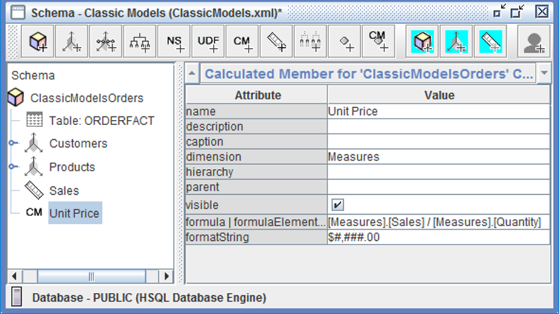

# Calculations

> **Warning:**
>
> #### Workshop - Calculations
>
> While base measures like Sales and Quantity provide essential metrics, business users often need derived calculations that combine, transform, or aggregate these measures in specific ways. Calculated members in Mondrian schemas enable you to define these business-critical metrics once in the semantic layer - such as average unit prices, profit margins, year-over-year growth rates, or top-performing customer segments - ensuring consistent calculations across all reports and analyses rather than requiring each report developer to recreate the same logic repeatedly with potential for errors and inconsistencies.
>
> In this workshop, you'll enhance both the Classic Models and Miniature Models schemas by adding calculated members that demonstrate two fundamental calculation patterns. First, you'll create a simple derived measure (UnitPrice) that divides Sales by Quantity to calculate average selling price - a straightforward mathematical operation between two base measures. Then you'll build a more sophisticated calculation (Top 10 Customers) that uses MDX functions to identify and aggregate the highest-performing customers - demonstrating how calculated members can incorporate filtering, ranking, and aggregation logic that would be complex or impossible to achieve with simple SQL queries.
>
> **What you'll do**
>
> * Add a UnitPrice calculated member to the Classic Models schema using division operators
> * Configure calculated member properties including dimension assignment, visibility, and format strings
> * Understand the formula/formulaElement syntax for defining MDX expressions
> * Create an Analyzer report that validates your calculated member displays correctly
> * Build a Top 10 Customers calculated member using advanced MDX functions (Aggregate, TopCount)
> * Apply set-based operations to filter and rank dimensional members
> * Publish enhanced schemas and test calculated members in production reports
> * Understand when to use calculated members versus calculated measures created in reporting tools
>
> **Prerequisites:** Completion of Classic Models and Miniature Models workshops; Schema Workbench and Pentaho Server installed and configured; understanding of base measures and MDX expression concepts; familiarity with Pentaho Analyzer
>
> **Estimated time:** 30 minutes

1. Start Schema Workbench:

> **Note:**
>
> #### Windows (PowerShell):
>
> ```powershell
> cd \
> cd Pentaho/design-tools/schema-workbench/
> ./workbench.bat
> ```

> **Note:**
>
> #### Linux:
>
> ```bash
> cd
> cd Pentaho/design-tools/schema-workbench/
> ./workbench.sh
> ```

<button data-launch="schema-workbench">Open Schema Workbench</button>

2. Ensure Pentaho Server is running:

> **Danger:** Ensure that the Pentaho Server is up and running (automatically started in Pentaho Lab):
>
> ```bash
> cd
> cd /opt/pentaho/server/pentaho-server
> sudo ./start-pentaho.sh
> ```

<div class="pcm-embed-card" data-href="https://www.loom.com/share/f90a125e5154469f86032d6515d4e99a?hideEmbedTopBar=true&amp;hide_owner=true&amp;hide_share=true&amp;hide_title=true" data-title="Adding Calculated Measures to the SteelWheels Sales Training Cube" data-description="In this video, I demonstrate how to add calculated measures to the SteelWheels Sales Training Cube using MDX formulas. I create two calculated measures: one for unit price, which divides sales by quantity, and another for year-to-date sales using the aggregate function with the sales measure. Both measures are formatted as U.S. currency with two decimal places. I encourage you to follow along and implement these calculations in your own cubes. Finally, I'll be testing the cube using MDX query mode in the next demonstration." data-thumb="../_assets/embeds/fa26dc70dacc.png"></div>

:::: tabs

### 1. Calculated Member — Unit Price

> **Note:**
>
> #### Calculated Member - Unit Price
>
> Calculated measures are derived metrics defined within the OLAP semantic layer that combine, transform, or aggregate base measures to create business-critical analytics. Unlike base measures that directly represent data stored in source tables, calculated measures use MDX (Multidimensional Expressions) formulas to perform operations ranging from simple arithmetic - such as dividing Sales by Quantity to determine average unit price - to sophisticated analytical functions like identifying top-performing customer segments through ranking and aggregation.
>
> By defining these calculations once within the Mondrian schema rather than recreating them in individual reports, organizations ensure consistent metric definitions across all analyses, eliminate calculation errors from redundant implementations, and embed business logic directly into the data model where it can be centrally maintained and automatically available to all report developers and end users.

<figure><figcaption><p>Calculated Member</p></figcaption></figure>

1. In the left pane, right-click **ClassicModelsOrders** Cube, and click **Add Calculated Member**.
2. To create the calculated member, type or choose:

| Attribute | Value |
| --- | --- |
| name | UnitPrice |
| dimension | Measures |
| visible | selected |
| formula \| formulaElement | _see formula below_ |
| formatString | `$#,###.00` |

```mdx
[Measures].[Sales] / [Measures].[Quantity]
```

3. **Save** and **Publish** the Schema.

***

**Analyzer Report**

1. From the User Console Home Perspective, click **Create New** > **Analysis Report**.
2. In the **Select Data Source** dialog, click **Classic Models: ClassicModelsOrders**.
3. Drag **Sales** to the **Measure** drop zone.
4. Drag **Quantity** to the **Measure** drop zone below Sales.
5. Drag **Customer** to the **Rows** drop zone.
6. Save the report in the **Training** folder as **Calculated Member report**.
7. Close the **Calculated Member report**.

<button data-launch="puc">Open Pentaho User Console</button>

### 2. Calculated Member — Top 10 Customers

> **Note:**
>
> #### Calculated Member - Top 10 Customers

1. In the left pane, right-click **Miniature Models: Sales** Cube, and click **Add Calculated Member**.
2. To create the calculated member, type or choose:

| Attribute | Value |
| --- | --- |
| name | Top 10 Customers |
| dimension | Measures |
| visible | selected |
| formula \| formulaElement | _see formula below_ |
| formatString | `$#,###.00` |

```mdx
Aggregate(
  TopCount([Customers].[Customer_Name].Members, 10, [Measures].Sales)
)
```

3. **Save** and **Publish** the Schema.

> **Success:** Both calculated members are now defined in the semantic layer. UnitPrice and Top 10 Customers are available to every report built on these schemas.

::::
