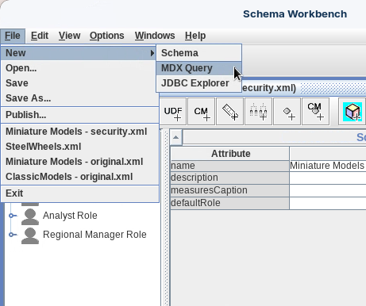
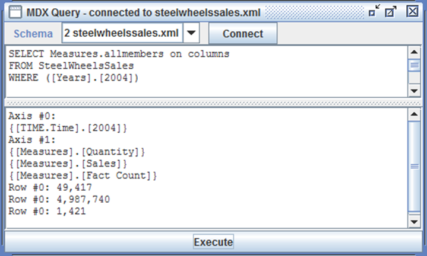
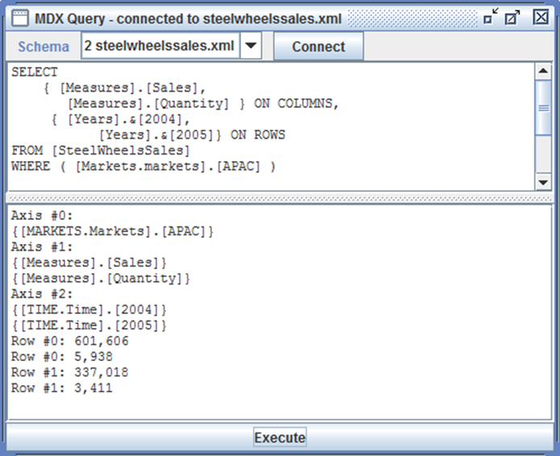

# MDX Query

> **Warning:**
>
> #### Workshop - MDX Query
>
> While Pentaho Analyzer provides an intuitive drag-and-drop interface for business users to explore OLAP cubes, schema developers and power users often need to query cubes directly using MDX (Multidimensional Expressions) — the SQL-equivalent language for OLAP databases. Understanding MDX enables you to test your schema designs, validate calculated members, troubleshoot query performance, and create sophisticated analytical queries that go beyond the capabilities of standard reporting interfaces. Schema Workbench's built-in MDX Query tool provides a direct testing environment for executing and debugging MDX statements against your published schemas.
>
> In this workshop, you'll use Schema Workbench's MDX Query mode to write and execute multidimensional queries against the SteelWheelsSales cube. You'll start with simple queries that retrieve all measures for a specific year, then progress to more complex cross-tabular queries that display multiple measures across different time periods filtered by geographic regions. This practical experience with MDX syntax — including SELECT, FROM, WHERE clauses, axis specifications, and member references — provides essential skills for schema validation, query optimization, and advanced analytical development.
>
> **What you'll do**
>
> * Launch MDX Query mode in Schema Workbench and connect to existing Mondrian schemas
> * Write basic MDX queries using SELECT, FROM, and WHERE clause syntax
> * Use the AllMembers function to retrieve all members from a dimension
> * Execute queries and interpret multidimensional result sets
> * Construct cross-tabular queries with measures on columns and time periods on rows
> * Apply WHERE clause filters to restrict analysis to specific dimensional contexts (territories/markets)
> * Reference dimension members using bracket notation and ampersand key syntax
> * Understand the difference between axes (COLUMNS, ROWS) and slicer dimensions (WHERE)
> * Test calculated members and validate schema behavior through direct MDX queries
>
> **Prerequisites:** Completion of SteelWheels or similar schema workshops; Schema Workbench and Pentaho Server installed and configured with published schemas; basic understanding of SQL syntax and multidimensional concepts
>
> **Estimated time:** 25 minutes

<div class="pcm-embed-card" data-href="https://www.loom.com/share/6404e8e60d424783933e7e48a6b443ad?hideEmbedTopBar=true&amp;hide_owner=true&amp;hide_share=true&amp;hide_title=true" data-title="Testing MDX Queries for the Steel Wheel Sales Training Cube 🛠️" data-description="In this video, I demonstrate how to test the Steel Wheel Sales Training Cube using MDX query mode. I write two MDX queries: the first displays all measures for the year 2004, confirming that both sales and quantity measures, along with calculated measures, are functioning correctly. I then modify the query to show only sales and quantity measures for 2005, illustrating how to select specific members from the year's level. I encourage you to explore variations of these queries to further test the schema. Finally, I will be publishing the schema to the repository in the next demonstration." data-thumb="../_assets/embeds/2631a0493553.png"></div>

> **Note:** **Start Schema Workbench**
>
> ```powershell
> cd \
> cd Pentaho/design-tools/schema-workbench/
> ./workbench.bat
> ```
>
> On Linux:
>
> ```bash
> cd
> cd Pentaho/design-tools/schema-workbench/
> ./workbench.sh
> ```

> **Danger:** Ensure that the Pentaho Server is up and running (it is started automatically in the Pentaho Lab):
>
> ```bash
> cd
> cd /opt/pentaho/server/pentaho-server
> sudo ./start-pentaho.sh
> ```

<button data-launch="schema-workbench">Open Schema Workbench</button>

:::: tabs

### 1. Launch MDX Query mode

> **Note:**
>
> #### Launch MDX Query mode
>
> Open MDX Query mode and connect it to a published schema so you can run multidimensional queries against the cube.

1. To access MDX Query mode, from the menu select **File** > **New** > **MDX Query**.

<figure><figcaption><p>MDX Query</p></figcaption></figure>

2. Connect to the `steelwheelssales.xml` schema.
3. To dismiss the **Mondrian connection successful** dialog, click **OK**.

### 2. A basic query

> **Note:**
>
> #### A basic query
>
> Write a simple query that returns all measures for a single year using `Measures.allmembers` on columns and a `WHERE` slicer.

1. Enter the following query into the top pane:

```mdx
SELECT Measures.allmembers on columns 
FROM SteelWheelsSales
WHERE ([Years].[2004])
```

<figure><figcaption><p>MDX Query - Quantity, Sales, Count for FY2004</p></figcaption></figure>

2. Execute the query.

> **Note:** Result: Quantity, Sales, and Count for FY2004.

### 3. A cross-tab query

> **Note:**
>
> #### A cross-tab query
>
> Build a cross-tab with measures on columns and years on rows, filtered to the APAC market using bracket and ampersand key references.

Here's another query — this time a cross-tab with measures on columns and years on rows, filtered to the APAC market.

```mdx
SELECT
{ [Measures].[Sales], [Measures].[Quantity] } ON COLUMNS,
{ [Years].&[2004],
[Years].&[2005]} ON ROWS
FROM [SteelWheelsSales]
WHERE ( [Markets.markets].[APAC] )
```

<figure><figcaption><p>MDX Query - Sales, Quantity for FY2004 &#x26; 2005 APAC Markets</p></figcaption></figure>

> **Success:** Result: Sales and Quantity for FY2004 & 2005 in the APAC markets.

::::
