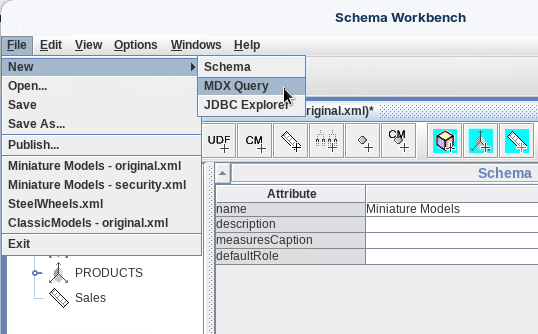
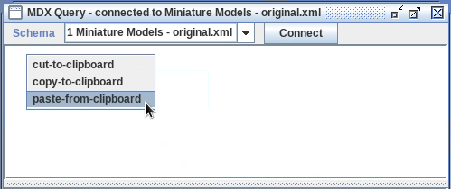
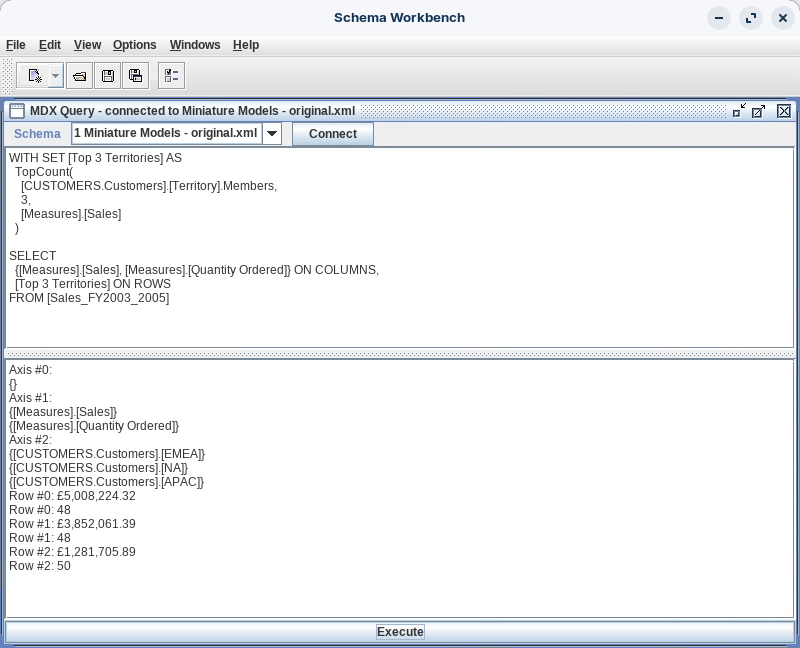
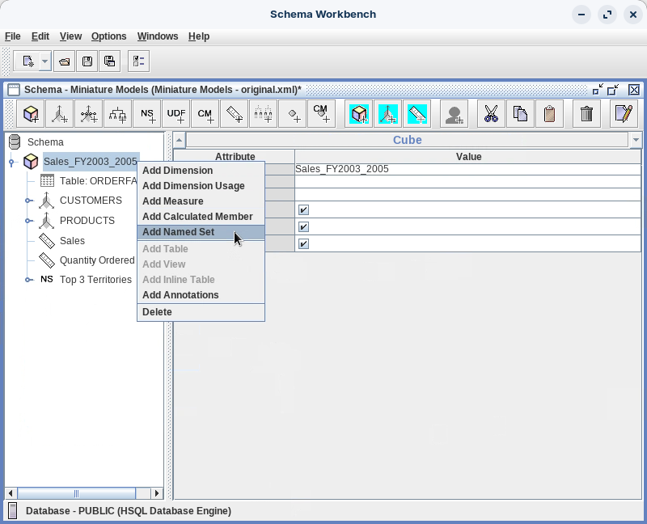
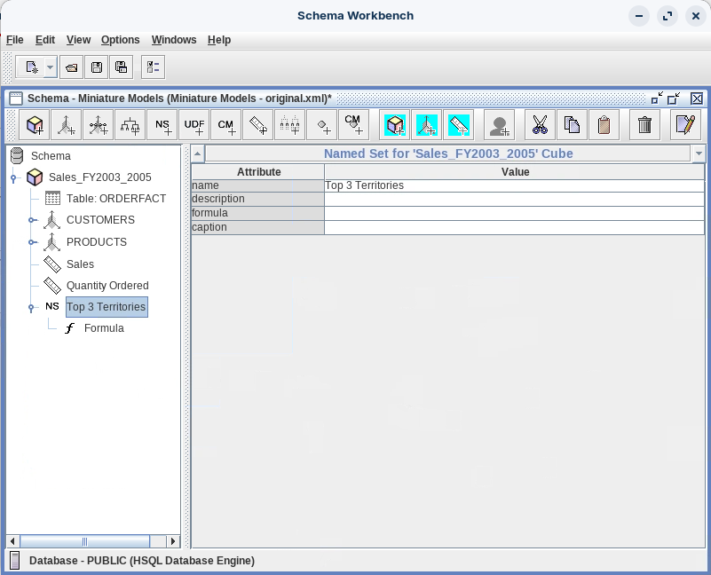
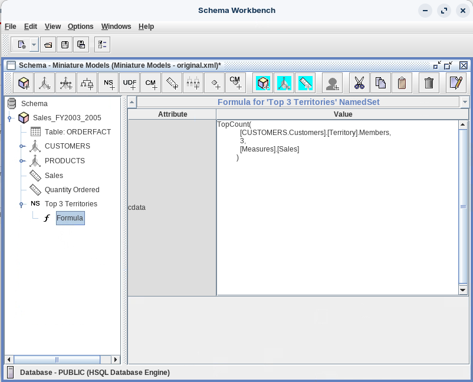

# Named Sets

> **Warning:**
>
> #### Workshop - Named Sets
>
> While calculated members enable you to define new metrics by combining or transforming measures, business users often need to work with specific, reusable collections of dimensional members - such as top-performing territories, strategic customer segments, or key product categories. Creating these groupings ad-hoc in individual reports is inefficient and inconsistent. Named Sets in Mondrian schemas solve this problem by defining reusable collections of dimension members using MDX expressions, creating dynamic "bookmarks" that automatically update based on current data and remain consistently available across all reports and analyses.
>
> In this workshop, you'll create and deploy Named Sets that identify and group important subsets of your dimensional data. You'll start by testing Named Set logic using the WITH SET clause in MDX queries, validating that your TopCount formula correctly identifies the three highest-performing territories by sales. Then you'll permanently embed this Named Set into your Miniature Models schema, making it available as a reusable filter that report builders can leverage without understanding the underlying MDX complexity or needing to recreate the ranking logic.
>
> **What you'll do**
>
> * Understand the difference between Named Sets (collections of members) and Calculated Members (single values)
> * Use MDX Query mode to test Named Set formulas before embedding them in schemas
> * Write WITH SET clauses to create temporary named sets for query testing
> * Apply the TopCount function to rank and filter dimensional members by measure values
> * Add Named Sets directly to Mondrian cube definitions using Schema Workbench
> * Configure Named Set properties including name and formula specifications
> * Publish schemas containing Named Sets to Pentaho BA Server
> * Understand when Named Sets provide better solutions than report-level filters
> * Create dynamic collections that automatically update as data changes
>
> **Prerequisites:** Completion of Miniature Models and MDX Query workshops; Schema Workbench and Pentaho Server installed and configured; Understanding of MDX syntax and TopCount function; Familiarity with dimension hierarchies and member navigation
>
> **Estimated time:** 30 minutes

#### Lab Files

Open these in Schema Workbench via **File ▸ Open** (copy them out of the guide's content folder first if you plan to edit):

[miniaturemodels-original.xml](./files/miniaturemodels-original.xml)


#### Named Sets vs. Calculated Members

Understanding the difference between Named Sets and Calculated Members is crucial:

| Aspect | Named Sets | Calculated Members |
| --- | --- | --- |
| **Returns** | Set of members | Single member/value |
| **Purpose** | Group members together | Calculate new values |
| **Definition** | WITH SET clause | WITH MEMBER clause |
| **Example** | Top 3 Territories by Sales | Profit (Sales - Cost) |

> **Note:** Named Sets are particularly useful for:
>
> * Top/Bottom N analysis: Top 10 Products, Bottom 3 Territories
> * Strategic groupings: Key Accounts, Focus Markets, Priority Products
> * Complex member selections: Members meeting multiple criteria
> * Report simplification: Reducing complexity in frequently used queries
> * Consistency: Ensuring the same business logic is applied across all reports

The Named Set you add to the Miniature Models schema looks like this:

```xml
<!-- ============================================ -->
<!-- ADD YOUR NAMED SET HERE - AFTER MEASURES     -->
<!-- ============================================ -->
<NamedSet name="Top 3 Territories">
    <Formula>TopCount([CUSTOMERS.Customers].[Territory].Members,3,[Measures].[Sales])</Formula>
</NamedSet>

<!-- If you have Calculated Members, they go after Named Sets -->
```

> **Note:** Start Schema Workbench
>
> Open a terminal and launch Schema Workbench.
>
> ```bat
> cd \
> cd Pentaho/design-tools/schema-workbench/
> ./workbench.bat
> ```
>
> On Linux / macOS:
>
> ```bash
> cd ~/Pentaho/design-tools/schema-workbench/
> ./workbench.sh
> ```

> **Danger:** Ensure the Pentaho Server is running before you Save and Publish the schema.

<button data-launch="schema-workbench">Open Schema Workbench</button>

Follow the guide below to add a Named Set to the Miniature Models Schema:

:::: tabs

### 1. Test the Named Set in MDX Query

> **Note:**
>
> #### MDX Query

1. Open the `miniaturemodels-original.xml` schema.
2. To access MDX Query mode, from the menu select **File** > **New** > **MDX Query**.

<figure><figcaption><p>MDX Query</p></figcaption></figure>

3. Click **Ok** to connect, and enter the following query into the top pane:

<figure><figcaption><p>Copy &#x26; paste formula</p></figcaption></figure>

```mdx
WITH SET [Top 3 Territories] AS
  TopCount(
    [CUSTOMERS.Customers].[Territory].Members,
    3,
    [Measures].[Sales]
  )

SELECT
  {[Measures].[Sales], [Measures].[Quantity Ordered]} ON COLUMNS,
  [Top 3 Territories] ON ROWS
FROM [Sales_FY2003_2005]
```

4. Click **Execute**.

<figure><figcaption><p>Named Set MDX Query - Top 3 Territories</p></figcaption></figure>

***

**WITH SET** clause (Named Set definition)

```mdx
WITH SET [Top 3 Territories] AS
```

This creates a **temporary named set** called `[Top 3 Territories]` that exists only for this query.

***

**TopCount** function

```mdx
TopCount(
[CUSTOMERS.Customers].[Territory].Members,
3,
[Measures].[Sales]
)
```

**Breaks down as:**

| Component | Explanation |
| --- | --- |
| `TopCount()` | MDX function that returns the top N items from a set |
| `[CUSTOMERS.Customers].[Territory].Members` | Gets ALL territory members from the Customers hierarchy |
| `3` | Returns the TOP 3 items |
| `[Measures].[Sales]` | Ranks territories by Sales (highest to lowest) |

**What it does:** Finds all territories, sorts them by Sales amount (descending), and returns the top 3.

### 2. Add the Named Set to the Schema

> **Note:**
>
> #### Add NS to Schema

1. Open the `miniaturemodels-original.xml` schema.
2. Right-click on the `Sales_FY2003_2005` cube and select **Add Named Set**.

<figure><figcaption><p>Add Named Set - Top 3 Territories</p></figcaption></figure>

3. Expand the Named Set and enter the following details:

| Attribute | Value |
| --- | --- |
| name | Top 3 Territories |
| formula | `TopCount([CUSTOMERS.Customers].[Territory].Members, 3, [Measures].[Sales])` |

<figure><figcaption><p>Named Set - Top 3 Territories</p></figcaption></figure>

4. Select **Formula** and copy / paste the formula:

```mdx
TopCount(
    [CUSTOMERS.Customers].[Territory].Members,
    3,
    [Measures].[Sales]
  )
```

<figure><figcaption><p>Enter Formula</p></figcaption></figure>

5. Click **Save and Publish**.

> **Success:** Your schema now contains the reusable `Top 3 Territories` Named Set, available to every report and analysis built on the Miniature Models cube.

::::
