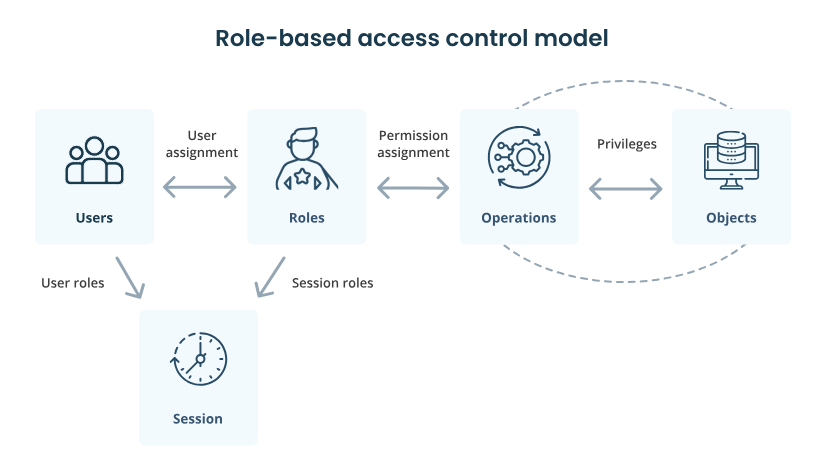
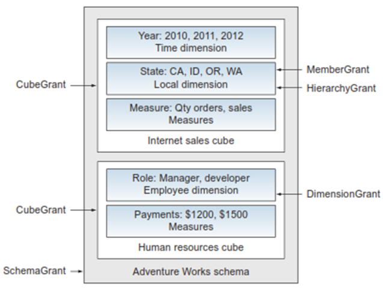
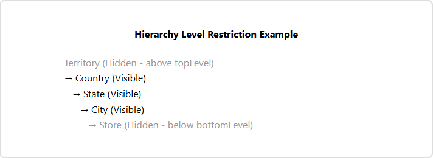

# Overview of Data Security

<div class="pcm-intro">

Publishing OLAP cubes for organisational use means more than building good dimensional models — you must ensure users see only the data their role permits. **Mondrian uses a role-based security model (RBAC)**: users are assigned to roles, and each role defines what data it can see within the cube. This lets a single analytics database serve many user types while showing each only their authorised data.

</div>

<figure><figcaption><p>RBAC</p></figcaption></figure>

> **Note:**
>
> #### Roles
>
> Within Mondrian, **roles must be explicitly defined in the schema** where they will be enforced. Creating a role is straightforward — declare a `Role` element and give it a `name`. Consider a sales-manager role: that person needs visibility into their team's performance, product-specific sales, and key customer accounts, so the role grants access to the relevant cubes, dimensions, and members.

```xml
<!-- A simple role -->
<Role name="Product Manager">
  <grants>...</grants>
</Role>

<!-- A union role combining two others -->
<Role name="Product and Sales Manager">
  <Union>
    <RoleUsage roleName="General Sales Manager"/>
    <RoleUsage roleName="Product Manager"/>
  </Union>
</Role>
```

## Connecting Pentaho roles to Mondrian roles

> **Note:**
>
> #### The role mapper
>
> Mondrian roles are enforced in the schema, but Pentaho users authenticate against the **platform**. A **role mapper** bridges the two — translating Pentaho user roles into the matching Mondrian schema roles.
>
> - **File:** `pentahoObjects.spring.xml`
> - **Path:** `pentaho-solutions/system`
> - **Bean ID:** `Mondrian-UserRoleMapper`

> **Danger:** **Security warning** — without a configured role mapper, Mondrian defaults to **unrestricted access**: every user can see all data regardless of their Pentaho roles. Always configure a role mapper.

Pentaho ships three built-in role-mapper types:

:::: tabs

### 1. One-to-One

> **Note:**
>
> #### One-to-One Role Mapper
>
> The simplest approach — it passes Pentaho roles to Mondrian **unchanged**. A user with the "Sales Manager" role in Pentaho gives Mondrian the exact same "Sales Manager" role. Widely used because it needs no separate role names or mapping logic.
>
> **`failOnEmptyRoleList`** — controls what happens when a user has no matching Mondrian role:
> - **Default (recommended):** throws an exception, preventing unauthorised access.
> - **If `false`:** users without a matching role get full access to everything — effectively no security. Avoid in production.

```xml
<bean id="Mondrian-UserRoleMapper"
  name="Mondrian-One-To-One-UserRoleMapper"
  class="org.pentaho.platform.plugin.action.mondrian.mapper.MondrianOneToOneUserRoleListMapper"
  scope="singleton" />
```

### 2. Lookup Map

> **Note:**
>
> #### Lookup Map Role Mapper
>
> Provides a translation layer when role names differ between Pentaho and Mondrian. Define key/value pairs where the **key** is the Pentaho role and the **value** is the target Mondrian role. At connection time Pentaho resolves the user's roles through this table and sends the mapped names to Mondrian.

```xml
<bean id="Mondrian-UserRoleMapper"
  name="Mondrian-SampleLookupMap-UserRoleMapper"
  class="org.pentaho.platform.plugin.action.mondrian.mapper.MondrianLookupMapUserRoleListMapper"
  scope="singleton">
  <property name="lookupMap">
    <map>
      <entry key="Power User" value="Power user" />
    </map>
  </property>
</bean>
```

### 3. User Session

> **Note:**
>
> #### User Session Role Mapper
>
> Retrieves Mondrian roles dynamically from a **session attribute**, so role assignments can be calculated at runtime or fetched from an external system during login. The only configuration needed is which session attribute holds the role information (e.g. `MondrianUserRoles`).

```xml
<bean id="Mondrian-UserRoleMapper"
  name="Mondrian-SampleUserSession-UserRoleMapper"
  class="org.pentaho.platform.plugin.action.mondrian.mapper.MondrianUserSessionUserRoleListMapper"
  scope="singleton">
  <property name="sessionProperty" value="MondrianUserRoles" />
</bean>
```

::::

## Security grants

> **Note:**
>
> #### Grants are filters
>
> Mondrian security grants are a set of **filters** on the data — a role sees only what its filters let through. At each level of the schema you can explicitly restrict or show data. Grants nest from the schema down to individual members.

<figure><figcaption></figcaption></figure>

| Level | Scope | Purpose |
| --- | --- | --- |
| **SchemaGrant** | Entire schema | Top-level access control. |
| **CubeGrant** | Individual cubes | Cube-specific restrictions. |
| **DimensionGrant / HierarchyGrant** | Dimensions & hierarchies | Dimensional filtering (HierarchyGrant adds `topLevel` / `bottomLevel`). |
| **MemberGrant** | Specific members | Fine-grained member access. |

> **Warning:** When a role is granted access to something, it is **implicitly granted access to the parent**. So setting a schema's access to `none` and then granting a cube gives the role access to that schema too — a shortcut for "deny everything except the named cube(s)".

:::: tabs

### 1. SchemaGrant

> **Note:**
>
> #### SchemaGrant
>
> The first and highest level of control. Its single `access` attribute is normally `all` or `none` (`all_dimensions` behaves like `none` and is deprecated). `all` grants the whole schema (finer grants can restrict further); `none` hides the schema completely.

```xml
<Role name="Product Manager">
  <SchemaGrant access="all">
    <!-- Additional grants can restrict further -->
  </SchemaGrant>
</Role>
```

### 2. CubeGrant

> **Note:**
>
> #### CubeGrant
>
> Takes a cube `name` and `access` (`all` or `none`). With schema `access="none"`, a `CubeGrant access="all"` exposes just that cube (and, implicitly, the parent schema). With schema `access="all"`, a `CubeGrant access="none"` hides one cube while leaving the rest visible.

```xml
<Role name="Product Manager">
  <SchemaGrant access="none">
    <CubeGrant cube="Product Sales" access="all"/>
  </SchemaGrant>
</Role>
```

### 3. Dimension & Hierarchy

> **Note:**
>
> #### DimensionGrant & HierarchyGrant
>
> `DimensionGrant` (`all`/`none`, no children) controls a whole dimension. For finer control use `HierarchyGrant`, which can bound the visible range with **`topLevel`** (hide upper, over-aggregated levels) and **`bottomLevel`** (hide lower, granular levels) — both require `access="custom"`.

```xml
<HierarchyGrant hierarchy="[Location]"
                access="custom"
                topLevel="[Location].[Country]"
                bottomLevel="[Location].[City]">
  <!-- User can only see Country to City levels -->
</HierarchyGrant>
```

<figure><figcaption><p>Top &#x26; Bottom</p></figcaption></figure>

### 4. MemberGrant

> **Note:**
>
> #### MemberGrant
>
> The finest control — within a hierarchy the role sees only the specific members it is granted. **Order matters**: granting a child then denying the parent makes the child inaccessible; denying a parent denies all its children (you can then re-grant a few); granting a child implicitly grants its parents.

```xml
<HierarchyGrant hierarchy="[Location]" access="custom">
  <MemberGrant member="[Location].[Country].[USA]" access="none"/>
  <MemberGrant member="[Location].[State].[WA]"   access="all"/>
</HierarchyGrant>
```

### 5. Rollup Policy

> **Note:**
>
> #### Rollup policy
>
> When a role can see only some of a member's children, what should the parent **total** show? The rollup policy decides — and prevents users from inferring hidden values by subtraction.

| Policy | Parent total includes | Can deduce hidden? | Best for |
| --- | --- | --- | --- |
| **full** | All children (visible + hidden) | Yes | Low-security scenarios with many children. |
| **partial** | Only visible children | No | Most common; intuitive for users. |
| **hidden** | Nothing (total hidden) | No | High-security; sensitive aggregates. |

::::

> **Note:** This page is the concept reference. Put it to work in the **Mondrian Security** workshop, where you build four progressively restrictive roles — Executive, Sales Manager, Analyst, and Regional Manager — on the Miniature Models schema.
