# Mondrian Security

> **Warning:**
>
> #### Workshop - Mondrian Security
>
> Publishing OLAP cubes for organizational use requires more than just creating sophisticated dimensional models—you must ensure that users only access data appropriate to their roles and responsibilities. While relational database security can restrict table-level access, OLAP security must operate at multiple granularities: entire schemas, specific cubes, individual dimensions and hierarchies, and even particular members within those hierarchies. Mondrian's role-based access control (RBAC) framework provides comprehensive security mechanisms that enable you to implement precise, multi-layered data protection policies directly within your schema definitions.
>
> In this comprehensive hands-on workshop, you'll implement enterprise-grade security for the Miniature Models schema by creating four distinct roles with progressively restrictive access patterns. You'll configure role mappers to bridge Pentaho platform roles with Mondrian schema roles, then systematically apply SchemaGrant, CubeGrant, HierarchyGrant, and MemberGrant security constraints that control exactly what data each role can access. Additionally, you'll explore rollup policies—a sophisticated feature that determines how aggregated totals behave when users have restricted access to underlying detail members—ensuring that security doesn't inadvertently expose restricted information through aggregate values.
>
> **What you'll do**
>
> * Create platform users (exec_user, sales_mgr, region_mgr, analyst) and assign Pentaho permissions
> * Configure the Lookup Map role mapper in pentahoObjects.spring.xml to connect platform roles to Mondrian roles
> * Implement SchemaGrant with "all" access for Executive Role providing unrestricted schema access
> * Implement SchemaGrant with "none" access plus CubeGrant for Sales Manager Role restricting to specific cubes
> * Add levels (State, City) to the CUSTOMERS dimension hierarchy for granular security testing
> * Implement HierarchyGrant with topLevel and bottomLevel restrictions for Analyst Role limiting drill-down depth
> * Create MemberGrant security for Regional Manager Role restricting access to specific states (NJ, NY, PA)
> * Understand security inheritance and how granting child access implicitly grants parent access
> * Configure rollup policies (full, partial, hidden) to control aggregate behavior with restricted access
> * Test and validate each security configuration by logging in as different users
> * Refresh Mondrian Schema Cache to apply security changes
>
> **Prerequisites:** Completion of Miniature Models workshop; Schema Workbench and Pentaho Server installed with administrative access; Understanding of dimension hierarchies and member navigation; Familiarity with XML editing and Pentaho user management
>
> **Estimated time:** 120 minutes

#### Lab Files

Open these in Schema Workbench via **File ▸ Open** (copy them out of the guide's content folder first if you plan to edit):

[miniaturemodels-original.xml](./files/miniaturemodels-original.xml)
[miniaturemodels-security.xml](./files/miniaturemodels-security.xml)


***

> **Note:** The completed secured schema for reference:

```xml
<Schema name="Miniature Models">
  <Cube name="Sales_FY2003_2005" visible="true" cache="true" enabled="true">
    <Table name="ORDERFACT" schema="PUBLIC">
    </Table>
    <Dimension type="StandardDimension" visible="true" foreignKey="CUSTOMERNUMBER" highCardinality="false" name="CUSTOMERS">
      <Hierarchy name="Customers" visible="true" hasAll="true" allMemberName="All Customers" primaryKey="CUSTOMERNUMBER">
        <Table name="CUSTOMER_W_TER" schema="PUBLIC">
        </Table>
        <Level name="Territory" visible="true" column="TERRITORY" type="String" uniqueMembers="true" levelType="Regular" hideMemberIf="Never">
        </Level>
        <Level name="Country" visible="true" column="COUNTRY" type="String" uniqueMembers="true" levelType="Regular" hideMemberIf="Never">
        </Level>
        <Level name="State" visible="true" table="CUSTOMER_W_TER" column="STATE" type="String" uniqueMembers="false" levelType="Regular" hideMemberIf="Never">
        </Level>
        <Level name="City" visible="true" table="CUSTOMER_W_TER" column="CITY" type="String" uniqueMembers="false" levelType="Regular" hideMemberIf="Never">
        </Level>
        <Level name="Customer Name" visible="true" column="CUSTOMERNAME" type="String" uniqueMembers="false" levelType="Regular" hideMemberIf="Never">
        </Level>
      </Hierarchy>
    </Dimension>
    <Dimension type="StandardDimension" visible="true" foreignKey="PRODUCTCODE" highCardinality="false" name="PRODUCTS">
      <Hierarchy name="Products" visible="true" hasAll="true" allMemberName="All Products" primaryKey="PRODUCTCODE">
        <Table name="PRODUCTS" schema="PUBLIC">
        </Table>
        <Level name="Line" visible="true" column="PRODUCTLINE" type="String" uniqueMembers="true" levelType="Regular" hideMemberIf="Never">
        </Level>
        <Level name="Vendor" visible="true" column="PRODUCTVENDOR" type="String" uniqueMembers="false" levelType="Regular" hideMemberIf="Never">
        </Level>
        <Level name="Name" visible="true" column="PRODUCTNAME" type="String" uniqueMembers="false" levelType="Regular" hideMemberIf="Never">
        </Level>
      </Hierarchy>
    </Dimension>
    <Measure name="Sales" column="TOTALPRICE" datatype="Numeric" formatString="&#163;#,###.00" aggregator="sum" visible="true">
    </Measure>
  </Cube>
  <Role name="Executive Role">
    <SchemaGrant access="all">
      <CubeGrant cube="Sales_FY2003_2005" access="all">
      </CubeGrant>
    </SchemaGrant>
  </Role>
  <Role name="Sales Manager Role">
    <SchemaGrant access="none">
      <CubeGrant cube="Sales_FY2003_2005" access="all">
      </CubeGrant>
    </SchemaGrant>
  </Role>
  <Role name="Analyst Role">
    <SchemaGrant access="none">
      <CubeGrant cube="Sales_FY2003_2005" access="all">
        <HierarchyGrant hierarchy="[CUSTOMERS.Customers]" topLevel="[CUSTOMERS.Customers].[Country]" bottomLevel="[CUSTOMERS.Customers].[City]" access="custom">
        </HierarchyGrant>
        <HierarchyGrant hierarchy="[PRODUCTS.Products]" access="all">
        </HierarchyGrant>
      </CubeGrant>
    </SchemaGrant>
  </Role>
  <Role name="Regional Manager Role">
    <SchemaGrant access="none">
      <CubeGrant cube="Sales_FY2003_2005" access="all">
        <HierarchyGrant hierarchy="[CUSTOMERS.Customers]" topLevel="[CUSTOMERS.Customers].[State]" access="custom">
          <MemberGrant member="[CUSTOMERS.Customers].[NA].[USA].[NJ]" access="all">
          </MemberGrant>
          <MemberGrant member="[CUSTOMERS.Customers].[NA].[USA].[NY]" access="all">
          </MemberGrant>
          <MemberGrant member="[CUSTOMERS.Customers].[NA].[USA].[PA]" access="all">
          </MemberGrant>
        </HierarchyGrant>
        <HierarchyGrant hierarchy="[PRODUCTS.Products]" access="all">
        </HierarchyGrant>
      </CubeGrant>
    </SchemaGrant>
  </Role>
</Schema>
```

***

> **Note:**
>
> #### Overview Security Concepts
>
> Before implementing security, it's important to understand the hierarchy of security grants in Mondrian:

> **Danger:** Important: Granting access to a child element implicitly grants access to its parent. For example, granting access to a cube implicitly grants access to the schema.

| Grant Type | Description |
| --- | --- |
| SchemaGrant | Controls access to the entire schema |
| CubeGrant | Controls access to individual cubes within a schema |
| DimensionGrant | Controls access to entire dimensions |
| HierarchyGrant | Controls access to hierarchies and can restrict by level (topLevel, bottomLevel) |
| MemberGrant | Controls access to specific members within a hierarchy |

***

1. Start Schema Workbench:

> **Note:**
>
> #### Windows (PowerShell)
>
> ```powershell
> cd \
> cd Pentaho/design-tools/schema-workbench/
> ./workbench.bat
> ```

> **Note:**
>
> #### Linux
>
> ```bash
> cd
> cd Pentaho/design-tools/schema-workbench/
> ./workbench.sh
> ```

2. Ensure Pentaho Server is running:

> **Danger:** Ensure that the Pentaho Server is up and running (automatically started in Pentaho Lab):
>
> ```bash
> cd
> cd /opt/pentaho/server/pentaho-server
> sudo ./start-pentaho.sh
> ```

<button data-launch="schema-workbench">Open Schema Workbench</button>

:::: tabs

### 1. Setup — Users, Roles & Role Mapper

> **Note:**
>
> #### Setup
>
> Let's drill down even further ..!
>
> The Regional Manager should only see data for the Western USA region, states that include California, Oregon, and Washington.

<button data-launch="puc">Open Pentaho User Console</button>

#### Users & Roles

> **Note:**
>
> #### Users & Roles
>
> We will create several test users to demonstrate different security scenarios:

| Username | Role | Purpose |
| --- | --- | --- |
| exec_user | Executive | Full access to all data |
| sales_mgr | Sales Manager | Access to sales cube only |
| region_mgr | Regional Manager | Limited to specific regions only |
| analyst | Analyst | Summary data only, no detailed records |

1. Log into Pentaho User Console as Administrator.

   * Username: admin
   * Password: password

2. Navigate to Administration Perspective from the drop-down menu.
3. Select **Users & Roles > Manage Users**.
4. Click on the **+** sign to create each user from the table above with password: `password`

<figure>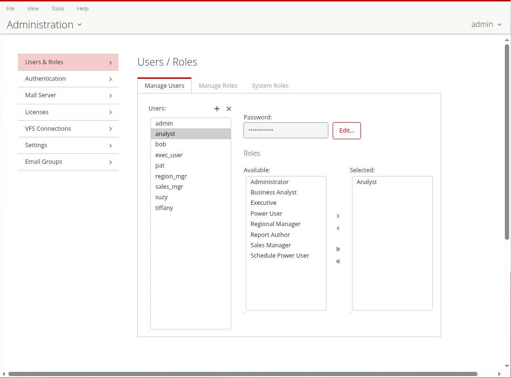<figcaption><p>Add Users</p></figcaption></figure>

5. Navigate to **Users & Roles > Manage Roles**.
6. Assign the following Roles / Permissions to the User:

| Role | Permissions | User |
| --- | --- | --- |
| Executive | All the permissions | exec_user |
| Sales Manager | Schedule Content, Read Content, Publish Content, Create Content, Execute | sales_mgr |
| Regional Manager | Schedule Content, Read Content, Publish Content, Create Content, Execute | region_mgr |
| Analyst | Publish Content, Create Content | analyst |

<figure>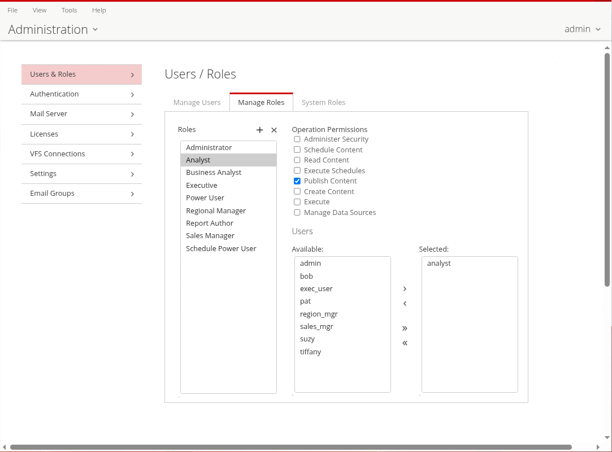<figcaption><p>Assign Roles / Permissions to User</p></figcaption></figure>

#### Role Mapper

> **Note:**
>
> #### Role Mapper
>
> The role mapper connects Pentaho user roles to Mondrian schema roles. We will use the Lookup Map role mapper to demonstrate flexible role mapping.

1. Open the file - pentahoObjects.spring.xml:

```bash
cd
cd /opt/pentaho/server/pentaho-server/pentaho-solutions/system
sudo nano pentahoObjects.spring.xml
```

2. Locate the Mondrian-UserRoleMapper section (approximately line 295).
3. Comment out the default One-to-One mapper if it's active:

```xml
<!-- Disabled for workshop
<bean id="Mondrian-UserRoleMapper"
  name="Mondrian-One-To-One-UserRoleMapper"
  class="org.pentaho.platform.plugin.action.mondrian.mapper.MondrianOneToOneUserRoleListMapper"
  scope="singleton" />
-->
```

4. Uncomment and configure the Lookup Map role mapper:

```xml
<bean id="Mondrian-UserRoleMapper"
  name="Mondrian-SampleLookupMap-UserRoleMapper"
  class="org.pentaho.platform.plugin.action.mondrian.mapper.MondrianLookupMapUserRoleListMapper"
  scope="singleton">
  <property name="lookupMap">
    <map>
      <entry key="Executive" value="Executive Role" />
      <entry key="Sales Manager" value="Sales Manager Role" />
      <entry key="Regional Manager" value="Regional Manager Role" />
      <entry key="Analyst" value="Analyst Role" />
    </map>
  </property>
</bean>
```

5. Save the file.
6. Restart the Pentaho server for changes to take effect:

> **Note:**
>
> #### Linux
>
> ```bash
> cd
> cd /opt/pentaho/server/pentaho-server
> sudo ./stop-pentaho.sh
> ```
>
> ```bash
> cd
> cd /opt/pentaho/server/pentaho-server
> sudo ./start-pentaho.sh
> ```

> **Note:** The key represents the Pentaho role name, and the value represents the Mondrian role name that will be defined in the schema.

### 2. SchemaGrant (Executive & Sales Manager)

> **Note:**
>
> #### SchemaGrant
>
> SchemaGrant controls access to the Miniature Models schema. We'll implement two scenarios:
>
> full access:
>
> no access:

> **Danger:**
>
> #### Refresh the Mondrian Schema Cache
>
> Please remember to refresh the Mondrian Schema Cache every time you edit and save the miniaturemodels-security.xml schema ..

1. Log in as Administrator.

   * Password: password

<figure>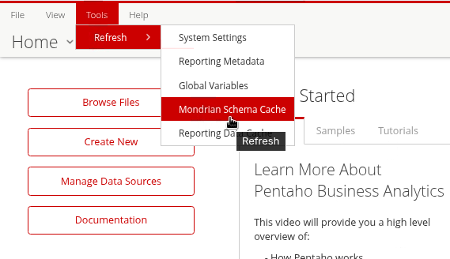<figcaption><p>Refresh the Mondrian Cache </p></figcaption></figure>

***

Follow the steps below to understand the difference between Full & No access:

#### Full Access — Executive Role

> **Note:**
>
> #### Full Access - Executive Role
>
> The Executive role should have unrestricted access to all cubes and dimensions in the schema. The easiest method to apply the SchemaGrant is by editing.

1. Open the miniaturemodels-original.xml schema.
2. Save as: Miniature Models - security.

<figure>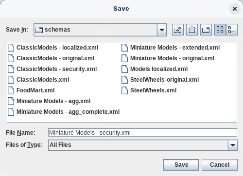<figcaption><p>miniaturemodels-security.xml</p></figcaption></figure>

3. Highlight Schema and Click on the 'User shadow+'.
4. Enter: **Executive Role** & tab to set the value.
5. Right-mouse on Executive Role & Select: Add Schema Grant.

<figure>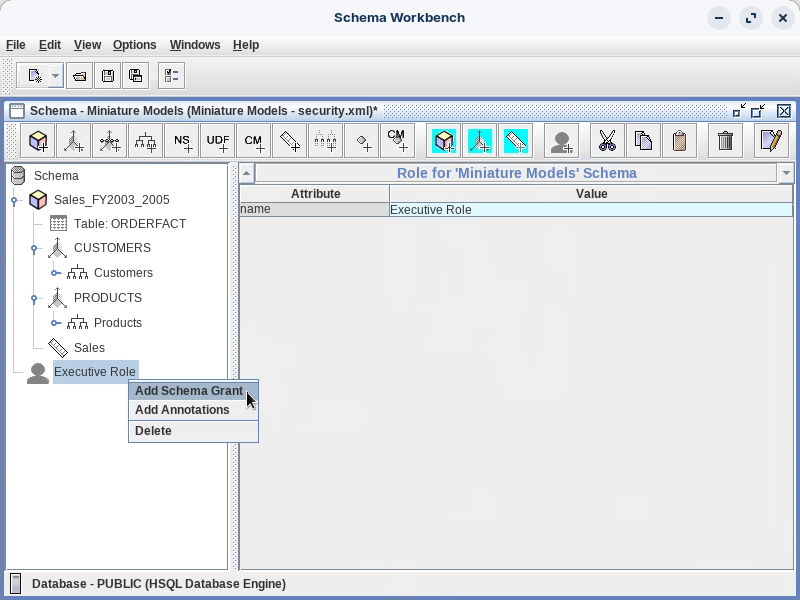<figcaption><p>Set Executive Role</p></figcaption></figure>

6. Select: **all** & tab to set the value.

<figure>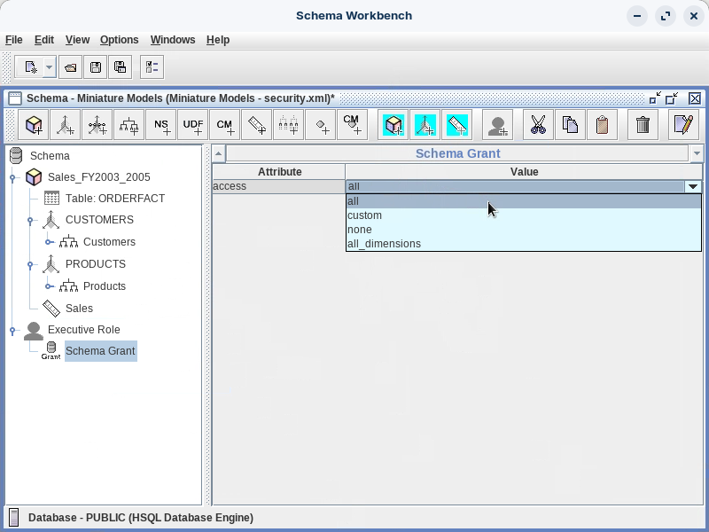<figcaption><p>Schema Grant access = all</p></figcaption></figure>

7. Right-mouse click on the Schema Grant and Add Cube Grant.

<figure>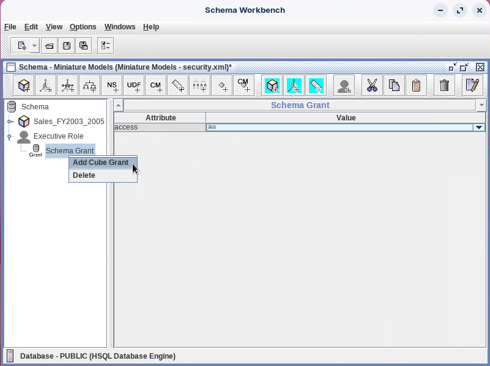<figcaption><p>Add Cube Grant</p></figcaption></figure>

8. Set access: **all**
9. From the cube drop-down, select: Sales_FY2003_2005.

<figure>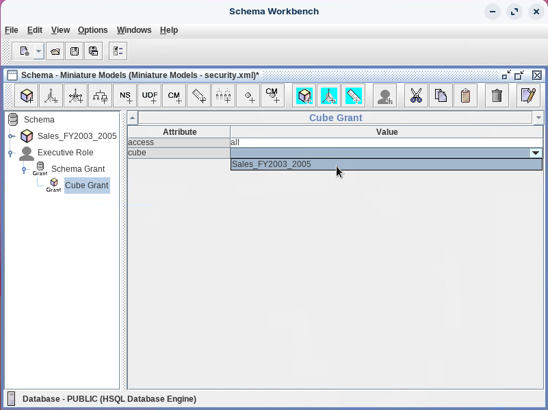<figcaption><p>Cube Grant to Sales_FY2003_2005 cube only</p></figcaption></figure>

```xml
<Role name="Executive Role">
    <SchemaGrant access="all">
        <CubeGrant cube="Sales_FY2003_2005" access="all">
        </CubeGrant>
    </SchemaGrant>
</Role>
```

10. Click Save & Publish.

> **Note:** Currently only Executive Role users have access to the Miniature Models - security schema / Sales_FY2003_2005 cube as a data source ..

To test login as: exec_user

<figure>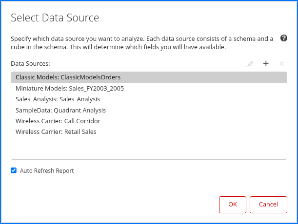<figcaption><p>Executive Role Data Sources</p></figcaption></figure>

To test log in as: analyst — no Miniature Models..!

<figure>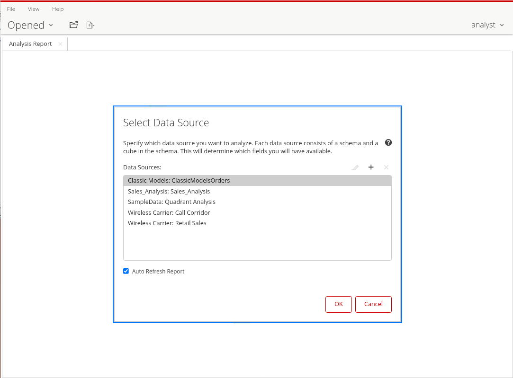<figcaption><p>Analyst Data Sources - no Miniature Models..!</p></figcaption></figure>

#### No Schema Access — Sales Manager Role

> **Note:**
>
> #### Sales Manager
>
> So far only the Executive Role users have access to the Miniature Models - security schema as a data source. Next step is to set access to the Sales_FY2003_2005 cube only for the Sales Manager Role users.

1. Open the miniaturemodels-security.xml schema.
2. Highlight Schema and Click on the 'User shadow+'.
3. Enter: Sales Manager Role & tab to set the value.
4. Right-mouse on Sales Manager Role & Select: Add Schema Grant.
5. Select: none & tab to set the value.

<figure>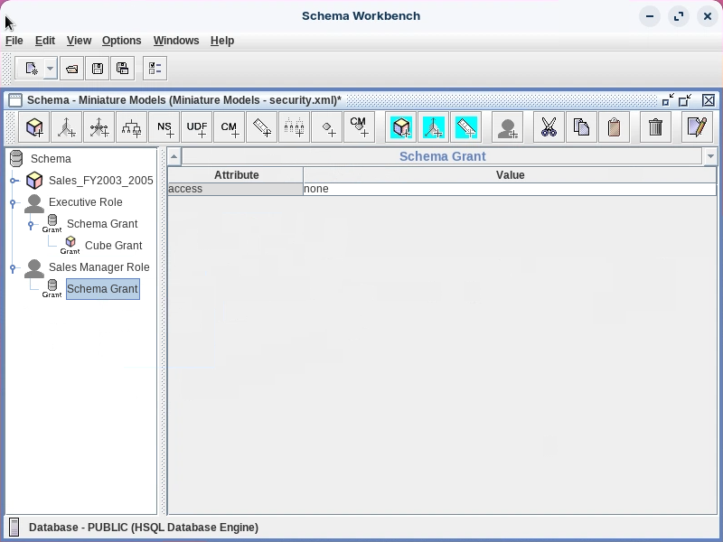<figcaption><p>Schema Grant access = none</p></figcaption></figure>

6. Right-mouse click on the Schema Grant and Add Cube Grant.
7. Set the access: **all** & tab to set the value.
8. From the cube drop-down, select cube: Sales_FY2003_2005 & tab.

<figure>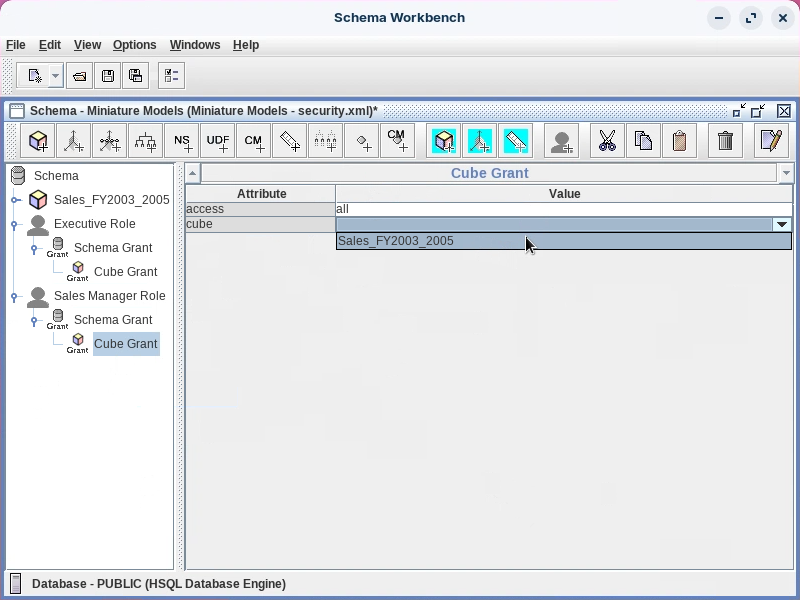<figcaption></figcaption></figure>

```xml
<Role name="Sales Manager Role">
    <SchemaGrant access="none">
        <CubeGrant cube="Sales_FY2003_2005" access="all">
        </CubeGrant>
    </SchemaGrant>
</Role>
```

9. Click Save & Publish.
10. To test login in as: sales_mgr

<figure>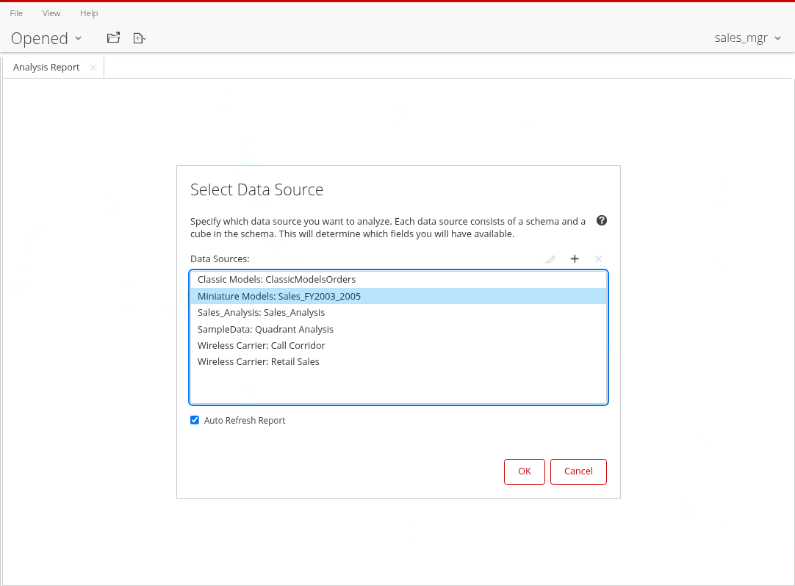<figcaption><p>sales_mgr</p></figcaption></figure>

> **Note:** Setting access='none' at the SchemaGrant level blocks all cubes by default. The CubeGrant then selectively grants access to the Sales_FY2003_2005 cube, implicitly granting access to the parent schema as well.
>
> Remember to refresh the Mondrian Schema Cache ..

### 3. HierarchyGrant (Analyst)

> **Note:**
>
> #### HierarchyGrant
>
> HierarchyGrant allows fine-grained control over which levels of a hierarchy users can access. We'll use topLevel and bottomLevel attributes to restrict the Analyst role's view.
>
> The Analyst role should see summarized data only, without access to the most granular details. We'll restrict their view to show data from Country level down to City level, but not individual PostalCodes.
>
> So we're going to have to add some Levels to our Schema:
>
> All > Territory > Country > State > City > Customer Name

> **Danger:**
>
> #### Refresh the Mondrian Schema Cache
>
> Please remember to refresh the Mondrian Schema Cache every time you edit and save the miniaturemodels-security.xml schema ..

1. Log in as Administrator.

   * Password: password

<figure><figcaption><p>Refresh the Mondrian Cache </p></figcaption></figure>

***

1. To add another level, in the left pane, right-click the Customers (hierarchy) under CUSTOMERS and select Add Level.
2. To define the State level, type or choose:

| Attribute | Value |
| --- | --- |
| name | State |
| column | STATE |
| type | String |
| levelType | Regular |
| hideMemberIf | Never |

3. To define the City level, type or choose:

| Attribute | Value |
| --- | --- |
| name | City |
| column | CITY |
| type | String |
| levelType | Regular |
| hideMemberIf | Never |

***

1. Open the miniaturemodels-security.xml schema.
2. Highlight Schema and Click on the 'User shadow+'.
3. Enter: Analyst Role & tab to set the value.
4. Right-mouse on Analyst Role & Select: Add Schema Grant.
5. Select: none & tab to set the value.
6. Right-mouse click on the Schema Grant and Add Cube Grant.
7. Set the access: **all** & tab to set the value.
8. From the cube drop-down, select cube: Sales_FY2003_2005 & tab.
9. Right-mouse click on the Cube Grant and Add Hierarchy Grant.

<figure>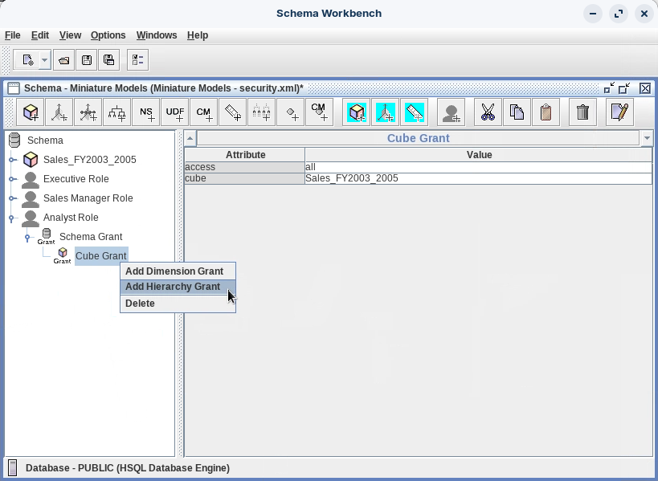<figcaption><p>Add Hierarchy Grant - CUSTOMERS.Customers</p></figcaption></figure>

10. From the drop-down options select the following:

| Attribute | Value |
| --- | --- |
| access | custom |
| hierarchy | [CUSTOMERS.Customers] |
| topLevel | [CUSTOMERS.Customers].[Country] |
| bottomLevel | [CUSTOMERS.Customers].[City] |

<figure>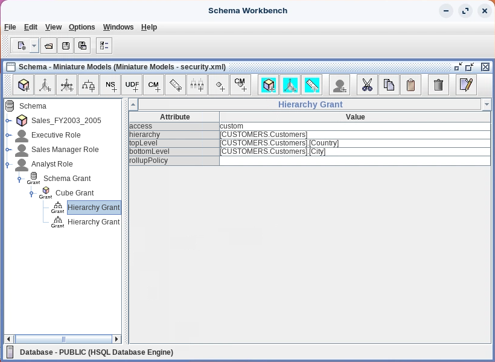<figcaption><p>Set hierarchy [CUSTOMERS.Customers]  topLevel &#x26; bottomLevel</p></figcaption></figure>

> **Note:**
>
> #### Top & Bottom Level
>
> * **topLevel**: The highest (most aggregated) level the user can see. Setting it to Country means the user cannot see the All level.
> * **bottomLevel**: The lowest (most detailed) level the user can see. Setting it to City means the user cannot see individual Store data.
>
> **Result**: The Analyst can see data aggregated from Country > Region > City, but not Customer Name -level details.

11. Right-mouse click on the Cube Grant and Add Hierarchy Grant.
12. From the drop-down options select the following:

| Attribute | Value |
| --- | --- |
| access | all |
| hierarchy | [PRODUCTS.Products] |

<figure>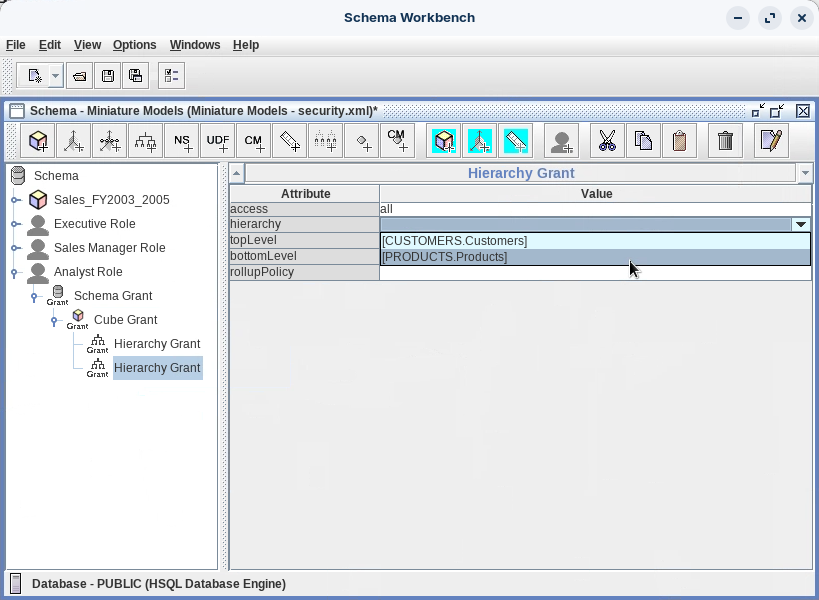<figcaption><p>Set hierarchy [PRODUCTS.Products]</p></figcaption></figure>

```xml
<Role name="Analyst Role">
    <SchemaGrant access="none">
        <CubeGrant cube="Sales_FY2003_2005" access="all">
            <HierarchyGrant hierarchy="[CUSTOMERS.Customers]"
                            access="custom"
                            topLevel="[CUSTOMERS.Customers].[Country]"
                            bottomLevel="[CUSTOMERS.Customers].[City]">
            </HierarchyGrant>
            <HierarchyGrant hierarchy="[PRODUCTS.Products]" access="all">
            </HierarchyGrant>
        </CubeGrant>
    </SchemaGrant>
</Role>
```

13. Click Save & Publish.

***

To test login in as: analyst

<figure>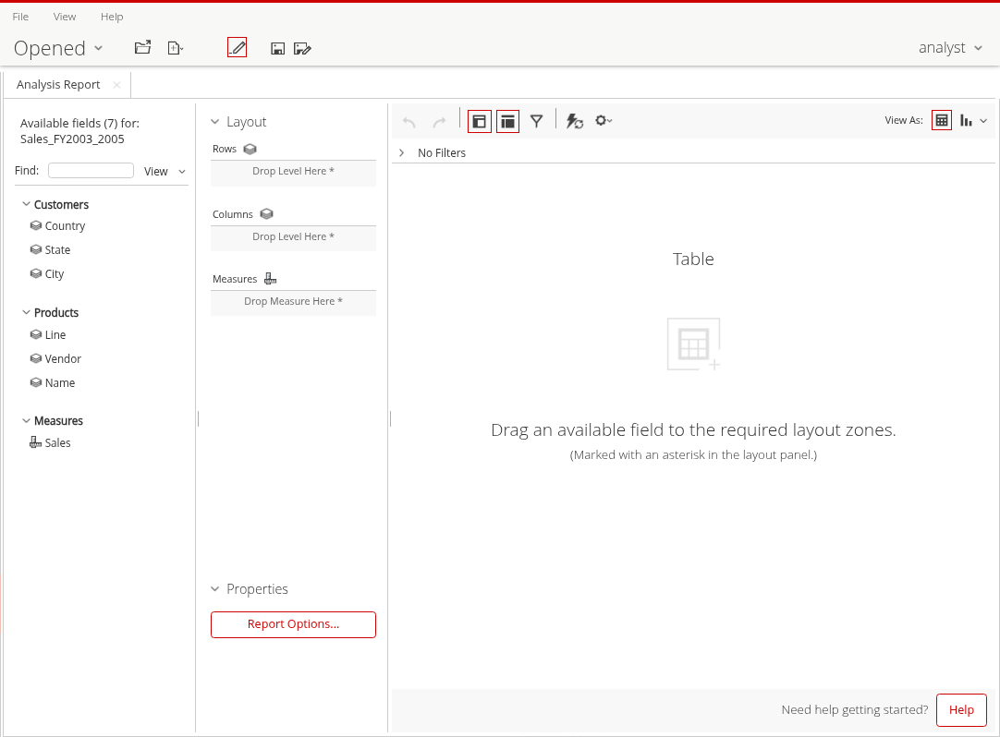<figcaption><p>Analyst</p></figcaption></figure>

> **Note:** Notice: The scope of the Customers Hierarchy has been restricted - no Territory & PostalCode

### 4. MemberGrant (Regional Manager)

> **Note:**
>
> #### Member Grant
>
> Let's dive a bit deeper..!
>
> The Regional Manager Role should only see data for the Eastern USA region, which include: New York, New Jersey, and Pennsylvania.

> **Danger:**
>
> #### Refresh the Mondrian Schema Cache
>
> Please remember to refresh the Mondrian Schema Cache every time you edit and save the miniaturemodels-security.xml schema ..

1. Log in as Administrator.

   * Password: password

<figure><figcaption><p>Refresh the Mondrian Cache </p></figcaption></figure>

***

1. Open the miniaturemodels-security.xml schema.
2. Highlight Schema and Click on the 'User shadow+'.
3. Enter: Regional Manager Role & tab to set the value.
4. Right-mouse on Regional Manager Role & Select: Add Schema Grant.
5. Select: none & tab to set the value.
6. Right-mouse click on the Schema Grant and Add Cube Grant.
7. Set the access: **all** & tab to set the value.
8. From the cube drop-down, select cube: Sales_FY2003_2005 & tab.
9. Right-mouse click on the Cube Grant and Add Hierarchy Grant.
10. From the drop-down options select the following:

| Attribute | Value |
| --- | --- |
| access | custom |
| hierarchy | [CUSTOMERS.Customers] |
| topLevel | [CUSTOMERS.Customers].[State] |

<figure>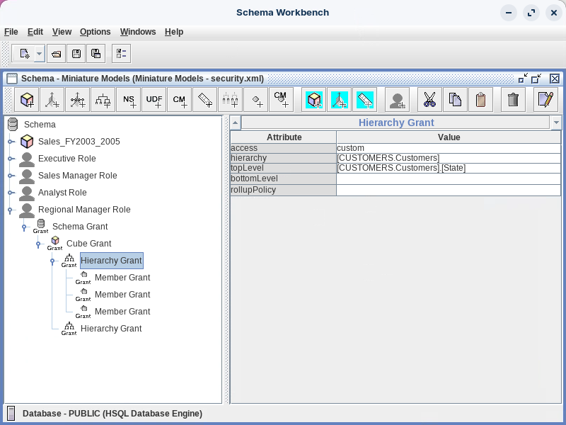<figcaption><p>Set hierarchy [CUSTOMERS.Customers]  topLevel</p></figcaption></figure>

11. Right-mouse click on Hierarchy Grant to Add a Member Grant.

> **Note:** Add the Member constraints for each State: [NJ] [NY] [PA]

12. Repeat the workflow to add the following Member Grants:

| Attribute | Value |
| --- | --- |
| access | all |
| member | [CUSTOMERS.Customers].[NA].[USA].[NJ] |
| | [CUSTOMERS.Customers].[NA].[USA].[NY] |
| | [CUSTOMERS.Customers].[NA].[USA].[PA] |

<figure>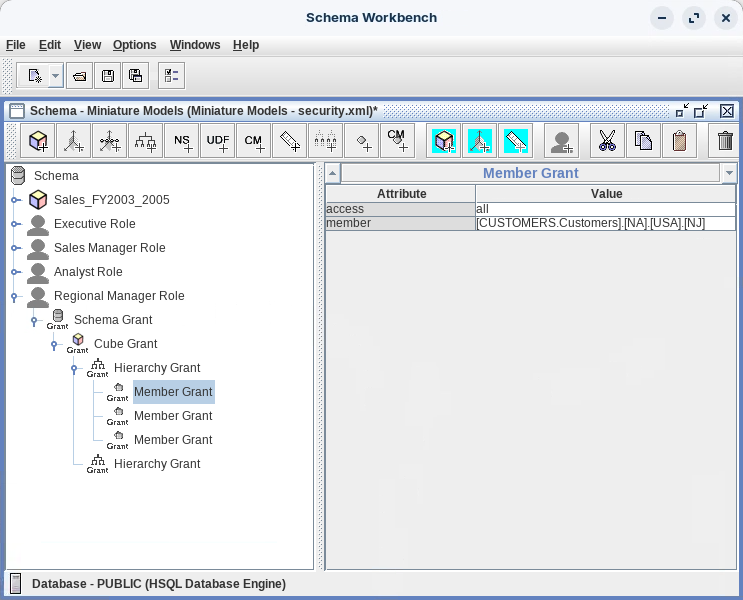<figcaption><p>Set member [CUSTOMERS.Customers].[NA].[USA].[NJ]</p></figcaption></figure>

13. Finally add the PRODUCTS.Products hierarchy:

| Attribute | Value |
| --- | --- |
| access | all |
| hierarchy | [PRODUCTS.Products] |

<figure>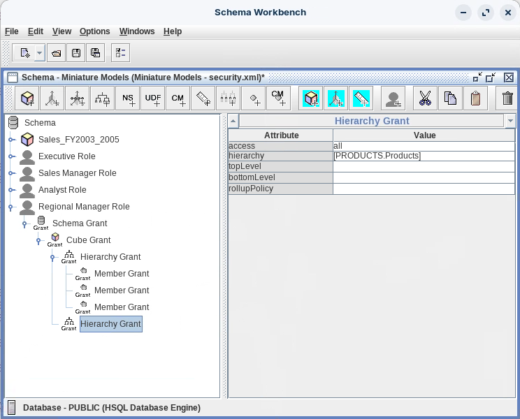<figcaption><p>Set hierarchy [PRODUCTS.Products]</p></figcaption></figure>

14. Finally Save & Publish.

```xml
<Role name="Regional Manager Role">
    <SchemaGrant access="none">
        <CubeGrant cube="Sales_FY2003_2005" access="all">
            <HierarchyGrant hierarchy="[CUSTOMERS.Customers]" access="custom" topLevel="[CUSTOMERS.Customers].[State]">
                <!-- Only grant access to specific states - do NOT grant to NA or USA -->
                <MemberGrant member="[CUSTOMERS.Customers].[NA].[USA].[NJ]" access="all">
                </MemberGrant>
                <MemberGrant member="[CUSTOMERS.Customers].[NA].[USA].[NY]" access="all">
                </MemberGrant>
                <MemberGrant member="[CUSTOMERS.Customers].[NA].[USA].[PA]" access="all">
                </MemberGrant>
            </HierarchyGrant>
            <HierarchyGrant hierarchy="[PRODUCTS.Products]" access="all">
            </HierarchyGrant>
        </CubeGrant>
    </SchemaGrant>
</Role>
```

> **Note:** With `access="custom"`, Mondrian denies everything by default and only allows what you explicitly grant. By only granting access to NJ, NY, and PA, those are the only states that will be visible.

***

To test login in as: region_mgr

<figure>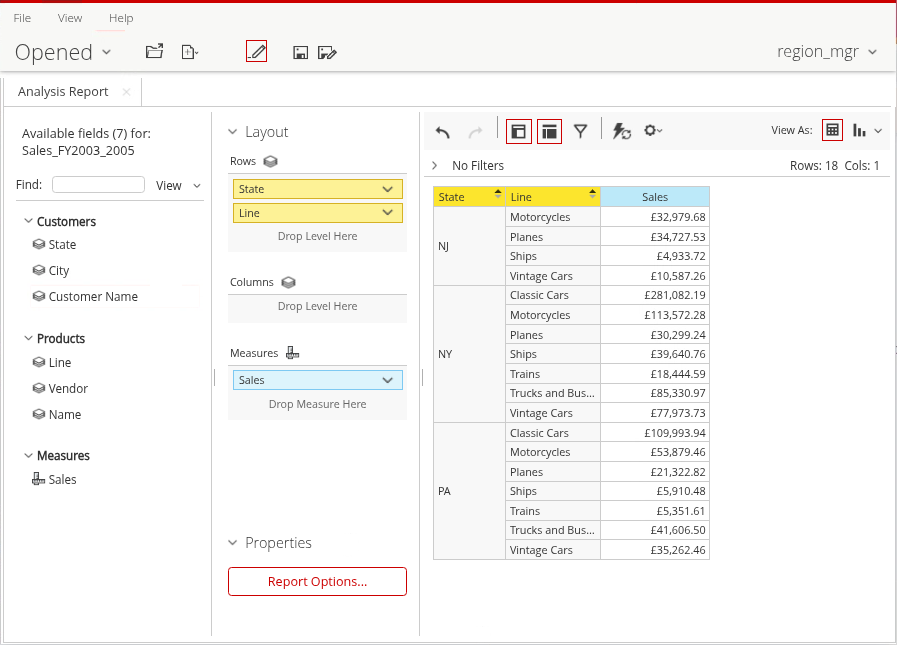<figcaption></figcaption></figure>

> **Note:** Notice topLevel: STATE. The default behaviour is to restrict the total / SUM as a Partial rollup.

### 5. Rollup Policies

> **Note:**
>
> #### Rollup Policies
>
> Rollup policies control **how measures are aggregated when role-based security restricts access to certain members** in a dimension hierarchy. This becomes critical when you have hierarchies with restricted access - topLevel & bottomLevel will restrict the aggregation.
>
> When a role restricts access to certain dimension members, what should happen to the totals at higher levels? Should they be included the restricted data or not?

| Policy | Behaviour |
| --- | --- |
| full | Shows the complete total including hidden members. User sees accurate company-wide totals but cannot infer hidden values if few members are visible. |
| partial | Shows total of only visible members. User sees accurate subtotals for their authorized data. Useful when users should only see their scope. |
| hidden | Hides the total completely if any children are not accessible. Most restrictive option, prevents any inference of hidden data. |

| Role Type | Recommended Policy | Reason |
| --- | --- | --- |
| Executive / VP | full | Need complete picture, restricted drill-down |
| Regional Manager | partial | Should only see their region's totals |
| Contributor | partial or hidden | Limited scope, no need for aggregates |
| Analyst (restricted data) | full | Need context of full data while working with subset |

> **Note:** Remember the aggregation level is determined by the access restrictions. So .. If Regional Manager needs to see "complete totals but limited drill-down":
>
> **Use top-down grant with denials**:

```xml
<HierarchyGrant hierarchy="[CUSTOMERS.Customers]"
              rollupPolicy="full"
              access="custom">
    <MemberGrant member="[CUSTOMERS.Customers].[NA].[USA]" access="all"/>
    <!-- Then deny all states -->
    <MemberGrant member="[CUSTOMERS.Customers].[NA].[USA].[CA]" access="none"/>
    <MemberGrant member="[CUSTOMERS.Customers].[NA].[USA].[CT]" access="none"/>
    <!-- ... deny all others ... -->
    <!-- Then grant access to the 3 states -->
    <MemberGrant member="[CUSTOMERS.Customers].[NA].[USA].[NJ]" access="all"/>
    <MemberGrant member="[CUSTOMERS.Customers].[NA].[USA].[NY]" access="all"/>
    <MemberGrant member="[CUSTOMERS.Customers].[NA].[USA].[PA]" access="all"/>
</HierarchyGrant>
```

::::
