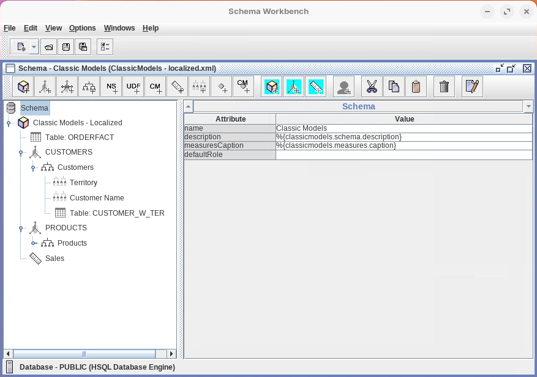

# FR Localization

> **Warning:**
>
> #### Workshop - FR Localization
>
> Global organizations require analytics solutions that speak the language of their users, presenting data concepts in familiar terms that cross linguistic and cultural boundaries. This workshop covers internationalizing Mondrian ROLAP schemas through Pentaho's dynamic schema processing framework, creating multilingual OLAP cubes that automatically adapt to user language preferences. Tokenization and Java localization properties work together to transform a single schema definition into a globally accessible analytics platform that serves French, English, and potentially any language your organization requires.
>
> In this workshop, you implement a complete bilingual solution by systematically tokenizing the Classic Models schema, creating language-specific property files that provide translations for every user-facing element, and configuring the Pentaho environment to process these tokens dynamically based on user locale. You will learn the critical distinction between components, elements, and properties in the tokenization naming convention, leverage Java's standard localization framework through property files, configure Mondrian's dynamic schema processor to perform runtime token substitution, and enable schema checksumming so Pentaho Analyzer can detect changes and refresh its caches.
>
> **What you'll do**
>
> * Start Schema Workbench and open the Classic Models schema for localization enhancement
> * Understand the tokenization pattern convention using the format `%{classicmodels.[component].[element].[property]}` where component identifies the schema layer (schema, dimension, hierarchy, measures), element specifies the particular object (customers, products, territory), and property indicates the attribute (caption, description)
> * Add comprehensive tokenization to the Classic Models schema across all user-facing elements including schema description and measures caption tokens, CUSTOMERS dimension with caption, description, hierarchy tokens (allMemberCaption, caption, description), and level tokens for Territory and Customer Name
> * Extend tokenization to the PRODUCTS dimension with complete hierarchy and level tokens for Product Line and Vendor, plus measure tokens for Sales caption
> * Save the tokenized schema as ClassicModels-localized.xml and publish it to the Pentaho Server
> * Create the required directory structure for localization property files at /server/pentaho-server/tomcat/webapps/pentaho/WEB-INF/classes/com/pentaho/messages/
> * Download and deploy MondrianMessages_en.properties containing English translations for all tokens
> * Download and deploy MondrianMessages_fr.properties containing French translations for all tokens
> * Verify successful file placement by listing contents of the messages directory
> * Configure mondrian.properties by adding the mondrian.rolap.localePropFile property pointing to com.pentaho.messages.MondrianMessages (without language suffix)
> * Save the mondrian.properties configuration file
> * Restart the Pentaho Server to activate the dynamic schema processing configuration
> * Access the User Console as Admin and navigate to Manage Data Sources to verify the data source configuration includes DynamicSchemaProcessor (pointing to Mondrian's token replacement processor) and UseContentChecksum (enabling schema change detection for Pentaho Analyzer cache refreshing)
> * Test the localized schema by accessing Pentaho Analyzer in different language contexts to verify automatic translation
>
> **Prerequisites:** Pentaho Schema Workbench installed; Pentaho Server running with Classic Models schema deployed; admin access to Pentaho Server file system
>
> **Estimated time:** 60 minutes

#### Lab Files

Open these in Schema Workbench via **File ▸ Open** (copy them out of the guide's content folder first if you plan to edit):

[classicmodels-localized.xml](./files/classicmodels-localized.xml)


***

1. Start Schema Workbench:

> **Note:**
>
> #### Windows (PowerShell)
>
> ```powershell
> cd \
> cd Pentaho/design-tools/schema-workbench/
> ./workbench.bat
> ```

> **Note:**
>
> #### Linux
>
> ```bash
> cd
> cd Pentaho/design-tools/schema-workbench/
> ./workbench.sh
> ```

2. Ensure Pentaho Server is running:

> **Danger:** Ensure that the Pentaho Server is up and running (automatically started in Pentaho Lab):
>
> ```bash
> cd
> cd /opt/pentaho/server/pentaho-server
> sudo ./start-pentaho.sh
> ```

<button data-launch="schema-workbench">Open Schema Workbench</button>

Follow the steps below to configure and deploy your localized model:

:::: tabs

### 1. Tokenized Schema

> **Note:**
>
> #### Tokenized Schema
>
> This section provides specific implementation details for localizing the Classic Models Mondrian schema. Follow these steps to deploy a fully working French-English bilingual analytics solution.
>
> The Classic Models schema is a sample ROLAP schema based on the Classic Models sample database, featuring:
>
> * Sales cube with multiple dimensions
> * Customers dimension (Territory, Customer Name)
> * Products dimension (Product Line, Vendor)
> * Multiple measures (Quantity, Sales, Order Count)

Here's the tokenized Classic Models Schema:

```xml
<?xml version="1.0" encoding="UTF-8"?>
<Schema name="Classic Models" caption="%{schema.caption}">
  
  <Cube name="ClassicModelsOrders" 
        caption="%{cube.orders.caption}" 
        visible="true" 
        cache="true" 
        enabled="true">
    
    <Table name="ORDERFACT" schema="PUBLIC">
    </Table>
    
    <Dimension type="StandardDimension" 
               visible="true" 
               foreignKey="CUSTOMERNUMBER" 
               highCardinality="false" 
               name="CUSTOMERS" 
               caption="%{dimension.customers.caption}">
      
      <Hierarchy name="Customers" 
                 caption="%{hierarchy.customers.caption}" 
                 visible="true" 
                 hasAll="true" 
                 allMemberName="All Customers" 
                 allMemberCaption="%{hierarchy.customers.allmember}"
                 primaryKey="CUSTOMERNUMBER">
        
        <Table name="CUSTOMER_W_TER" schema="PUBLIC">
        </Table>
        
        <Level name="Territory" 
               caption="%{level.territory.caption}" 
               visible="true" 
               column="TERRITORY" 
               type="String" 
               uniqueMembers="true" 
               levelType="Regular" 
               hideMemberIf="Never">
        </Level>
        
        <Level name="Customer Name" 
               caption="%{level.customername.caption}" 
               visible="true" 
               column="CUSTOMERNAME" 
               type="String" 
               uniqueMembers="false" 
               levelType="Regular" 
               hideMemberIf="Never">
        </Level>
      </Hierarchy>
    </Dimension>
    
    <Dimension type="StandardDimension" 
               visible="true" 
               foreignKey="PRODUCTCODE" 
               highCardinality="false" 
               name="PRODUCTS" 
               caption="%{dimension.products.caption}">
      
      <Hierarchy name="Products" 
                 caption="%{hierarchy.products.caption}" 
                 visible="true" 
                 hasAll="true" 
                 allMemberName="All Products" 
                 allMemberCaption="%{hierarchy.products.allmember}"
                 primaryKey="PRODUCTCODE">
        
        <Table name="PRODUCTS" schema="PUBLIC">
        </Table>
        
        <Level name="Product Line" 
               caption="%{level.productline.caption}" 
               visible="true" 
               column="PRODUCTLINE" 
               type="String" 
               uniqueMembers="true" 
               levelType="Regular" 
               hideMemberIf="Never">
        </Level>
        
        <Level name="Vendor" 
               caption="%{level.vendor.caption}" 
               visible="true" 
               column="PRODUCTVENDOR" 
               type="String" 
               uniqueMembers="false" 
               levelType="Regular" 
               hideMemberIf="Never">
        </Level>
      </Hierarchy>
    </Dimension>
    
    <Measure name="Sales" 
             caption="%{measure.sales.caption}" 
             column="TOTALPRICE" 
             datatype="Numeric" 
             formatString="$#,###.00" 
             aggregator="sum" 
             visible="true">
    </Measure>
  </Cube>
</Schema>
```

<figure><figcaption><p>Add Tokens</p></figcaption></figure>

1. Add the following Tokens to the Classic Models schema.
2. Save your schema - ClassicModels-localized.xml
3. Publish your schema.

#### Classic Models Schema - Localization Tokens Table

All tokens follow the pattern: `%{classicmodels.[component].[element].[property]}`

Where:

* **component** = schema, dimension, hierarchy, or measures
* **element** = specific name (customers, products, territory, etc.)
* **property** = caption or description

| Schema Element | Attribute | Token |
| --- | --- | --- |
| Schema | description | `%{schema.description}` |
| Schema | measuresCaption | `%{measures.caption}` |
| Dimension: CUSTOMERS | caption | `%{dimension.customers.caption}` |
| Dimension: CUSTOMERS | description | `%{dimension.customers.description}` |
| Hierarchy: Customers | allMemberCaption | `%{dimension.customers.allmember.caption}` |
| Hierarchy: Customers | caption | `%{hierarchy.customers.caption}` |
| Hierarchy: Customers | description | `%{hierarchy.customers.description}` |
| Level: Territory | caption | `%{dimension.customers.territory.caption}` |
| Level: Territory | description | `%{dimension.customers.territory.description}` |
| Level: Customer Name | caption | `%{dimension.customers.customername.caption}` |
| Level: Customer Name | description | `%{dimension.customers.customername.description}` |
| Dimension: PRODUCTS | caption | `%{dimension.products.caption}` |
| Dimension: PRODUCTS | description | `%{dimension.products.description}` |
| Hierarchy: Products | allMemberCaption | `%{dimension.products.allmember.caption}` |
| Hierarchy: Products | caption | `%{hierarchy.products.caption}` |
| Hierarchy: Products | description | `%{hierarchy.products.description}` |
| Level: Product Line | caption | `%{dimension.products.line.caption}` |
| Level: Product Line | description | `%{dimension.products.line.description}` |
| Level: Vendor | caption | `%{dimension.products.vendor.caption}` |
| Level: Vendor | description | `%{dimension.products.vendor.description}` |
| Measure: Sales | caption | `%{measures.sales.caption}` |

### 2. Properties

> **Note:**
>
> #### MondrianMessages_[locale].properties

1. Navigate to or create the following directory.

```
/server/pentaho-server/tomcat/webapps/pentaho/WEB-INF/classes/com/pentaho/messages/
```

> **Danger:** If some folders are missing (chances are all those inside the 'classes' folder won't be present), create all missing folders manually.

Linux:

```bash
cd
cd /opt/pentaho/server/tomcat/webapps/pentaho/WEB-INF/classes
sudo mkdir -p com/pentaho/messages && cd com/pentaho/messages
```

2. Download the properties files.

- [MondrianMessages_en.properties](../_assets/files/MondrianMessages_en.properties)
- [MondrianMessages_fr.properties](../_assets/files/MondrianMessages_fr.properties)

3. Copy the files into the messages folder.

Linux:

```bash
cd
sudo cp ~/Downloads/MondrianMessages_*.properties /opt/pentaho/server/tomcat/webapps/pentaho/WEB-INF/classes/com/pentaho/messages/
```

4. Check the files have been successfully copied.

Linux:

```bash
cd
ls -l /opt/pentaho/server/tomcat/webapps/pentaho/WEB-INF/classes/com/pentaho/messages/
```

### 3. mondrian.properties

> **Note:**
>
> #### Configuring mondrian.properties

1. Navigate to: mondrian.properties

Linux:

```bash
cd
cd /opt/pentaho/server/pentaho-server/pentaho-solutions/system/mondrian
sudo nano mondrian.properties
```

2. Add the locale property - add line at the bottom.

```
mondrian.rolap.localePropFile=com.pentaho.messages.MondrianMessages
```

> **Note:** This points to your message bundle location (without language suffix).

3. Save the mondrian.properties file

```
Ctrl + o
Enter
Ctrl + x
```

4. Restart the Pentaho Server.

Linux:

```bash
cd
cd /opt/pentaho/server/pentaho-server
sudo ./stop-pentaho.sh
```

```bash
cd
cd /opt/pentaho/server/pentaho-server
sudo ./start-pentaho.sh
```

### 4. Manage Data Source

> **Note:**
>
> #### Manage Data Source

<button data-launch="puc">Open Pentaho User Console</button>

1. Login to the User Console as Admin > Manage Data Sources

> **Note:** The two following properties were added to the DataSourceInfo element.
>
> **DynamicSchemaProcessor**
>
> This property points to a fully qualified class name implementing `mondrian.spi.DynamicSchemaProcessor`. Dynamic schema processors are classes who filter the schema file contents and provide a filtered output to Mondrian's core. Mondrian comes with a dynamic schema processor who searches for tokens and replaces them with values from Java localization files. As a matter of fact, it is implemented with Java's standard localized messages framework.
>
> **UseContentChecksum**
>
> This property tells Mondrian to maintain a checksum of the schema XML and expose it through `mondrian.olap.Schema.getId()`. This property is used by Pentaho Analyzer to detect changes in the schema and refresh its caches. Also note that enabling this feature will make Mondrian call the schema processor for every connection request. This means that your schema processor implementation is expected to perform caching when necessary to avoid unnecessary processing.

> **Success:** With the localized schema published, the message property files deployed, mondrian.properties configured, and the server restarted, the Classic Models cube now renders captions and descriptions in the user's locale. Open Pentaho Analyzer in French and English contexts to verify automatic translation.

::::

## Lab Files

Download the reference files for this lab:

- [ClassicModels-localized.xml](../_assets/data/classicmodels-localized.xml)
- [MondrianMessages_en.properties](../_assets/files/MondrianMessages_en.properties)
- [MondrianMessages_fr.properties](../_assets/files/MondrianMessages_fr.properties)
