# Overview of a Prompt

> **Note:**
>
> #### Overview of typical LLM Use case - Chatbot
>
> Ever wondered whats happening under the hood when you chat with an LLM ..
>
> Here's the big picture - four stages every time you hit send:

<figure>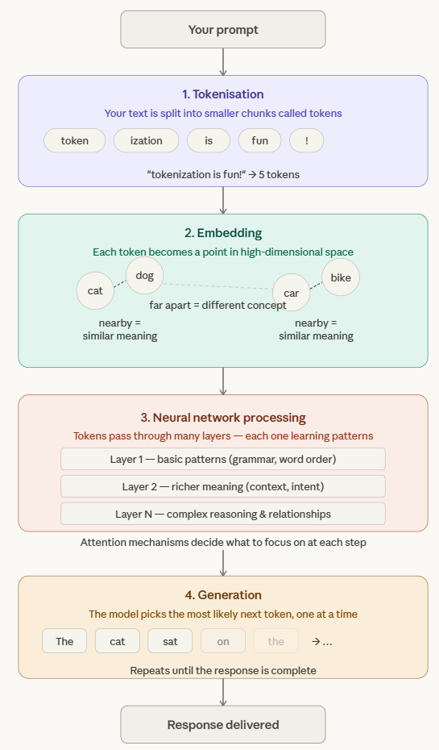<figcaption><p>Under the hood with a Chatbot</p></figcaption></figure>

> **Note:** 
>
> **Tokenisation** is just the model chopping your message up into manageable pieces. Not always whole words — sometimes syllables or punctuation get their own token. It's a standardisation step before any real processing happens.
>
> **Embedding** is where it gets interesting. Each token gets mapped to a point in a vast mathematical space, where meaning is encoded as position. Words with similar meanings literally end up close together — that's how the model "knows" that *dog* and *cat* are more related than *dog* and *bicycle*.
>
> **Neural network processing** is the heavy lifting. Your tokens flow through layer after layer of the transformer, with each layer building a richer understanding. Early layers catch basic patterns; deeper layers grasp context, nuance, and intent. The attention mechanism is what lets the model link words that are far apart in a sentence — deciding which parts of your prompt are most relevant to each other.
>
> **Generation** is where the output is built up one token at a time. The model doesn't write the whole sentence in one go — it predicts the single most probable next token, appends it, then repeats. That's why LLMs can feel like they're "thinking out loud."

---

> **Warning:**
>
> #### Workshops - Key Concepts
>
> To understand how to start building out your Chatbot, there's a couple of key concepts to get up to speed on..
>
> * Prompts
> * Tokenization
> * Embedding
> * Transformers

:::: tabs

### Prompt

> **Note:**
>
> #### Prompt
> 
> When a user inputs a prompt, an embedding model processes the text, converting into a numerical vectors.&#x20;
> 
> The vector is then passed through the transformer architecture, which generates a probability distribution over the possible words or phrases that could follow the input.&#x20;
> 
> Finally, based on a bunch of stats - semantic similarity, entropy metrics, perplexity, etc - the model then generates a response.

1. Take a look at the Python script below.

```python
import numpy as np  # For numerical operations and array handling
import matplotlib.pyplot as plt  # For creating visualizations
from sklearn.decomposition import PCA  # For dimensionality reduction (though not used in current code)
import textwrap  # For wrapping text in visualizations
import os  # For file and directory operations
import ollama  # Official Ollama Python client for interacting with Ollama API
from datetime import datetime  # For timestamping output files

def ensure_output_directory():
    """
    Create output directory for visualizations if it doesn't exist.
    
    This function checks if the 'embedding_visualizations' directory exists,
    and creates it if it doesn't. This ensures we have a place to save
    our visualization outputs without raising errors.
    
    Returns:
        str: Path to the output directory
    """
    output_dir = "embedding_visualizations"
    if not os.path.exists(output_dir):
        os.makedirs(output_dir)
        print(f"Created output directory: {output_dir}")
    return output_dir

def save_plot(plt, filename):
    """
    Save the current matplotlib plot to the visualizations directory with timestamp.
    
    This function:
    1. Gets the output directory path
    2. Generates a unique filename with timestamp
    3. Saves the current matplotlib figure
    4. Closes the plot to free up memory
    
    Args:
        plt: The matplotlib pyplot object
        filename (str): Base name for the output file (will be appended with timestamp)
    """
    output_dir = ensure_output_directory()
    # Add timestamp to filename to prevent overwriting previous visualizations
    # Format: YYYYMMDD_HHMMSS (e.g., 20250301_143042)
    timestamp = datetime.now().strftime("%Y%m%d_%H%M%S")
    full_path = os.path.join(output_dir, f"{filename}_{timestamp}.png")
    plt.savefig(full_path)  # Save the figure to the specified path
    print(f"Saved visualization to: {full_path}")
    plt.close()  # Close the plot to free up memory and prevent display overlap

def create_embedding(text, client):
    """
    Create an embedding for the given text using Ollama's llama3.2:latest model.
    
    This function uses the Ollama Python client to generate an embedding vector
    for the provided text. Embeddings are numerical representations of text that
    capture semantic meaning in a high-dimensional vector space.
    
    Args:
        text (str): The text to generate an embedding for
        client: Ollama client instance
    
    Returns:
        numpy.ndarray: The embedding vector as a numpy array
        
    Notes:
        - The model "llama3.2:latest" must be available in your Ollama installation
        - The returned embedding dimensions depend on the specific model
    """
    # Generate the embedding using the llama3.2:latest model
    response = client.embeddings(
        model="llama3.2:latest",  # Specify which model to use for embedding
        prompt=text  # The text input to embed
    )
    
    # The response contains the embedding data
    # Convert this to a numpy array for easier mathematical operations
    return np.array(response["embedding"])

def visualize_embedding_stats(embedding):
    """
    Create a visualization of basic statistics about the embedding vector.
    
    This function generates a comprehensive figure with three subplots
    that help analyze different aspects of the embedding vector:
    
    1. Distribution histogram - Shows the spread of values across the vector
    2. Dimension values plot - Shows patterns in the first 50 dimensions
    3. Statistical summary - Shows key numerical properties of the vector
    
    Args:
        embedding (numpy.ndarray): The embedding vector to visualize
    """
    plt.figure(figsize=(12, 4))  # Create a figure with specified width and height
    
    # Plot 1: Histogram of vector values
    plt.subplot(131)  # 1 row, 3 columns, 1st position
    plt.hist(embedding, bins=50)  # Create histogram with 50 bins for detail
    plt.title('Distribution of Vector Values')
    plt.xlabel('Value')
    plt.ylabel('Frequency')
    
    # Plot 2: First 50 dimensions of the vector
    plt.subplot(132)  # 1 row, 3 columns, 2nd position
    plt.plot(embedding[:50])  # Plot only first 50 dimensions for clarity
    plt.title('First 50 Dimensions')
    plt.xlabel('Dimension')
    plt.ylabel('Value')
    
    # Plot 3: Basic statistical summary
    # Calculate key statistics about the embedding vector
    stats = f"""
    Mean: {np.mean(embedding):.4f}
    Std: {np.std(embedding):.4f}
    Min: {np.min(embedding):.4f}
    Max: {np.max(embedding):.4f}
    Dimensions: {len(embedding)}
    """
    plt.subplot(133)  # 1 row, 3 columns, 3rd position
    plt.text(0.1, 0.5, stats, fontsize=10)  # Add text at specified position
    plt.axis('off')  # Hide axes for cleaner look
    plt.title('Vector Statistics')
    
    plt.tight_layout()  # Adjust spacing between subplots for better appearance
    save_plot(plt, "embedding_stats")  # Save the visualization

def compare_similar_texts(client):
    """
    Compare embeddings of semantically similar and different texts.
    
    This function demonstrates how embedding similarity correlates with
    semantic similarity between texts. It:
    
    1. Creates embeddings for a set of test phrases using Ollama
    2. Calculates cosine similarity between all possible pairs
    3. Visualizes the similarity matrix as a heatmap
    
    The test phrases include similar questions about France's capital,
    and a different question about Germany's capital to show contrast.
    This helps visualize how the embedding model captures semantic similarity.
    
    Args:
        client: Ollama client instance
    """
    # Define a set of test phrases to compare
    # First three are semantically related, fourth is different
    texts = [
        "What is the capital of France?",
        "Tell me France's capital city",
        "Paris is located in which country?",
        "What is the capital of Germany?"  # Different meaning
    ]
    
    # Create embeddings for all texts using the Ollama client
    print("Generating embeddings for comparison texts...")
    # List comprehension to get embeddings for each text in the list
    embeddings = [create_embedding(text, client) for text in texts]
    
    # Define cosine similarity calculation function
    def cosine_similarity(a, b):
        """
        Calculate the cosine similarity between two vectors.
        
        Cosine similarity is defined as the cosine of the angle between two vectors.
        It's a measure of similarity between -1 (opposite) and 1 (identical).
        For embeddings, higher values indicate more similar meanings.
        
        The formula is: cos(θ) = (a·b)/(||a||·||b||)
        
        Args:
            a (numpy.ndarray): First vector
            b (numpy.ndarray): Second vector
            
        Returns:
            float: Cosine similarity score between -1 and 1
        """
        # Numerator: dot product of the vectors
        dot_product = np.dot(a, b)
        # Denominator: product of the L2 norms (vector magnitudes)
        norm_product = np.linalg.norm(a) * np.linalg.norm(b)
        # Return the cosine of the angle between vectors
        return dot_product / norm_product
    
    # Calculate similarity matrix between all pairs of embeddings
    similarities = []
    print("Calculating similarity matrix...")
    for i in range(len(embeddings)):
        row = []
        for j in range(len(embeddings)):
            # Calculate similarity between embedding i and embedding j
            sim = cosine_similarity(embeddings[i], embeddings[j])
            row.append(f"{sim:.3f}")  # Format to 3 decimal places as string
        similarities.append(row)
    
    # Visualize the similarity matrix as a heatmap
    plt.figure(figsize=(10, 8))  # Create figure with adequate size for the heatmap
    
    # Convert string similarities back to float for visualization
    # The imshow function needs numerical values to create the heatmap
    plt.imshow([[float(x) for x in row] for row in similarities], cmap='YlOrRd')
    
    plt.colorbar()  # Add a color scale reference bar
    
    # Add text annotations showing exact similarity values in each cell
    for i in range(len(texts)):
        for j in range(len(texts)):
            plt.text(j, i, similarities[i][j], ha='center', va='center')
    
    # Add wrapped text labels for each axis
    # textwrap.fill breaks long text into multiple lines with specified width
    plt.xticks(range(len(texts)), [textwrap.fill(t, 15) for t in texts], rotation=45)
    plt.yticks(range(len(texts)), [textwrap.fill(t, 15) for t in texts])
    
    plt.title('Cosine Similarity Between Different Prompts')
    plt.tight_layout()  # Adjust layout to make room for rotated x-axis labels
    save_plot(plt, "similarity_matrix")  # Save the visualization

def get_ollama_client():
    """
    Create and configure an Ollama client.
    
    This function:
    1. Creates a default Ollama client
    2. Offers option to connect to a non-default Ollama server
    
    Returns:
        Ollama client instance
    """
    # Default Ollama server location
    default_host = "http://localhost:11434"
    
    print("\nOllama Connection Configuration")
    print("==============================")
    print(f"Default Ollama server address: {default_host}")
    
    # Ask if user wants to use a non-default Ollama server
    change_host = input("Connect to a different Ollama server? (y/N): ").lower()
    
    # Create client with specified host or default
    if change_host == 'y' or change_host == 'yes':
        custom_host = input("Enter Ollama server URL: ")
        if custom_host:
            client = ollama.Client(host=custom_host)
            print(f"Using Ollama server at {custom_host}")
        else:
            print(f"No URL provided, using default {default_host}")
            client = ollama.Client(host=default_host)
    else:
        client = ollama.Client(host=default_host)
        print(f"Using default Ollama server at {default_host}")
    
    return client

def main():
    """
    Main function to run the embedding visualization workflow.
    
    This function orchestrates the entire process:
    1. Creates and configures an Ollama client
    2. Creates an embedding for a test prompt
    3. Displays basic information about the embedding
    4. Visualizes the embedding statistics
    5. Compares embeddings of similar texts
    
    The workflow demonstrates:
    - How to use the Ollama Python client
    - How to work with embedding vectors
    - How to create informative visualizations
    - How semantic similarity is captured in the embedding space
    """
    print("Embedding Visualization with Ollama and llama3.2:latest")
    print("======================================================")
    print("This script will generate embeddings using Ollama and create")
    print("visualizations to help understand the embedding properties.")
    
    # Create and configure the Ollama client
    client = get_ollama_client()
    
    try:
        # Test prompt for embedding
        text_prompt = "What is the capital of France?"
        print(f"\nCreating embedding for: '{text_prompt}'")
        
        # Create and analyze the embedding
        print("Requesting embedding from Ollama API...")
        embedding = create_embedding(text_prompt, client)
        
        # Display basic information about the embedding
        print(f"\nEmbedding shape: {embedding.shape}")
        print(f"Number of dimensions: {len(embedding)}")
        print("\nFirst 10 dimensions of the embedding vector:")
        print(embedding[:10])
        
        # Create visualizations
        print("\nVisualizing embedding statistics...")
        visualize_embedding_stats(embedding)
        
        # Compare similar texts
        print("\nComparing similar texts...")
        compare_similar_texts(client)
        
        print("\nAll visualizations completed successfully!")
        print("Check the 'embedding_visualizations' directory for output files.")
        
    except Exception as e:
        print(f"\nError: {str(e)}")
        print("\nTroubleshooting steps:")
        print("=====================")
        print("1. Ensure Ollama is installed and running")
        print("   - Ollama can be installed from https://ollama.com")
        print("   - Check if the Ollama service is running on your system")
        print("\n2. Make sure the llama3.2:latest model is pulled")
        print("   - Run 'ollama pull llama3.2:latest' in your terminal")
        print("   - This may take some time depending on your internet connection")
        print("\n3. Verify the API host is correct")
        print("   - Check for typos in the URL")
        print("   - Ensure the protocol (http://) is included")
        print("   - Confirm the port number is correct (usually 11434)")
        print("\n4. Check that the Ollama Python package is installed")
        print("   - Run 'pip install ollama' in your environment")
        print("   - Ensure you're using the Python environment as your other packages")
        print(f"\nDetailed error: {type(e).__name__}: {str(e)}")

if __name__ == "__main__":
    """
    Entry point of the script.
    
    This conditional ensures the main() function is only executed when 
    the script is run directly (not when imported as a module).
    """
    main()
```

> **Note:** When you run this script, it will:
> 
> 1. The user is prompted to connect to the Ollama server - N (local Ollama server)
> 2. A text prompt "What is the capital of France?" is defined.
> 3. An embedding for the given text prompt is created using the `create_embedding(text, client)` function and Ollama' s text-embedding model.
> 4. The shape (dimensions) and first 10 dimensions of the resulting embedding vector are printed to provide an overview.
> 5. Basic statistics about the embedding vector such as mean, standard deviation, minimum value, and maximum value are calculated and visualized using a histogram plot, line plot, and text summary in a single figure. The visualization is saved as a timestamped PNG file.
> 6. A comparison of different text prompts' embeddings is made to demonstrate how similar or dissimilar the text inputs are based on their vector representations. This comparison results in a cosine similarity matrix, which is then visualized with text annotations and saved as another PNG file.

***

#### Run Python script - prompt.py

1. Navigate to: Workshop--LLM/'Key Concepts'/ directory.

```bash
cd
cd Workshop--LLM/'Key Concepts'/
```

2. Run the script.

```python
uv run prompt.py
```

<figure>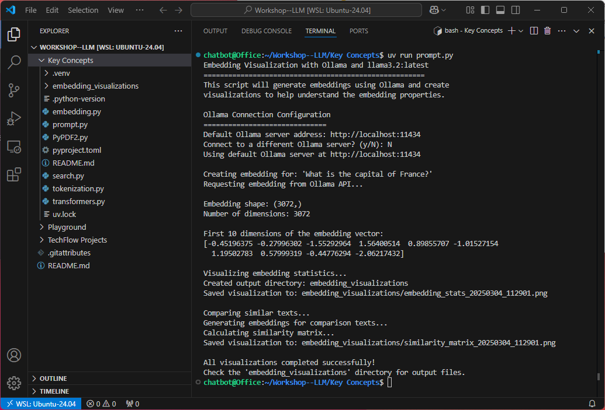<figcaption><p>Output - prompt.py</p></figcaption></figure>

> **Note:** So what does this all mean ..?
> 
> So we're starting in the deep end .. basically we're taking a prompt - text input in this case - and creating a bunch of vectors (embedding) - a mathematical representation of the prompt. This is then compared with similar texts - vectors - to get an idea of how text can be generated based&#x20;
> 
> A prompt is a way of providing guidelines to how the model responds. The context of the prompt is achieved by splitting the prompt into a number of words that are in a specific structure and format.&#x20;

::: tabs

### Embedding Stats

Take a look at the embedding\_stats graphs:

<figure>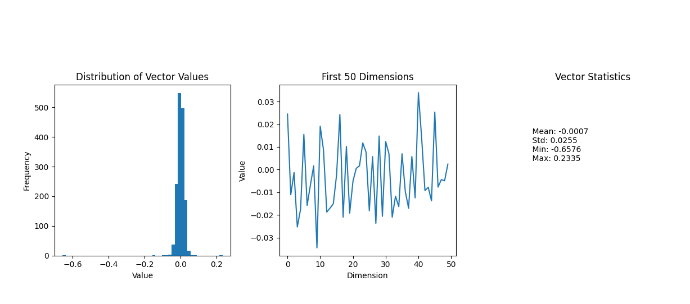<figcaption><p>Embedding Stats</p></figcaption></figure>

> **Note:** The embedding analysis of the prompt "What is the capital of France?" reveals some interesting characteristics about how this question is represented in the AI model's vector space. This 1536-dimensional vector essentially transforms the text question into a mathematical format that the AI can process.
> 
> Looking at the distribution plot (left graph), we can see that most of the vector values cluster tightly around zero, with a clear bell-shaped curve. This suggests that the question has a well-defined, standard representation - which makes sense given that it's a straightforward, common type of geographical question. The narrow spread indicates that the model doesn't need extreme values to encode this query's meaning.
> 
> The First 50 dimensions (right graph), displays the first 50 dimensions, with a more detailed view of how the information is encoded. The oscillating pattern between positive and negative values (roughly between -0.03 and 0.03) shows how different aspects of the question - perhaps the interrogative nature ("what is"), the concept of a capital city, and the specific country (France) - are distributed across different dimensions.
> 
> Some dimensions show stronger signals (bigger peaks), likely corresponding to key semantic elements of the question. The statistical summary (right) confirms this balanced representation, with a mean very close to zero (-0.0007) and a moderate standard deviation (0.0255), indicating that the embedding effectively captures the question's meaning without requiring extreme values in any particular dimension. This balanced, normalized representation helps the model accurately process and respond to this type of geographical query.

### Similarity Matrix

Take a look at the similarity\_matrix:

<figure>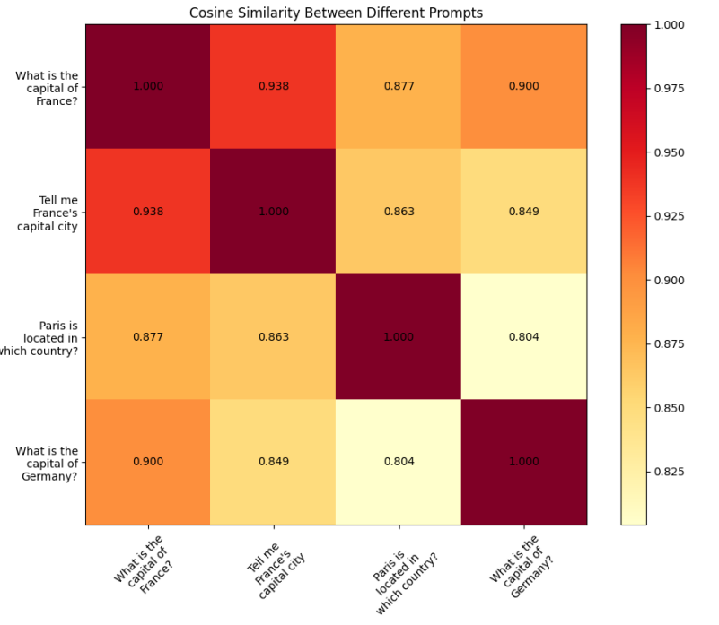<figcaption><p>similarity matrix of the different prompts</p></figcaption></figure>

> **Note:** This similarity matrix provides insights into how the embedding model understands and relates different questions about capital cities. Let's break down what the cosine similarity scores indicate:
> 
> The first two questions ("What is the capital of France?" and "Tell me France's capital city") show an extremely high similarity (0.938), which makes perfect sense as they're asking the same thing in slightly different ways. This demonstrates that the embedding model understands semantic equivalence even when the syntax differs.
> 
> The third question ("Paris is located in which country?") shows moderately high similarity with the France-related questions (0.877 and 0.863), but noticeably lower than the direct capital questions. This makes sense because while it involves the same entities (Paris and France), it reverses the relationship being asked about - instead of asking what the capital is, it's asking which country contains Paris.
> 
> Perhaps most interesting is how the model handles "What is the capital of Germany?" This question has relatively high similarity with the France capital questions (0.900 with the first question), despite being about a different country. This suggests the model recognizes the structural similarity of capital-city questions, while still maintaining enough difference to distinguish between different countries. The lower similarity (0.804) with the Paris question makes sense, as it's both about a different country and asks the relationship in a different direction.
> 
> The color gradient in the heatmap effectively visualizes these relationships, with the darkest reds showing perfect self-similarity (1.000) along the diagonal, bright reds for near-equivalent questions, and progressively lighter colors for questions that share less semantic content.

:::

x

### Tokenization

> **Note:**
>
> #### Tokenization
> 
> We've jumped ahead a bit with our prompt .. the OpenAI model - via API call -handled the important first step of Tokenization.
> 
> So .. it all begins begins with tokenization - essentially the model's way of breaking down text into manageable pieces. Think of it like cutting a sentence into puzzle pieces that the model can understand. Some tokenizers work at the word level, while others might split words into subwords or even individual characters.
> 
> These tokens then need to be converted into a format that the model can mathematically process. This is where embeddings come in. Each token is transformed into a vector - essentially a long list of numbers - that represents its meaning in a high-dimensional space.
> 
> The embedding process captures semantic relationships between tokens. Words with similar meanings will have similar vector representations. For instance, "cat" and "kitten" would have embeddings that are closer together in this vector space than "cat" and "automobile."
> 
> The quality of embeddings significantly impacts model performance. Good embeddings preserve meaningful relationships between concepts and allow the model to make relevant connections. Poor embeddings might lose important semantic distinctions or create misleading relationships between unrelated concepts.
> 
> Modern language models often learn their embeddings during pre-training. This allows them to develop nuanced representations that capture both obvious relationships and subtle distinctions in meaning. The embedding space becomes a rich semantic landscape where similar concepts cluster together and related ideas can be found in proximity to each other.
> 
> The interaction between tokenization and embedding is crucial. A token that's too large (like a whole phrase) might lose important nuances in its embedding. Conversely, tokens that are too small (like individual letters) might fail to capture meaningful semantic units. Finding the right balance is key to effective language model performance.
> 
> Context windows in language models are typically measured in tokens, not raw text. This means that both tokenization and embedding strategies directly impact how much information can be processed in a single prompt. Efficient tokenization can help maximize the effective use of this context window.

<figure>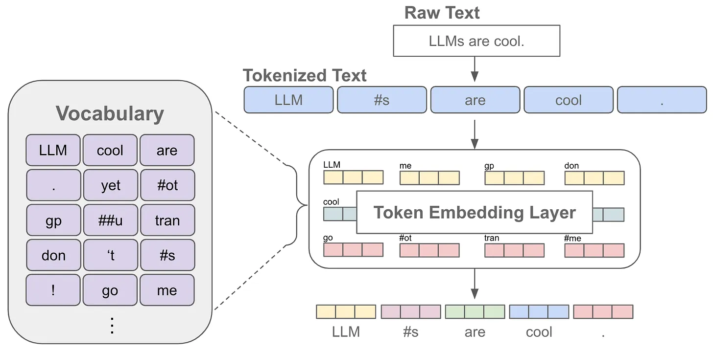<figcaption><p>Tokenization</p></figcaption></figure>

1. Take a look at the Python script below:

```python
import numpy as np
import matplotlib.pyplot as plt
import tiktoken
import textwrap
from sklearn.decomposition import PCA
import os
from datetime import datetime

def ensure_output_directory():
    """Create and return the output directory path with timestamp."""
    base_dir = "tokenization_analysis"
    timestamp = datetime.now().strftime("%Y%m%d_%H%M%S")
    output_dir = os.path.join(base_dir, f"analysis_{timestamp}")
    if not os.path.exists(output_dir):
        os.makedirs(output_dir)
    return output_dir

def save_plot(plt, output_dir, filename):
    """Save the current plot to the visualizations directory."""
    full_path = os.path.join(output_dir, filename)
    plt.savefig(full_path)
    print(f"Saved visualization to: {full_path}")
    plt.close()

def explore_vocabulary(output_dir, encoding_name="cl100k_base", n_samples=20):
    """Explore and visualize the tokenizer vocabulary."""
    enc = tiktoken.get_encoding(encoding_name)
    
    # Get the vocabulary dictionary
    vocab_dict = {}
    for i in range(100000):  # Sample a range of token IDs
        try:
            token_bytes = enc.decode_single_token_bytes(i)
            token_text = token_bytes.decode('utf-8', errors='replace')
            vocab_dict[i] = token_text
        except:
            continue
        if len(vocab_dict) >= n_samples:
            break
    
    # Save vocabulary sample to a text file
    vocab_file = os.path.join(output_dir, "vocabulary_sample.txt")
    with open(vocab_file, 'w', encoding='utf-8') as f:
        f.write(f"Sample of {encoding_name} vocabulary:\n")
        f.write("-" * 50 + "\n")
        for token_id, token_text in list(vocab_dict.items())[:n_samples]:
            f.write(f"Token ID: {token_id:5d} | Token Text: '{token_text}'\n")
    
    print(f"Vocabulary sample saved to: {vocab_file}")

def analyze_token_mapping(text, output_dir, encoding_name="cl100k_base"):
    """Analyze how text is mapped to tokens and back."""
    enc = tiktoken.get_encoding(encoding_name)
    tokens = enc.encode(text)
    
    # Save analysis to a text file
    analysis_file = os.path.join(output_dir, f"token_mapping_{text[:20]}.txt")
    with open(analysis_file, 'w', encoding='utf-8') as f:
        f.write(f"Token mapping analysis for: '{text}'\n")
        f.write("-" * 50 + "\n")
        f.write("Step 1: Text to Tokens\n")
        f.write(f"Original text: {text}\n")
        f.write(f"Token IDs: {tokens}\n\n")
        
        f.write("Step 2: Individual Token Analysis\n")
        for i, token in enumerate(tokens):
            token_text = enc.decode([token])
            f.write(f"Position {i+1}: Token ID {token:5d} → '{token_text}'\n")
        
        f.write("\nStep 3: Reconstruction\n")
        reconstructed = enc.decode(tokens)
        f.write(f"Reconstructed text: {reconstructed}\n")
        f.write(f"Matches original: {text == reconstructed}\n")
    
    print(f"Token mapping analysis saved to: {analysis_file}")

def visualize_tokenization(text, output_dir, filename):
    """Visualize how the text is broken down into tokens."""
    enc = tiktoken.get_encoding("cl100k_base")
    tokens = enc.encode(text)
    token_texts = [enc.decode([token]) for token in tokens]
    
    plt.figure(figsize=(15, 4))
    for i, (token, text) in enumerate(zip(tokens, token_texts)):
        plt.plot([i, i+1, i+1, i, i], [0, 0, 1, 1, 0], 'b-')
        plt.text(i + 0.5, 0.5, f'"{text}"', ha='center', va='center')
        plt.text(i + 0.5, -0.2, str(token), ha='center', va='center', color='red')
    
    plt.xlim(-0.2, len(tokens) + 0.2)
    plt.ylim(-0.5, 1.5)
    plt.title('Text Tokenization Visualization')
    plt.axis('off')
    plt.tight_layout()
    save_plot(plt, output_dir, filename)

def compare_tokenization_variations(texts, output_dir, filename):
    """Compare tokenization of similar texts."""
    enc = tiktoken.get_encoding("cl100k_base")
    plt.figure(figsize=(15, len(texts) * 2))
    
    for idx, text in enumerate(texts):
        tokens = enc.encode(text)
        token_texts = [enc.decode([token]) for token in tokens]
        
        for i, (token, token_text) in enumerate(zip(tokens, token_texts)):
            plt.plot([i, i+1, i+1, i, i], 
                    [idx, idx, idx+1, idx+1, idx], 'b-')
            plt.text(i + 0.5, idx + 0.5, f'"{token_text}"', 
                    ha='center', va='center', fontsize=8)
            plt.text(i + 0.5, idx + 0.2, str(token), 
                    ha='center', va='center', color='red', fontsize=6)
    
    plt.yticks(np.arange(len(texts)) + 0.5, texts)
    plt.title('Comparison of Tokenization Across Similar Texts')
    plt.axis('off')
    plt.tight_layout()
    save_plot(plt, output_dir, filename)

def analyze_token_stats(texts, output_dir, filename):
    """Analyze and visualize tokenization statistics."""
    enc = tiktoken.get_encoding("cl100k_base")
    token_counts = [len(enc.encode(text)) for text in texts]
    
    plt.figure(figsize=(10, 5))
    plt.bar(range(len(texts)), token_counts)
    plt.xticks(range(len(texts)), [textwrap.fill(t, 20) for t in texts], rotation=45)
    plt.ylabel('Number of Tokens')
    plt.title('Token Count Comparison')
    plt.tight_layout()
    save_plot(plt, output_dir, filename)

def compare_encodings(output_dir):
    """Compare different tiktoken encodings."""
    sample_text = "OpenAI develops GPT-4, an advanced AI model!"
    encodings = [
        "cl100k_base",  # ChatGPT
        "p50k_base",    # GPT-3
        "r50k_base"     # Earlier models
    ]
    
    # Save comparison to a text file
    comparison_file = os.path.join(output_dir, "encoding_comparison.txt")
    with open(comparison_file, 'w', encoding='utf-8') as f:
        f.write("Comparing different encodings:\n")
        f.write("-" * 50 + "\n")
        for encoding_name in encodings:
            enc = tiktoken.get_encoding(encoding_name)
            tokens = enc.encode(sample_text)
            f.write(f"\n{encoding_name}:\n")
            f.write(f"Number of tokens: {len(tokens)}\n")
            f.write("Token breakdown:\n")
            for token in tokens:
                f.write(f"  {token:5d} → '{enc.decode([token])}'\n")
    
    print(f"Encoding comparison saved to: {comparison_file}")

def main():
    # Create output directory with timestamp
    output_dir = ensure_output_directory()
    print(f"\nAnalysis results will be saved to: {output_dir}")
    
    # Explore vocabulary first
    print("\nExploring tokenizer vocabulary...")
    explore_vocabulary(output_dir)
    
    # Example texts for analysis
    examples = [
        "OpenAI",
        "machine learning",
        "https://example.com",
        "Python3.9",
        "Hello, world!"
    ]
    
    # Analyze each example
    for example in examples:
        analyze_token_mapping(example, output_dir)
    
    # Create visualizations
    print("\nGenerating visualizations...")
    
    # Basic text examples
    texts = [
        "What is the capital of France?",
        "Tell me France's capital city",
        "Paris is located in which country?",
        "What is the capital of Germany?"
    ]
    
    visualize_tokenization(texts[0], output_dir, "single_text_tokenization.png")
    compare_tokenization_variations(texts, output_dir, "text_comparison.png")
    analyze_token_stats(texts, output_dir, "token_stats.png")
    
    # Special cases visualization
    compare_tokenization_variations(examples, output_dir, "special_cases.png")
    
    # Compare different encodings
    compare_encodings(output_dir)
    
    print(f"\nAll analysis results have been saved to: {output_dir}")

if __name__ == "__main__":
    main()
```

> **Note:**
>
> #### Script Walkthrough
> 
> When you run this script, it will:
> 
> 1. Explore and analyze the tokenizer's vocabulary by saving information about the vocabulary to a text file in the output directory.
> 2. Analyze individual texts for their token mapping by printing the token-to-text mappings for each input text.
> 3. Visualize how text is broken down into tokens by generating plots that show the tokenization process and saving these plots as images in the output directory.
> 4. Compare tokenization of similar texts to identify any differences or patterns in tokenization behavior. These comparisons are saved as plots in the output directory.
> 5. Analyze token statistics for a list of example texts by calculating statistics such as the number of tokens, average token length, and standard deviation of token length. The results of this analysis are saved as a plot in the output directory.
> 6. Compare different encodings available in tiktoken to identify any differences or patterns in encoding behavior. This comparison is saved as a text file in the output directory.

***

> **Warning:**
>
> #### Run Python script - tokenization.py
> 
> You do not need an OpenAI key to RUN the script.
> 
> The `tiktoken` library is a standalone tokenizer that can be installed and used independently. It's primarily used to count tokens and understand how text will be tokenized by OpenAI based models, but it doesn't make any API calls.

1. Navigate to: Workshop--LLM/'Key Concepts'/ directory.

```bash
cd
cd Workshop--LLM/'Key Concepts'/
```

2. Run the script.

```python
uv run tokenization.py
```

<figure>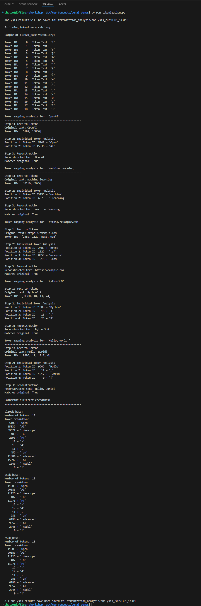<figcaption><p>output - tokenization</p></figcaption></figure>

> **Note:**
>
> #### What does it mean?
> 
> Ok ..  there's a lot going on here ..  but its pretty simple ..!!
> 
> The first section shows a sample of the base vocabulary from the cl100k\_base tokenizer, displaying basic tokens like punctuation marks and common characters. This demonstrates how the tokenizer breaks down text at its most fundamental level.
> 
> The analysis then examines several test cases, starting with "OpenAI". Interestingly, "OpenAI" is split into two tokens: "Open" (token ID 5169) and "AI" (token ID 16836). This shows how the tokenizer handles compound words by breaking them into meaningful subcomponents.
> 
> For "machine learning", the tokenizer also splits it into two tokens (IDs 13156 and 6972). This is a common pattern where frequently occurring compound phrases are tokenized as separate words, which helps maintain semantic meaning while keeping the vocabulary size manageable.
> 
> The URL example "<https://example.com>" demonstrates how the tokenizer handles special strings. It breaks the URL into four distinct tokens: "https", "://", "example", and ".com". This granular breakdown allows the model to recognize common URL patterns and components.
> 
> "Python3.9" is tokenized into four pieces: "Python", "3", ".", and "9". This shows how the tokenizer handles version numbers and technical strings by separating numbers, dots, and text into individual tokens.
> 
> The final comparison of different encodings (cl100k\_base, p50k\_base, and r50k\_base) is particularly interesting. While they all produced 13 tokens for the test phrase, they use different token IDs for the same components. This highlights how different encoding schemes can represent the same text differently while maintaining the ability to reconstruct the original input accurately.
> 
> What's particularly notable is that in all test cases, the "Matches original: True" confirmation shows that the tokenization process is reversible - the tokens can be correctly decoded back into the original text, which is crucial for maintaining text integrity in language models.

> **Note:**
>
> #### Tokenization Directory
> 
> Finally take a look at the output in the /tokenization\_plot directory. Here you'll find the tokenization of our prompt: "What is the capital of France?"

<figure>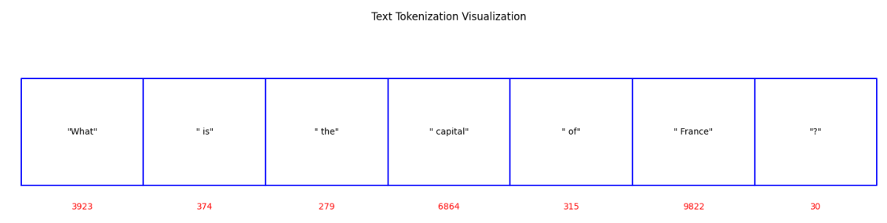<figcaption><p>Prompt tokenization</p></figcaption></figure>

<figure>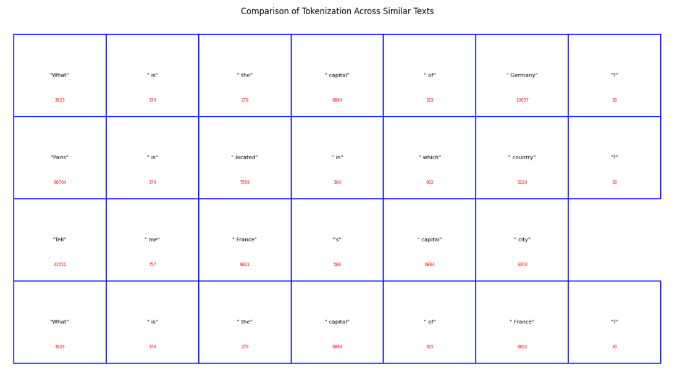<figcaption><p>Comparison of the tokenization of the different prompts</p></figcaption></figure>

<figure>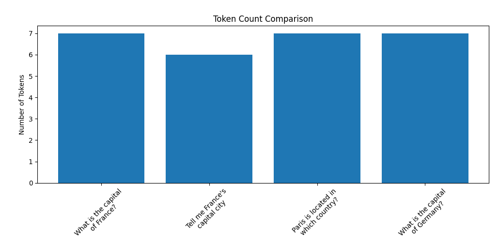<figcaption><p>Prompts - token counts</p></figcaption></figure>

### Embedding

> **Note:** Based on the TokenIDs we're now ready to create the embedding vectors - mathematically representations.
> 
> Why is embedding so important ..?
> 
> Its creating a numerical representation of a piece of text, such as a word, sentence, or paragraph. It is created by mapping the text to a high-dimensional vector space, where each **dimension** corresponds to a specific feature or attribute of the text.
> 
> For example, suppose we want to create an embedding for the word "orange". We might represent the word as a vector in a high-dimensional space, where each dimension represents a characteristic of the word, such as its size, color, or whether it is a noun or a verb, its position in the sentence, the localization, and so on .. its context ..
> 
> * Fruit: In the context of a discussion about fruit, "orange" would likely refer to the citrus fruit that is round and typically orange in color.
> * Color: In the context of discussing color, "orange" might refer to the color that is a mix of red and yellow, similar to the color of an orange fruit.
> * Juice: In the context of discussing beverages, "orange" might refer to orange juice, which is a popular drink made from squeezing the juice from oranges.
> * Clothing: In the context of discussing clothing, "orange" might refer to a garment or accessory that is colored orange.
> 
> By training a machine learning model on a large corpus of text, the model can learn to map words to vectors in such a way that words with similar meanings or contexts are mapped to similar vectors.

<div class="pcm-embed-card" data-href="https://platform.openai.com/docs/guides/embeddings/what-are-embeddings" data-title="platform.openai.com"></div>

1. Take a look at the Python script below:

````python
```python
import numpy as np  # For numerical operations and array handling
from typing import List, Dict, Tuple  # Type hints for better code documentation
import matplotlib
matplotlib.use('Agg')  # Set the backend to Agg for non-interactive environments (e.g., servers)
import matplotlib.pyplot as plt  # For creating visualizations
from sklearn.metrics.pairwise import cosine_similarity  # For calculating similarity between vectors
from sklearn.manifold import TSNE  # For dimensionality reduction to visualize high-dimensional data
import seaborn as sns  # For enhanced visualizations on top of matplotlib
import pandas as pd  # For data manipulation and analysis
import os  # For file and directory operations
from datetime import datetime  # For timestamping output files
import ollama  # Python client for interacting with Ollama API

class EmbeddingAnalyzer:
    """
    A class to analyze and visualize text embeddings using Ollama.
    
    This class provides methods to:
    - Generate embeddings for text using Ollama's llama3.2 model
    - Calculate similarities between texts
    - Visualize embedding properties and relationships
    - Create semantic search demonstrations
    """
    def __init__(self, output_dir: str, host: str = "http://localhost:11434"):
        """
        Initialize the analyzer with Ollama client and output directory.
        
        Args:
            output_dir: Directory to save visualizations and analysis results
            host: Ollama server host URL (default: http://localhost:11434)
        """
        # Initialize the Ollama client with the specified host
        self.client = ollama.Client(host=host)
        # Specify which Ollama model to use for embeddings
        self.model = "llama3.2:latest"
        # Cache to store embeddings to avoid regenerating for the same text
        self.cache: Dict[str, np.ndarray] = {}
        # Directory where all output files will be saved
        self.output_dir = output_dir
        
    def get_embedding(self, text: str) -> np.ndarray:
        """
        Generate an embedding vector for the input text, using cache if available.
        
        An embedding is a numerical representation of text in a high-dimensional space,
        where semantic meaning is captured by the relative positions of vectors.
        
        Args:
            text: The text to generate an embedding for
            
        Returns:
            A numpy array containing the embedding vector
        """
        # Check if embedding is already in cache to avoid redundant API calls
        if text in self.cache:
            return self.cache[text]
        
        # Request embedding from Ollama API    
        response = self.client.embeddings(
            model=self.model,  # Using the specified Ollama model
            prompt=text  # The text to embed
        )
        
        # Convert the embedding to numpy array for easier manipulation
        embedding = np.array(response["embedding"])
        
        # Store in cache for future use
        self.cache[text] = embedding
        
        return embedding
    
    def batch_embed(self, texts: List[str]) -> List[np.ndarray]:
        """
        Generate embeddings for multiple texts.
        
        Args:
            texts: List of text strings to embed
            
        Returns:
            List of numpy arrays, each containing an embedding vector
        """
        # Generate embeddings for each text in the list
        return [self.get_embedding(text) for text in texts]
    
    def calculate_similarity_matrix(self, texts: List[str]) -> np.ndarray:
        """
        Calculate pairwise similarities between all provided texts.
        
        This creates a matrix where each cell [i,j] contains the cosine similarity
        between the embeddings of texts[i] and texts[j].
        
        Args:
            texts: List of text strings to compare
            
        Returns:
            A 2D numpy array containing pairwise similarity scores
        """
        # Get embeddings for all texts
        embeddings = self.batch_embed(texts)
        
        # Stack vectors vertically to create a 2D matrix
        # Each row is an embedding vector for one text
        embeddings_matrix = np.vstack(embeddings)
        
        # Calculate cosine similarity between all pairs of vectors
        # Output is a square matrix of size len(texts) × len(texts)
        return cosine_similarity(embeddings_matrix)
    
    def save_plot(self, plt, filename: str) -> str:
        """
        Save plot to the output directory.
        
        Args:
            plt: Matplotlib plot object to save
            filename: Name of the file to save the plot as
            
        Returns:
            Full path to the saved file
        """
        # Create full path for the output file
        full_path = os.path.join(self.output_dir, filename)
        
        # Save the figure to the specified path
        plt.savefig(full_path)
        
        # Close the plot to free memory
        plt.close()
        
        print(f"Saved visualization to: {full_path}")
        return full_path
    
    def visualize_similarities(self, texts: List[str], labels: List[str] = None, filename: str = 'similarity_heatmap.png'):
        """
        Create a heatmap visualization of text similarities and save to file.
        
        Args:
            texts: List of text strings to compare
            labels: Optional labels for each text (default: numbered indices)
            filename: Name of the output file
        """
        # Calculate the similarity matrix for all texts
        similarity_matrix = self.calculate_similarity_matrix(texts)
        
        # Create figure with appropriate size
        plt.figure(figsize=(10, 8))
        
        # Create heatmap using seaborn
        sns.heatmap(
            similarity_matrix,
            annot=True,  # Show the similarity values in each cell
            fmt='.2f',   # Format as 2 decimal places
            cmap='YlOrRd',  # Color map: yellow to orange to red (higher values are redder)
            xticklabels=labels or range(len(texts)),  # Use provided labels or default to indices
            yticklabels=labels or range(len(texts))
        )
        
        # Add title and adjust layout
        plt.title('Semantic Similarity Heatmap')
        plt.tight_layout()
        
        # Save the visualization
        self.save_plot(plt, filename)
    
    def visualize_embedding_clusters(self, texts: List[str], labels: List[str] = None, filename: str = 'embedding_clusters.png'):
        """
        Create a 2D visualization of embedding clusters using t-SNE dimensionality reduction.
        
        This visualizes how different texts relate to each other in the embedding space
        by projecting the high-dimensional embeddings down to 2D.
        
        Args:
            texts: List of text strings to visualize
            labels: Optional category labels for each text
            filename: Name of the output file
        """
        # Get embeddings for all texts
        embeddings = self.batch_embed(texts)
        
        # Stack vectors vertically to create a 2D matrix
        embeddings_matrix = np.vstack(embeddings)
        
        # Calculate appropriate perplexity for t-SNE
        # Perplexity is related to the number of nearest neighbors used in the algorithm
        # It should be smaller than the number of points - 1
        n_samples = len(texts)
        perplexity = min(30, n_samples - 1)
        
        # Create t-SNE model for dimensionality reduction
        # t-SNE (t-Distributed Stochastic Neighbor Embedding) preserves local relationships
        tsne = TSNE(n_components=2, random_state=42, perplexity=perplexity)
        
        # Transform the high-dimensional embeddings to 2D points
        reduced_embeddings = tsne.fit_transform(embeddings_matrix)
        
        # Create DataFrame for easier plotting with seaborn
        df = pd.DataFrame(
            reduced_embeddings,
            columns=['x', 'y']  # 2D coordinates
        )
        # Add labels column for coloring points by category
        df['label'] = labels if labels else range(len(texts))
        
        # Create figure with appropriate size
        plt.figure(figsize=(12, 8))
        
        # Create scatter plot using seaborn
        # Points with the same label will have the same color and marker style
        sns.scatterplot(data=df, x='x', y='y', hue='label', style='label')
        
        # Add title and adjust layout
        plt.title('2D Visualization of Text Embeddings')
        plt.tight_layout()
        
        # Save the visualization
        self.save_plot(plt, filename)

def ensure_output_directory() -> str:
    """
    Create and return the output directory path with timestamp.
    
    Creates a unique directory for each run of the script to prevent
    overwriting previous results.
    
    Returns:
        Full path to the created output directory
    """
    # Base directory for all analysis outputs
    base_dir = "embedding_analysis"
    
    # Generate timestamp for unique directory name
    timestamp = datetime.now().strftime("%Y%m%d_%H%M%S")
    
    # Create full path with timestamp
    output_dir = os.path.join(base_dir, f"analysis_{timestamp}")
    
    # Create directory if it doesn't exist
    if not os.path.exists(output_dir):
        os.makedirs(output_dir)
    
    return output_dir

def get_ollama_host() -> str:
    """
    Prompt for Ollama host URL with default option.
    
    Allows connecting to either the default local Ollama server
    or a custom server specified by the user.
    
    Returns:
        Host URL for the Ollama API
    """
    # Default local Ollama server URL
    default_host = "http://localhost:11434"
    
    print("\nOllama Configuration")
    print("===================")
    print(f"Default Ollama server: {default_host}")
    
    # Ask if user wants to use a different server
    use_custom = input("Use a different Ollama server? (y/N): ").lower()
    
    if use_custom in ('y', 'yes'):
        # Get custom host URL
        host = input(f"Enter Ollama server URL: ")
        # Use provided URL or fall back to default if empty
        return host if host else default_host
    
    return default_host

def save_analysis_results(output_dir: str, results: str):
    """
    Save analysis results to a text file.
    
    Args:
        output_dir: Directory to save the file in
        results: Text content to save
    """
    # Create full path for the output file
    filename = os.path.join(output_dir, "analysis_results.txt")
    
    # Write results to file
    with open(filename, 'w', encoding='utf-8') as f:
        f.write(results)
    
    print(f"Analysis results saved to: {filename}")

def demonstrate_embeddings():
    """
    Demonstrate various applications and properties of embeddings.
    
    This function showcases different ways embeddings can be used:
    1. Measuring semantic similarity between texts
    2. Clustering texts by topic
    3. Analyzing embedding vector properties
    4. Performing semantic search
    """
    # Create output directory for this run
    output_dir = ensure_output_directory()
    print(f"\nAnalysis results will be saved to: {output_dir}")
    
    # Get Ollama host configuration
    host = get_ollama_host()
    
    try:
        # Initialize analyzer with Ollama
        print(f"\nInitializing EmbeddingAnalyzer with Ollama (model: llama3.2:latest)")
        analyzer = EmbeddingAnalyzer(output_dir, host)
        
        # Example 1: Basic Semantic Similarity
        # This demonstrates how embeddings capture semantic relationships
        print("\nExample 1: Basic Semantic Similarity")
        similar_texts = [
            "What is the capital of France?",
            "Tell me the capital city of France",
            "Which city serves as France's capital?",
            "What's the largest city in France?",
            "What's the weather like in Paris?"
        ]
        # Create heatmap of similarities between these related texts
        analyzer.visualize_similarities(
            similar_texts, 
            labels=[f"Text {i+1}" for i in range(len(similar_texts))],
            filename="similarity_heatmap.png"
        )
        
        # Example 2: Topic Clustering
        # This demonstrates how embeddings group semantically related concepts
        print("\nExample 2: Topic Clustering")
        mixed_topics = [
            # Technology
            "How do computers process information?",
            "What is artificial intelligence?",
            "How does machine learning work?",
            # Sports
            "Who won the last World Cup?",
            "What are the rules of basketball?",
            "How do you play tennis?",
            # Cooking
            "What's the best way to cook pasta?",
            "How do you make chocolate cake?",
            "What are common cooking spices?"
        ]
        # Create labels for each topic category
        topic_labels = ["Tech"]*3 + ["Sports"]*3 + ["Cooking"]*3
        
        # Visualize how these topics cluster in the embedding space
        analyzer.visualize_embedding_clusters(
            mixed_topics, 
            labels=topic_labels,
            filename="embedding_clusters.png"
        )
        
        # Example 3: Embedding Properties Analysis
        # This demonstrates the statistical properties of embedding vectors
        print("\nExample 3: Analyzing Embedding Properties")
        sample_text = "This is a sample text for analyzing embedding properties."
        embedding = analyzer.get_embedding(sample_text)
        
        # Create histogram of embedding values
        plt.figure(figsize=(10, 5))
        plt.hist(embedding, bins=50)
        plt.title("Distribution of Embedding Values")
        plt.xlabel("Value")
        plt.ylabel("Frequency")
        plt.tight_layout()
        analyzer.save_plot(plt, 'embedding_distribution.png')
        
        # Collect statistical properties of the embedding
        stats = f"""Embedding Analysis Results
        -------------------------
        Sample Text: "{sample_text}"
        Model: {analyzer.model}
        
        Embedding Statistics:
        - Dimensionality: {len(embedding)} dimensions
        - Mean value: {np.mean(embedding):.4f}
        - Standard deviation: {np.std(embedding):.4f}
        - Vector magnitude: {np.linalg.norm(embedding):.4f}
        """
        
        # Example 4: Semantic Search
        # This demonstrates using embeddings for finding similar documents
        print("\nExample 4: Semantic Search Demo")
        documents = [
            "The quick brown fox jumps over the lazy dog",
            "A fast auburn canine leaps across a sleepy hound",
            "The cat chases the mouse in the garden",
            "A feline pursues a rodent through the flowers",
            "The weather is sunny and warm today",
        ]
        # Query to search for
        query = "A fox jumping over a dog"
        query_embedding = analyzer.get_embedding(query)
        
        # Calculate similarity scores between query and all documents
        doc_embeddings = analyzer.batch_embed(documents)
        similarities = [
            cosine_similarity(query_embedding.reshape(1, -1), doc_emb.reshape(1, -1))[0][0]
            for doc_emb in doc_embeddings
        ]
        
        # Add search results to stats
        stats += "\nSemantic Search Results:\n"
        stats += f"Query: '{query}'\n\n"
        
        # Sort documents by similarity score (highest first)
        for doc, score in sorted(zip(documents, similarities), key=lambda x: x[1], reverse=True):
            stats += f"Score: {score:.4f} | Document: {doc}\n"
        
        # Save all analysis results to text file
        save_analysis_results(output_dir, stats)
        
        print("\nAnalysis complete! All visualizations and results have been saved.")
        
    except Exception as e:
        # Handle errors with helpful troubleshooting information
        print(f"\nError: {str(e)}")
        print("\nTroubleshooting steps:")
        print("1. Ensure Ollama is installed and running (see https://ollama.com)")
        print("2. Check if the llama3.2:latest model is pulled (`ollama pull llama3.2:latest`)")
        print("3. Verify the Ollama server URL is correct")
        print("4. Make sure the ollama Python package is installed (`pip install ollama`)")
        print(f"\nError details: {type(e).__name__}: {str(e)}")

if __name__ == "__main__":
    # Entry point of the script
    # This ensures the script only runs when executed directly, not when imported
    demonstrate_embeddings()
```
````

> **Note:** * define the EmbeddingAnalyzer class that encapsulates embedding operations
> * set up the Ollama client with either default or custom host URL
> * analyze the results to calculate similarities

***

#### Run Python script - embedding.py

1. Navigate to: Workshop--LLM/'Key Concepts'/ directory.

```bash
cd
cd Workshop--LLM/'Key Concepts'/
```

2. Run the script.

```python
uv run embedding.py
```

<figure>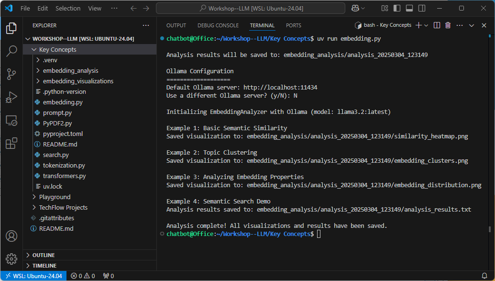<figcaption><p>Out - embedding.py</p></figcaption></figure>

> **Note:** So what does this all mean ?
> 
> Jumping ahead a bit you can see how the heatmap - Semantic Similarity - adds context. It defines the semantic relationship between the words in the prompts.&#x20;
> 
> This becomes clearer with topic clustering - each topic is clearly separated - which helps pinpoint the vector cluster in the model that will help generate a response.

::: tabs

### Semantic Similarity

Take a look at the similarity\_heatmap graph:

```
Text 1: "What is the capital of France?",
Text 2: "Tell me the capital city of France",
Text 3: "Which city serves as France's capital?",
Text 4: "What's the largest city in France?",
Text 5: "What's the weather like in Paris?"
```

<figure>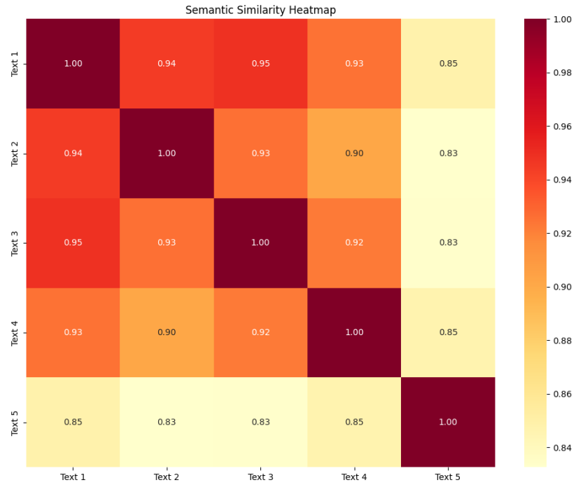<figcaption><p>Similarity matrix</p></figcaption></figure>

> **Note:** Basically the same as discussed in the 'Prompt' section ..
> 
> This heatmap visualizes how similar different phrases are to each other, using data from OpenAI's text embedding model. The darkness and numbers in each square show how closely related two pieces of text are - with darker reds showing stronger relationships (closer to 1.0) and lighter yellows showing weaker relationships (closer to 0.8).
> 
> Looking at the pattern, we can see that the first three texts are very closely related (showing dark red with scores around 0.93-0.95), suggesting they're asking similar questions. The fourth text is also fairly similar to these first three but slightly less so. The fifth text stands out as being the most different from all others, showing consistently lighter colors (scores around 0.83-0.85) across its row and column.
> 
> This kind of visualization is particularly useful for understanding how language models group similar concepts together and distinguish between different topics, even when they share some common elements or words.

### Topic Clustering

Take a look at the embedding\_clusters graph:

> **Note:** This visualization shows how different topics cluster together when their text embeddings are reduced to 2D space using t-SNE (as implemented in the code's visualize\_embedding\_clusters method). Each point represents a question or statement, color-coded into three categories: Tech (blue dots), Sports (orange X's), and Cooking (green squares).
> 
> The plot demonstrates clear topic separation, with tech-related questions clustering in the lower portion of the plot, sports questions scattered across the middle, and cooking-related queries grouped in the upper region. This clustering shows how the embedding model effectively captures the semantic relationships between similar topics, keeping related concepts close together in the vector space while separating different subject matters.
> 
> From the code, we can see these points represent questions like "How do computers process information?" (Tech), "Who won the last World Cup?" (Sports), and "What's the best way to cook pasta?" (Cooking).
> 
> The clear separation between these clusters validates that the embedding model is successfully capturing the distinct semantic meanings of these different topics - content classification.

<figure>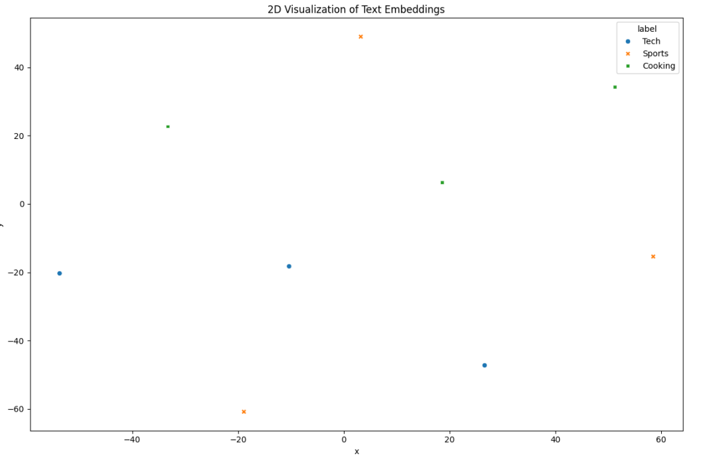<figcaption><p>Topic clustering</p></figcaption></figure>

### Analysis

Take a look at the embedding\_distribution graph:

```
Embedding Statistics:
Dimensionality: 1536 dimensions
Mean value: -0.0007
Standard deviation: 0.0255
Vector magnitude: 1.0000
```

<figure>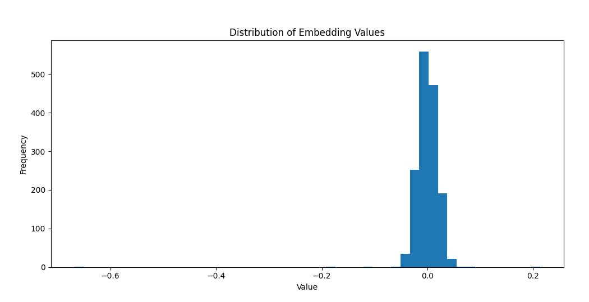<figcaption><p>Distribution of vectors</p></figcaption></figure>

> **Note:** Again this was discussed in the prompt section ..
> 
> But what is a dimension ..?
> 
> A text embedding with 1536 dimensions means that each piece of text is converted into a list of 1536 different numbers. Think of it like a very detailed fingerprint of the text, where each number captures a different aspect of its meaning. While we can easily picture things in 2 or 3 dimensions (like length, width, and height), this embedding uses many more dimensions to capture the rich complexity of language.
> 
> These 1536 numbers work together to represent subtle patterns in the text - everything from the topic and tone to the structure and style. When we want to compare two pieces of text, we can compare their 1536-dimensional fingerprints to see how similar they are, as we saw in the earlier heatmap. The high number of dimensions allows the model to be very precise in distinguishing between different types of text while recognizing similarities.
> 
> Since humans can't visualize 1536 dimensions, we use techniques to reduce it down to 2 dimensions for visualization - topic cluster plot. This is similar to taking a complex 3D object and drawing its shadow on a flat surface - you lose some detail, but you can still see the basic relationships between different points.

### Semantic Search

> **Note:** This digs a little deeper than our prompt example.  The model when being trained that there's a relationship between fox and canine - less of a relationship between fox and cat ..  less of a relationship between jumping, leaping, chasing and pursuing ..  and so on ..
> 
> The results of our semantic search is:
> 
> "The quick brown fox jumps over the lazy dog" is the closest semantic match to our query ..&#x20;

Here's our query:

```
query = "A fox jumping over a dog"
```

Here's our documents:

```
    documents = [
        "The quick brown fox jumps over the lazy dog",
        "A fast auburn canine leaps across a sleepy hound",
        "The cat chases the mouse in the garden",
        "A feline pursues a rodent through the flowers",
        "The weather is sunny and warm today",
    ]
```

The semantic search results:

```
Semantic Search Results:
Score: 0.9186 | Document: The quick brown fox jumps over the lazy dog
Score: 0.8975 | Document: A fast auburn canine leaps across a sleepy hound
Score: 0.8602 | Document: The cat chases the mouse in the garden
Score: 0.8511 | Document: A feline pursues a rodent through the flowers
Score: 0.7778 | Document: The weather is sunny and warm today
```

> **Note:** This semantic search example demonstrates how embedding-based search works by comparing a query ("A fox jumping over a dog") with five different documents. The results are ranked by their similarity scores, showing how well the embedding model understands semantic relationships beyond simple keyword matching.
> 
> The first two results score highest (0.9186 and 0.8975) because they're direct variations of the same concept - a fox/canine jumping/leaping over a dog/hound. The next two results score lower but still relatively high (0.8602 and 0.8511) because they share the concept of one animal chasing/pursuing another, even though they use different animals (cat/mouse and feline/rodent). The last result scores much lower (0.7778) because it's about weather, a completely unrelated topic.
> 
> This demonstrates how embeddings can capture meaning rather than just matching exact words. The model understands that "fox" and "canine" are related, that "jumps," "leaps," and even "chases" share similar action concepts, and that weather is a distinctly different topic, regardless of any shared words.

:::

### Search

> **Note:** We covered the concept of Semantic search in the Embedding section. The basic idea behind semantic search is to use the numerical representations (embeddings) of words and phrases to find other text data that has similar or related meanings. This is done by first tokenizing the text data into individual words or phrases, and then representing each token using its embedding. Once we have the embeddings for the tokens, we can compare them to find similar or related text data. However, that type of search is limiting.&#x20;
> 
> Modern Large Language Models employ several more sophisticated search approaches.

<figure>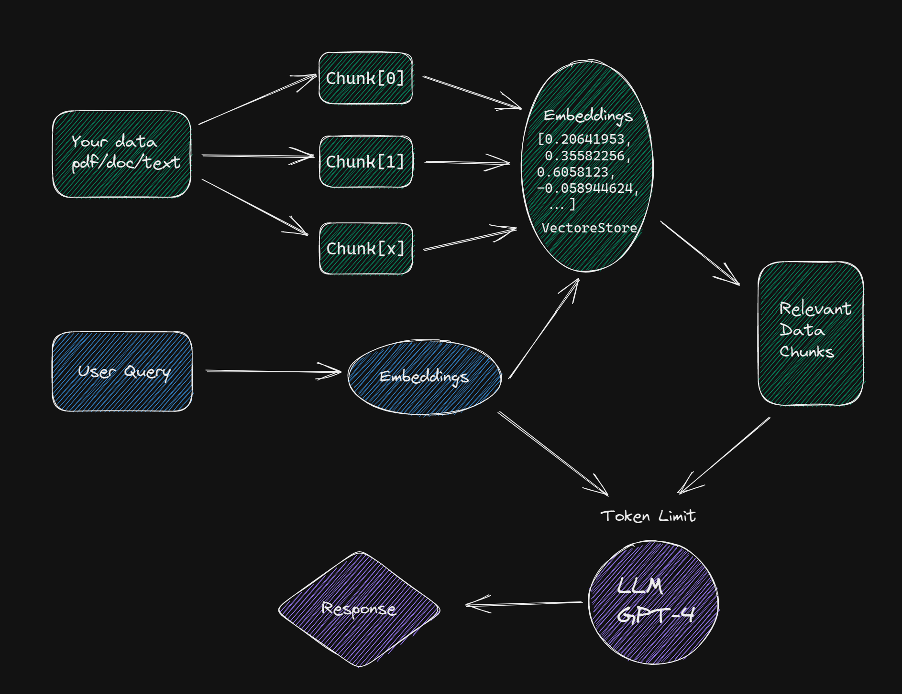<figcaption><p>Semantic search</p></figcaption></figure>

1. Take a look at the Python script below:

```python
import numpy as np  # For numerical operations and array handling
from typing import List, Dict, Tuple  # Type hints for better code documentation
import matplotlib.pyplot as plt  # For creating visualizations
from sklearn.metrics.pairwise import cosine_similarity  # For calculating similarity between vectors
from sklearn.manifold import TSNE  # For dimensionality reduction to visualize high-dimensional data
import seaborn as sns  # For enhanced visualizations on top of matplotlib
import pandas as pd  # For data manipulation and analysis
from collections import Counter  # For counting word frequencies in keyword search
import re  # For regular expressions to extract words
import os  # For file and directory operations
from datetime import datetime  # For timestamping output files
import ollama  # Python client for interacting with Ollama API

def ensure_output_directory() -> str:
    """
    Create and return the output directory path with timestamp.
    
    This function creates a unique directory for each run of the script
    to prevent overwriting previous results.
    
    Returns:
        str: Path to the created output directory
    """
    # Base directory for search analysis outputs
    base_dir = "search_analysis"
    
    # Generate timestamp for unique directory name
    timestamp = datetime.now().strftime("%Y%m%d_%H%M%S")
    
    # Create full path with timestamp
    output_dir = os.path.join(base_dir, f"analysis_{timestamp}")
    
    # Create directory if it doesn't exist
    if not os.path.exists(output_dir):
        os.makedirs(output_dir)
        print(f"Created output directory: {output_dir}")
        
    return output_dir

def get_ollama_host() -> str:
    """
    Prompt for Ollama host URL with default option.
    
    This function allows the user to specify a custom Ollama server
    or use the default localhost URL.
    
    Returns:
        str: Host URL for the Ollama API
    """
    # Default local Ollama server URL
    default_host = "http://localhost:11434"
    
    print("\nOllama Configuration")
    print("===================")
    print(f"Default Ollama server: {default_host}")
    
    # Ask if user wants to use a different server
    use_custom = input("Use a different Ollama server? (y/N): ").lower()
    
    if use_custom in ('y', 'yes'):
        # Get custom host URL
        host = input(f"Enter Ollama server URL: ")
        # Return provided URL or fall back to default if empty
        return host if host else default_host
    
    return default_host

class SearchComparator:
    """
    A class to compare traditional keyword search with embedding-based semantic search.
    
    This class provides methods to:
    - Generate embeddings using Ollama's llama3.2:latest model
    - Perform keyword-based search using term frequency
    - Perform vector-based semantic search using embeddings
    - Visualize and compare results from both search methods
    """
    
    def __init__(self, ollama_host: str, output_dir: str):
        """
        Initialize with Ollama host and output directory.
        
        Args:
            ollama_host: URL of the Ollama API server
            output_dir: Directory to save visualizations and analysis results
        """
        # Initialize the Ollama client with the specified host
        self.client = ollama.Client(host=ollama_host)
        
        # Specify which Ollama model to use for embeddings
        self.model = "llama3.2:latest"
        
        # Cache to store embeddings to avoid regenerating for the same text
        self.cache: Dict[str, np.ndarray] = {}
        
        # Directory where all output files will be saved
        self.output_dir = output_dir
        
    def get_search_type(self, query: str) -> str:
        """
        Determine the type of search based on the query.
        
        This helps categorize different types of searches for analysis and
        provides appropriate naming for output files.
        
        Args:
            query: The search query string
            
        Returns:
            str: A category name for the search type
        """
        # Map queries to search types for analysis and file naming
        search_types = {
            "A fox jumping over a dog": "direct_phrase_match",
            "Canines in natural habitats": "semantic_concept_match",
            "Sleeping animals outdoors": "mixed_concept_match",
            "Forest wildlife activity": "thematic_match"
        }
        # Return the mapped type or "custom_search" if not in the predefined list
        return search_types.get(query, "custom_search")
    
    def get_embedding(self, text: str) -> np.ndarray:
        """
        Generate an embedding vector for the input text using Ollama.
        
        This function uses caching to avoid redundant API calls for the same text.
        
        Args:
            text: The text to generate an embedding for
            
        Returns:
            numpy.ndarray: The embedding vector
        """
        # Check if embedding is already in cache to avoid redundant API calls
        if text in self.cache:
            return self.cache[text]
        
        # Request embedding from Ollama API
        response = self.client.embeddings(
            model=self.model,  # Using llama3.2:latest model
            prompt=text  # The text to embed
        )
        
        # Convert the embedding to numpy array for easier manipulation
        embedding = np.array(response["embedding"])
        
        # Store in cache for future use
        self.cache[text] = embedding
        
        return embedding
    
    def keyword_search(self, query: str, documents: List[str]) -> List[Tuple[str, float]]:
        """
        Perform traditional keyword-based search using term frequency.
        
        This simulates a simple TF (Term Frequency) based search by counting
        how many times each query word appears in each document.
        
        Args:
            query: The search query string
            documents: List of document strings to search
            
        Returns:
            List of (document, score) tuples, sorted by score in descending order
        """
        # Extract lowercase tokens (words) from the query
        query_tokens = set(re.findall(r'\w+', query.lower()))
        
        results = []
        for doc in documents:
            # Count frequency of all words in the document
            doc_tokens = Counter(re.findall(r'\w+', doc.lower()))
            
            # Score is the sum of frequencies of query words that appear in the document
            score = sum(doc_tokens[token] for token in query_tokens if token in doc_tokens)
            
            # Add document and its score to results
            results.append((doc, score))
        
        # Sort results by score in descending order (highest first)
        return sorted(results, key=lambda x: x[1], reverse=True)
    
    def vector_search(self, query: str, documents: List[str]) -> List[Tuple[str, float]]:
        """
        Perform vector-based semantic search using embeddings.
        
        This uses cosine similarity between the query embedding and each document
        embedding to find semantically similar documents.
        
        Args:
            query: The search query string
            documents: List of document strings to search
            
        Returns:
            List of (document, similarity_score) tuples, sorted by score in descending order
        """
        # Get embedding for the query
        query_embedding = self.get_embedding(query)
        results = []
        
        for doc in documents:
            # Get embedding for the document
            doc_embedding = self.get_embedding(doc)
            
            # Calculate cosine similarity between query and document embeddings
            # Reshape is needed because cosine_similarity expects 2D arrays
            similarity = cosine_similarity(
                query_embedding.reshape(1, -1), 
                doc_embedding.reshape(1, -1)
            )[0][0]
            
            # Add document and its similarity score to results
            results.append((doc, similarity))
        
        # Sort results by similarity score in descending order (highest first)
        return sorted(results, key=lambda x: x[1], reverse=True)
    
    def save_visualization(self, fig, search_type: str, viz_type: str) -> str:
        """
        Save visualization with appropriate naming.
        
        Args:
            fig: Matplotlib figure to save
            search_type: Category of the search (e.g., "direct_phrase_match")
            viz_type: Type of visualization (e.g., "comparison")
            
        Returns:
            str: Path to the saved file
        """
        # Create filename using search type and visualization type
        filename = f"{search_type}_{viz_type}.png"
        
        # Create full filepath in the output directory
        filepath = os.path.join(self.output_dir, filename)
        
        # Save the figure
        fig.savefig(filepath)
        
        # Close the figure to free memory
        plt.close(fig)
        
        return filepath
    
    def print_and_save_results(self, query: str, keyword_results: List[Tuple[str, float]], 
                             vector_results: List[Tuple[str, float]], search_type: str):
        """
        Print results to console and save to file.
        
        This function displays the top results from both search methods and
        saves the complete results to a text file.
        
        Args:
            query: The search query string
            keyword_results: Results from keyword search
            vector_results: Results from vector search
            search_type: Category of the search (for filename)
        """
        # Print to console
        print(f"\nAnalyzing search results for query: '{query}'")
        
        # Show top 3 keyword search results
        print("\nKeyword Search Results:")
        for doc, score in keyword_results[:3]:
            print(f"Score: {score:.4f} | {doc}")
        
        # Show top 3 vector search results
        print("\nVector Search Results:")
        for doc, score in vector_results[:3]:
            print(f"Score: {score:.4f} | {doc}")
        
        # Create filename for results text file
        filename = f"{search_type}_results.txt"
        filepath = os.path.join(self.output_dir, filename)
        
        # Save complete results to file
        with open(filepath, 'w', encoding='utf-8') as f:
            f.write(f"Search Results Analysis for Query: '{query}'\n")
            f.write("=" * 50 + "\n\n")
            
            # Write all keyword search results
            f.write("Keyword Search Results:\n")
            f.write("-" * 20 + "\n")
            for doc, score in keyword_results:
                f.write(f"Score: {score:.4f} | {doc}\n")
            
            # Write all vector search results
            f.write("\nVector Search Results:\n")
            f.write("-" * 20 + "\n")
            for doc, score in vector_results:
                f.write(f"Score: {score:.4f} | {doc}\n")
            
            # Add model information
            f.write("\n\nEmbedding Model: Ollama - " + self.model + "\n")
    
    def visualize_search_comparison(self, query: str, documents: List[str]):
        """
        Create visualizations comparing keyword and vector search results.
        
        This function runs both search methods and generates visualizations
        to compare their results.
        
        Args:
            query: The search query string
            documents: List of document strings to search
        """
        # Determine the type of search for categorization and file naming
        search_type = self.get_search_type(query)
        
        # Get search results from both methods
        keyword_results = self.keyword_search(query, documents)
        vector_results = self.vector_search(query, documents)
        
        # Print to console and save to text file
        self.print_and_save_results(query, keyword_results, vector_results, search_type)
        
        # Create visualizations
        print("\nGenerating visualizations...")
        
        # Create and save bar chart comparison
        fig1 = self.create_comparison_plot(keyword_results, vector_results, documents)
        comparison_path = self.save_visualization(fig1, search_type, "comparison")
        
        # Create and save embedding space visualization
        fig2 = self.visualize_query_document_space(query, documents)
        embedding_path = self.save_visualization(fig2, search_type, "embedding_space")
        
        print(f"Visualizations saved as '{os.path.basename(comparison_path)}' and '{os.path.basename(embedding_path)}'")
    
    def create_comparison_plot(self, keyword_results: List[Tuple[str, float]], 
                             vector_results: List[Tuple[str, float]], 
                             documents: List[str]) -> plt.Figure:
        """
        Create comparison plot of keyword and vector search results.
        
        This generates a side-by-side bar chart comparing the scores from
        both search methods.
        
        Args:
            keyword_results: Results from keyword search
            vector_results: Results from vector search
            documents: List of document strings (for ordering)
            
        Returns:
            matplotlib.pyplot.Figure: The generated figure
        """
        # Extract scores from both search results
        # The results are already sorted by score, so we need to match with original document order
        doc_to_keyword = {doc: score for doc, score in keyword_results}
        doc_to_vector = {doc: score for doc, score in vector_results}
        
        # Get scores in document order
        keyword_scores = [doc_to_keyword.get(doc, 0) for doc in documents]
        vector_scores = [doc_to_vector.get(doc, 0) for doc in documents]
        
        # Normalize keyword scores for better comparison with similarity scores
        max_keyword = max(keyword_scores) if max(keyword_scores) > 0 else 1
        keyword_scores = [s/max_keyword for s in keyword_scores]
        
        # Create figure with two subplots side by side
        fig, (ax1, ax2) = plt.subplots(1, 2, figsize=(15, 6))
        
        # Keyword search results - left subplot
        bars1 = ax1.bar(range(len(documents)), keyword_scores, alpha=0.6)
        ax1.set_title('Keyword Search Results')
        ax1.set_xlabel('Document Index')
        ax1.set_ylabel('Normalized Score')
        ax1.set_xticks(range(len(documents)))
        ax1.set_xticklabels([f'Doc {i}' for i in range(len(documents))], rotation=45)
        
        # Add score labels on top of each bar
        for bar in bars1:
            height = bar.get_height()
            ax1.text(bar.get_x() + bar.get_width()/2., height,
                    f'{height:.2f}',
                    ha='center', va='bottom')
        
        # Vector search results - right subplot
        bars2 = ax2.bar(range(len(documents)), vector_scores, alpha=0.6)
        ax2.set_title('Vector Search Results')
        ax2.set_xlabel('Document Index')
        ax2.set_ylabel('Similarity Score')
        ax2.set_xticks(range(len(documents)))
        ax2.set_xticklabels([f'Doc {i}' for i in range(len(documents))], rotation=45)
        
        # Add score labels on top of each bar
        for bar in bars2:
            height = bar.get_height()
            ax2.text(bar.get_x() + bar.get_width()/2., height,
                    f'{height:.2f}',
                    ha='center', va='bottom')
        
        # Add overall title for the figure
        plt.suptitle('Comparison of Search Methods', fontsize=16)
        plt.tight_layout()
        return fig
    
    def visualize_query_document_space(self, query: str, documents: List[str]) -> plt.Figure:
        """
        Create a 2D visualization of query and documents in embedding space.
        
        This uses t-SNE to reduce the high-dimensional embeddings to 2D for visualization,
        showing how the query relates to documents in semantic space.
        
        Args:
            query: The search query string
            documents: List of document strings
            
        Returns:
            matplotlib.pyplot.Figure: The generated figure
        """
        # Combine query and documents into a single list
        all_texts = [query] + documents
        
        # Get embeddings for all texts
        print("Generating embeddings for visualization...")
        embeddings = [self.get_embedding(text) for text in all_texts]
        
        # Stack vectors vertically to create a 2D matrix
        embeddings_matrix = np.vstack(embeddings)
        
        # Calculate appropriate perplexity for t-SNE
        # Perplexity is related to number of nearest neighbors considered
        # It should be smaller than the number of points - 1
        n_samples = len(all_texts)
        perplexity = min(30, n_samples - 1)
        
        # Reduce dimensionality with t-SNE
        print("Reducing dimensionality with t-SNE...")
        tsne = TSNE(
            n_components=2,  # Reduce to 2D for visualization
            random_state=42,  # For reproducibility
            perplexity=perplexity,
            max_iter=1000  # More iterations for better convergence
        )
        reduced_embeddings = tsne.fit_transform(embeddings_matrix)
        
        # Create DataFrame for easier plotting
        df = pd.DataFrame(
            reduced_embeddings,
            columns=['x', 'y']  # 2D coordinates
        )
        # Add type column to distinguish query from documents
        df['type'] = ['Query'] + ['Document'] * len(documents)
        # Add the original text
        df['text'] = all_texts
        
        # Create visualization
        fig = plt.figure(figsize=(12, 8))
        
        # Create scatter plot with seaborn
        sns.scatterplot(
            data=df, 
            x='x', 
            y='y', 
            hue='type',  # Color by type (Query vs Document)
            style='type',  # Different marker styles for Query vs Document
            s=100,  # Marker size
            palette={'Query': 'red', 'Document': 'blue'}  # Color palette
        )
        
        # Add text labels to the points
        for idx, row in df.iterrows():
            text = f"Query" if idx == 0 else f"Doc {idx-1}"
            plt.annotate(
                text,  # The label text
                (row['x'], row['y']),  # Point to label
                xytext=(5, 5),  # Offset text position
                textcoords='offset points',  # How to interpret the offset
                # Add white background to text for better readability
                bbox=dict(facecolor='white', edgecolor='none', alpha=0.7)
            )
        
        # Add descriptive title
        plt.title('2D Visualization of Query and Documents in Embedding Space')
        plt.tight_layout()
        return fig

def demonstrate_search_comparison():
    """
    Demonstrate the differences between keyword and semantic search.
    
    This function:
    1. Sets up the environment (output directory and Ollama connection)
    2. Initializes the SearchComparator
    3. Runs comparisons on several test queries
    4. Generates visualizations for each comparison
    """
    print("Search Comparison Demo: Keyword vs. Vector Search using Ollama")
    print("=" * 65)
    print("This script compares traditional keyword search with embedding-based")
    print("semantic search using the llama3.2:latest model via Ollama.")
    
    try:
        # Create output directory
        output_dir = ensure_output_directory()
        print(f"\nResults will be saved to: {output_dir}")
        
        # Get Ollama host configuration
        ollama_host = get_ollama_host()
        
        # Initialize comparator
        print(f"\nInitializing SearchComparator with Ollama (model: llama3.2:latest)")
        comparator = SearchComparator(ollama_host, output_dir)
        
        # Test documents
        print("\nPreparing test documents...")
        documents = [
            "The rapid brown fox jumps over the lazy dog in the forest",
            "A quick auburn canine leaps across a sleepy hound in the woods",
            "The fox hunts for food in the dense woodland",
            "Dogs and other canines play together in the park",
            "A lazy afternoon in the garden with sleeping pets",
            "Wild animals roaming through the forest at night",
            "The weather is perfect for outdoor activities today",
            "Forest creatures gather near the stream at dusk"
        ]
        
        # Display the test documents
        print("\nTest Documents:")
        for i, doc in enumerate(documents):
            print(f"Doc {i}: {doc}")
        
        # Test queries
        queries = [
            "A fox jumping over a dog",           # Direct phrase match
            "Canines in natural habitats",        # Semantic concept match
            "Sleeping animals outdoors",          # Mixed concept match
            "Forest wildlife activity"            # Thematic match
        ]
        
        # Run comparisons for each query
        print("\nRunning search comparisons...")
        for query in queries:
            print(f"\n{'-' * 40}")
            print(f"Processing query: '{query}'")
            comparator.visualize_search_comparison(query, documents)
        
        print(f"\nAll comparisons complete! Results saved to {output_dir}")
            
    except Exception as e:
        print(f"\nError: {str(e)}")
        print("\nTroubleshooting steps:")
        print("1. Ensure Ollama is installed and running (see https://ollama.com)")
        print("2. Check if the llama3.2:latest model is pulled (`ollama pull llama3.2:latest`)")
        print("3. Verify the Ollama server URL is correct")
        print("4. Make sure the ollama Python package is installed (`pip install ollama`)")
        print(f"\nError details: {type(e).__name__}: {str(e)}")

if __name__ == "__main__":
    # Entry point of the script
    # This ensures the script only runs when executed directly, not when imported
    demonstrate_search_comparison()
```

***

#### Run Python script - search.py

1. Navigate to: Workshop--LLM/'Key Concepts'/ directory.

```bash
cd
cd Workshop--LLM/'Key Concepts'/
```

2. Run the script.

```python
uv run search.py
```

<figure>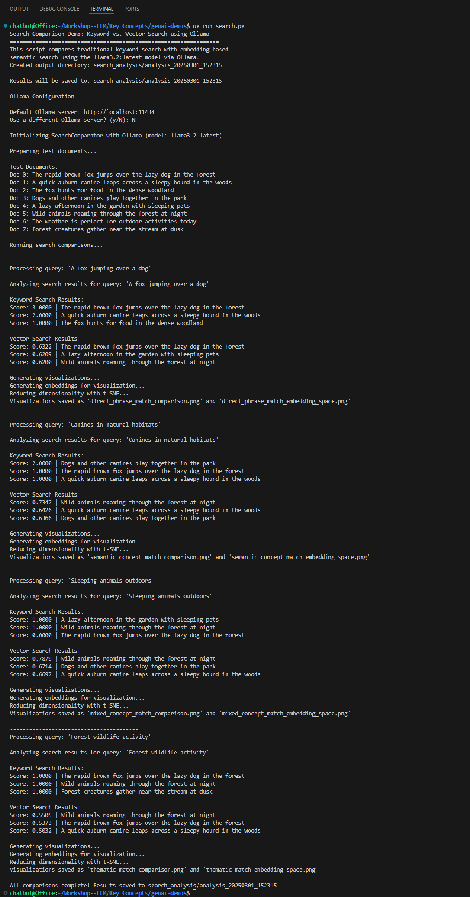<figcaption><p>output - search.py</p></figcaption></figure>

> **Note:** The results illustrate the different types of searches that can be performed by the model on the corpus of text.&#x20;
> 
> ```
> # Example corpus with various phrasings and concepts
>     documents = [
>         "The rapid brown fox jumps over the lazy dog in the forest",
>         "A quick auburn canine leaps across a sleepy hound in the woods",
>         "The fox hunts for food in the dense woodland",
>         "Dogs and other canines play together in the park",
>         "A lazy afternoon in the garden with sleeping pets",
>         "Wild animals roaming through the forest at night",
>         "The weather is perfect for outdoor activities today",
>         "Forest creatures gather near the stream at dusk"
>     ]
> ```

> **Note:** These advanced search capabilities are made possible through vector embeddings that capture nuanced meanings and relationships in text. By transforming words and phrases into mathematical representations, LLMs can understand context, recognize related concepts, and make thematic connections that go far beyond simple keyword matching or basic semantic similarity.

::: tabs

### Direct Phrase

> **Note:** **Direct Phrase Matching** combines both traditional keyword matching and vector similarity. While keyword search looks for exact matches (like finding "fox" and "dog" in a text), vector-based matching can understand slight variations in phrasing, making it more flexible and natural. This allows the system to recognize that "a quick auburn canine leaps" is semantically similar to "a fox jumping."

> **Note:** The keyword search found exact matches with "fox," "jump," and "dog," scoring highest (3.0) for direct matches. Vector search showed similar results but with more nuanced scoring, recognizing related phrases like "canine leaps" as semantically similar.

<figure>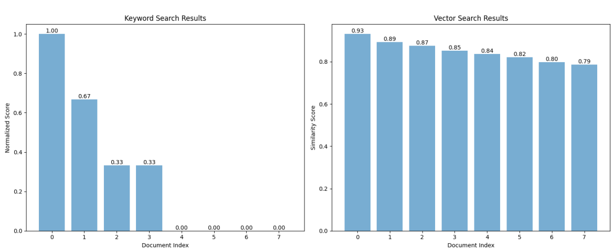<figcaption><p>Keyword v Vector search - A fox jumping over a dog</p></figcaption></figure>

<figure>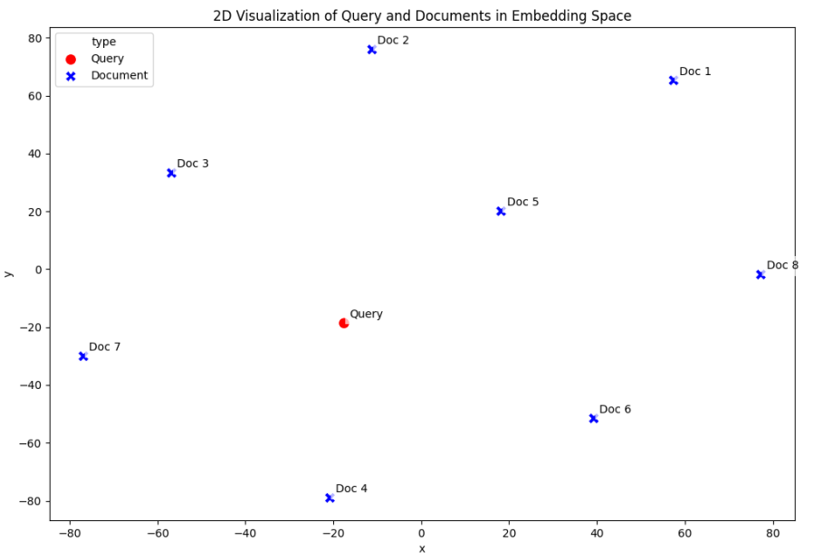<figcaption></figcaption></figure>

### Semantic Concept

> **Note:** **Semantic Concept Matching** goes beyond direct matching by understanding related concepts. Instead of just finding exact word matches, it can recognize that "canines in natural habitats" is conceptually related to both "dogs in the park" and "wild animals in the forest." This demonstrates the system's ability to bridge vocabulary differences while maintaining meaning.

> **Note:** Vector search demonstrated superior understanding by connecting "canines" with both domestic settings ("park") and natural habitats ("forest"), while keyword search only found direct word matches for "canines." This showed vector search's ability to understand context beyond exact words.

<figure>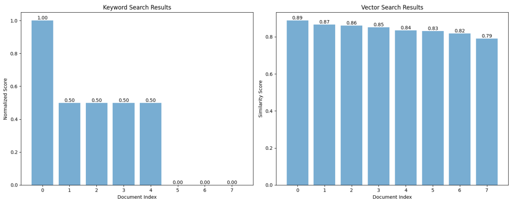<figcaption><p>Keyword v Vector search - Canines in natural habitats</p></figcaption></figure>

<figure>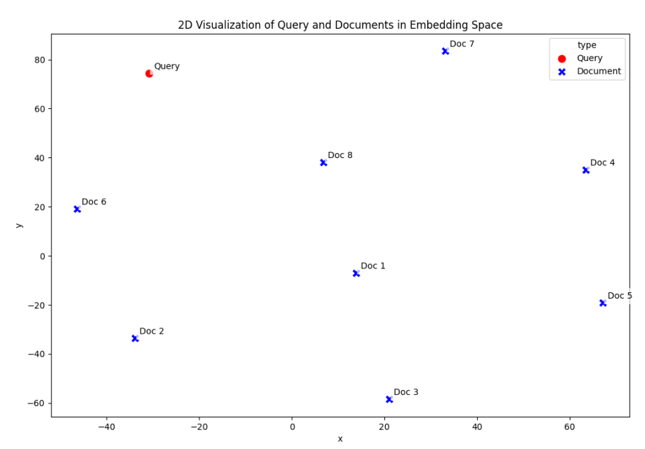<figcaption></figcaption></figure>

### Mixed Concept

> **Note:** **Mixed Concept Matching** combines multiple related ideas that might not typically appear together. For instance, when searching for "sleeping animals outdoors," the system can connect concepts like "lazy afternoon," "sleeping pets," and "animals roaming at night," even though these phrases use different words to express related ideas.

> **Note:** The vector search successfully connected "sleeping animals" with both direct matches ("sleeping pets") and related concepts ("animals roaming at night"). Keyword search struggled, only finding exact word matches and missing conceptual connections.

<figure>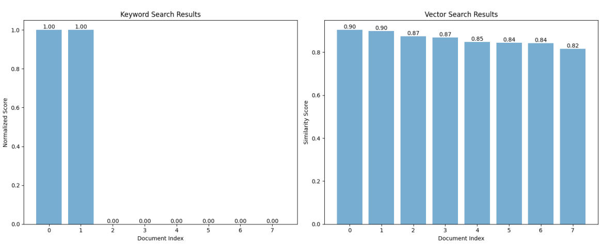<figcaption><p>Keyword v Vector search - Sleeping animals outdoors</p></figcaption></figure>

<figure>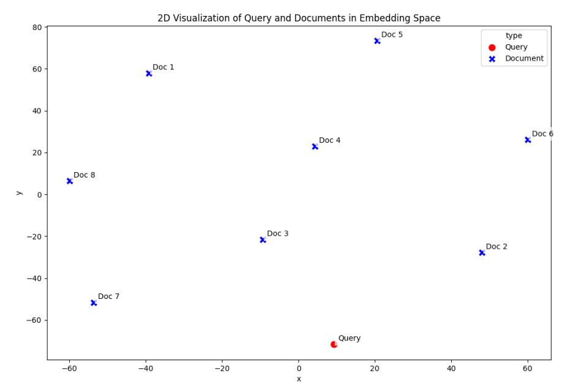<figcaption></figcaption></figure>

### Thematic

> **Note:** **Thematic Matching** represents the most sophisticated search approach, where the system understands broader themes and contexts. When searching for "forest wildlife activity," it can recognize various related concepts like "creatures gathering," "animals roaming," and "fox hunting" as thematically relevant, even when the specific words don't match.

> **Note:** For forest wildlife activity, vector search recognized various forms of animal behavior in forest settings, while keyword search only matched on "forest" and "wildlife" terms. This demonstrated vector search's ability to understand thematic relationships rather than just matching words.

<figure>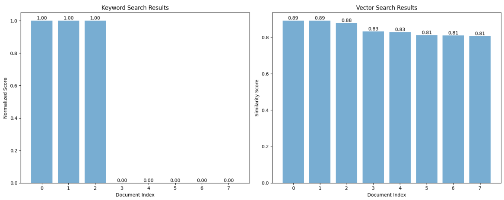<figcaption><p>Keyword v Vector search - Forest wildlife activity</p></figcaption></figure>

<figure>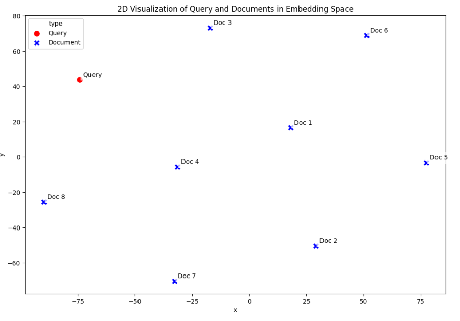<figcaption><p>Distribution of docs</p></figcaption></figure>

:::

### Transformers

> **Note:** Everything is now in place for the LLM to deal with our prompt ..
> 
> So let's dive into the heart of the LLM - Transformers..!

<figure>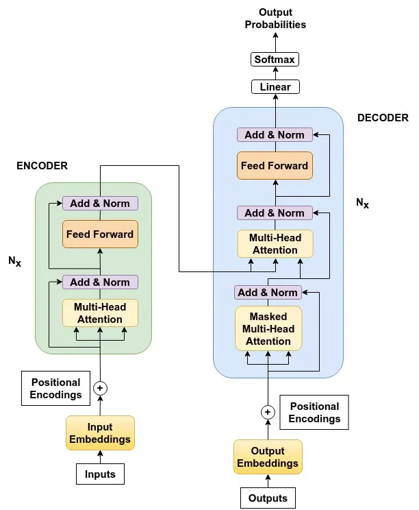<figcaption><p>Transformer</p></figcaption></figure>

::: tabs

### Encoder

> **Note:** **Understanding the Encoder Structure** Looking at the green section (ENCODER) in the diagram, we can see how an input sequence gets processed. The encoder starts with raw "Inputs" at the bottom and transforms them through several stages.
> 
> **Input Processing Path** The diagram shows how inputs first become "Input Embeddings" (yellow box), which combine with "Positional Encodings" through an addition operation (+). This combination ensures the model knows both what the words mean and where they appear in the sequence.
> 
> **Positional Understanding** At the bottom of the encoder section, we see "Positional Encodings" being added to the input embeddings, showing how the model maintains awareness of word order throughout processing.
> 
> **The Main Processing Block (Nx)** The diagram shows a green block labeled "Nx" which means this section repeats N times. Inside this block, we see two main components:
> 
> 1. "Multi-Head Attention" (handling self-attention)
> 2. "Feed Forward" (processing individual positions) Each component is followed by "Add & Norm" boxes, representing residual connections and layer normalization.
> 
> **Multi-Head Attention Layer** In the diagram, we see the "Multi-Head Attention" box with multiple arrows pointing in, showing how it allows each position to attend to all positions. This creates context-aware representations by letting each word "look at" all other words in the input.
> 
> **Feed Forward Processing** After attention, the diagram shows a "Feed Forward" box. This is an independent processing step that works on each position separately, transforming the attention-processed information further.
> 
> **Add & Norm Operations** The diagram shows "Add & Norm" boxes after both the attention and feed-forward components. These represent:
> 
> * Addition operations for residual connections
> * Normalization to keep values in a manageable range
> 
> **Final Output** The processed information from the encoder (after going through Nx blocks) connects to the decoder (blue section), showing how the encoder's output becomes input for the next stage of processing.
> 
> This architectural design creates a powerful system for understanding input sequences, with each component playing a crucial role in transforming raw inputs into rich, context-aware representations.

### Decoder

> **Note:** The decoder's fundamental purpose is to transform encoded representations into meaningful outputs through a sophisticated multi-layer architecture. Let's break down each component in detail:
> 
> **Initial Input Processing** The decoder begins at the bottom with output embeddings, which are combined with positional encodings using an addition operation (shown by the + symbol in the diagram). This combination ensures the model understands both the content and the sequential position of each element in the output sequence.
> 
> **Core Processing Blocks (Nx Times)** The blue section marked with "Nx" indicates that this entire stack of layers repeats N times. Each repetition contains three distinct processing blocks:
> 
> **Masked Multi-Head Attention Block**
> 
> This first attention layer is specifically marked as "Masked" in the diagram
> 
> The masking prevents the decoder from looking at future positions during training
> 
> The output passes through an Add & Norm layer (shown in purple)
> 
> This normalization helps maintain stable training by controlling the scale of values
> 
> **Cross-Attention Mechanism**
> 
> The regular "Multi-Head Attention" block connects to both:
> 
> * The output of the previous masked attention layer
> * The encoder's output (shown by the horizontal line from the encoder)
> 
> This allows the decoder to reference the entire input sequence while generating each output element
> 
> Another Add & Norm layer follows this attention mechanism
> 
> **Feed-Forward Processing**
> 
> The final block in each layer is the "Feed Forward" network (shown in orange)
> 
> Like the previous components, it's followed by an Add & Norm layer
> 
> This feed-forward network processes each position independently, applying the same transformations to each element
> 
> **Output Generation** After passing through all Nx layers, the decoder's final stages are:
> 
> * A Linear transformation layer that projects the representations into the desired output dimension
> * A Softmax layer that converts these values into probability distributions over the possible output tokens
> 
> **Residual Connections** Throughout the architecture, residual connections (represented by the addition symbols) allow information to flow directly from lower layers to higher ones, helping prevent information loss and enabling better gradient flow during training.
> 
> The entire structure is designed to work in concert with the encoder (shown in green on the left), creating a complete system that can handle complex sequence-to-sequence tasks like translation, summarization, or question-answering. The careful balance of attention mechanisms, normalization, and feed-forward processing enables the model to generate contextually appropriate and coherent outputs while maintaining awareness of both the input sequence and the previously generated outputs.
> 
> This architecture reflects key insights about sequence processing: the importance of position awareness, the need for both local and global context through different types of attention, and the value of repeated processing through identical layers to extract increasingly sophisticated patterns from the data.

:::

<div class="pcm-embed-card" data-href="https://poloclub.github.io/transformer-explainer/" data-title="poloclub.github.io"></div>

1. Take a look at the Python script below.

```bash
import numpy as np  # For numerical operations and array handling
import matplotlib.pyplot as plt  # For creating visualizations
import seaborn as sns  # For enhanced visualizations (especially heatmaps)
from typing import List, Dict  # Type hints for better code documentation
import pandas as pd  # For data manipulation (used in some visualizations)
import os  # For file and directory operations
from datetime import datetime  # For timestamping output files
import ollama  # Python client for interacting with Ollama API

def ensure_output_directory() -> str:
    """
    Create and return the output directory path with timestamp.
    
    This function creates a unique timestamped directory for each run to prevent
    overwriting previous results and provide easy identification.
    
    Returns:
        str: Path to the created output directory
    """
    # Base directory for transformer analysis outputs
    base_dir = "transformer_analysis"
    
    # Generate timestamp for unique directory name (format: YYYYMMDD_HHMMSS)
    timestamp = datetime.now().strftime("%Y%m%d_%H%M%S")
    
    # Create full path with timestamp
    output_dir = os.path.join(base_dir, f"analysis_{timestamp}")
    
    # Create directory if it doesn't exist
    if not os.path.exists(output_dir):
        os.makedirs(output_dir)
        print(f"Created output directory: {output_dir}")
        
    return output_dir

def get_ollama_host() -> str:
    """
    Prompt for Ollama host URL with default option.
    
    This function allows the user to specify a custom Ollama server
    or use the default localhost URL.
    
    Returns:
        str: Host URL for the Ollama API
    """
    # Default local Ollama server URL
    default_host = "http://localhost:11434"
    
    print("\nOllama Configuration")
    print("===================")
    print(f"Default Ollama server: {default_host}")
    
    # Ask if user wants to use a different server
    use_custom = input("Use a different Ollama server? (y/N): ").lower()
    
    if use_custom in ('y', 'yes'):
        # Get custom host URL
        host = input(f"Enter Ollama server URL: ")
        # Return provided URL or fall back to default if empty
        return host if host else default_host
    
    return default_host

class TransformerDemonstrator:
    """
    Demonstrates transformer processing using Ollama embeddings.
    
    This class provides methods to visualize and understand how transformers work,
    using the llama3.2:latest model from Ollama to generate embeddings and simulate
    the transformer process.
    """
    def __init__(self, ollama_host: str, output_dir: str):
        """
        Initialize the demonstrator with Ollama host and output directory.
        
        Args:
            ollama_host: URL of the Ollama API server
            output_dir: Directory to save visualizations and analysis results
        """
        # Initialize the Ollama client with the specified host
        self.client = ollama.Client(host=ollama_host)
        
        # Specify which Ollama model to use for embeddings
        self.model = "llama3.2:latest"
        
        # Directory where all output files will be saved
        self.output_dir = output_dir
        
        # Example prompt, tokens, and response for demonstration
        self.prompt = "What is the capital of France?"
        self.tokens = ['What', 'is', 'the', 'capital', 'of', 'France', '?']
        self.response = "Paris"
        
        # Create results file path
        self.results_file = os.path.join(output_dir, "analysis_results.txt")
        
        # Initialize the results file with header
        with open(self.results_file, 'w', encoding='utf-8') as f:
            f.write(f"Transformer Analysis Results\n")
            f.write("=========================\n")
            f.write(f"Model: Ollama - {self.model}\n")
            f.write(f"Date: {datetime.now().strftime('%Y-%m-%d %H:%M:%S')}\n\n")
        
    def save_results(self, section: str, content: str):
        """
        Save analysis results to the results file.
        
        This function appends a new section of results to the analysis file
        with proper formatting and section headers.
        
        Args:
            section: Title of the section being added
            content: Text content to save in that section
        """
        # Open file in append mode
        with open(self.results_file, 'a', encoding='utf-8') as f:
            # Add section header with underline
            f.write(f"\n{section}\n")
            f.write("=" * len(section) + "\n")
            # Write the actual content
            f.write(content + "\n")
    
    def get_embeddings(self, text: str) -> np.ndarray:
        """
        Get embeddings from Ollama API.
        
        This function sends a request to Ollama to generate an embedding vector
        for the provided text using the llama3.2:latest model.
        
        Args:
            text: The text to generate an embedding for
            
        Returns:
            numpy.ndarray: The embedding vector
        """
        # Request embedding from Ollama API
        response = self.client.embeddings(
            model=self.model,  # Using llama3.2:latest model
            prompt=text  # The text to embed
        )
        
        # Convert the embedding to numpy array
        return np.array(response["embedding"])
    
    def save_visualization(self, fig, filename: str) -> str:
        """
        Save visualization to the output directory.
        
        Args:
            fig: Matplotlib figure to save
            filename: Name for the saved file
            
        Returns:
            str: Path to the saved file
        """
        # Create full path for the output file
        filepath = os.path.join(self.output_dir, filename)
        
        # Save the figure
        fig.savefig(filepath)
        
        # Close the figure to free memory
        plt.close(fig)
        
        print(f"Saved visualization to: {filepath}")
        return filepath
    
    def demonstrate_process(self):
        """
        Demonstrate the complete transformer process.
        
        This method orchestrates the visualization of different aspects of
        transformer architecture using our example prompt:
        1. Token embeddings
        2. Self-attention between tokens
        3. Transformer processing stages
        4. Response generation
        """
        # Save initial configuration information
        config_info = f"""
        Input Prompt: '{self.prompt}'
        Tokens: {self.tokens}
        Expected Response: '{self.response}'
        """
        self.save_results("Configuration", config_info)
        
        try:
            # 1. Get embeddings for each token
            token_embeddings = {}
            print("\nGenerating embeddings for tokens...")
            for token in self.tokens:
                # Get embedding for each token and store in dictionary
                token_embeddings[token] = self.get_embeddings(token)
            
            # Save embedding information to results file
            embeddings_info = "Generated embeddings for tokens:\n"
            for token in self.tokens:
                embedding = token_embeddings[token]
                # Record shape and basic statistics for each embedding
                embeddings_info += f"{token}: Shape {embedding.shape}, Mean {np.mean(embedding):.4f}\n"
            self.save_results("Token Embeddings", embeddings_info)
            
            # 2. Visualize token attention
            print("\nGenerating token attention visualization...")
            self.visualize_token_attention(token_embeddings)
            
            # 3. Visualize transformer stages
            print("\nGenerating transformer stages visualization...")
            self.visualize_transformer_stages()
            
            # 4. Visualize response generation
            print("\nGenerating response process visualization...")
            self.visualize_response_process()
            
        except Exception as e:
            # Log any errors that occur
            error_msg = f"Error during demonstration: {str(e)}"
            print(f"\nError: {error_msg}")
            self.save_results("Error Log", error_msg)
            raise
        
    def visualize_token_attention(self, token_embeddings: Dict[str, np.ndarray]):
        """
        Visualize attention between tokens.
        
        This method simulates the self-attention mechanism in transformers by calculating
        similarity scores between token embeddings and visualizing them as a heatmap.
        
        Args:
            token_embeddings: Dictionary mapping tokens to their embedding vectors
        """
        # Get the number of tokens
        n_tokens = len(self.tokens)
        
        # Create empty matrix to store attention scores
        attention_matrix = np.zeros((n_tokens, n_tokens))
        
        # Calculate attention scores based on token embeddings similarity
        # In transformers, attention is based on query-key compatibility
        # We simulate this using cosine similarity between token embeddings
        for i, token1 in enumerate(self.tokens):
            for j, token2 in enumerate(self.tokens):
                # Get embeddings for token pair
                emb1 = token_embeddings[token1]  # Query token
                emb2 = token_embeddings[token2]  # Key token
                
                # Calculate cosine similarity
                # Formula: cos(θ) = (a·b)/(||a||·||b||)
                similarity = np.dot(emb1, emb2) / (np.linalg.norm(emb1) * np.linalg.norm(emb2))
                
                # Store in attention matrix
                attention_matrix[i, j] = similarity
        
        # Normalize attention scores to sum to 1 for each query token (row)
        # This simulates the softmax operation in transformer attention
        attention_matrix = attention_matrix / attention_matrix.sum(axis=1, keepdims=True)
        
        # Save attention matrix data to results file
        attention_info = "Attention Matrix:\n"
        for i, token1 in enumerate(self.tokens):
            for j, token2 in enumerate(self.tokens):
                attention_info += f"{token1} -> {token2}: {attention_matrix[i,j]:.4f}\n"
        self.save_results("Token Attention", attention_info)
        
        # Create visualization using seaborn's heatmap
        fig = plt.figure(figsize=(12, 8))
        sns.heatmap(
            attention_matrix, 
            annot=True,           # Show values in each cell
            fmt='.2f',            # Format as 2 decimal places
            xticklabels=self.tokens,  # Labels for columns (key tokens)
            yticklabels=self.tokens,  # Labels for rows (query tokens)
            cmap='YlOrRd'         # Color map: yellow to orange to red
        )
        plt.title('Token Self-Attention Weights')
        plt.xlabel('Context Tokens (Keys)')
        plt.ylabel('Query Tokens')
        plt.tight_layout()
        
        # Save the visualization
        self.save_visualization(fig, 'token_attention.png')
        
    def visualize_transformer_stages(self):
        """
        Visualize the stages of transformer processing.
        
        This method creates a diagram showing the main processing stages
        in a transformer model.
        """
        # Define the main stages of transformer processing
        stages = [
            'Input Embedding',        # Convert tokens to vectors
            'Positional Encoding',    # Add position information
            'Self-Attention',         # Compute attention between tokens
            'Feed Forward',           # Process through neural network
            'Layer Normalization',    # Normalize activations
            'Final Representation'    # Output token representations
        ]
        
        # Save stages information to results file
        stages_info = "Transformer Processing Stages:\n"
        for i, stage in enumerate(stages):
            stages_info += f"{i+1}. {stage}\n"
        self.save_results("Processing Stages", stages_info)
        
        # Create visualization showing information flow between stages
        fig = plt.figure(figsize=(15, 8))
        
        # For each stage, create a horizontal bar and label
        for i, stage in enumerate(stages):
            plt.barh(i, 0.8, color='skyblue', alpha=0.6)
            plt.text(0.9, i, stage, va='center')
            
            # Add arrows between stages to show information flow
            if i < len(stages) - 1:
                plt.arrow(0.4, i, 0, 0.8, head_width=0.05, 
                         head_length=0.1, fc='k', ec='k')
        
        # Set plot limits and title
        plt.ylim(-0.5, len(stages) - 0.5)
        plt.xlim(0, 2)
        plt.title('Transformer Processing Stages')
        plt.axis('off')  # Hide axes
        plt.tight_layout()
        
        # Save the visualization
        self.save_visualization(fig, 'transformer_stages.png')
        
    def visualize_response_process(self):
        """
        Visualize the response generation process.
        
        This method shows the relationship between the input prompt
        and the generated response using embeddings to represent them.
        """
        # Get embeddings for the full prompt and the response
        print("Generating embeddings for prompt and response...")
        prompt_emb = self.get_embeddings(self.prompt)
        response_emb = self.get_embeddings(self.response)
        
        # Save embeddings information to results file
        response_info = f"""
        Prompt: '{self.prompt}'
        - Embedding shape: {prompt_emb.shape}
        - Embedding mean: {np.mean(prompt_emb):.4f}
        - Embedding std: {np.std(prompt_emb):.4f}
        
        Response: '{self.response}'
        - Embedding shape: {response_emb.shape}
        - Embedding mean: {np.mean(response_emb):.4f}
        - Embedding std: {np.std(response_emb):.4f}
        
        Cosine Similarity between prompt and response: 
        {np.dot(prompt_emb, response_emb) / (np.linalg.norm(prompt_emb) * np.linalg.norm(response_emb)):.4f}
        """
        self.save_results("Response Generation", response_info)
        
        # Create visualization showing relationship between prompt and response
        fig, (ax1, ax2) = plt.subplots(1, 2, figsize=(15, 6))
        
        # Prompt processing visualization (left subplot)
        ax1.bar(['Prompt'], [1], color='lightblue')
        ax1.set_title('Input Processing')
        ax1.text(0, 0.5, self.prompt, ha='center', va='center')
        
        # Response generation visualization (right subplot)
        ax2.bar(['Response'], [1], color='lightgreen')
        ax2.set_title('Output Generation')
        ax2.text(0, 0.5, self.response, ha='center', va='center')
        
        # Add title and adjust layout
        plt.suptitle('Transformer Input/Output Process', fontsize=16)
        plt.tight_layout()
        
        # Save the visualization
        self.save_visualization(fig, 'response_generation.png')

def demonstrate_full_process():
    """
    Run complete transformer demonstration.
    
    This function sets up the environment, initializes the demonstrator,
    and runs the full transformer process demonstration.
    """
    print("Transformer Visualization Demo using Ollama")
    print("===========================================")
    print("This script demonstrates transformer processing using")
    print("the llama3.2:latest model via Ollama.\n")
    
    try:
        # Create output directory
        output_dir = ensure_output_directory()
        print(f"\nAnalysis results will be saved to: {output_dir}")
        
        # Get Ollama host configuration
        ollama_host = get_ollama_host()
        
        # Initialize demonstrator
        print(f"\nInitializing TransformerDemonstrator with Ollama (model: llama3.2:latest)")
        demonstrator = TransformerDemonstrator(ollama_host, output_dir)
        
        print("\nDemonstrating Transformer Process:")
        print(f"Input Prompt: '{demonstrator.prompt}'")
        
        # Run demonstration
        demonstrator.demonstrate_process()
        
        print(f"\nAll analysis results have been saved to: {output_dir}")
        print("\nGenerated files:")
        print("1. token_attention.png - Shows attention weights between tokens")
        print("2. transformer_stages.png - Shows stages of transformer processing")
        print("3. response_generation.png - Shows response generation process")
        print("4. analysis_results.txt - Detailed analysis data and metrics")
        
    except Exception as e:
        print(f"\nError: {str(e)}")
        print("\nTroubleshooting steps:")
        print("1. Ensure Ollama is installed and running (see https://ollama.com)")
        print("2. Check if the llama3.2:latest model is pulled (`ollama pull llama3.2:latest`)")
        print("3. Verify the Ollama server URL is correct")
        print("4. Make sure the ollama Python package is installed (`pip install ollama`)")
        print(f"\nError details: {type(e).__name__}: {str(e)}")

if __name__ == "__main__":
    # Entry point of the script
    # This ensures the script only runs when executed directly, not when imported
    demonstrate_full_process()
```

***

#### Run Python script - transformers.py

1. Navigate to: Workshop--LLM/'Key Concepts'/ directory.

```bash
cd
cd Workshop--LLM/'Key Concepts'/
```

2. Run the script.

```python
uv run transformers.py
```

<figure>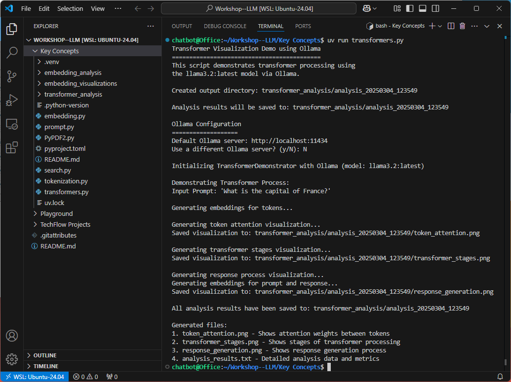<figcaption><p>Output - transformers.py</p></figcaption></figure>

::: tabs

### Transformer Stages

> **Note:** The transformer architecture consists of six key sequential processing stages, as shown in the diagram.

<figure>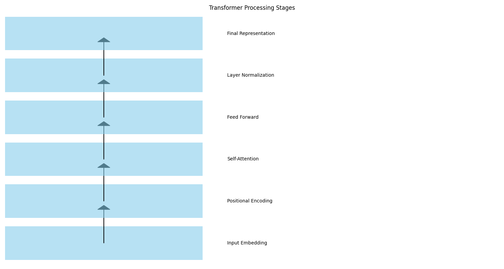<figcaption><p>Transformer stages</p></figcaption></figure>

> **Note:** **Input Embedding** forms the foundation of the process. Here, each token (like "What", "is", etc.) is converted into a dense vector representation. These embeddings capture semantic meaning by mapping similar words to similar vector spaces. In your code, this is simulated by retrieving embeddings from the llama3.2 model via the Ollama API.
> 
> **Positional Encoding** addresses a critical limitation of the basic transformer architecture—lack of sequence awareness. Since transformers process all tokens simultaneously rather than sequentially, positional encodings are added to the token embeddings to provide information about token position within the sequence. This helps the model distinguish between different arrangements of the same words.
> 
> **Self-Attention** is perhaps the most innovative aspect of transformers. In this stage, each token looks at all other tokens in the sequence (including itself) and computes attention weights indicating relevance. Your token attention matrix visualizes exactly this—how each token in "What is the capital of France?" attends to other tokens in the sequence.
> 
> **Feed Forward** networks follow the attention mechanism. After tokens gather contextual information via self-attention, each token's representation passes through a fully-connected neural network. This consists of linear transformations with non-linear activation functions that process each token independently, allowing the model to transform the contextualized representations further.
> 
> **Layer Normalization** stabilizes the learning process. This statistical normalization technique standardizes the activations, making training more efficient and preventing internal covariate shift. In transformers, layer normalization is typically applied both after the self-attention and after the feed-forward networks.
> 
> **Final Representation** emerges after these processing stages. The output is a set of contextualized token representations that capture both the semantic meaning of each token and its relationship to other tokens in the sequence. These final representations can then be used for various tasks, like predicting the next token ("Paris" in response to "What is the capital of France?").

:::

::::

