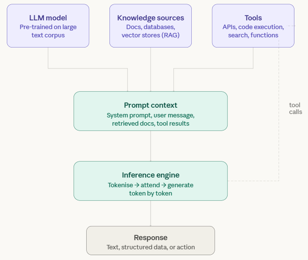

# GenAI

<figure><figcaption><p>GenAI components</p></figcaption></figure>

> **Note:** **So does it work?**
> 
> At its core, a GenAI system is built around a large language model (LLM) — a neural network trained on vast amounts of text. Through that training, it learns patterns in language: grammar, facts, reasoning styles, and how ideas connect. When you interact with it, the model isn't "looking things up" — it's generating responses based on those learned patterns.
> 
> Before the model generates anything, everything relevant gets assembled into a **prompt context**. This is the full picture the model sees: a system prompt (instructions defining how it should behave), your message, any documents retrieved from a knowledge source, and any results from tool calls made earlier in the conversation. The richer and more relevant this context, the better the output.
> 
> Knowledge sources extend what the model knows beyond its training data. Using a technique called RAG (Retrieval-Augmented Generation), the system searches a database or document store for content relevant to your query and injects it into the context. This is how GenAI systems can answer questions about your own documents or up-to-date information.
> 
> Tools give the model the ability to act — not just respond. During a conversation, the model can decide to call an external API, run a piece of code, or search the web. The result comes back into the context, and the model uses it to form its final answer. This loop is what makes agentic AI possible.
> 
> Finally, the **inference engine** takes the assembled context and generates a response token by token — each word (or part of a word) is predicted based on everything that came before it. This continues until the response is complete. The output might be plain text, structured data, or a trigger for another action.

***

> **Note:** Let's take a look at the GenAI steps availble as an EE plugin ..

1. Start Pentaho Data Integration:

```bash
cd
cd Pentaho/design-tools/data-integration
sh spoon.sh
```

***

## Workshops

* **HTML Parser** — extract text from HTML/XML with XPath and CSS selectors to feed GenAI steps.
* **Apache Tika** — extract text from Office documents (Word, password-protected, multiple files).
