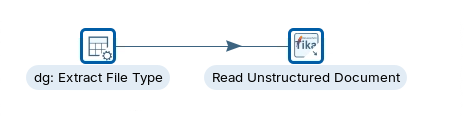
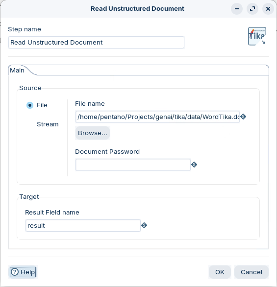
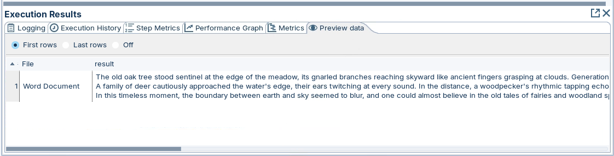
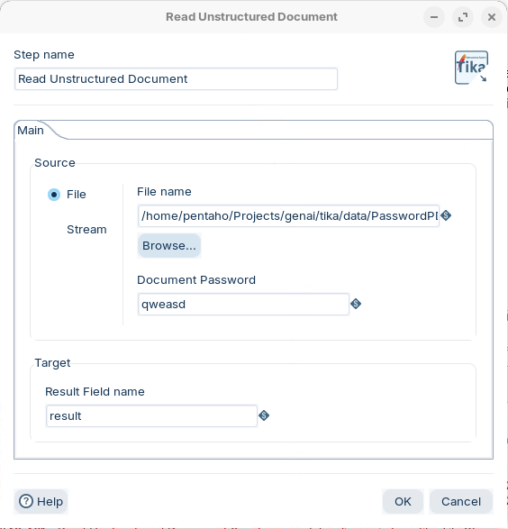
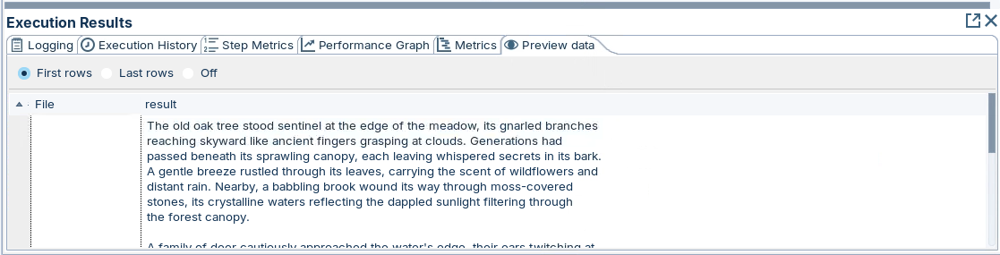
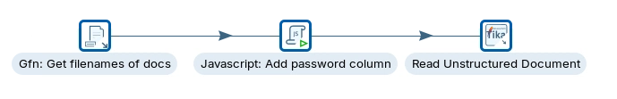
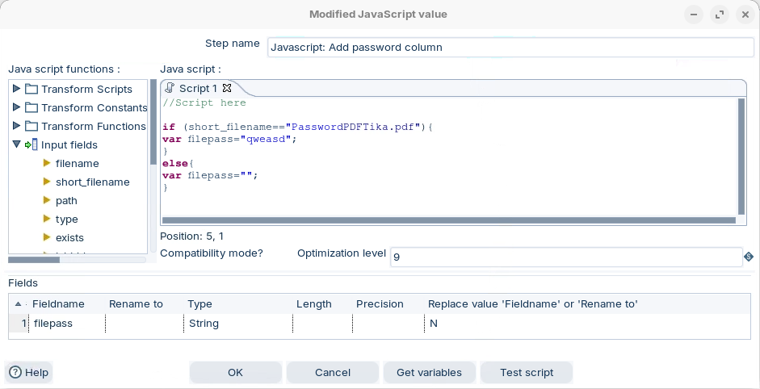
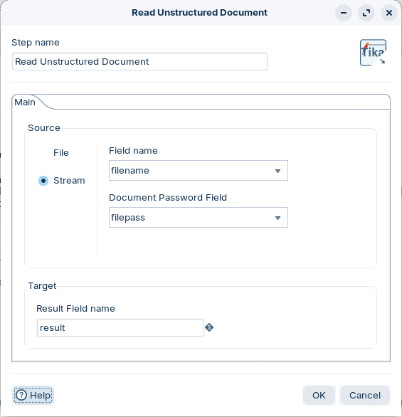
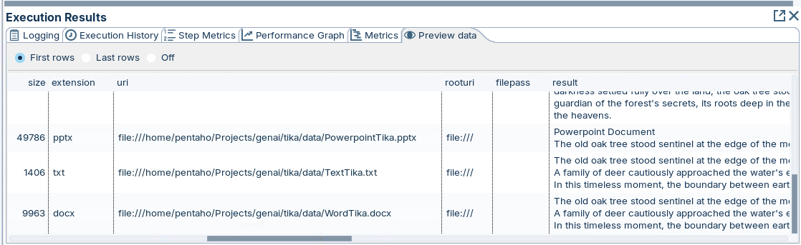

# Apache Tika

> **Note:** Apache Tika is a content analysis toolkit that extracts text, metadata, and language from a variety of file formats. It's commonly used in data processing to prepare data for further analysis.
> 
> * Supports a wide range of document formats including PDFs, Word documents, and HTML files.
> * Extracts metadata such as author, title, creation date, and language.
> * Can be integrated into larger data processing pipelines for automated content extraction.
> * Facilitates full-text search indexing and content classification.
> 
> The step is located in the Input folder.

<div class="pcm-embed-card" data-href="https://tika.apache.org/" data-title="tika.apache.org"></div>

::: tabs

### Word Document

> **Note:** The data source is a word document.
> 
> The document type is referenced in a datastream field.

**Word Document**

```
The old oak tree stood sentinel at the edge of the meadow, its gnarled branches reaching skyward like ancient fingers grasping at clouds. Generations had passed beneath its sprawling canopy, each leaving whispered secrets in its bark. A gentle breeze rustled through its leaves, carrying the scent of wildflowers and distant rain. Nearby, a babbling brook wound its way through moss-covered stones, its crystalline waters reflecting the dappled sunlight filtering through the forest canopy. 
A family of deer cautiously approached the water's edge, their ears twitching at every sound. In the distance, a woodpecker's rhythmic tapping echoed through the trees, nature's own percussion. As the sun began its slow descent, the meadow came alive with the soft glow of fireflies, their bioluminescent dance a magical display against the deepening twilight. A lone owl hooted softly, heralding the arrival of night and all its mysterious inhabitants. The air grew cooler, and dew began to form on blades of grass, each droplet a miniature world reflecting the stars above. 
In this timeless moment, the boundary between earth and sky seemed to blur, and one could almost believe in the old tales of fairies and woodland spirits. As darkness settled fully over the land, the oak tree stood as it always had, a silent guardian of the forest's secrets, its roots deep in the earth, its crown brushing the heavens.
```

1. Open the following transformation:

<figure><figcaption><p>Word document</p></figcaption></figure>

**Windows**

C:/Projects/genai/tika/Read Unstructured Document- Word Doc.ktr

**Linux**

\~/Projects/genai/tika/Read Unstructured Document- Word Doc.ktr

2. Double-click on the Read Unstructured Document step and configure with the following settings:

<figure><figcaption><p>Word document</p></figcaption></figure>

3. RUN and preview the results.

<figure><figcaption><p>Results</p></figcaption></figure>

### Password Protected

> **Note:** The data source is a password protected PDF document.
> 
> The document type is referenced in a datastream field.

1. Open the following transformation:

<figure><figcaption><p>PDF password protected document</p></figcaption></figure>

**Windows**

C:/Projects/genai/tika/Read Unstructured Document- Password PDF.ktr

**Linux**

\~/Projects/genai/tika/Read Unstructured Document- Password PDF.ktr.

2. Double-click on the Read Unstructured Document step and configure with the following settings:

<figure><figcaption><p>PDF password protected</p></figcaption></figure>

3. RUN and preview the results.

<figure><figcaption><p>PDF password protected</p></figcaption></figure>

### Multiple Documents

> **Note:** Multiple documents are referenced as the data source.
> 
> The Javascript step is used to add the PDF password.

1. Open the following transformation:

<figure><figcaption><p>Multiple documents</p></figcaption></figure>

**Windows**

C:/Projects/genai/tika/Read Unstructured Document- Stream Multiple Files.ktr

**Linux**

\~/Projects/genai/tika/Read Unstructured Document- Stream Multiple Files.ktr.

2. Double-click on the Javascript: Add password column.

<figure><figcaption><p>Add PDF password</p></figcaption></figure>

> **Note:** A data stream field: filepass is associated with the password: qweasd

3. Double-click on the Read Unstructured Document step and configure with the following settings:

<figure><figcaption><p>Pass filenames + password</p></figcaption></figure>

3. RUN and preview the results.

<figure><figcaption><p>Results</p></figcaption></figure>

:::

