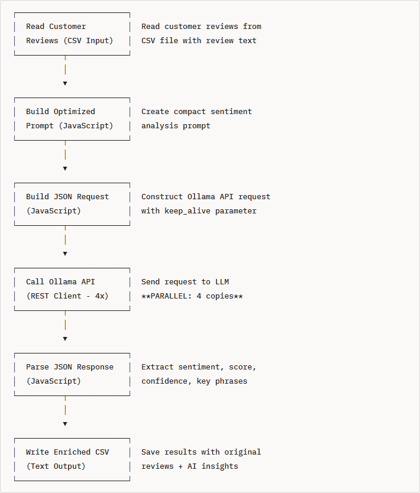

# Sentiment Analysis

> **Warning:**
>
> #### Workshop - Sentiment Analysis
> 
> This workshop integrates a Large Language Model (LLM) via Ollama with Pentaho Data Integration (PDI) to analyze sentiment on customer reviews.
> 
> In this workshop, you build an ETL pipeline that reads customer feedback, classifies sentiment with a local LLM, and writes structured results.
> 
> **What you'll do**
> 
> * Verify the Ollama installation and confirm the API endpoint responds
> * Read customer reviews into the transformation
> * Build the prompt and call the Ollama API for each review
> * Parse the LLM response and extract the sentiment fields
> * Write the structured results to output
> 
> **Prerequisites:** Ollama running locally with the required model pulled, and PDI (Spoon) installed. Understanding of basic transformation concepts (steps, hops, preview).
> 
> **Estimated time:** 45 minutes

**Workflow**

<figure><figcaption><p>sentiment_analysis_optimized</p></figcaption></figure>

1. Verify Ollama Installation.

```bash
# Check if Ollama is responding
curl http://localhost:11434/api/tags
```

Run through the following steps to build `sentiment_analysis_optimized.ktr`:


<div class="pcm-tabs-widget" data-tabs="%5B%7B%22title%22%3A%221.%20Sentiment%20Analysis%22%2C%22body%22%3A%22%3E%20**Note%3A**%5Cn%3E%5Cn%3E%20%23%23%23%23%20What%20is%20Sentiment%20Analysis%3F%5Cn%3E%20%5Cn%3E%20Sentiment%20Analysis%20is%20the%20process%20of%20computationally%20identifying%20and%20categorizing%20opinions%20expressed%20in%20text%20to%20determine%20whether%20the%20writer's%20attitude%20toward%20a%20particular%20topic%2C%20product%2C%20or%20service%20is%20positive%2C%20negative%2C%20or%20neutral.%5Cn%5Cn**Example%20Input%3A**%5Cn%5Cn%60%60%60%5Cn%5C%22This%20laptop%20exceeded%20my%20expectations!%20The%20battery%20life%20is%20incredible%20and%20the%5Cnperformance%20is%20blazing%20fast.%20Highly%20recommend%20for%20anyone%20looking%20for%20a%20quality%20machine.%5C%22%5Cn%60%60%60%5Cn%5Cn**Example%20Output%20(Sentiment%20Analysis)%3A**%5Cn%5Cn%60%60%60json%5Cn%7B%5Cn%20%20%5C%22sentiment%5C%22%3A%20%5C%22positive%5C%22%2C%5Cn%20%20%5C%22score%5C%22%3A%200.9%2C%5Cn%20%20%5C%22confidence%5C%22%3A%2095%2C%5Cn%20%20%5C%22key_phrases%5C%22%3A%20%5B%5C%22exceeded%20expectations%5C%22%2C%20%5C%22incredible%20battery%5C%22%2C%20%5C%22blazing%20fast%5C%22%2C%20%5C%22highly%20recommend%5C%22%5D%2C%5Cn%20%20%5C%22summary%5C%22%3A%20%5C%22Customer%20extremely%20satisfied%20with%20laptop%20performance%20and%20battery%20life%5C%22%5Cn%7D%5Cn%60%60%60%5Cn%5Cn%3E%20**Note%3A**%5Cn%3E%5Cn%3E%20%23%23%23%23%20Why%20is%20Sentiment%20Analysis%20Important%3F%5Cn%3E%20%5Cn%3E%20**Business%20Applications%3A**%5Cn%3E%20%5Cn%3E%201.%20**Customer%20Feedback%20Analysis**%20-%20Automatically%20categorize%20thousands%20of%20reviews%20to%20identify%20satisfaction%20trends%5Cn%3E%202.%20**Brand%20Monitoring**%20-%20Track%20public%20sentiment%20about%20your%20brand%20across%20social%20media%20and%20review%20sites%5Cn%3E%203.%20**Product%20Improvement**%20-%20Identify%20which%20features%20customers%20love%20and%20which%20need%20improvement%5Cn%3E%204.%20**Customer%20Support%20Prioritization**%20-%20Route%20angry%20customers%20to%20experienced%20support%20agents%20first%5Cn%3E%205.%20**Market%20Research**%20-%20Understand%20customer%20opinions%20about%20competitor%20products%5Cn%3E%206.%20**Crisis%20Detection**%20-%20Quickly%20identify%20negative%20sentiment%20spikes%20that%20require%20immediate%20attention%5Cn%5Cn%3E%20**Note%3A**%20**Real-World%20Example%3A**%20A%20company%20receives%2010%2C000%20product%20reviews%20per%20month.%20Manual%20analysis%20would%20take%20weeks.%20With%20sentiment%20analysis%3A%5Cn%3E%20%5Cn%3E%20*%20**Instant%20categorization**%3A%207%2C500%20positive%2C%201%2C800%20neutral%2C%20700%20negative%5Cn%3E%20*%20**Identify%20issues**%3A%20Negative%20reviews%20mention%20%5C%22battery%20life%5C%22%20450%20times%20%E2%86%92%20product%20team%20investigates%5Cn%3E%20*%20**Measure%20satisfaction**%3A%2075%25%20positive%20sentiment%20score%20%E2%86%92%20track%20over%20time%5Cn%3E%20*%20**Prioritize%20responses**%3A%20Route%20the%20200%20most%20negative%20reviews%20to%20customer%20service%5Cn%5Cn%3E%20**Note%3A**%5Cn%3E%5Cn%3E%20%23%23%23%23%20Types%20of%20Sentiment%5Cn%3E%20%5Cn%3E%20**1.%20Polarity%20(Basic)**%5Cn%3E%20%5Cn%3E%20*%20**Positive**%3A%20%5C%22This%20product%20is%20amazing!%5C%22%5Cn%3E%20*%20**Negative**%3A%20%5C%22Terrible%20quality%2C%20waste%20of%20money%5C%22%5Cn%3E%20*%20**Neutral**%3A%20%5C%22The%20product%20arrived%20on%20Tuesday%5C%22%5Cn%3E%20%5Cn%3E%20**2.%20Granular%20Sentiment%20(Scored)**%5Cn%3E%20%5Cn%3E%20*%20**Very%20Positive**%3A%20%2B0.8%20to%20%2B1.0%20(%5C%22Best%20purchase%20ever!%5C%22)%5Cn%3E%20*%20**Positive**%3A%20%2B0.3%20to%20%2B0.7%20(%5C%22Good%20value%20for%20money%5C%22)%5Cn%3E%20*%20**Neutral**%3A%20-0.2%20to%20%2B0.2%20(%5C%22It%20works%20as%20described%5C%22)%5Cn%3E%20*%20**Negative**%3A%20-0.7%20to%20-0.3%20(%5C%22Not%20what%20I%20expected%5C%22)%5Cn%3E%20*%20**Very%20Negative**%3A%20-1.0%20to%20-0.8%20(%5C%22Complete%20garbage%2C%20requesting%20refund%5C%22)%5Cn%3E%20%5Cn%3E%20**3.%20Emotion-Based%20Sentiment**%20(Advanced)%5Cn%3E%20%5Cn%3E%20*%20**Joy**%3A%20%5C%22So%20happy%20with%20this%20purchase!%5C%22%5Cn%3E%20*%20**Anger**%3A%20%5C%22This%20company%20has%20the%20worst%20customer%20service!%5C%22%5Cn%3E%20*%20**Frustration**%3A%20%5C%22Why%20doesn't%20this%20feature%20work%20properly%3F%5C%22%5Cn%3E%20*%20**Disappointment**%3A%20%5C%22Expected%20better%20quality%20for%20the%20price%5C%22%5Cn%5Cn***%5Cn%5Cn**How%20LLMs%20Improve%20Sentiment%20Analysis**%5Cn%5Cn**Traditional%20Methods%20(Rule-Based%2FML)%3A**%5Cn%5Cn%60%60%60python%5Cn%23%20Simple%20keyword%20matching%5Cnpositive_words%20%3D%20%5B%5C%22good%5C%22%2C%20%5C%22great%5C%22%2C%20%5C%22excellent%5C%22%2C%20%5C%22love%5C%22%5D%5Cnnegative_words%20%3D%20%5B%5C%22bad%5C%22%2C%20%5C%22poor%5C%22%2C%20%5C%22terrible%5C%22%2C%20%5C%22hate%5C%22%5D%5Cn%5Cnif%20text%20contains%20more%20positive_words%3A%5Cn%20%20%20%20sentiment%20%3D%20%5C%22positive%5C%22%5Cn%60%60%60%5Cn%5Cn%3E%20**Note%3A**%20**Problems%20with%20Traditional%20Methods%3A**%5Cn%3E%20%5Cn%3E%20%E2%9D%8C%20Can't%20handle%20context%3A%20%5C%22This%20isn't%20bad%5C%22%20%E2%86%92%20Detected%20as%20negative%20(contains%20%5C%22bad%5C%22)%5Cn%3E%20%5Cn%3E%20%E2%9D%8C%20Misses%20sarcasm%3A%20%5C%22Oh%20great%2C%20another%20software%20bug%5C%22%20%E2%86%92%20Detected%20as%20positive%20(contains%20%5C%22great%5C%22)%5Cn%3E%20%5Cn%3E%20%E2%9D%8C%20Ignores%20negation%3A%20%5C%22Not%20good%20at%20all%5C%22%20%E2%86%92%20Detected%20as%20positive%20(contains%20%5C%22good%5C%22)%5Cn%3E%20%5Cn%3E%20%E2%9D%8C%20Limited%20to%20trained%20categories%5Cn%3E%20%5Cn%3E%20%E2%9D%8C%20Requires%20extensive%20labeled%20training%20data%5Cn%5Cn***%5Cn%5Cn**LLM-Based%20Sentiment%20Analysis%3A**%5Cn%5Cn%60%60%60%5CnPrompt%3A%20%5C%22Analyze%20the%20sentiment%20of%20this%20review%20and%20respond%20in%20JSON%20format...%5C%22%5Cn%5CnLLM%20Response%3A%5Cn%7B%5Cn%20%20%5C%22sentiment%5C%22%3A%20%5C%22positive%5C%22%2C%5Cn%20%20%5C%22score%5C%22%3A%200.85%2C%5Cn%20%20%5C%22confidence%5C%22%3A%2090%2C%5Cn%20%20%5C%22reasoning%5C%22%3A%20%5C%22Customer%20expresses%20satisfaction%20with%20performance%20and%20battery%2C%5Cn%20%20%20%20%20%20%20%20%20%20%20%20%20%20%20uses%20enthusiastic%20language%20('exceeded%20expectations'%2C%20'incredible')%5C%22%5Cn%7D%5Cn%60%60%60%5Cn%5Cn%3E%20**Note%3A**%20**Advantages%20of%20LLMs%3A**%5Cn%3E%20%5Cn%3E%20%E2%9C%85%20Understands%20context%20and%20nuance%5Cn%3E%20%5Cn%3E%20%E2%9C%85%20Detects%20sarcasm%20and%20irony%5Cn%3E%20%5Cn%3E%20%E2%9C%85%20Handles%20negation%20correctly%5Cn%3E%20%5Cn%3E%20%E2%9C%85%20Provides%20explanations%20and%20reasoning%5Cn%3E%20%5Cn%3E%20%E2%9C%85%20Extracts%20key%20phrases%20automatically%5Cn%3E%20%5Cn%3E%20%E2%9C%85%20Works%20in%20multiple%20languages%20(multilingual%20models)%5Cn%3E%20%5Cn%3E%20%E2%9C%85%20No%20training%20data%20required%20(zero-shot%20learning)%5Cn%3E%20%5Cn%3E%20%E2%9C%85%20Customizable%20output%20format%20(JSON%2C%20XML%2C%20etc.)%5Cn%5Cn***%5Cn%5Cn%3E%20**Note%3A**%5Cn%3E%5Cn%3E%20%23%23%23%23%20Sentiment%20Analysis%20Output%20Components%5Cn%3E%20%5Cn%3E%20In%20this%20workshop%2C%20our%20LLM%20will%20extract%3A%5Cn%3E%20%5Cn%3E%20**1.%20Sentiment%20Classification**%5Cn%3E%20%5Cn%3E%20*%20Category%3A%20positive%2C%20negative%2C%20or%20neutral%5Cn%3E%20*%20Example%3A%20%60%5C%22sentiment%5C%22%3A%20%5C%22positive%5C%22%60%5Cn%3E%20%5Cn%3E%20**2.%20Sentiment%20Score**%5Cn%3E%20%5Cn%3E%20*%20Numeric%20value%20from%20-1.0%20(very%20negative)%20to%20%2B1.0%20(very%20positive)%5Cn%3E%20*%20Example%3A%20%60%5C%22score%5C%22%3A%200.9%60%20(strongly%20positive)%5Cn%3E%20%5Cn%3E%20**3.%20Confidence%20Level**%5Cn%3E%20%5Cn%3E%20*%20How%20certain%20is%20the%20LLM%20about%20this%20classification%20(0-100%25)%5Cn%3E%20*%20Example%3A%20%60%5C%22confidence%5C%22%3A%2095%60%20(very%20confident)%5Cn%3E%20*%20Low%20confidence%20(%3C60%25)%20might%20indicate%20mixed%20or%20ambiguous%20sentiment%5Cn%3E%20%5Cn%3E%20**4.%20Key%20Phrases**%5Cn%3E%20%5Cn%3E%20*%20Important%20words%2Fphrases%20that%20influenced%20the%20sentiment%5Cn%3E%20*%20Example%3A%20%60%5B%5C%22exceeded%20expectations%5C%22%2C%20%5C%22incredible%20battery%5C%22%2C%20%5C%22blazing%20fast%5C%22%5D%60%5Cn%3E%20*%20Useful%20for%20identifying%20specific%20strengths%20or%20weaknesses%5Cn%3E%20%5Cn%3E%20**5.%20Summary**%5Cn%3E%20%5Cn%3E%20*%20One-sentence%20summary%20of%20the%20review's%20main%20point%5Cn%3E%20*%20Example%3A%20%60%5C%22Customer%20extremely%20satisfied%20with%20laptop%20performance%20and%20battery%20life%5C%22%60%5Cn%3E%20*%20Helps%20quickly%20understand%20what%20the%20review%20is%20about%5Cn%5Cn***%5Cn%5Cn**Use%20Cases%20in%20This%20Workshop**%5Cn%5CnWe'll%20analyze%20**3%20customer%20reviews**%20with%20varying%20sentiments%3A%5Cn%5Cn**Review%201%20(Positive)%3A**%5Cn%5Cn%60%60%60%5Cn%5C%22This%20laptop%20exceeded%20my%20expectations!%20The%20battery%20life%20is%20incredible...%5C%22%5Cn%E2%86%92%20Sentiment%3A%20positive%2C%20Score%3A%200.9%2C%20Confidence%3A%2090%25%5Cn%60%60%60%5Cn%5Cn**Review%202%20(Negative)%3A**%5Cn%5Cn%60%60%60%5Cn%5C%22The%20wireless%20mouse%20I%20bought%20stopped%20working%20after%20just%202%20weeks...%5C%22%5Cn%E2%86%92%20Sentiment%3A%20negative%2C%20Score%3A%20-0.6%2C%20Confidence%3A%2080%25%5Cn%60%60%60%5Cn%5Cn**Review%203%20(Neutral%2FMixed)%3A**%5Cn%5Cn%60%60%60%5Cn%5C%22Good%20laptop%20overall%2C%20but%20it%20gets%20a%20bit%20warm%20during%20intensive%20tasks...%5C%22%5Cn%E2%86%92%20Sentiment%3A%20neutral%2C%20Score%3A%20-0.33%2C%20Confidence%3A%2070%25%5Cn%60%60%60%5Cn%5Cn%3E%20**Note%3A**%5Cn%3E%5Cn%3E%20%23%23%23%23%20Expected%20Results%5Cn%3E%20%5Cn%3E%20After%20running%20this%20workshop's%20transformation%2C%20you'll%20have%3A%5Cn%3E%20%5Cn%3E%20*%20Original%20review%20text%5Cn%3E%20*%20AI-determined%20sentiment%20(positive%2Fnegative%2Fneutral)%5Cn%3E%20*%20Numeric%20score%20(-1.0%20to%201.0)%5Cn%3E%20*%20Confidence%20percentage%5Cn%3E%20*%20Key%20phrases%20extracted%5Cn%3E%20*%20One-sentence%20summary%5Cn%3E%20%5Cn%3E%20All%20in%20a%20structured%20CSV%20file%20ready%20for%20analysis%2C%20visualization%2C%20or%20database%20import!%5Cn%5Cn%3E%20**Note%3A**%5Cn%3E%5Cn%3E%20%23%23%23%23%20Key%20Takeaways%5Cn%3E%20%5Cn%3E%201.%20**Sentiment%20analysis%20automatically%20categorizes%20opinions**%20in%20customer%20feedback%5Cn%3E%202.%20**LLMs%20provide%20context-aware%20analysis**%20that%20traditional%20methods%20can't%20match%5Cn%3E%203.%20**Structured%20JSON%20output**%20makes%20results%20easy%20to%20process%20in%20ETL%20pipelines%5Cn%3E%204.%20**Confidence%20scores**%20help%20identify%20reviews%20that%20need%20manual%20review%5Cn%3E%205.%20**Key%20phrases**%20identify%20specific%20strengths%20and%20weaknesses%5Cn%3E%206.%20**Scalable%20processing**%20-%20analyze%20thousands%20of%20reviews%20in%20minutes%22%7D%2C%7B%22title%22%3A%222.%20API%20Endpoint%22%2C%22body%22%3A%22%3E%20**Note%3A**%5Cn%3E%5Cn%3E%20%23%23%23%23%20Ollama%20API%20Endpoint%5Cn%3E%20%5Cn%3E%20Ollama%20provides%20a%20REST%20API%20at%20%60http%3A%2F%2Flocalhost%3A11434%60%5Cn%3E%20%5Cn%3E%20**Key%20Endpoint%3A**%20%60%2Fapi%2Fgenerate%60%5Cn%3E%20%5Cn%3E%20**Sample%20Request%20Format**%5Cn%3E%20%5Cn%3E%20%60%60%60json%5Cn%3E%20%7B%5Cn%3E%20%20%20%5C%22model%5C%22%3A%20%5C%22llama3.2%3A3b%5C%22%2C%5Cn%3E%20%20%20%5C%22prompt%5C%22%3A%20%5C%22Your%20prompt%20text%20here%5C%22%2C%5Cn%3E%20%20%20%5C%22stream%5C%22%3A%20false%2C%5Cn%3E%20%20%20%5C%22format%5C%22%3A%20%5C%22json%5C%22%5Cn%3E%20%7D%5Cn%3E%20%60%60%60%5Cn%3E%20%5Cn%3E%20**Parameters%3A**%5Cn%3E%20%5Cn%3E%20*%20%60model%60%3A%20Which%20LLM%20model%20to%20use%5Cn%3E%20*%20%60prompt%60%3A%20The%20instruction%2Fquestion%20for%20the%20model%5Cn%3E%20*%20%60stream%60%3A%20false%20for%20complete%20responses%20(true%20for%20streaming)%5Cn%3E%20*%20%60format%60%3A%20%5C%22json%5C%22%20to%20request%20JSON-formatted%20output%5Cn%3E%20%5Cn%3E%20**Sample%20Response%20Format**%5Cn%3E%20%5Cn%3E%20%60%60%60json%5Cn%3E%20%7B%5Cn%3E%20%20%20%5C%22model%5C%22%3A%20%5C%22llama3.2%3A3b%5C%22%2C%5Cn%3E%20%20%20%5C%22created_at%5C%22%3A%20%5C%222024-02-25T12%3A00%3A00.000Z%5C%22%2C%5Cn%3E%20%20%20%5C%22response%5C%22%3A%20%5C%22%7B%5C%5C%5C%22sentiment%5C%5C%5C%22%3A%5C%5C%5C%22positive%5C%5C%5C%22%2C%5C%5C%5C%22score%5C%5C%5C%22%3A0.85%7D%5C%22%2C%5Cn%3E%20%20%20%5C%22done%5C%22%3A%20true%2C%5Cn%3E%20%20%20%5C%22total_duration%5C%22%3A%202000000000%5Cn%3E%20%7D%5Cn%3E%20%60%60%60%5Cn%3E%20%5Cn%3E%20The%20actual%20LLM%20output%20is%20in%20the%20%60response%60%20field.%5Cn%5Cn1.%20Test%20the%20API%20manually%2C%20enter%20this%20command%3A%5Cn%5Cn%60%60%60bash%5Cncurl%20http%3A%2F%2Flocalhost%3A11434%2Fapi%2Fgenerate%20-d%20'%7B%5Cn%20%20%5C%22model%5C%22%3A%20%5C%22llama3.2%3A3b%5C%22%2C%5Cn%20%20%5C%22prompt%5C%22%3A%20%5C%22Analyze%20the%20sentiment%20of%20this%20review%20and%20respond%20in%20JSON%3A%20%5C%5C%5C%22This%20product%20is%20amazing!%20Best%20purchase%20ever.%5C%5C%5C%22%20Provide%20sentiment%20(positive%2Fnegative%2Fneutral)%20and%20score%20(-1%20to%201).%5C%22%2C%5Cn%20%20%5C%22stream%5C%22%3A%20false%2C%5Cn%20%20%5C%22format%5C%22%3A%20%5C%22json%5C%22%5Cn%7D'%5Cn%60%60%60%5Cn%5Cn%3Cfigure%3E%3Cimg%20src%3D%5C%22..%2F_assets%2Fimages%2Fsentiment_api_response.png%5C%22%20alt%3D%5C%22%5C%22%3E%3Cfigcaption%3E%3Cp%3EResponse%20from%20sentiment%20analysis%3C%2Fp%3E%3C%2Ffigcaption%3E%3C%2Ffigure%3E%5Cn%5Cn**The%20Response%20Structure**%5Cn%5CnThis%20is%20a%20successful%20response%20from%20the%20Ollama%20API.%20Here's%20what%20each%20part%20means%3A%5Cn%5Cn%3E%20**Note%3A**%20**Main%20Fields%3A**%5Cn%3E%20%5Cn%3E%20*%20**%60%5C%22model%5C%22%3A%20%5C%22llama3.2%3A3b%5C%22%60**%20-%20Confirms%20which%20model%20processed%20your%20request%20(Llama%203.2%20with%203%20billion%20parameters)%5Cn%3E%20*%20**%60%5C%22created_at%5C%22%60**%20-%20Timestamp%20when%20the%20response%20was%20generated%5Cn%3E%20*%20**%60%5C%22response%5C%22%60**%20-%20**This%20is%20the%20actual%20AI-generated%20answer%3A**%5Cn%3E%20%5Cn%3E%20%20%20%60%60%60json%5Cn%3E%20%20%20%7B%5Cn%3E%20%20%20%20%20%5C%22sentiment%5C%22%3A%20%5C%22positive%5C%22%2C%5Cn%3E%20%20%20%20%20%5C%22score%5C%22%3A%201%5Cn%3E%20%20%20%7D%5Cn%3E%20%20%20%60%60%60%5Cn%3E%20%5Cn%3E%20%20%20The%20AI%20correctly%20identified%20the%20review%20as%20**positive**%20with%20a%20maximum%20confidence%20score%20of%20**1**%20(on%20the%20-1%20to%201%20scale%20you%20requested)%5Cn%3E%20*%20**%60%5C%22done%5C%22%3A%20true%60**%20-%20Request%20completed%20successfully%5Cn%3E%20*%20**%60%5C%22done_reason%5C%22%3A%20%5C%22stop%5C%22%60**%20-%20Model%20finished%20naturally%20(not%20cut%20off%20due%20to%20length%20limits)%5Cn%5Cn%3E%20**Note%3A**%20**Performance%20Metrics%3A**%5Cn%3E%20%5Cn%3E%20*%20**%60%5C%22total_duration%5C%22%3A%203131161470%60**%20-%20Total%20time%3A%20%5C%5C~3.1%20seconds%20(in%20nanoseconds)%5Cn%3E%20*%20**%60%5C%22load_duration%5C%22%3A%20220384685%60**%20-%20Model%20loading%3A%20%5C%5C~0.2%20seconds%5Cn%3E%20*%20**%60%5C%22prompt_eval_count%5C%22%3A%2064%60**%20-%20Your%20prompt%20used%2064%20tokens%5Cn%3E%20*%20**%60%5C%22prompt_eval_duration%5C%22%3A%20115063978%60**%20-%20Processing%20prompt%3A%20%5C%5C~0.1%20seconds%5Cn%3E%20*%20**%60%5C%22eval_count%5C%22%3A%2018%60**%20-%20Response%20generated%2018%20tokens%5Cn%3E%20*%20**%60%5C%22eval_duration%5C%22%3A%202088187708%60**%20-%20Generating%20response%3A%20%5C%5C~2.1%20seconds%5Cn%5Cn%3E%20**Note%3A**%20**%60context%60**%5Cn%3E%20%5Cn%3E%20The%20array%20of%20numbers%20represents%20the%20internal%20token%20IDs%20used%20by%20the%20model%20-%20you%20can%20ignore%20this%20unless%20you're%20doing%20advanced%20work%20with%20conversation%20history.%5Cn%5Cn%3E%20**Note%3A**%20**Summary**%5Cn%3E%20%5Cn%3E%20The%20API%20successfully%20analyzed%20%5C%22This%20product%20is%20amazing!%20Best%20purchase%20ever.%5C%22%20and%20correctly%20returned%3A%5Cn%3E%20%5Cn%3E%20*%20**Sentiment%3A**%20Positive%5Cn%3E%20*%20**Score%3A**%201.0%20(maximum%20positivity)%5Cn%3E%20%5Cn%3E%20The%20whole%20process%20took%20about%203%20seconds.%20This%20is%20exactly%20what%20you'd%20use%20in%20your%20PDI%20transformation%20to%20get%20sentiment%20analysis%20results!%22%7D%2C%7B%22title%22%3A%223.%20Transformation%22%2C%22body%22%3A%22%3E%20**Note%3A**%5Cn%3E%5Cn%3E%20%23%23%23%23%20PDI%20-%20Transformation%5Cn%5Cn%3Cfigure%3E%3Cimg%20src%3D%5C%22..%2F_assets%2Fimages%2Fsentiment_transformation.png%5C%22%20alt%3D%5C%22%5C%22%3E%3Cfigcaption%3E%3Cp%3ESentiment%20Analysis%3C%2Fp%3E%3C%2Ffigcaption%3E%3C%2Ffigure%3E%5Cn%5Cn%7B%25%20file%20src%3D%5C%22..%2F_assets%2Fdata%2Fcustomer_reviews.csv%5C%22%20%25%7D%5Cn%5Cn%7B%25%20file%20src%3D%5C%22..%2F_assets%2Ffiles%2Fsentiment_analysis.ktr%5C%22%20%25%7D%5Cn%5Cn%7B%25%20file%20src%3D%5C%22..%2F_assets%2Ffiles%2Fsentiment_analysis_optimized.ktr%5C%22%20%25%7D%5Cn%5Cn***%5Cn%5CnRun%20through%20the%20following%20steps%20to%20build%20%60sentiment_analysis_optimized.ktr%60%3A%5Cn%5Cn%5Cn%5Cn%3Cdiv%20class%3D%5C%22pcm-tabs-widget%5C%22%20data-tabs%3D%5C%22%255B%257B%2522title%2522%253A%25221.%2520Customer%2520Reviews%2522%252C%2522body%2522%253A%2522%253E%2520**Note%253A**%255Cn%253E%255Cn%253E%2520%2523%2523%2523%2523%2520CSV%2520file%2520input%255Cn%253E%2520%255Cn%253E%2520Read%2520customer%255C%255C_reviews.csv%255Cn%255Cn1.%2520Examine%2520the%2520customer%2520reviews%2520dataset.%255Cn%255Cn%2560%2560%2560bash%255Cncd%255Cncd%2520%252Fhome%252Fpentaho%252FLLM-PDI-Integration%252Fworkshops%252Fworkshop-01-sentiment-analysis%255Cncat%2520data%252Fcustomer_reviews.csv%2520%257C%2520head%2520-5%255Cn%2560%2560%2560%255Cn%255Cn%2560%2560%2560csv%255Cnreview_id%252Ccustomer_name%252Cproduct%252Creview_text%252Cdate%255Cn1%252CSarah%2520Johnson%252CLaptop%2520Pro%252015%252C%255C%2522This%2520laptop%2520exceeded%2520my%2520expectations!%2520Fast%2520performance%252C%2520great%2520battery%2520life%252C%2520and%2520the%2520display%2520is%2520stunning.%2520Worth%2520every%2520penny.%255C%2522%252C2024-02-15%255Cn2%252CMike%2520Chen%252CWireless%2520Mouse%252C%255C%2522The%2520mouse%2520stopped%2520working%2520after%2520just%25202%2520weeks.%2520Very%2520disappointed%2520with%2520the%2520quality.%2520Would%2520not%2520recommend.%255C%2522%252C2024-02-16%255Cn3%252CEmily%2520Rodriguez%252CUSB-C%2520Hub%252C%255C%2522Good%2520product%2520overall.%2520Works%2520as%2520expected%252C%2520though%2520it%2520gets%2520a%2520bit%2520warm%2520during%2520heavy%2520use.%2520Decent%2520value%2520for%2520money.%255C%2522%252C2024-02-17%255Cn4%252CDavid%2520Kim%252CMechanical%2520Keyboard%252C%255C%2522Absolutely%2520love%2520this%2520keyboard!%2520The%2520tactile%2520feedback%2520is%2520perfect%252C%2520build%2520quality%2520is%2520excellent%252C%2520and%2520it's%2520a%2520pleasure%2520to%2520type%2520on.%2520Highly%2520recommend%2520for%2520programmers%2520and%2520writers.%255C%2522%252C2024-02-18%255Cn5%252CJessica%2520Martinez%252CWebcam%2520HD%2520Pro%252C%255C%2522Terrible%2520experience.%2520The%2520image%2520quality%2520is%2520poor%2520even%2520in%2520good%2520lighting%252C%2520and%2520the%2520microphone%2520picks%2520up%2520too%2520much%2520background%2520noise.%2520Returning%2520it%2520tomorrow.%255C%2522%252C2024-02-19%255Cn%2560%2560%2560%255Cn%255Cn%253E%2520**Note%253A**%2520The%2520dataset%2520contains%253A%255Cn%253E%2520%255Cn%253E%2520*%2520**review%255C%255C_id**%253A%2520Unique%2520identifier%255Cn%253E%2520*%2520**customer%255C%255C_name**%253A%2520Customer%2520who%2520wrote%2520the%2520review%255Cn%253E%2520*%2520**product**%253A%2520Product%2520being%2520reviewed%255Cn%253E%2520*%2520**review%255C%255C_text**%253A%2520The%2520actual%2520review%2520content%2520(this%2520is%2520what%2520we'll%2520analyze)%255Cn%253E%2520*%2520**date**%253A%2520Review%2520date%255Cn%255Cn2.%2520Double-click%2520on%2520the%2520CSV%2520file%2520input%2520step%2520to%2520review%2520settings%253A%255Cn%255Cn%253Cfigure%253E%253Cimg%2520src%253D%255C%2522..%252F_assets%252Fimages%252Fsentiment_customer_reviews.png%255C%2522%2520alt%253D%255C%2522%255C%2522%253E%253Cfigcaption%253E%253C%252Ffigcaption%253E%253C%252Ffigure%253E%255Cn%255Cn*%2520**Configuration%253A**%255Cn%2520%2520*%2520**File%2520path%253A**%2520%2560%2524%257BINPUT_FILE%257D%2560%2520(parameter%252C%2520defaults%2520to%2520%2560..%252Fdata%252Fcustomer_reviews.csv%2560)%255Cn%2520%2520*%2520**Delimiter%253A**%2520comma%2520(%252C)%255Cn%2520%2520*%2520**Enclosure%253A**%2520double%2520quote%2520(%255C%2522)%255Cn%2520%2520*%2520**Header%2520row%253A**%2520Yes%255Cn%2520%2520*%2520**Encoding%253A**%2520UTF-8%255Cn*%2520**Output%2520Fields%253A**%2520review%255C%255C_id%252C%2520customer%255C%255C_name%252C%2520product%252C%2520review%255C%255C_text%252C%2520date%255Cn%255Cn%253E%2520**Note%253A**%2520The%2520transformation%2520uses%2520the%2520%2560INPUT_FILE%2560%2520parameter%2520for%2520flexibility.%2520You%2520can%2520override%2520this%2520when%2520running%253A%255Cn%253E%2520%255Cn%253E%2520%2560%2560%2560bash%255Cn%253E%2520-param%253AINPUT_FILE%253D%252Fpath%252Fto%252Fyour%252Fcustomer_reviews.csv%255Cn%253E%2520%2560%2560%2560%2522%257D%252C%257B%2522title%2522%253A%25222.%2520Build%2520Prompt%2522%252C%2522body%2522%253A%2522%253E%2520**Note%253A**%255Cn%253E%255Cn%253E%2520%2523%2523%2523%2523%2520Modified%2520JavaScript%2520Value%255Cn%253E%2520%255Cn%253E%2520Construct%2520the%2520JSON%2520payload%2520for%2520Ollama%2520API.%255Cn%255Cn1.%2520Double-click%2520on%2520the%2520Modified%2520JavaScript%2520Value%2520to%2520review%2520settings%253A%255Cn%255Cn%253Cfigure%253E%253Cimg%2520src%253D%255C%2522..%252F_assets%252Fimages%252Fsentiment_build_prompt.png%255C%2522%2520alt%253D%255C%2522%255C%2522%253E%253Cfigcaption%253E%253Cp%253EBuild%2520your%2520prompt%253C%252Fp%253E%253C%252Ffigcaption%253E%253C%252Ffigure%253E%255Cn%255Cn**Step%2520Type%253A**%2520Modified%2520Java%2520Script%2520Value%255Cn%255Cn*%2520**Purpose%253A**%2520Construct%2520the%2520JSON%2520payload%2520for%2520Ollama%2520API%255Cn*%2520**Key%2520Logic%253A**%255Cn%255Cn%2520%2520%2560%2560%2560javascript%255Cn%2520%2520%252F%252F%2520%253D%253D%253D%253D%253D%253D%253D%253D%253D%253D%253D%253D%253D%253D%253D%253D%253D%253D%253D%253D%253D%253D%253D%253D%253D%253D%253D%253D%253D%253D%253D%253D%253D%253D%253D%253D%253D%253D%253D%253D%253D%253D%253D%253D%253D%253D%253D%253D%253D%253D%253D%253D%253D%253D%253D%253D%253D%253D%253D%253D%253D%253D%253D%253D%253D%253D%253D%253D%253D%253D%253D%253D%253D%253D%253D%253D%253D%255Cn%2520%2520%252F%252F%2520SENTIMENT%2520ANALYSIS%2520SCRIPT%2520FOR%2520PENTAHO%2520DATA%2520INTEGRATION%2520(PDI)%255Cn%2520%2520%252F%252F%2520%253D%253D%253D%253D%253D%253D%253D%253D%253D%253D%253D%253D%253D%253D%253D%253D%253D%253D%253D%253D%253D%253D%253D%253D%253D%253D%253D%253D%253D%253D%253D%253D%253D%253D%253D%253D%253D%253D%253D%253D%253D%253D%253D%253D%253D%253D%253D%253D%253D%253D%253D%253D%253D%253D%253D%253D%253D%253D%253D%253D%253D%253D%253D%253D%253D%253D%253D%253D%253D%253D%253D%253D%253D%253D%253D%253D%253D%255Cn%2520%2520%252F%252F%2520This%2520script%2520constructs%2520an%2520API%2520request%2520payload%2520for%2520a%2520local%2520LLM%2520(via%2520Ollama)%255Cn%2520%2520%252F%252F%2520to%2520perform%2520sentiment%2520analysis%2520on%2520review%2520text.%2520It%2520is%2520designed%2520to%2520run%2520inside%255Cn%2520%2520%252F%252F%2520a%2520PDI%2520%255C%2522Modified%2520JavaScript%255C%2522%2520step%252C%2520where%2520variables%2520and%2520row%2520fields%2520are%255Cn%2520%2520%252F%252F%2520accessible%2520through%2520PDI's%2520JavaScript%2520scripting%2520engine.%255Cn%2520%2520%252F%252F%255Cn%2520%2520%252F%252F%2520Performance%2520note%253A%2520Uses%2520keep_alive%2520and%2520optimized%2520threading%2520to%2520maintain%255Cn%2520%2520%252F%252F%2520model%2520responsiveness%2520across%2520multiple%2520rows%2520without%2520reloading%2520the%2520model%255Cn%2520%2520%252F%252F%2520into%2520memory%2520for%2520each%2520request.%255Cn%2520%2520%252F%252F%2520%253D%253D%253D%253D%253D%253D%253D%253D%253D%253D%253D%253D%253D%253D%253D%253D%253D%253D%253D%253D%253D%253D%253D%253D%253D%253D%253D%253D%253D%253D%253D%253D%253D%253D%253D%253D%253D%253D%253D%253D%253D%253D%253D%253D%253D%253D%253D%253D%253D%253D%253D%253D%253D%253D%253D%253D%253D%253D%253D%253D%253D%253D%253D%253D%253D%253D%253D%253D%253D%253D%253D%253D%253D%253D%253D%253D%253D%255Cn%255Cn%2520%2520%252F%252F%2520---------------------------------------------------------------------------%255Cn%2520%2520%252F%252F%2520STEP%25201%253A%2520BUILD%2520THE%2520LLM%2520PROMPT%255Cn%2520%2520%252F%252F%2520---------------------------------------------------------------------------%255Cn%2520%2520%252F%252F%2520Constructs%2520a%2520structured%2520prompt%2520that%2520instructs%2520the%2520LLM%2520to%253A%255Cn%2520%2520%252F%252F%2520%2520%2520-%2520Analyze%2520the%2520sentiment%2520of%2520the%2520incoming%2520review%2520text%255Cn%2520%2520%252F%252F%2520%2520%2520-%2520Return%2520results%2520in%2520a%2520strict%2520JSON%2520format%2520for%2520easy%2520downstream%2520parsing%255Cn%2520%2520%252F%252F%255Cn%2520%2520%252F%252F%2520The%2520variable%2520%2560review_text%2560%2520is%2520expected%2520to%2520come%2520from%2520an%2520incoming%2520PDI%2520row%255Cn%2520%2520%252F%252F%2520field%2520(e.g.%252C%2520a%2520database%2520column%2520or%2520CSV%2520field%2520containing%2520customer%2520reviews).%255Cn%2520%2520%252F%252F%255Cn%2520%2520%252F%252F%2520The%2520JSON%2520schema%2520in%2520the%2520prompt%2520tells%2520the%2520model%2520exactly%2520what%2520fields%2520to%2520return%253A%255Cn%2520%2520%252F%252F%2520%2520%2520-%2520sentiment%253A%2520%2520%2520%2520categorical%2520label%2520(positive%252C%2520negative%252C%2520or%2520neutral)%255Cn%2520%2520%252F%252F%2520%2520%2520-%2520score%253A%2520%2520%2520%2520%2520%2520%2520%2520numeric%2520sentiment%2520score%2520from%2520-1.0%2520(most%2520negative)%2520to%25201.0%2520(most%2520positive)%255Cn%2520%2520%252F%252F%2520%2520%2520-%2520confidence%253A%2520%2520%2520model's%2520self-assessed%2520confidence%2520in%2520its%2520classification%2520(0-100%2525)%255Cn%2520%2520%252F%252F%2520%2520%2520-%2520key_phrases%253A%2520%2520notable%2520phrases%2520from%2520the%2520review%2520that%2520drove%2520the%2520sentiment%2520decision%255Cn%2520%2520%252F%252F%2520%2520%2520-%2520summary%253A%2520%2520%2520%2520%2520%2520a%2520one-sentence%2520summary%2520of%2520the%2520review's%2520overall%2520meaning%255Cn%2520%2520var%2520prompt_text%2520%253D%2520%255C%2522Analyze%2520sentiment%253A%2520%255C%255C%255C%2522%255C%2522%2520%252B%2520review_text%2520%252B%2520%255C%2522%255C%255C%255C%2522%255C%255Cn%255C%2522%2520%252B%255Cn%2520%2520%2520%2520%2520%2520%2520%2520%2520%2520%2520%2520%2520%2520%2520%2520%2520%2520%2520%2520%255C%2522JSON%2520format%253A%255C%255Cn%255C%2522%2520%252B%255Cn%2520%2520%2520%2520%2520%2520%2520%2520%2520%2520%2520%2520%2520%2520%2520%2520%2520%2520%2520%2520%255C%2522%257B%255C%255Cn%255C%2522%2520%252B%255Cn%2520%2520%2520%2520%2520%2520%2520%2520%2520%2520%2520%2520%2520%2520%2520%2520%2520%2520%2520%2520%255C%2522%2520%2520%255C%255C%255C%2522sentiment%255C%255C%255C%2522%253A%2520%255C%255C%255C%2522positive%252Fnegative%252Fneutral%255C%255C%255C%2522%252C%255C%255Cn%255C%2522%2520%252B%255Cn%2520%2520%2520%2520%2520%2520%2520%2520%2520%2520%2520%2520%2520%2520%2520%2520%2520%2520%2520%2520%255C%2522%2520%2520%255C%255C%255C%2522score%255C%255C%255C%2522%253A%2520-1.0%2520to%25201.0%252C%255C%255Cn%255C%2522%2520%252B%255Cn%2520%2520%2520%2520%2520%2520%2520%2520%2520%2520%2520%2520%2520%2520%2520%2520%2520%2520%2520%2520%255C%2522%2520%2520%255C%255C%255C%2522confidence%255C%255C%255C%2522%253A%25200-100%252C%255C%255Cn%255C%2522%2520%252B%255Cn%2520%2520%2520%2520%2520%2520%2520%2520%2520%2520%2520%2520%2520%2520%2520%2520%2520%2520%2520%2520%255C%2522%2520%2520%255C%255C%255C%2522key_phrases%255C%255C%255C%2522%253A%2520%255B%255C%255C%255C%2522phrase1%255C%255C%255C%2522%252C%2520%255C%255C%255C%2522phrase2%255C%255C%255C%2522%255D%252C%255C%255Cn%255C%2522%2520%252B%255Cn%2520%2520%2520%2520%2520%2520%2520%2520%2520%2520%2520%2520%2520%2520%2520%2520%2520%2520%2520%2520%255C%2522%2520%2520%255C%255C%255C%2522summary%255C%255C%255C%2522%253A%2520%255C%255C%255C%2522one%2520sentence%255C%255C%255C%2522%255C%255Cn%255C%2522%2520%252B%255Cn%2520%2520%2520%2520%2520%2520%2520%2520%2520%2520%2520%2520%2520%2520%2520%2520%2520%2520%2520%2520%255C%2522%257D%255C%2522%253B%255Cn%255Cn%2520%2520%252F%252F%2520---------------------------------------------------------------------------%255Cn%2520%2520%252F%252F%2520STEP%25202%253A%2520RESOLVE%2520PDI%2520VARIABLES%2520FOR%2520MODEL%2520CONFIGURATION%255Cn%2520%2520%252F%252F%2520---------------------------------------------------------------------------%255Cn%2520%2520%252F%252F%2520Uses%2520PDI's%2520getVariable()%2520function%2520to%2520read%2520Kettle%2520variables%2520(set%2520via%255Cn%2520%2520%252F%252F%2520kettle.properties%252C%2520Set%2520Variables%2520step%252C%2520or%2520command-line%2520arguments).%255Cn%2520%2520%252F%252F%2520This%2520allows%2520the%2520model%2520name%2520and%2520keep_alive%2520duration%2520to%2520be%2520changed%2520without%255Cn%2520%2520%252F%252F%2520modifying%2520the%2520script%2520%25E2%2580%2594%2520useful%2520for%2520switching%2520between%2520models%2520or%2520tuning%255Cn%2520%2520%252F%252F%2520performance%2520across%2520different%2520environments%2520(dev%252C%2520staging%252C%2520production).%255Cn%2520%2520%252F%252F%255Cn%2520%2520%252F%252F%2520MODEL_NAME%253A%2520The%2520Ollama%2520model%2520identifier%2520to%2520use%2520for%2520inference.%255Cn%2520%2520%252F%252F%2520%2520%2520-%2520Default%253A%2520%255C%2522llama3.2%253A3b%255C%2522%2520%25E2%2580%2594%2520a%2520compact%25203-billion%2520parameter%2520model%2520that%255Cn%2520%2520%252F%252F%2520%2520%2520%2520%2520balances%2520quality%2520and%2520speed%252C%2520well-suited%2520for%2520structured%2520tasks%2520like%255Cn%2520%2520%252F%252F%2520%2520%2520%2520%2520sentiment%2520analysis%2520on%2520modest%2520hardware%2520(e.g.%252C%2520Intel%2520CPU%2520without%2520GPU).%255Cn%2520%2520var%2520model_name%2520%253D%2520getVariable(%255C%2522MODEL_NAME%255C%2522%252C%2520%255C%2522llama3.2%253A3b%255C%2522)%253B%255Cn%255Cn%2520%2520%252F%252F%2520KEEP_ALIVE%253A%2520How%2520long%2520Ollama%2520should%2520keep%2520the%2520model%2520loaded%2520in%2520memory%2520after%255Cn%2520%2520%252F%252F%2520%2520%2520the%2520last%2520request.%2520This%2520is%2520critical%2520for%2520batch%2520processing%2520in%2520PDI%2520%25E2%2580%2594%2520without%255Cn%2520%2520%252F%252F%2520%2520%2520it%252C%2520the%2520model%2520would%2520be%2520unloaded%2520and%2520reloaded%2520for%2520every%2520single%2520row%252C%255Cn%2520%2520%252F%252F%2520%2520%2520adding%2520~10-30%2520seconds%2520of%2520overhead%2520per%2520request.%255Cn%2520%2520%252F%252F%2520%2520%2520-%2520Default%253A%2520%255C%252230m%255C%2522%2520(30%2520minutes)%2520%25E2%2580%2594%2520ensures%2520the%2520model%2520stays%2520warm%2520throughout%255Cn%2520%2520%252F%252F%2520%2520%2520%2520%2520a%2520typical%2520ETL%2520batch%2520run.%255Cn%2520%2520var%2520keep_alive%2520%253D%2520getVariable(%255C%2522KEEP_ALIVE%255C%2522%252C%2520%255C%252230m%255C%2522)%253B%255Cn%255Cn%2520%2520%252F%252F%2520---------------------------------------------------------------------------%255Cn%2520%2520%252F%252F%2520STEP%25203%253A%2520CONSTRUCT%2520THE%2520OLLAMA%2520API%2520REQUEST%2520PAYLOAD%255Cn%2520%2520%252F%252F%2520---------------------------------------------------------------------------%255Cn%2520%2520%252F%252F%2520Builds%2520the%2520JSON%2520payload%2520for%2520Ollama's%2520%252Fapi%252Fgenerate%2520endpoint.%255Cn%2520%2520%252F%252F%2520The%2520payload%2520is%2520serialized%2520with%2520JSON.stringify()%2520so%2520it%2520can%2520be%2520passed%2520to%255Cn%2520%2520%252F%252F%2520a%2520subsequent%2520%255C%2522REST%2520Client%255C%2522%2520step%2520or%2520HTTP%2520Post%2520step%2520in%2520the%2520PDI%2520transformation.%255Cn%2520%2520var%2520json_payload%2520%253D%2520JSON.stringify(%257B%255Cn%255Cn%2520%2520%2520%2520%2520%2520%252F%252F%2520%255C%2522model%255C%2522%253A%2520Specifies%2520which%2520Ollama%2520model%2520to%2520invoke.%2520Resolved%2520from%2520the%255Cn%2520%2520%2520%2520%2520%2520%252F%252F%2520PDI%2520variable%2520above%2520so%2520it%2520can%2520be%2520swapped%2520without%2520code%2520changes.%255Cn%2520%2520%2520%2520%2520%2520%255C%2522model%255C%2522%253A%2520model_name%252C%255Cn%255Cn%2520%2520%2520%2520%2520%2520%252F%252F%2520%255C%2522prompt%255C%2522%253A%2520The%2520full%2520prompt%2520string%2520including%2520the%2520review%2520text%2520and%2520the%255Cn%2520%2520%2520%2520%2520%2520%252F%252F%2520desired%2520JSON%2520output%2520schema.%2520Ollama%2520will%2520pass%2520this%2520directly%2520to%2520the%2520model.%255Cn%2520%2520%2520%2520%2520%2520%255C%2522prompt%255C%2522%253A%2520prompt_text%252C%255Cn%255Cn%2520%2520%2520%2520%2520%2520%252F%252F%2520%255C%2522stream%255C%2522%253A%2520false%2520%25E2%2580%2594%2520Disables%2520streaming%2520mode.%2520When%2520true%252C%2520Ollama%2520sends%255Cn%2520%2520%2520%2520%2520%2520%252F%252F%2520tokens%2520one%2520at%2520a%2520time%2520(useful%2520for%2520chat%2520UIs).%2520Setting%2520to%2520false%2520tells%255Cn%2520%2520%2520%2520%2520%2520%252F%252F%2520Ollama%2520to%2520wait%2520until%2520the%2520entire%2520response%2520is%2520generated%2520and%2520return%2520it%255Cn%2520%2520%2520%2520%2520%2520%252F%252F%2520as%2520a%2520single%2520JSON%2520object%2520%25E2%2580%2594%2520which%2520is%2520what%2520we%2520need%2520for%2520PDI%2520row%2520processing.%255Cn%2520%2520%2520%2520%2520%2520%255C%2522stream%255C%2522%253A%2520false%252C%255Cn%255Cn%2520%2520%2520%2520%2520%2520%252F%252F%2520%255C%2522format%255C%2522%253A%2520%255C%2522json%255C%2522%2520%25E2%2580%2594%2520Instructs%2520Ollama%2520to%2520constrain%2520the%2520model's%2520output%255Cn%2520%2520%2520%2520%2520%2520%252F%252F%2520to%2520valid%2520JSON.%2520This%2520prevents%2520the%2520model%2520from%2520adding%2520conversational%255Cn%2520%2520%2520%2520%2520%2520%252F%252F%2520preamble%2520or%2520markdown%2520formatting%252C%2520making%2520downstream%2520parsing%2520reliable.%255Cn%2520%2520%2520%2520%2520%2520%255C%2522format%255C%2522%253A%2520%255C%2522json%255C%2522%252C%255Cn%255Cn%2520%2520%2520%2520%2520%2520%252F%252F%2520%255C%2522options%255C%2522%253A%2520Model-level%2520inference%2520parameters%2520for%2520performance%2520tuning.%255Cn%2520%2520%2520%2520%2520%2520%255C%2522options%255C%2522%253A%2520%257B%255Cn%2520%2520%2520%2520%2520%2520%2520%2520%2520%2520%252F%252F%2520%255C%2522num_thread%255C%2522%253A%25200%2520%25E2%2580%2594%2520Setting%2520to%25200%2520tells%2520Ollama%2520to%2520auto-detect%2520the%255Cn%2520%2520%2520%2520%2520%2520%2520%2520%2520%2520%252F%252F%2520optimal%2520number%2520of%2520CPU%2520threads%2520based%2520on%2520the%2520system's%2520hardware.%255Cn%2520%2520%2520%2520%2520%2520%2520%2520%2520%2520%252F%252F%2520On%2520Intel%2520CPUs%252C%2520this%2520typically%2520maps%2520to%2520the%2520number%2520of%2520performance%255Cn%2520%2520%2520%2520%2520%2520%2520%2520%2520%2520%252F%252F%2520cores.%2520You%2520can%2520override%2520with%2520a%2520specific%2520value%2520(e.g.%252C%25208)%2520if%2520you%255Cn%2520%2520%2520%2520%2520%2520%2520%2520%2520%2520%252F%252F%2520want%2520to%2520limit%2520CPU%2520usage%2520to%2520leave%2520resources%2520for%2520other%2520processes.%255Cn%2520%2520%2520%2520%2520%2520%2520%2520%2520%2520%255C%2522num_thread%255C%2522%253A%25200%252C%255Cn%255Cn%2520%2520%2520%2520%2520%2520%2520%2520%2520%2520%252F%252F%2520%255C%2522num_ctx%255C%2522%253A%25202048%2520%25E2%2580%2594%2520Sets%2520the%2520context%2520window%2520size%2520(in%2520tokens)%2520for%255Cn%2520%2520%2520%2520%2520%2520%2520%2520%2520%2520%252F%252F%2520the%2520model.%2520A%2520smaller%2520context%2520window%2520uses%2520less%2520RAM%2520and%2520speeds%2520up%255Cn%2520%2520%2520%2520%2520%2520%2520%2520%2520%2520%252F%252F%2520inference.%25202048%2520tokens%2520is%2520sufficient%2520for%2520sentiment%2520analysis%2520of%255Cn%2520%2520%2520%2520%2520%2520%2520%2520%2520%2520%252F%252F%2520individual%2520reviews%2520(typically%2520100-500%2520tokens)%252C%2520while%2520leaving%255Cn%2520%2520%2520%2520%2520%2520%2520%2520%2520%2520%252F%252F%2520room%2520for%2520the%2520prompt%2520template%2520and%2520JSON%2520output%2520structure.%255Cn%2520%2520%2520%2520%2520%2520%2520%2520%2520%2520%252F%252F%2520Increasing%2520this%2520(e.g.%252C%2520to%25204096)%2520would%2520be%2520needed%2520only%2520for%2520very%255Cn%2520%2520%2520%2520%2520%2520%2520%2520%2520%2520%252F%252F%2520long%2520reviews%2520but%2520would%2520slow%2520down%2520processing%2520and%2520use%2520more%2520memory.%255Cn%2520%2520%2520%2520%2520%2520%2520%2520%2520%2520%255C%2522num_ctx%255C%2522%253A%25202048%255Cn%2520%2520%2520%2520%2520%2520%257D%252C%255Cn%255Cn%2520%2520%2520%2520%2520%2520%252F%252F%2520%255C%2522keep_alive%255C%2522%253A%2520Controls%2520how%2520long%2520the%2520model%2520stays%2520loaded%2520in%2520Ollama's%255Cn%2520%2520%2520%2520%2520%2520%252F%252F%2520memory%2520after%2520this%2520request%2520completes.%2520This%2520is%2520the%2520single%2520biggest%255Cn%2520%2520%2520%2520%2520%2520%252F%252F%2520performance%2520optimization%2520for%2520batch%2520ETL%2520workloads%2520%25E2%2580%2594%2520model%2520loading%255Cn%2520%2520%2520%2520%2520%2520%252F%252F%2520can%2520take%252010-30%252B%2520seconds%2520depending%2520on%2520model%2520size%2520and%2520disk%2520speed.%255Cn%2520%2520%2520%2520%2520%2520%252F%252F%2520By%2520keeping%2520the%2520model%2520warm%252C%2520subsequent%2520rows%2520are%2520processed%2520in%255Cn%2520%2520%2520%2520%2520%2520%252F%252F%2520milliseconds-to-seconds%2520rather%2520than%2520tens%2520of%2520seconds%2520each.%255Cn%2520%2520%2520%2520%2520%2520%255C%2522keep_alive%255C%2522%253A%2520keep_alive%255Cn%2520%2520%257D)%253B%255Cn%255Cn%255Cn%2520%2520The%2520key%2520things%2520this%2520script%2520does%2520in%2520the%2520context%2520of%2520a%2520PDI%2520transformation%253A%255Cn%255Cn%2520%25201.%2520**Prompt%2520engineering**%2520%25E2%2580%2594%2520builds%2520a%2520structured%2520prompt%2520that%2520forces%2520the%2520LLM%2520to%2520return%2520parseable%2520JSON%2520with%2520specific%2520sentiment%2520fields%255Cn%2520%25202.%2520**Externalized%2520configuration**%2520%25E2%2580%2594%2520uses%2520PDI%2520variables%2520so%2520the%2520model%2520and%2520keep-alive%2520settings%2520can%2520be%2520changed%2520at%2520the%2520transformation%2520or%2520job%2520level%2520without%2520editing%2520code%255Cn%2520%25203.%2520**Batch%2520performance%2520tuning**%2520%25E2%2580%2594%2520the%2520%2560keep_alive%2560%252C%2520%2560num_thread%2560%252C%2520and%2520%2560num_ctx%2560%2520settings%2520are%2520specifically%2520chosen%2520to%2520optimize%2520throughput%2520when%2520processing%2520many%2520rows%2520on%2520CPU-only%2520hardware%2520(no%2520GPU)%255Cn%2520%2520%2560%2560%2560%255Cn%255Cn%253E%2520**Note%253A**%2520**Output%2520Fields%253A**%2520prompt%255C%255C_text%252C%2520json%255C%255C_payload%255Cn%255Cn**PDI%2520Parameter%2520Resolution%2520in%2520JavaScript%253A**%255Cn%255CnPDI%2520parameters%2520work%2520differently%2520depending%2520on%2520where%2520you%2520use%2520them%253A%255Cn%255Cn%257C%2520Location%2520%2520%2520%2520%2520%2520%2520%2520%2520%2520%2520%2520%2520%2520%2520%257C%2520Syntax%2520%2520%2520%2520%2520%2520%2520%2520%2520%2520%257C%2520Works%253F%2520%257C%2520Example%2520%2520%2520%2520%2520%2520%2520%2520%2520%2520%2520%2520%2520%2520%2520%2520%2520%2520%2520%2520%2520%2520%2520%2520%2520%2520%2520%2520%2520%2520%2520%2520%2520%2520%2520%2520%2520%2520%2520%2520%2520%257C%255Cn%257C%2520----------------------%2520%257C%2520---------------%2520%257C%2520------%2520%257C%2520-----------------------------------------------%2520%257C%255Cn%257C%2520**XML%2520tags**%2520%2520%2520%2520%2520%2520%2520%2520%2520%2520%2520%257C%2520%2560%2524%257BPARAM%257D%2560%2520%2520%2520%2520%2520%2520%257C%2520%25E2%259C%2585%2520YES%2520%2520%257C%2520%2560%253Curl%253E%2524%257BOLLAMA_URL%257D%252Fapi%252Fgenerate%253C%252Furl%253E%2560%2520%2520%2520%2520%2520%2520%2520%2520%2520%257C%255Cn%257C%2520**JavaScript%2520strings**%2520%257C%2520%2560%255C%2522%2524%257BPARAM%257D%255C%2522%2560%2520%2520%2520%2520%257C%2520%25E2%259D%258C%2520NO%2520%2520%2520%257C%2520%2560var%2520x%2520%253D%2520%255C%2522%2524%257BMODEL_NAME%257D%255C%2522%253B%2560%2520stays%2520literal%2520%2520%2520%2520%2520%2520%2520%2520%257C%255Cn%257C%2520**JavaScript%2520code**%2520%2520%2520%2520%257C%2520%2560getVariable()%2560%2520%257C%2520%25E2%259C%2585%2520YES%2520%2520%257C%2520%2560var%2520x%2520%253D%2520getVariable(%255C%2522MODEL_NAME%255C%2522%252C%2520%255C%2522default%255C%2522)%253B%2560%2520%257C%255Cn%255Cn**Correct%2520JavaScript%2520approach%253A**%255Cn%255Cn%2560%2560%2560javascript%255Cn%252F%252F%2520%25E2%259C%2585%2520CORRECT%2520-%2520Use%2520getVariable()%255Cnvar%2520model_name%2520%253D%2520getVariable(%255C%2522MODEL_NAME%255C%2522%252C%2520%255C%2522llama3.2%253A3b%255C%2522)%253B%255Cnvar%2520url%2520%253D%2520getVariable(%255C%2522OLLAMA_URL%255C%2522%252C%2520%255C%2522http%253A%252F%252Flocalhost%253A11434%255C%2522)%253B%255Cn%255Cnvar%2520payload%2520%253D%2520JSON.stringify(%257B%255Cn%2520%2520%2520%2520%255C%2522model%255C%2522%253A%2520model_name%2520%2520%252F%252F%2520Use%2520the%2520variable%255Cn%257D)%253B%255Cn%2560%2560%2560%255Cn%255Cn**Incorrect%2520approach%2520(common%2520mistake)%253A**%255Cn%255Cn%2560%2560%2560javascript%255Cn%252F%252F%2520%25E2%259D%258C%2520WRONG%2520-%2520Parameters%2520not%2520replaced%2520in%2520JavaScript%2520strings%255Cnvar%2520payload%2520%253D%2520JSON.stringify(%257B%255Cn%2520%2520%2520%2520%255C%2522model%255C%2522%253A%2520%255C%2522%2524%257BMODEL_NAME%257D%255C%2522%2520%2520%252F%252F%2520This%2520stays%2520as%2520literal%2520%255C%2522%2524%257BMODEL_NAME%257D%255C%2522%255Cn%257D)%253B%255Cn%252F%252F%2520Result%253A%2520%257B%255C%2522model%255C%2522%253A%2520%255C%2522%2524%257BMODEL_NAME%257D%255C%2522%257D%2520-%2520causes%2520400%2520error!%255Cn%2560%2560%2560%255Cn%255Cn%253E%2520**Note%253A**%2520**Prompt%2520Engineering%2520Tips%253A**%255Cn%253E%2520%255Cn%253E%2520*%2520Be%2520explicit%2520about%2520the%2520desired%2520output%2520format%255Cn%253E%2520*%2520Provide%2520clear%2520examples%2520when%2520possible%255Cn%253E%2520*%2520Request%2520structured%2520data%2520(JSON)%2520for%2520easier%2520parsing%255Cn%253E%2520*%2520Specify%2520value%2520ranges%2520and%2520types%2522%257D%252C%257B%2522title%2522%253A%25223.%2520Call%2520Ollama%2522%252C%2522body%2522%253A%2522%253E%2520**Note%253A**%255Cn%253E%255Cn%253E%2520%2523%2523%2523%2523%2520REST%2520Client%255Cn%253E%2520%255Cn%253E%2520The%2520REST%2520client%2520transformation%2520step%2520enables%2520you%2520to%2520consume%2520RESTful%2520services.%255Cn%253E%2520%255Cn%253E%2520Representational%2520State%2520Transfer%2520(REST)%2520is%2520a%2520key%2520design%2520idiom%2520that%2520embraces%2520a%2520stateless%2520client-server%2520architecture%2520in%2520which%2520web%2520services%2520are%2520viewed%2520as%2520resources%2520and%2520can%2520be%2520identified%2520by%2520their%2520URLs.%255Cn%253E%2520%255Cn%253E%2520You%2520can%2520escape%2520input%2520field%2520data%2520by%2520using%2520the%2520Calculator%2520step%2520and%2520the%2520Mask%2520XML%2520content%2520from%2520string%2520A%2520or%2520Escape%2520HTML%2520content%2520function.%255Cn%255Cn1.%2520Double-click%2520on%2520the%2520REST%2520client%2520step%2520to%2520review%2520settings%253A%255Cn%255Cn%253Cfigure%253E%253Cimg%2520src%253D%255C%2522..%252F_assets%252Fimages%252Fsentiment_ollama_post.png%255C%2522%2520alt%253D%255C%2522%255C%2522%253E%253Cfigcaption%253E%253Cp%253EPOST%2520request%2520to%2520Ollama%253C%252Fp%253E%253C%252Ffigcaption%253E%253C%252Ffigure%253E%255Cn%255Cn%253E%2520**Note%253A**%2520Use%2520the%2520**REST%2520Client**%2520step%252C%2520not%2520the%2520generic%2520HTTP%2520Client%2520step.%2520The%2520REST%2520Client%2520is%2520specifically%2520designed%2520for%2520REST%2520APIs%2520and%2520handles%2520POST%2520requests%2520properly.%255Cn%255Cn1.%2520Add%2520a%2520%255C%2522REST%2520Client%255C%2522%2520step%255Cn2.%2520**General%2520Tab%253A**%255Cn%2520%2520%2520*%2520Application%2520type%253A%2520TEXT%2520PLAIN%255Cn%2520%2520%2520*%2520HTTP%2520method%253A%2520POST%255Cn%2520%2520%2520*%2520URL%253A%2520%2560%2524%257BOLLAMA_URL%257D%252Fapi%252Fgenerate%2560%255Cn%2520%2520%2520*%2520Body%2520field%253A%2520%2560json_payload%2560%255Cn3.%2520**Headers%2520Tab%253A**%255Cn%2520%2520%2520*%2520Add%253A%2520Content-Type%2520%253D%2520application%252Fjson%255Cn%2520%2520%2520*%2520Add%253A%2520Accept%2520%253D%2520application%252Fjson%255Cn4.%2520**Settings%2520Tab%253A**%255Cn%2520%2520%2520*%2520Result%2520field%2520name%253A%2520%2560llm_response%2560%255Cn%2520%2520%2520*%2520HTTP%2520status%2520code%2520field%253A%2520%2560response_code%2560%255Cn%2520%2520%2520*%2520Response%2520time%253A%2520%2560response_time%2560%255Cn%2520%2520%2520*%2520Socket%2520timeout%253A%2520300000%255Cn%2520%2520%2520*%2520Connection%2520timeout%253A%252030000%255Cn%255Cn**Common%2520Issues%2520%2526%2520Solutions%253A**%255Cn%255Cn%257C%2520Issue%2520%2520%2520%2520%2520%2520%2520%2520%2520%2520%2520%2520%2520%2520%2520%2520%2520%2520%2520%2520%2520%2520%257C%2520Cause%2520%2520%2520%2520%2520%2520%2520%2520%2520%2520%2520%2520%2520%2520%2520%2520%2520%2520%2520%2520%2520%2520%2520%2520%2520%2520%2520%2520%2520%2520%2520%2520%2520%2520%2520%2520%2520%257C%2520Solution%2520%2520%2520%2520%2520%2520%2520%2520%2520%2520%2520%2520%2520%2520%2520%2520%2520%2520%2520%2520%2520%2520%2520%2520%2520%2520%2520%2520%2520%2520%2520%2520%2520%2520%2520%257C%255Cn%257C%2520--------------------------%2520%257C%2520-----------------------------------------%2520%257C%2520------------------------------------------%2520%257C%255Cn%257C%2520**405%2520Method%2520Not%2520Allowed**%2520%257C%2520Using%2520HTTP%2520Client%2520instead%2520of%2520REST%2520Client%2520%2520%257C%2520Change%2520step%2520type%2520to%2520REST%2520Client%2520%2520%2520%2520%2520%2520%2520%2520%2520%2520%2520%2520%257C%255Cn%257C%2520**400%2520Bad%2520Request**%2520%2520%2520%2520%2520%2520%2520%2520%257C%2520PDI%2520parameters%2520not%2520resolved%2520in%2520JavaScript%2520%257C%2520Use%2520%2560getVariable()%2560%2520in%2520JavaScript%2520%2520%2520%2520%2520%2520%2520%2520%2520%2520%257C%255Cn%257C%2520**Timeout%2520errors**%2520%2520%2520%2520%2520%2520%2520%2520%2520%257C%2520Socket%2520timeout%2520too%2520low%2520%2520%2520%2520%2520%2520%2520%2520%2520%2520%2520%2520%2520%2520%2520%2520%2520%2520%2520%2520%257C%2520Increase%2520to%2520300000ms%2520(5%2520minutes)%2520%2520%2520%2520%2520%2520%2520%2520%2520%2520%2520%257C%255Cn%257C%2520**Connection%2520refused**%2520%2520%2520%2520%2520%257C%2520Ollama%2520not%2520running%2520%2520%2520%2520%2520%2520%2520%2520%2520%2520%2520%2520%2520%2520%2520%2520%2520%2520%2520%2520%2520%2520%2520%2520%257C%2520Run%2520%2560curl%2520http%253A%252F%252Flocalhost%253A11434%252Fapi%252Ftags%2560%2520%257C%255Cn%255Cn%253E%2520**Note%253A**%2520**Important%2520Notes%253A**%255Cn%253E%2520%255Cn%253E%2520%25E2%259C%2585%2520LLM%2520inference%2520takes%252020-30%2520seconds%2520per%2520review%2520-%2520this%2520is%2520normal%255Cn%253E%2520%255Cn%253E%2520%25E2%259C%2585%2520Set%2520socket%2520timeout%2520to%2520at%2520least%2520300000ms%2520(5%2520minutes)%255Cn%253E%2520%255Cn%253E%2520%25E2%259C%2585%2520Always%2520check%2520%2560response_code%2560%2520field%2520(should%2520be%2520200)%255Cn%253E%2520%255Cn%253E%2520%25E2%259C%2585%2520Use%2520REST%2520Client%2520step%252C%2520not%2520HTTP%2520Client%255Cn%253E%2520%255Cn%253E%2520%25E2%259C%2585%2520Test%2520Ollama%2520API%2520with%2520curl%2520before%2520running%2520transformation%2522%257D%252C%257B%2522title%2522%253A%25224.%2520Parse%2520Response%2522%252C%2522body%2522%253A%2522%253E%2520**Note%253A**%255Cn%253E%255Cn%253E%2520%2523%2523%2523%2523%2520JSON%2520Input%255Cn%253E%2520%255Cn%253E%2520This%2520step%2520extracts%2520the%2520actual%2520LLM-generated%2520content%2520from%2520Ollama's%2520response%2520wrapper.%255Cn%253E%2520%255Cn%253E%2520Parse%2520the%2520LLM's%2520JSON%2520output%2520into%2520separate%2520fields.%255Cn%255Cn1.%2520Double-click%2520on%2520the%2520JSON%2520Input%2520step%2520to%2520review%2520settings%253A%255Cn%255Cn%253Cfigure%253E%253Cimg%2520src%253D%255C%2522..%252F_assets%252Fimages%252Fsentiment_parse_response.png%255C%2522%2520alt%253D%255C%2522%255C%2522%253E%253Cfigcaption%253E%253Cp%253EParse%2520the%2520llm_response%2520field%253C%252Fp%253E%253C%252Ffigcaption%253E%253C%252Ffigure%253E%255Cn%255Cn*%2520**Configuration%253A**%255Cn%2520%2520*%2520Source%253A%2520Field%2520value%2520(llm%255C%255C_response)%255Cn%2520%2520*%2520JSON%2520field%2520path%253A%2520%2560%2524.response%2560%255Cn%2520%2520*%2520Output%2520field%253A%2520%2560sentiment_json%2560%2522%257D%252C%257B%2522title%2522%253A%25225.%2520Extract%2520Sentiment%2522%252C%2522body%2522%253A%2522%253E%2520**Note%253A**%255Cn%253E%255Cn%253E%2520%2523%2523%2523%2523%2520JSON%2520Input%255Cn%253E%2520%255Cn%253E%2520Parse%2520the%2520LLM's%2520JSON%2520output%2520into%2520separate%2520fields%255Cn%255Cn1.%2520Double-click%2520on%2520JSON%2520input%2520step%2520to%2520review%2520settings%253A%255Cn%255Cn%253Cfigure%253E%253Cimg%2520src%253D%255C%2522..%252F_assets%252Fimages%252Fsentiment_extract_fields.png%255C%2522%2520alt%253D%255C%2522%255C%2522%253E%253Cfigcaption%253E%253Cp%253EExtract%2520sentiment%2520fields%253C%252Fp%253E%253C%252Ffigcaption%253E%253C%252Ffigure%253E%255Cn%255Cn*%2520**Configuration%253A**%255Cn%2520%2520*%2520Source%253A%2520Field%2520value%2520(sentiment%255C%255C_json)%255Cn%2520%2520*%2520JSON%2520paths%253A%255Cn%2520%2520%2520%2520*%2520%2560%2524.sentiment%2560%2520%25E2%2586%2592%2520sentiment%2520(String)%255Cn%2520%2520%2520%2520*%2520%2560%2524.score%2560%2520%25E2%2586%2592%2520score%2520(Number%252C%2520format%253A%2520%2523.%2523%2523)%255Cn%2520%2520%2520%2520*%2520%2560%2524.confidence%2560%2520%25E2%2586%2592%2520confidence%2520(Integer)%255Cn%2520%2520%2520%2520*%2520%2560%2524.key_phrases%2560%2520%25E2%2586%2592%2520key%255C%255C_phrases%2520(String)%255Cn%2520%2520%2520%2520*%2520%2560%2524.summary%2560%2520%25E2%2586%2592%2520summary%2520(String)%2522%257D%252C%257B%2522title%2522%253A%25226.%2520Write%2520Results%2522%252C%2522body%2522%253A%2522%253E%2520**Note%253A**%255Cn%253E%255Cn%253E%2520%2523%2523%2523%2523%2520Text%2520file%2520output%255Cn%253E%2520%255Cn%253E%2520Save%2520enriched%2520data%2520to%2520CSV%255Cn%255Cn1.%2520Double-click%2520on%2520Text%2520fle%2520output%2520to%2520review%2520settings%253A%255Cn%255Cn%253Cfigure%253E%253Cimg%2520src%253D%255C%2522..%252F_assets%252Fimages%252Fsentiment_output.png%255C%2522%2520alt%253D%255C%2522%255C%2522%253E%253Cfigcaption%253E%253Cp%253EOutput%2520results%253C%252Fp%253E%253C%252Ffigcaption%253E%253C%252Ffigure%253E%255Cn%255Cn*%2520**Configuration%253A**%255Cn%2520%2520*%2520File%2520name%253A%2520%2560..%252Fdatasets%252Fsentiment_results%2560%255Cn%2520%2520*%2520Extension%253A%2520.csv%255Cn%2520%2520*%2520Add%2520date%253A%2520Yes%255Cn%2520%2520*%2520Add%2520time%253A%2520Yes%255Cn%2520%2520*%2520Format%253A%2520DOS%2520(Windows%2520line%2520endings)%255Cn%2520%2520*%2520Encoding%253A%2520UTF-8%255Cn%2520%2520*%2520Include%2520header%253A%2520Yes%255Cn%2520%2520*%2520Fields%253A%2520All%2520original%2520fields%2520%252B%2520sentiment%2520fields%2522%257D%255D%5C%22%3E%3C%2Fdiv%3E%22%7D%2C%7B%22title%22%3A%223.%20RUN%22%2C%22body%22%3A%22%3E%20**Note%3A**%5Cn%3E%5Cn%3E%20%23%23%23%23%20RUN%20the%20transformation%5Cn%3E%20%5Cn%3E%20The%20transformation%20has%20been%20optimzed%20to%20execute%20on%20minimal%20spec%20machines.%5Cn%5Cn1.%20Before%20you%20RUN%20the%20transformation%2C%20you%20will%20need%20to%20set%20the%20parameters.%5Cn2.%20Double-click%20anywhere%20on%20the%20canvas%20to%20display%20the%20transformatiom%20properties%3A%5Cn%5Cn%3Cfigure%3E%3Cimg%20src%3D%5C%22..%2F_assets%2Fimages%2Fsentiment_run_output.png%5C%22%20alt%3D%5C%22%5C%22%3E%3Cfigcaption%3E%3C%2Ffigcaption%3E%3C%2Ffigure%3E%5Cn%5CnTransformation%20Parameters%5Cn%5CnThe%20transformation%20uses%20these%20parameters%20for%20flexibility%3A%5Cn%5Cn**Basic%20Transformation%20(%60sentiment_analysis.ktr%60)**%5Cn%5Cn%3Ctable%20data-full-width%3D%5C%22true%5C%22%3E%3Cthead%3E%3Ctr%3E%3Cth%20width%3D%5C%22152%5C%22%3EParameter%3C%2Fth%3E%3Cth%20width%3D%5C%22288%5C%22%3EDefault%20Value%3C%2Fth%3E%3Cth%20width%3D%5C%22261%5C%22%3EDescription%3C%2Fth%3E%3C%2Ftr%3E%3C%2Fthead%3E%3Ctbody%3E%3Ctr%3E%3Ctd%3EOLLAMA_URL%3C%2Ftd%3E%3Ctd%3Ehttp%3A%2F%2Flocalhost%3A11434%3C%2Ftd%3E%3Ctd%3EOllama%20API%20endpoint%3C%2Ftd%3E%3C%2Ftr%3E%3Ctr%3E%3Ctd%3EMODEL_NAME%3C%2Ftd%3E%3Ctd%3Ellama3.2%3A3b%3C%2Ftd%3E%3Ctd%3EModel%20to%20use%20for%20analysis%3C%2Ftd%3E%3C%2Ftr%3E%3Ctr%3E%3Ctd%3EINPUT_FILE%3C%2Ftd%3E%3Ctd%3E..%2Fdata%2Fcustomer_reviews.csv%3C%2Ftd%3E%3Ctd%3EInput%20data%20path%3C%2Ftd%3E%3C%2Ftr%3E%3C%2Ftbody%3E%3C%2Ftable%3E%5Cn%5Cn**Optimized%20Transformation%20(%60sentiment_analysis_optimized.ktr%60)**%5Cn%5Cn%3Ctable%3E%3Cthead%3E%3Ctr%3E%3Cth%20width%3D%5C%22160%5C%22%3EParameter%3C%2Fth%3E%3Cth%20width%3D%5C%22274%5C%22%3EDefault%20Value%3C%2Fth%3E%3Cth%3EDescription%3C%2Fth%3E%3C%2Ftr%3E%3C%2Fthead%3E%3Ctbody%3E%3Ctr%3E%3Ctd%3EOLLAMA_URL%3C%2Ftd%3E%3Ctd%3Ehttp%3A%2F%2Flocalhost%3A11434%3C%2Ftd%3E%3Ctd%3EOllama%20API%20endpoint%3C%2Ftd%3E%3C%2Ftr%3E%3Ctr%3E%3Ctd%3EMODEL_NAME%3C%2Ftd%3E%3Ctd%3Ellama3.2%3A3b%3C%2Ftd%3E%3Ctd%3EModel%20to%20use%20for%20analysis%3C%2Ftd%3E%3C%2Ftr%3E%3Ctr%3E%3Ctd%3EINPUT_FILE%3C%2Ftd%3E%3Ctd%3E..%2Fdata%2Fcustomer_reviews.csv%3C%2Ftd%3E%3Ctd%3EInput%20data%20path%3C%2Ftd%3E%3C%2Ftr%3E%3Ctr%3E%3Ctd%3E%3Cstrong%3EKEEP_ALIVE%3C%2Fstrong%3E%3C%2Ftd%3E%3Ctd%3E%3Cstrong%3E30m%3C%2Fstrong%3E%3C%2Ftd%3E%3Ctd%3E%3Cstrong%3EKeep%20model%20in%20memory%20(5m%2F15m%2F30m%2F60m)%3C%2Fstrong%3E%3C%2Ftd%3E%3C%2Ftr%3E%3Ctr%3E%3Ctd%3E%3Cstrong%3ESTEP_COPIES%3C%2Fstrong%3E%3C%2Ftd%3E%3Ctd%3E%3Cstrong%3E4%3C%2Fstrong%3E%3C%2Ftd%3E%3Ctd%3E%3Cstrong%3EParallel%20copies%20(set%20to%20CPU%20cores%20-%201)%3C%2Fstrong%3E%3C%2Ftd%3E%3C%2Ftr%3E%3C%2Ftbody%3E%3C%2Ftable%3E%5Cn%5Cn%3E%20**Note%3A**%20**Parameter%20Details%3A**%5Cn%3E%20%5Cn%3E%20*%20**KEEP%5C%5C_ALIVE%3A**%20Controls%20how%20long%20Ollama%20keeps%20the%20model%20loaded%20in%20memory%5Cn%3E%20%5Cn%3E%20%20%20%605m%60%20%3D%205%20minutes%20(minimal%20memory%20usage)%5Cn%3E%20%5Cn%3E%20%20%20%6015m%60%20%3D%2015%20minutes%20(balanced)%5Cn%3E%20%5Cn%3E%20%20%20%6030m%60%20%3D%2030%20minutes%20(recommended%20-%20prevents%20reload%20overhead)%5Cn%3E%20%5Cn%3E%20%20%20%6060m%60%20%3D%2060%20minutes%20(for%20heavy%20workloads)%5Cn%3E%20*%20**STEP%5C%5C_COPIES%3A**%20Number%20of%20parallel%20processing%20threads%20for%20the%20%5C%22Call%20Ollama%20API%5C%22%20step%5Cn%3E%20%5Cn%3E%20%20%20Recommended%3A%20CPU%20cores%20-%201%20(e.g.%2C%208%20cores%20%3D%20set%20to%204)%5Cn%3E%20%5Cn%3E%20%20%20Higher%20%3D%20faster%20processing%20but%20more%20memory%20usage%5Cn%3E%20%5Cn%3E%20%20%20Default%3A%204%20(good%20for%20most%20systems)%5Cn%3E%20*%20**File%20Path%20Note%3A**%20The%20default%20INPUT%5C%5C_FILE%20parameter%20points%20to%20%60..%2Fdata%2Fcustomer_reviews.csv%60.%20Make%20sure%20your%20data%20files%20are%20in%20the%20%60data%2F%60%20folder%2C%20not%20%60datasets%2F%60.%5Cn%5Cn***%5Cn%5Cn%3E%20**Note%3A**%20**Performance%20Notes**%5Cn%3E%20%5Cn%3E%20**Processing%20Time**%5Cn%3E%20%5Cn%3E%20*%20**3%20reviews**%3A%20%5C%5C~69%20seconds%20(%5C%5C~23%20sec%2Freview)%5Cn%3E%20*%20**Expected%20for%20100%20reviews**%3A%20%5C%5C~38%20minutes%20(at%2023%20sec%2Freview)%5Cn%3E%20*%20**Optimized%20version**%20(parallel)%3A%20Expected%203-4x%20faster%5Cn%3E%20%5Cn%3E%20**Recommendations**%5Cn%3E%20%5Cn%3E%201.%20**For%20testing**%3A%20Use%20small%20datasets%20(3-10%20reviews)%5Cn%3E%202.%20**For%20production**%3A%20Use%20optimized%20version%20with%20parallel%20processing%5Cn%3E%203.%20**Adjust%20STEP%5C%5C_COPIES**%3A%20Set%20to%20(CPU%20cores%20-%201)%20for%20optimal%20performance%5Cn%3E%204.%20**Model%20choice**%3A%5Cn%3E%20%20%20%20*%20llama3.2%3A1b%20%3D%20faster%2C%20less%20accurate%5Cn%3E%20%20%20%20*%20llama3.2%3A3b%20%3D%20balanced%20(recommended)%5Cn%3E%20%20%20%20*%20llama2%3A7b%20%3D%20slower%2C%20more%20accurate%5Cn%5Cn***%5Cn%5Cn**Results**%5Cn%5CnInput%20Data%5Cn%5Cn%60%60%60csv%5Cnreview_id%2Ccustomer_name%2Cproduct%2Creview_text%2Cdate%5Cn1%2CSarah%20Johnson%2CLaptop%20Pro%2015%2C%5C%22This%20laptop%20exceeded%20my%20expectations!...%5C%22%2C2024-02-15%5Cn2%2CMike%20Chen%2CWireless%20Mouse%2C%5C%22The%20mouse%20stopped%20working%20after%20just%202%20weeks...%5C%22%2C2024-02-16%5Cn3%2CEmily%20Rodriguez%2CUSB-C%20Hub%2C%5C%22Good%20product%20overall.%20Works%20as%20expected...%5C%22%2C2024-02-17%5Cn%60%60%60%5Cn%5Cn**Output%20Data%20with%20Sentiment%20Analysis**%5Cn%5Cn%3Ctable%3E%3Cthead%3E%3Ctr%3E%3Cth%20width%3D%5C%22101%5C%22%3EReview%3C%2Fth%3E%3Cth%20width%3D%5C%22152%5C%22%3ECustomer%3C%2Fth%3E%3Cth%20width%3D%5C%22155%5C%22%3EProduct%3C%2Fth%3E%3Cth%20width%3D%5C%22138%5C%22%3ESentiment%3C%2Fth%3E%3Cth%20width%3D%5C%22136%5C%22%3EScore%3C%2Fth%3E%3Cth%20width%3D%5C%22137%5C%22%3EConfidence%3C%2Fth%3E%3Cth%20width%3D%5C%22153%5C%22%3EResult%3C%2Fth%3E%3C%2Ftr%3E%3C%2Fthead%3E%3Ctbody%3E%3Ctr%3E%3Ctd%3E1%3C%2Ftd%3E%3Ctd%3ESarah%20Johnson%3C%2Ftd%3E%3Ctd%3ELaptop%20Pro%2015%3C%2Ftd%3E%3Ctd%3E%3Cstrong%3Epositive%3C%2Fstrong%3E%3C%2Ftd%3E%3Ctd%3E%3Cstrong%3E0.9%3C%2Fstrong%3E%3C%2Ftd%3E%3Ctd%3E90%25%3C%2Ftd%3E%3Ctd%3E%E2%9C%85%20Correct%3C%2Ftd%3E%3C%2Ftr%3E%3Ctr%3E%3Ctd%3E2%3C%2Ftd%3E%3Ctd%3EMike%20Chen%3C%2Ftd%3E%3Ctd%3EWireless%20Mouse%3C%2Ftd%3E%3Ctd%3E%3Cstrong%3Enegative%3C%2Fstrong%3E%3C%2Ftd%3E%3Ctd%3E%3Cstrong%3E-0.6%3C%2Fstrong%3E%3C%2Ftd%3E%3Ctd%3E80%25%3C%2Ftd%3E%3Ctd%3E%E2%9C%85%20Correct%3C%2Ftd%3E%3C%2Ftr%3E%3Ctr%3E%3Ctd%3E3%3C%2Ftd%3E%3Ctd%3EEmily%20Rodriguez%3C%2Ftd%3E%3Ctd%3EUSB-C%20Hub%3C%2Ftd%3E%3Ctd%3E%3Cstrong%3Eneutral%3C%2Fstrong%3E%3C%2Ftd%3E%3Ctd%3E%3Cstrong%3E-0.33%3C%2Fstrong%3E%3C%2Ftd%3E%3Ctd%3E70%25%3C%2Ftd%3E%3Ctd%3E%E2%9C%85%20Correct%3C%2Ftd%3E%3C%2Ftr%3E%3C%2Ftbody%3E%3C%2Ftable%3E%5Cn%5CnView%20the%20complete%20results%20at%3A%20%60~%2FLLM-PDI-Integration%2Fworkshops%2Fworkshop-01-sentiment-analysis%2Fdatasets%2Fsentiment_results_optimized_timestamp.csv%60%22%7D%5D"></div>
