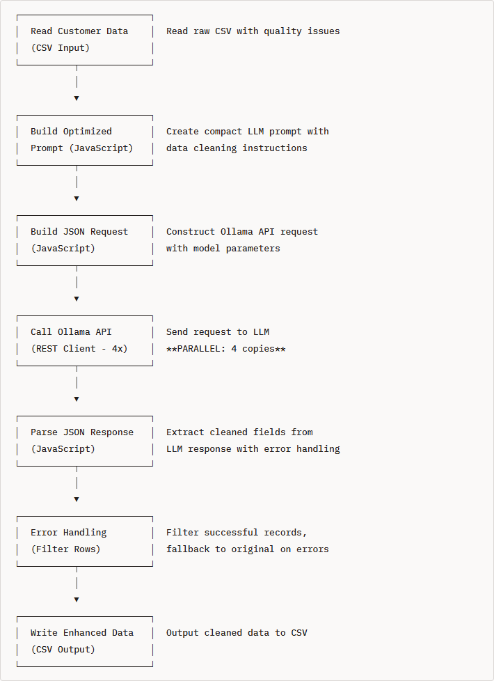
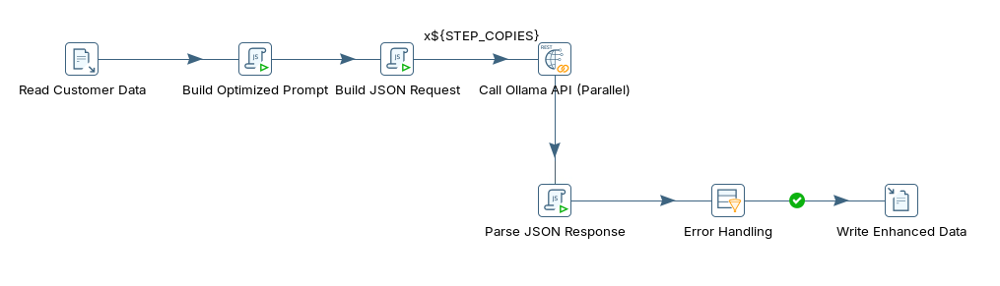
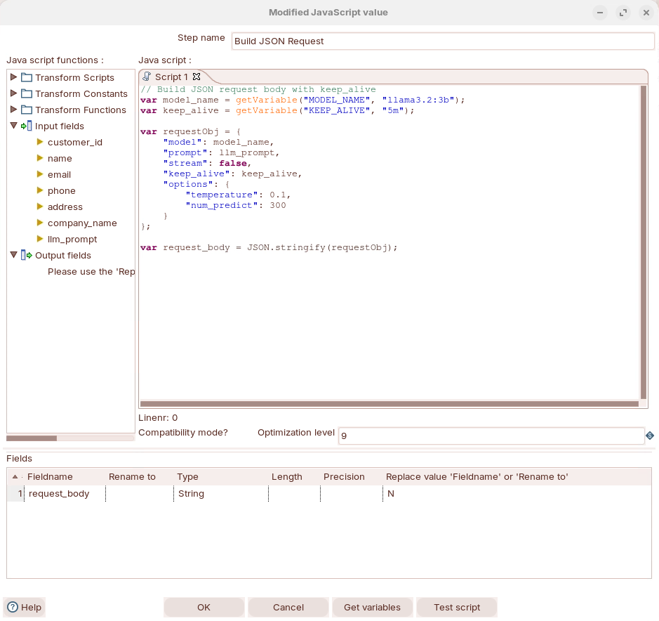
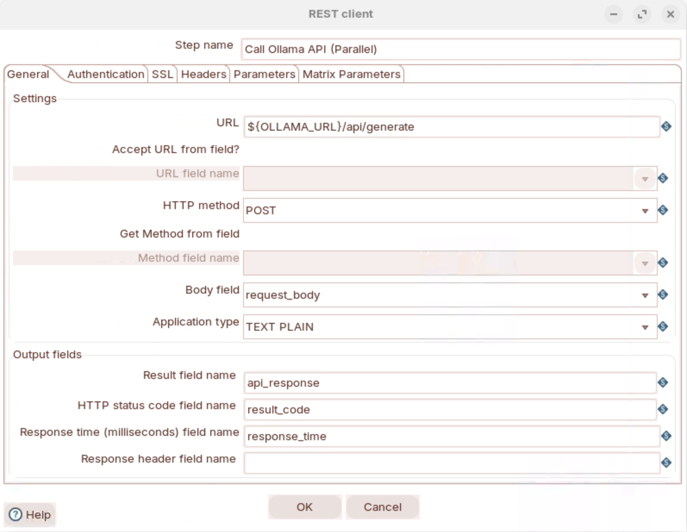

# Data Quality

> **Warning:**
>
> #### Workshop - Data Quality
> 
> Large Language Models (LLMs) can automatically clean, standardize, and enhance data quality in your ETL pipelines. This workshop uses Ollama with Pentaho Data Integration (PDI) to fix common data quality issues like inconsistent formatting, invalid data, and missing information.
> 
> Common data quality problems include inconsistent name formatting (john smith vs JOHN SMITH vs John Smith), invalid or malformed email addresses, multiple phone number formats (+1-555-123-4567 vs 555.123.4567 vs (555) 123-4567), incomplete or inconsistent addresses, and company name variations (ACME CORP vs Acme Corp vs acme corp).
> 
> In this workshop, you build a transformation that calls a local LLM to clean and standardize messy customer records and return structured JSON.
> 
> **What you'll do**
> 
> * Verify Ollama is installed and responding
> * Read messy customer records into a transformation
> * Call a local LLM to clean and standardize name, email, phone, and address fields
> * Return the cleaned data as structured JSON
> * Build `data_quality_optimized.ktr`
> 
> **Prerequisites:** Ollama running locally and Pentaho Data Integration (PDI) installed.
> 
> **Estimated time:** 35 minutes

**Traditional Solutions vs LLM Approach:**

| Approach               | Pros                                      | Cons                               |
| ---------------------- | ----------------------------------------- | ---------------------------------- |
| **Regex/Rules**        | Fast, deterministic                       | Brittle, requires constant updates |
| **Data Quality Tools** | Comprehensive                             | Expensive, complex setup           |
| **Manual Cleaning**    | Accurate                                  | Doesn't scale                      |
| **LLM Approach**       | Flexible, intelligent, handles edge cases | Requires LLM infrastructure        |

**Workflow**

<figure><figcaption><p>data_quailty_optimized</p></figcaption></figure>

1. Verify Ollama Installation

```bash
# Check if Ollama is responding
curl http://localhost:11434/api/tags
```

2. Run through the following steps to build `data_quality_optimized.ktr`:

:::: tabs

### 1. Data Quality

**Understanding Data Quality Challenges**

Step 1: Examine the Raw Data

Review the sample data, which ships with this lab:

[data_quality_customers.csv](./files/data_quality_customers.csv)

**Sample Records:**

```csv
customer_id,name,email,phone,address,company_name
1001,john smith,JSMITH@GMAIL.COM,555.123.4567,"123 main st apt 5, new york, ny","acme corp"
1002,SARAH JOHNSON,sarah.j@company,+1-555-987-6543,"456 oak avenue, los angeles, ca 90001",TechStart Inc
1005,JAMES WILSON,james@,555-999-8888,"PO Box 456, Seattle WA 98101","Cloud Services, Inc."
1010,Bob O'Brien,bob.obrien@tech.co,(555) 111-2222,"789 pine street suite 100, san francisco, ca 94102","AI Solutions LLC"
```

**Data Quality Issues Identified:**

| Customer | Name Issue | Email Issue       | Phone Issue    | Address Issue            | Company Issue |
| -------- | ---------- | ----------------- | -------------- | ------------------------ | ------------- |
| 1001     | Lowercase  | Mixed case        | Dots separator | Lowercase, abbreviations | Lowercase     |
| 1002     | All caps   | Incomplete domain | Valid format   | Good                     | Mixed case    |
| 1005     | Good       | Missing domain    | Dashes         | Abbreviations            | Good          |
| 1010     | Good       | Valid             | Parentheses    | Lowercase                | Good          |

Step 2: Define Quality Standards

Our target output standards:

| Field       | Standard Format                     | Example                           |
| ----------- | ----------------------------------- | --------------------------------- |
| **Name**    | Title Case                          | `John Smith`                      |
| **Email**   | <lowercase@domain.com> or `INVALID` | `jsmith@gmail.com`                |
| **Phone**   | +1-555-123-4567                     | `+1-555-123-4567`                 |
| **Address** | Street, City, State ZIP             | `123 Main St Apt 5, New York, NY` |
| **Company** | Proper Business Name                | `Acme Corp`                       |

Step 3: Traditional vs LLM Approach

> **Note:** **Common Data Quality Problems:**
> 
> * Inconsistent name formatting (john smith vs JOHN SMITH vs John Smith)
> * Invalid or malformed email addresses
> * Multiple phone number formats (+1-555-123-4567 vs 555.123.4567 vs (555) 123-4567)
> * Incomplete or inconsistent addresses
> * Company name variations (ACME CORP vs Acme Corp vs acme corp)

**Solution Comparison:**

| Approach               | Pros                                      | Cons                                              | Example                                |
| ---------------------- | ----------------------------------------- | ------------------------------------------------- | -------------------------------------- |
| **Regex/Rules**        | Fast, deterministic                       | Brittle, requires constant updates for edge cases | `phone.replace(/[^\d]/g, '')`          |
| **Data Quality Tools** | Comprehensive features                    | Expensive ($20K-$50K+), complex setup (weeks)     | Informatica, Talend DQ                 |
| **Manual Cleaning**    | 100% accurate                             | Doesn't scale, labor intensive                    | Excel find/replace                     |
| **LLM Approach**       | Flexible, intelligent, handles edge cases | Requires LLM infrastructure                       | `"Clean and standardize this data..."` |
|

### 2. API Endpoint

> **Note:**
>
> #### Ollama API Endpoint
> 
> Ollama provides a REST API at `http://localhost:11434`
> 
> **Key Endpoint:** `/api/generate`
> 
> **Sample Request Format**
> 
> ```json
> {
>   "model": "llama3.2:3b",
>   "prompt": "Clean this data. Return JSON: {\"name\":\"Title Case\",\"email\":\"valid@format\",\"phone\":\"+1-555-123-4567\",\"address\":\"St,City,ST ZIP\",\"company_name\":\"Proper Name\"}\nName:john smith\nEmail:JSMITH@GMAIL.COM\nPhone:555.123.4567\nAddr:123 main st apt 5, new york, ny\nCo:acme corp",
>   "stream": false,
>   "keep_alive": "5m",
>   "options": {
>     "temperature": 0.1,
>     "num_predict": 300
>   }
> }
> ```
> 
> **Key Parameters:**
> 
> * `model`: `llama3.2:3b` - Smaller, faster model optimized for structured tasks
> * `prompt`: Compact instructions with example format
> * `stream`: `false` - Get complete response at once
> * `keep_alive`: `"5m"` - Keep model loaded for 5 minutes (faster subsequent requests)
> * `temperature`: `0.1` - Low randomness for consistent formatting
> * `num_predict`: `300` - Limit output tokens
> 
> **Sample Response Format**
> 
> ```json
> {
>   "model": "llama3.2:3b",
>   "created_at": "2026-02-27T14:00:00.000Z",
>   "response": "{\"name\":\"John Smith\",\"email\":\"jsmith@gmail.com\",\"phone\":\"+1-555-123-4567\",\"address\":\"123 Main St Apt 5, New York, NY\",\"company_name\":\"Acme Corp\"}",
>   "done": true,
>   "total_duration": 1500000000,
>   "load_duration": 100000000,
>   "prompt_eval_count": 85,
>   "prompt_eval_duration": 200000000,
>   "eval_count": 45,
>   "eval_duration": 1200000000
> }
> ```
> 
> **Response Fields:**
> 
> * `response`: Contains the cleaned JSON data (as a string)
> * `done`: `true` when generation is complete
> * `prompt_eval_count`: Input tokens processed (85 tokens)
> * `eval_count`: Output tokens generated (45 tokens)
> * Total tokens: 130 tokens per record

1. Test the API manually, enter this command:

```bash
curl http://localhost:11434/api/generate -d '{
  "model": "llama3.2:3b",
  "prompt": "Clean this data. Return JSON: {\"name\":\"Title Case\",\"email\":\"valid@format\",\"phone\":\"+1-555-123-4567\",\"address\":\"St,City,ST ZIP\",\"company_name\":\"Proper Name\"}\nName:SARAH JOHNSON\nEmail:sarah.j@company\nPhone:+1-555-987-6543\nAddr:456 oak avenue, los angeles, ca 90001\nCo:TechStart Inc",
  "stream": false
}'
```

**Expected Response:**

```json
{
  "response": "{\"name\":\"Sarah Johnson\",\"email\":\"INVALID\",\"phone\":\"+1-555-987-6543\",\"address\":\"456 Oak Avenue, Los Angeles, CA 90001\",\"company_name\":\"TechStart Inc\"}"
}
```

> **Note:** Notice:
> 
> * Name converted to Title Case
> * Email marked as `INVALID` (incomplete domain `@company`)
> * Phone already in correct format
> * Address capitalized and formatted
> * Company name preserved (already correct)

### 3. Transformation

> **Note:**
>
> #### PDI Transformation

<figure><figcaption><p>data_quality</p></figcaption></figure>

[data_quality_customers.csv](./files/data_quality_customers.csv)

[data_quality_enhancement.ktr](./files/data_quality_enhancement.ktr) <button data-launch="spoon" data-path="files/data_quality_enhancement.ktr">Open in Pentaho Data Integration</button> <button data-graph="files/data_quality_enhancement.ktr">View graph</button>

[data_quality_enhancement_optimized.ktr](./files/data_quality_enhancement_optimized.ktr) <button data-launch="spoon" data-path="files/data_quality_enhancement_optimized.ktr">Open in Pentaho Data Integration</button> <button data-graph="files/data_quality_enhancement_optimized.ktr">View graph</button>

***

Run through the following steps to build `data_quality_optimized.ktr`:

::: tabs

### 1. Read Customer

> **Note:**
>
> #### CSV file input

x

x

x

x

### 2. Build prompt

> **Note:**
>
> #### JSON input
> 
> Creates the LLM prompt from input data
> 
> **Input**: Raw customer fields (name, email, phone, address, company\_name)\
> **Outpu**t: llm\_prompt (string)

x

x

**Build Optimized Prompt (Modified Java Script Value)**

JavaScript code:

```javascript
// Optimized short prompt - 50% shorter than basic version
var llm_prompt = "Clean this data. Return JSON: {\"name\":\"Title Case\",\"email\":\"valid@format\",\"phone\":\"+1-555-123-4567\",\"address\":\"St,City,ST ZIP\",\"company_name\":\"Proper Name\"}\nName:" + name + "\nEmail:" + email + "\nPhone:" + phone + "\nAddr:" + address + "\nCo:" + company_name;
```

> **Note:** **Prompt Optimization Techniques:**
> 
> ❌ Removed: Verbose explanations ("Clean and standardize this customer record...")
> 
> ❌ Removed: Detailed field descriptions ("Full Name in Title Case")
> 
> ✅ Kept: Clear format example in JSON
> 
> ✅ Kept: Abbreviated field labels to reduce tokens
> 
> **Result**: 50% shorter → 50% faster processing

x

x

x

### 3. Build request

> **Note:**
>
> #### Modifed JavaScript value
> 
> Wraps the prompt into Ollama API request format.
> 
> **Input**: llm\_prompt (from Step 2) + transformation parameters
> 
> **Output**: request\_body (JSON string ready for API)
> 
> Why separate? Handles API-specific configuration (model, temperature, keep\_alive). Separates prompt logic from API plumbing.

1. Double-click on the MJV - Build JSON prompt - to review the settimgs:

<figure><figcaption><p>Build API request</p></figcaption></figure>

**Build JSON Request (Modified Java Script Value)**

**Use `getVariable()` for Parameters**

```javascript
// =============================================================================
// OLLAMA API REQUEST BUILDER FOR PENTAHO DATA INTEGRATION (PDI)
// =============================================================================
// This script constructs a JSON request payload for Ollama's /api/generate
// endpoint, intended to run inside a PDI "Modified JavaScript" step.
//
// It takes an LLM prompt (built in a previous step or script block and stored
// in the `llm_prompt` variable) and wraps it in a properly configured API
// request body. The configuration is tuned for deterministic, concise LLM
// output — ideal for structured ETL tasks like classification, extraction,
// or summarization where consistency matters more than creativity.
//
// Key design decisions:
//   - Model and keep_alive are externalized as PDI variables so they can be
//     changed at the job/transformation level without editing this script.
//   - keep_alive keeps the model loaded in Ollama's memory between rows,
//     avoiding the costly model reload (~10-30s) on every request during
//     batch processing.
//   - Low temperature (0.1) ensures near-deterministic output, so the same
//     input produces the same result across runs — critical for reproducible
//     ETL pipelines.
//   - num_predict caps output length to prevent runaway generation, which
//     protects both processing time and memory usage.
//
// Prerequisites:
//   - `llm_prompt` must be defined in an earlier script block or mapped from
//     an incoming row field. It contains the fully constructed prompt with
//     any row-level data already interpolated.
//   - Ollama must be running and accessible from the PDI server (typically
//     at http://localhost:11434).
//   - The specified model must be pulled in Ollama (e.g., `ollama pull llama3.2:3b`).
//
// Output:
//   - `request_body`: A JSON string ready to be passed to a REST Client or
//     HTTP Post step targeting Ollama's /api/generate endpoint.
// =============================================================================

// ---------------------------------------------------------------------------
// RESOLVE PDI VARIABLES FOR MODEL CONFIGURATION
// ---------------------------------------------------------------------------
// getVariable() reads Kettle variables that can be set via:
//   - kettle.properties file
//   - A "Set Variables" step earlier in the transformation
//   - Command-line arguments (-param:MODEL_NAME=mistral:7b)
//   - Environment-level configuration in the Pentaho Server
//
// This externalization means the same transformation can target different
// models in dev vs. production without any code changes.

// MODEL_NAME: The Ollama model identifier to use for inference.
// Default: "llama3.2:3b" — a lightweight 3B parameter model that offers
// a good balance of speed and quality for structured tasks on CPU hardware.
// Can be overridden to larger models (e.g., "llama3.1:8b") for more complex
// tasks where accuracy is prioritized over throughput.
var model_name = getVariable("MODEL_NAME", "llama3.2:3b");

// KEEP_ALIVE: Duration Ollama keeps the model loaded in memory after each
// request. This is the most impactful performance setting for batch ETL —
// without it, Ollama unloads the model after each request (default: 5m),
// and reloading takes ~10-30 seconds depending on model size and disk speed.
// Default: "5m" (5 minutes) — sufficient for steady row-by-row processing.
// Increase to "30m" or higher for transformations with variable pacing or
// if rows arrive in bursts with gaps between them.
// Set to "0" to unload immediately after each request (saves memory but
// dramatically slows batch processing).
var keep_alive = getVariable("KEEP_ALIVE", "5m");

// ---------------------------------------------------------------------------
// BUILD THE OLLAMA API REQUEST OBJECT
// ---------------------------------------------------------------------------
// Constructs a JavaScript object matching the Ollama /api/generate schema.
// Each property controls a specific aspect of the inference request.
var requestObj = {

    // "model": Which Ollama model to invoke. Must match an installed model
    // name exactly (run `ollama list` to see available models).
    "model": model_name,

    // "prompt": The full prompt string to send to the model. This variable
    // should already contain the complete, formatted prompt with any
    // row-level data (e.g., review text, product names) interpolated in.
    // It is built in a prior step or script block in the transformation.
    "prompt": llm_prompt,

    // "stream": false — Returns the complete response as a single JSON
    // object rather than streaming tokens incrementally. Streaming is
    // useful for real-time chat UIs but unsuitable for PDI, which needs
    // the full response in one row field for downstream parsing.
    "stream": false,

    // "keep_alive": Passed directly to Ollama to control model residency
    // in memory. See variable definition above for detailed explanation.
    "keep_alive": keep_alive,

    // "options": Fine-grained inference parameters that control the model's
    // generation behavior. These are passed through to the underlying
    // llama.cpp engine that powers Ollama.
    "options": {

        // "temperature": 0.1 — Controls randomness in token selection.
        //   - 0.0 = fully deterministic (greedy decoding, always picks
        //           the highest-probability token)
        //   - 0.1 = near-deterministic with minimal variation — the sweet
        //           spot for structured ETL tasks where you want consistent,
        //           predictable output but allow the model slight flexibility
        //           to avoid degenerate repetition loops
        //   - 0.7-1.0 = creative/conversational (too unpredictable for ETL)
        //
        // For classification, extraction, and structured JSON output, keep
        // this at 0.1 or below to ensure reproducible results across runs.
        "temperature": 0.1,

        // "num_predict": 300 — Maximum number of tokens the model will
        // generate in its response. This acts as a safety cap to prevent:
        //   - Runaway generation (model gets stuck in loops)
        //   - Excessive processing time on long, unnecessary output
        //   - Memory bloat from unexpectedly large responses
        //
        // 300 tokens is approximately 200-250 words — sufficient for most
        // structured outputs like JSON sentiment results, classifications,
        // or short summaries. If responses are being truncated (check for
        // incomplete JSON), increase this value. If processing is slower
        // than needed, decrease it to match your actual output size.
        "num_predict": 300
    }
};

// ---------------------------------------------------------------------------
// SERIALIZE TO JSON STRING
// ---------------------------------------------------------------------------
// Converts the JavaScript object to a JSON string so it can be passed as
// the HTTP request body in a subsequent PDI "REST Client" step.
// The REST Client step should be configured with:
//   - URL: http://localhost:11434/api/generate
//   - HTTP Method: POST
//   - Body field: request_body
//   - Content-Type: application/json
var request_body = JSON.stringify(requestObj);
```

> **Note:** **Why `getVariable()`?**
> 
> * `"${MODEL_NAME}"` → **DOES NOT WORK** in JavaScript strings (stays literal)
> * `getVariable("MODEL_NAME", "llama3.2:3b")` → **WORKS** (resolves to actual value)

### 4. Ollama API

> **Note:**
>
> #### REST Client
> 
> The REST client transformation step enables you to consume RESTful services.
> 
> Representational State Transfer (REST) is a key design idiom that embraces a stateless client-server architecture in which web services are viewed as resources and can be identified by their URLs.
> 
> You can escape input field data by using the Calculator step and the Mask XML content from string A or Escape HTML content function.

1. Double-click on the REST client step to review settings:

<figure><figcaption><p>Call Ollama API</p></figcaption></figure>

**Call Ollama API (Parallel) - REST Client**

Configuration:

* **Step Type**: `REST Client` (Rest)
* **Method**: `POST`
* **URL**: `${OLLAMA_URL}/api/generate`
* **Body Field**: `request_body`
* **Application type:** `TEXT PLAIN`
* **Result Fields**:
  * Name: `api_response`
  * Code: `result_code`
  * Response time: `response_time`
* **Headers**: *(leave empty - REST Client auto-adds Content-Type)*
* **Step Copies**: `${STEP_COPIES}` → Default: 4 (parallel processing)

**Step 7: Write Enhanced Data (Text File Output)**

Configuration:

* **Filename**: `../data/customer_data_enhanced_optimized`
* **Extension**: `.csv`
* **Add date**: `Y` (adds `_20260227`)
* **Add time**: `Y` (adds `_134529`)
* **Result**: `customer_data_enhanced_optimized_20260227_134529.csv`
* **Fields**: `customer_id`, `enhanced_name`, `enhanced_email`, `enhanced_phone`, `enhanced_address`, `enhanced_company`

#### Transformation Parameters

**Basic Transformation (`data_quality_enhancement.ktr`)**

| Parameter   | Default Value                    | Description                    |
| ----------- | -------------------------------- | ------------------------------ |
| OLLAMA\_URL | <http://localhost:11434>         | Ollama API endpoint            |
| MODEL\_NAME | llama3.2:3b                      | Model to use for data cleaning |
| INPUT\_FILE | ../data/customer\_data\_raw\.csv | Input data path                |

**Optimized Transformation (`data_quality_enhancement_optimized.ktr`)**

| Parameter        | Default Value                    | Description                                   |
| ---------------- | -------------------------------- | --------------------------------------------- |
| OLLAMA\_URL      | <http://localhost:11434>         | Ollama API endpoint                           |
| MODEL\_NAME      | llama3.2:3b                      | Model to use (llama3.2:3b recommended)        |
| INPUT\_FILE      | ../data/customer\_data\_raw\.csv | Input data path                               |
| **KEEP\_ALIVE**  | **5m**                           | **Keep model in memory (5m/15m/30m/60m)**     |
| **STEP\_COPIES** | **4**                            | **Parallel API calls (set to CPU cores - 1)** |

**Parameter Tuning Guide:**

| CPU Cores | STEP\_COPIES | Expected Throughput |
| --------- | ------------ | ------------------- |
| 4 cores   | 4            | 1.0-1.2 rec/sec     |
| 8 cores   | 6-8          | 1.5-2.0 rec/sec     |
| 16 cores  | 12-14        | 2.5-3.5 rec/sec     |

#### Tested Configuration (Verified Working ✅)

**Test Environment:**

* OS: Ubuntu 22.04 Linux
* PDI: 11.0.0.0-237
* Ollama: Latest
* Model: llama3.2:3b
* CPU: 4 cores
* RAM: 16GB

**Verified Parameters:**

```bash
OLLAMA_URL=http://localhost:11434
MODEL_NAME=llama3.2:3b
STEP_COPIES=4
KEEP_ALIVE=5m
INPUT_FILE=../data/customer_data_raw.csv
```

x

x

### 5. Response

> **Note:**
>
> #### Modified JavaScript Value

x

**Parse JSON Response (Modified Java Script Value)**

````javascript
// ============================================================
// OLLAMA API RESPONSE PARSER
// Purpose: Extracts AI-enhanced contact fields from the raw
// Ollama API response, falling back to original values if
// parsing fails at any stage.
// ============================================================

// --- Initialize output variables with original (fallback) values ---
// These ensure downstream steps always receive valid data even if
// parsing fails. The enhanced_* variables will be overwritten only
// if valid AI-enhanced values are successfully extracted.
var enhanced_name    = name;          // Fallback: original name field from stream
var enhanced_email   = email;         // Fallback: original email field from stream
var enhanced_phone   = phone;         // Fallback: original phone field from stream
var enhanced_address = address;       // Fallback: original address field from stream
var enhanced_company = company_name;  // Fallback: original company_name field from stream

// --- Initialize error tracking variables ---
// parsing_error acts as a Y/N flag for downstream error routing steps
// error_message captures the specific failure reason for logging/debugging
var parsing_error = "N";   // Default: assume success until a failure is caught
var error_message = "";    // Default: empty; populated only on failure

try {
    // --- Stage 1: Parse the outer Ollama API response envelope ---
    // The raw api_response field is a JSON string returned by the Ollama REST API.
    // Its structure is: { "model": "...", "response": "<model output>", ... }
    // We parse it first to extract the inner "response" string produced by the LLM.
    var response = JSON.parse(api_response);

    // The "response" property contains the raw text generated by the LLM.
    // This may include prose, markdown, code fences, or other formatting
    // in addition to the JSON payload we actually need.
    var fullResponse = response.response;

    // --- Stage 2: Locate the embedded JSON object within the LLM output ---
    // LLMs often wrap JSON in explanatory text (e.g. "Here is the result: {...}"),
    // markdown code fences (```json ... ```), or other surrounding content.
    // To handle this robustly, we scan for the first "{" and last "}" rather
    // than assuming the entire response string is valid JSON.
    var jsonStart = fullResponse.indexOf("{");           // Position of opening brace
    var jsonEnd   = fullResponse.lastIndexOf("}") + 1;  // Position after closing brace

    // --- Stage 3: Extract and parse the embedded JSON if found ---
    if (jsonStart >= 0 && jsonEnd > jsonStart) {
        // Slice out only the JSON substring, discarding any surrounding text.
        // Example: "Sure! Here you go: {\"name\":\"...\"} Hope that helps!"
        //           becomes → {"name":"..."}
        var jsonStr = fullResponse.substring(jsonStart, jsonEnd);

        // Parse the extracted JSON string into a JavaScript object.
        // If the LLM produced malformed JSON this will throw and be caught below.
        var data = JSON.parse(jsonStr);

        // --- Stage 4: Map parsed fields to output variables ---
        // Use the AI-enhanced value if present and non-empty; otherwise keep
        // the original field value as the fallback (|| operator handles null,
        // undefined, and empty string cases from the parsed object).
        enhanced_name    = data.name         || name;
        enhanced_email   = data.email        || email;
        enhanced_phone   = data.phone        || phone;
        enhanced_address = data.address      || address;
        enhanced_company = data.company_name || company_name;

    } else {
        // --- Failure path: No JSON object detected in the LLM output ---
        // The model may have returned a plain-text response, an apology,
        // or a refusal. Flag the error and preserve the original fallback values.
        parsing_error = "Y";
        error_message = "No JSON found in response";
    }

} catch(e) {
    // --- Failure path: A JSON.parse() call threw a SyntaxError ---
    // This catches two possible failure points:
    //   1. The outer Ollama envelope was malformed (Stage 1 failure)
    //   2. The extracted JSON substring was malformed (Stage 3 failure)
    // In both cases we fall back to the original field values initialized above.
    parsing_error = "Y";
    error_message = e.message || "Parse error";  // Use exception message if available
}
````

> **Note:** **Error Handling Strategy:**
> 
> * Start with original values as fallback
> * Try to parse Ollama JSON response
> * Extract JSON object from response text (handles markdown code blocks)
> * Parse individual fields with fallback to original
> * Set `parsing_error = "Y"` if anything fails
> * Keep original values on error

x

x

x

### 6. Error

> **Note:**
>
> #### Filter rows

x

x

**Error Handling (Filter Rows)**

Filter condition: `parsing_error = "N"`

* **Send TRUE to**: "Write Enhanced Data" (successfully cleaned records)
* **Send FALSE to**: *(nowhere - discard failed records or log separately)*

x

x

:::

### 4. RUN

x

x

x

x

x

x

::::

