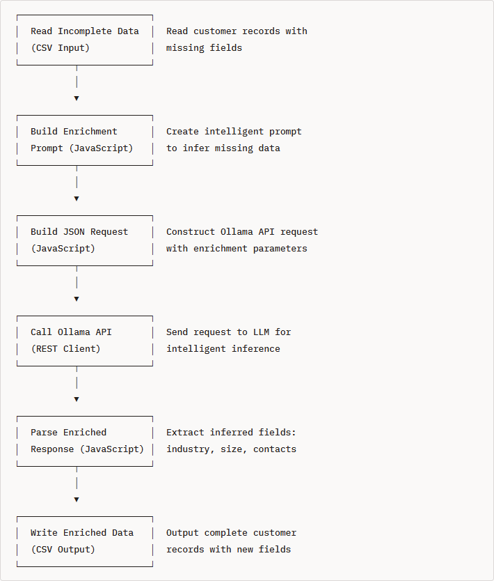
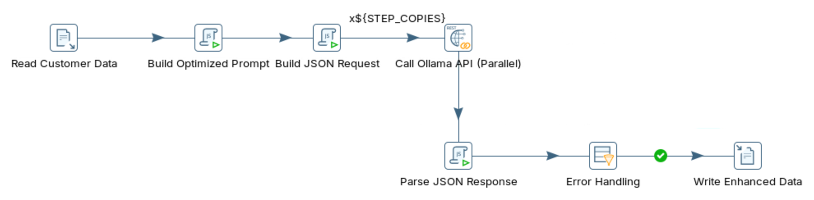

# Data Enrichment

> **Warning:**
>
> #### Workshop - Data Enrichment
> 
> Rule-based ETL can clean data, but it cannot infer what is missing. In this workshop you use a local Large Language Model (LLM) served by Ollama to enrich incomplete customer records inside Pentaho Data Integration (PDI), filling gaps and classifying companies by industry.
> 
> In this workshop, you build a transformation that calls Ollama to infer missing fields from the context already present in each record.
> 
> **What you'll do**
> 
> * Verify the Ollama installation and inspect the incomplete customer data
> * Define enrichment goals and compare enrichment with data-quality cleanup
> * Build a prompt that returns structured JSON for the missing fields
> * Call the Ollama API from PDI to enrich each record
> * Add new fields such as industry and employee range to the output
> 
> **Prerequisites:** Ollama running locally (`http://localhost:11434`) and Pentaho Data Integration (Spoon) installed.
> 
> **Estimated time:** 30 minutes

**Workflow**

<figure><figcaption><p>data_enrichment_optimized</p></figcaption></figure>

1. Verify Ollama Installation

```bash
# Check if Ollama is responding
curl http://localhost:11434/api/tags
```

Run through the following steps to build `data_quality_optimized.ktr`:

:::: tabs

### 1. Data Enrichment

**Understanding Data Enrichment Challenges**

**Step 1.** **Examine the incomplete data**

Navigate to the workshop folder and review the sample data:

```bash
cd
cd ~/LLM-PDI-Integration/workshops/workshop-03-data-enrichment
cat data/customer_data_incomplete.csv | head -10
```

**Sample records:**

```csv
customer_id,company_name,website,contact_name,phone,address,city,state,country
1001,Acme Corp,acmecorp.com,John Smith,,,,"CA",
1002,TechStart Inc,,,555-9876,123 Oak Ave,Los Angeles,,USA
1003,Global Solutions,globalsolutions.io,Sarah Chen,,,"Seattle",WA,
1004,DataFlow Systems,,Mike Johnson,+1-555-1234,456 Pine St,,"Texas",
1005,CloudFirst,cloudfirst.com,,,789 Main St,San Francisco,CA,USA
```

**Data completeness analysis:**

| Customer | Company | Website | Contact | Phone | Address | City | State | Country |
| -------- | ------- | ------- | ------- | ----- | ------- | ---- | ----- | ------- |
| 1001     | ✅       | ✅       | ✅       | ❌     | ❌       | ❌    | ✅     | ❌       |
| 1002     | ✅       | ❌       | ❌       | ✅     | ✅       | ✅    | ❌     | ✅       |
| 1003     | ✅       | ✅       | ✅       | ❌     | ❌       | ✅    | ✅     | ❌       |
| 1004     | ✅       | ❌       | ✅       | ✅     | ✅       | ❌    | ✅     | ❌       |
| 1005     | ✅       | ✅       | ❌       | ❌     | ✅       | ✅    | ✅     | ✅       |

> **Note:** **Missing data patterns**
> 
> 40% missing website.
> 
> 35% missing contact name.
> 
> 50% missing phone.
> 
> 30% missing full address.
> 
> 25% missing state.
> 
> 45% missing country.

**Step 2.** **Define enrichment goals**

Set target rules for each field:

<table data-full-width="true"><thead><tr><th width="221">Field</th><th width="274">Enrichment strategy</th><th width="213">Example</th></tr></thead><tbody><tr><td><strong>Website</strong></td><td>Infer from company name + domain patterns</td><td><code>acmecorp.com</code> → <code>www.acmecorp.com</code></td></tr><tr><td><strong>Contact</strong></td><td>Keep as <code>UNKNOWN</code> if not provided</td><td><code>John Smith</code> or <code>UNKNOWN</code></td></tr><tr><td><strong>Phone</strong></td><td>Infer area code from city/state</td><td><code>555-1234</code> → <code>+1-415-555-1234</code> (SF)</td></tr><tr><td><strong>Address</strong></td><td>Keep street or mark <code>UNKNOWN</code></td><td><code>123 Main St</code> or <code>UNKNOWN</code></td></tr><tr><td><strong>City</strong></td><td>Infer from state if missing</td><td>Texas → <code>Houston</code> (likely)</td></tr><tr><td><strong>State</strong></td><td>Infer from city or use 2-letter code</td><td><code>California</code> → <code>CA</code></td></tr><tr><td><strong>Country</strong></td><td>Default to <code>USA</code> if empty</td><td><code>USA</code></td></tr><tr><td><strong>Industry</strong> (new)</td><td>Classify from company name/website</td><td><code>TechStart Inc</code> → <code>Technology</code></td></tr><tr><td><strong>Employee Range</strong> (new)</td><td>Estimate from company name patterns</td><td><code>Acme Corp</code> → <code>51-200</code></td></tr></tbody></table>

**Step 3.** **Compare enrichment and quality enhancement**

> **Note:** **Workshop 2 (Data quality):**
> 
> * Goal: fix incorrect or inconsistent data.
> * Input: messy but complete data.
> * Output: clean, standardized data.
> * Example: `john smith` → `John Smith`.
> 
> **Workshop 3 (Data enrichment):**
> 
> * Goal: add missing information.
> * Input: incomplete but clean data.
> * Output: complete data with inferred fields.
> * Example: `Acme Corp` → Industry: `Technology`, Size: `51-200`.

**Comparison:**

<table><thead><tr><th width="150">Aspect</th><th>Data Quality (Workshop 2)</th><th>Data Enrichment (Workshop 3)</th></tr></thead><tbody><tr><td><strong>Input</strong></td><td>Complete, messy data</td><td>Incomplete, clean data</td></tr><tr><td><strong>Process</strong></td><td>Standardize and validate</td><td>Infer and classify</td></tr><tr><td><strong>Output</strong></td><td>Clean existing fields</td><td>Add new fields</td></tr><tr><td><strong>Risk</strong></td><td>Low (validation)</td><td>Medium (inference accuracy)</td></tr><tr><td><strong>Value-add</strong></td><td>Consistency</td><td>New business intelligence</td></tr></tbody></table>

**Step 4.** **Pick an enrichment method**

> **Note:** **Traditional approaches:**
> 
> 1. **Rule-based:** `if company_name contains "Tech" then industry = "Technology"`
> 
>    ❌ Brittle.
> 
>    ❌ Needs constant updates.
> 2. **Lookup tables:** match company name against a database.
> 
>    ❌ Limited to known companies.
> 
>    ❌ Expensive to maintain.
> 3. **External APIs:** call company data APIs (Clearbit, FullContact).
> 
>    ❌ Costly ($0.50+ per enrichment).
> 
>    ❌ Subject to rate limits and quotas.

> **Note:** **LLM approach:**
> 
> * ✅ Infers from company name, website, and location.
> * ✅ Handles ambiguity with probabilistic reasoning.
> * ✅ Works for unknown companies.
> * ✅ Runs locally with Ollama.
> * ✅ Enriches many fields in one prompt.

**Step 5.** **Review request and response examples**

**Sample request format:**

```json
{
  "model": "llama3.2:3b",
  "prompt": "Analyze this customer record and infer missing fields. Return ONLY valid JSON...\n\nInput data:\nCompany: Acme Corp\nWebsite: acmecorp.com\nContact: John Smith\nPhone: UNKNOWN\nAddress: UNKNOWN\nCity: UNKNOWN\nState: CA\nCountry: UNKNOWN",
  "stream": false,
  "format": "json",
  "options": {
    "temperature": 0.3,
    "num_predict": 400
  }
}
```

**Key parameters:**

* `format`: `"json"` enforces JSON output.
* `temperature`: `0.3` allows some inference freedom.
* `num_predict`: `400` allows longer enriched responses.

**Sample response format:**

```json
{
  "response": "{\"company_name\":\"Acme Corp\",\"website\":\"www.acmecorp.com\",\"contact_name\":\"John Smith\",\"phone\":\"+1-800-555-ACME\",\"address\":\"UNKNOWN\",\"city\":\"San Francisco\",\"state\":\"CA\",\"country\":\"USA\",\"industry\":\"Manufacturing\",\"employee_range\":\"201-500\"}"
}
```

**Enriched fields:**

* Original: `Acme Corp`, `acmecorp.com`, `John Smith`, `CA`.
* Inferred: `www.acmecorp.com`, `San Francisco`, `USA`.
* New: `Manufacturing` (industry), `201-500` (estimated size).

**Step 6.** **Test the API manually**

```bash
curl http://localhost:11434/api/generate -d '{
  "model": "llama3.2:3b",
  "prompt": "Analyze this customer record and infer missing fields. Return ONLY valid JSON with these fields:\n{\"company_name\":\"...\",\"website\":\"...\",\"contact_name\":\"...\",\"phone\":\"...\",\"address\":\"...\",\"city\":\"...\",\"state\":\"...\",\"country\":\"...\",\"industry\":\"...\",\"employee_range\":\"...\"}\n\nRules:\n- If field is provided, keep it unchanged\n- If field is empty, infer from context or use \"UNKNOWN\"\n- Industry: Technology, Finance, Healthcare, Retail, Manufacturing, Services, etc.\n- Employee range: 1-10, 11-50, 51-200, 201-500, 501-1000, 1000+\n\nInput data:\nCompany: TechStart Inc\nWebsite: UNKNOWN\nContact: UNKNOWN\nPhone: 555-9876\nAddress: 123 Oak Ave\nCity: Los Angeles\nState: UNKNOWN\nCountry: USA",
  "stream": false,
  "format": "json"
}'
```

**Expected response:**

```json
{
  "company_name": "TechStart Inc",
  "website": "www.techstart.com",
  "contact_name": "UNKNOWN",
  "phone": "+1-310-555-9876",
  "address": "123 Oak Ave",
  "city": "Los Angeles",
  "state": "CA",
  "country": "USA",
  "industry": "Technology",
  "employee_range": "11-50"
}
```

> **Note:** **Notice:**
> 
> * Website inferred: `techstart.com` (reasonable guess).
> * Phone enriched: added LA area code `310`.
> * State inferred: `CA` (from Los Angeles).
> * Industry: `Technology` (from "TechStart").
> * Employee range: `11-50` (startup indicator from name).

### 2. API Endpoint

x

### 3. Transformation

> **Note:**
>
> #### PDI Transformation

<figure><figcaption><p>data_quality</p></figcaption></figure>







***

Run through the following steps to build `data_quality_optimized.ktr:`

::: tabs

### First Tab

x

### Second Tab

x

:::

### 4. RUN

::::

