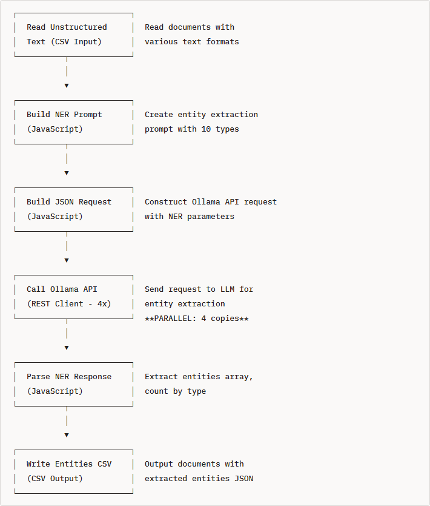
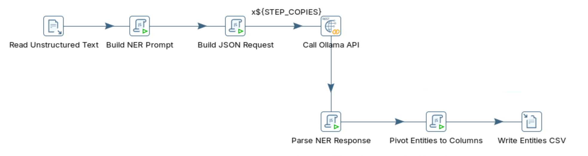

# Named Entity Recognition

> **Warning:**
>
> #### Workshop - Named Entity Recognition
> 
> Named Entity Recognition (NER) is the NLP task of identifying and classifying named entities such as people, organizations, locations, and dates from unstructured text. This workshop uses a local LLM served by Ollama, called from Pentaho Data Integration (PDI), to extract and classify those entities.
> 
> In this workshop, you build a transformation that sends free text to an LLM and parses the structured entities it returns.
> 
> **What you'll do**
> 
> * Verify your local Ollama installation is responding
> * Send unstructured text to an LLM endpoint from PDI
> * Prompt the model to extract named entities as structured output
> * Parse the LLM response into pipeline rows
> * Build and run `named_entity_recognition_optimized.ktr`
> 
> **Prerequisites:** Ollama running locally and Pentaho Data Integration (PDI) installed. Familiarity with basic transformation concepts (steps, hops, preview).
> 
> **Estimated time:** 30 minutes

**Workflow**

<figure><figcaption><p>named_entity_recognition_optimized</p></figcaption></figure>

1. Verify Ollama Installation

```bash
# Check if Ollama is responding
curl http://localhost:11434/api/tags
```

2. Run through the following steps to build `named_entity_recognition_optimized.ktr`:

:::: tabs

### 1. NER?

> **Note:**
>
> #### Named Entity Recognition
> 
> Named Entity Recognition (NER) is the process of identifying and classifying named entities in unstructured text into predefined categories.

**Example Input:**

```
"Hi, this is Sarah Johnson from Acme Corporation. I'm writing about the order
I placed on December 15th, 2024. Please contact me at sarah.johnson@acmecorp.com"
```

**Example Output (Extracted Entities):**

```json
[
  {"entity": "Sarah Johnson", "type": "PERSON", "context": "this is Sarah Johnson from"},
  {"entity": "Acme Corporation", "type": "ORGANIZATION", "context": "Sarah Johnson from Acme Corporation"},
  {"entity": "December 15th, 2024", "type": "DATE", "context": "order I placed on December 15th"},
  {"entity": "sarah.johnson@acmecorp.com", "type": "CONTACT", "context": "contact me at sarah.johnson@acmecorp.com"}
]
```

#### Entity Types in This Workshop

| Entity Type      | Description                  | Examples                                           |
| ---------------- | ---------------------------- | -------------------------------------------------- |
| **PERSON**       | Names of people              | Sarah Johnson, Dr. Michael Chen, CEO Richard Davis |
| **ORGANIZATION** | Companies, institutions      | Acme Corp, Stanford University, FBI                |
| **LOCATION**     | Cities, addresses, buildings | San Francisco, 123 Main St, Room 405               |
| **DATE**         | Dates and times              | December 15th 2024, Feb 1st, 10:30 AM PST          |
| **PRODUCT**      | Product names/models         | iPhone 16, UltraBook Pro X1, Widget X-200          |
| **MONEY**        | Currency amounts             | $125,000, £250,000 GBP, $1,899.99                  |
| **CONTACT**      | Emails, phone numbers        | <user@company.com>, 555-123-4567, ext. 4521        |
| **ID**           | Identifiers, tracking codes  | CUST-98765, INV-2024-0089, ORD-2025-5678           |
| **TECHNOLOGY**   | Software, platforms          | AWS, Python, TensorFlow, Docker                    |
| **POSITION**     | Job titles, roles            | CEO, Project Manager, CFO, VP of Engineering       |

> **Note:** **Why Use LLMs for NER?**
> 
> Traditional NER approaches (rule-based, statistical models, pre-trained NER models) have limitations:
> 
> **Traditional Approach Challenges:**
> 
> * Requires extensive labeled training data
> * Struggles with domain-specific entities
> * Fixed entity type schemas
> * Poor performance on new/rare entity types
> * Cannot adapt to context easily
> 
> **LLM-Based NER Advantages:**
> 
> * Zero-shot extraction (no training data needed)
> * Flexible entity type definitions
> * Handles multiple domains simultaneously
> * Contextual understanding (disambiguates entities)
> * Easy to add new entity types via prompt engineering
> * Extracts relationships and context

> **Note:** **Real-World Use Cases:**
> 
> * **Customer Service** - Extract customer names, IDs, product references, dates from support tickets
> * **Legal/Compliance** - Identify parties, dates, amounts, locations in contracts
> * **Log Analysis** - Extract usernames, IP addresses, error codes, timestamps
> * **Business Intelligence** - Pull company names, products, revenue figures from reports
> * **Healthcare** - Extract patient names, medications, dates, doctors from medical records
> * **Email Processing** - Identify senders, recipients, dates, action items, referenced documents

### 2. API Endpoint

### 3. Transformation

> **Note:**
>
> #### PDI Transformation

<figure><figcaption><p>named_entity_recognition</p></figcaption></figure>









Run through the following steps to build `named_entity_recognition_optimized.ktr`&#x20;

***

::: tabs

### First Tab

x

### Second Tab

x

:::

### 4. RUN

x

x

x

x

x

::::

