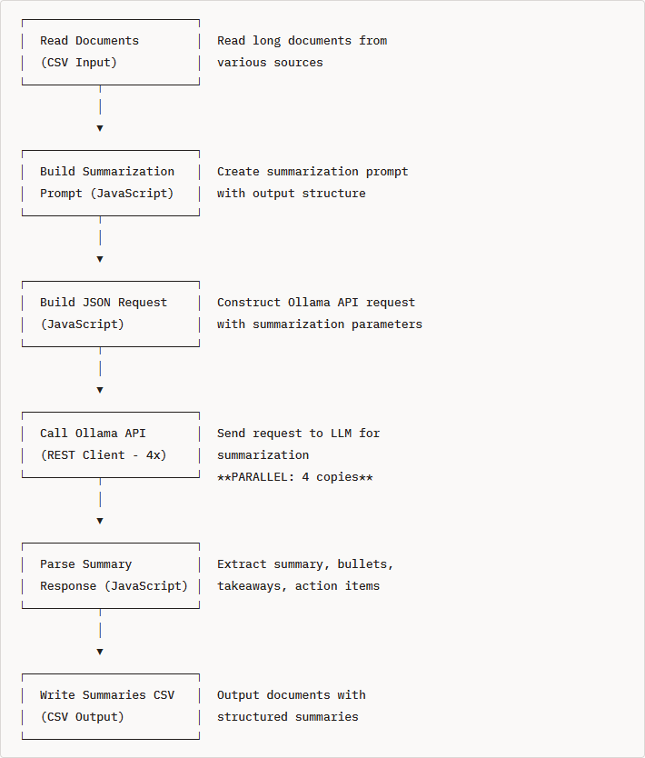
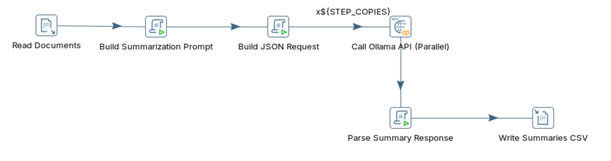

# Text Summarization

> **Warning:**
>
> #### Workshop - Text Summarization
> 
> Large volumes of documentation are hard to act on quickly. A local LLM can condense long free-text into concise, actionable summaries.
> 
> In this workshop, you build a Pentaho Data Integration (PDI) transformation that sends long documents to a local Ollama model and captures the generated summary alongside the source records.
> 
> **What you'll do**
> 
> * Verify the local Ollama installation is responding
> * Read long free-text documents into the transformation
> * Send each document to a local LLM for abstractive summarization
> * Capture the concise summary ready to store with the source record
> * Build and run `text_summarization_optimized.ktr` in Spoon
> 
> **Prerequisites:** Ollama running locally and Pentaho Data Integration (PDI) installed.
> 
> **Estimated time:** 30 minutes

**Workflow**

<figure><figcaption><p>text_summarization_optimized</p></figcaption></figure>

1. Verify Ollama Installation

```bash
# Check if Ollama is responding
curl http://localhost:11434/api/tags
```

2. Run through the following steps to build `text_summarization_optimized.ktr`:

::: tabs

### Text Summarization

> **Note:**
>
> #### What is Text Summarization?
> 
> Text summarization is the process of condensing long documents into shorter versions while preserving the most important information and key points.

**Example Input (Meeting Notes, 450 words):**

```
Meeting held on February 15, 2025, in Conference Room A. Attendees: Sarah Johnson (CEO), Michael Chen (CTO), Jennifer Williams (VP Product), Robert Smith (VP Sales), and Linda Martinez (VP Marketing). The meeting focused on our Q1 2025 product strategy and roadmap priorities. Sarah opened the meeting by reviewing Q4 2024 performance, noting that revenue exceeded targets by 23% at $45.6 million, driven primarily by enterprise sales in North America. Michael presented the technical roadmap, highlighting three major initiatives...
```

**Example Output (Summarization):**

```json
{
  "summary": "Q1 2025 product strategy meeting covered Q4 performance review (revenue up 23% to $45.6M), technical roadmap with three major initiatives (AI platform, cloud integrations, mobile redesign), customer feedback analysis prioritizing reporting dashboards and collaboration tools, and sales pipeline projecting $38-42M for Q1.",
  "bullet_points": [
    "Q4 2024 revenue exceeded targets by 23% at $45.6 million",
    "Three major technical initiatives: AI analytics platform (March 15), cloud integrations (April), mobile redesign (May)",
    "Top customer requests: advanced reporting, real-time collaboration, API documentation",
    "Q1 sales pipeline: $38-42M projected with 15 major deals totaling $12M",
    "$2.5M marketing budget approved for Q1 campaigns"
  ],
  "key_takeaways": [
    "Strong Q4 performance driven by enterprise North American sales",
    "60% of engineering resources allocated to top customer feature requests",
    "Focus on thought leadership marketing strategy with conferences and webinars"
  ],
  "action_items": [
    "Michael: Finalize API documentation by March 1st",
    "Jennifer: Create customer advisory board by February 28th",
    "Robert: Implement new sales playbook by March 15th",
    "Linda: Launch website redesign by March 30th"
  ]
}
```

**Summarization Types**

| Type              | Description                          | Use Case                       | Length Reduction |
| ----------------- | ------------------------------------ | ------------------------------ | ---------------- |
| **Extractive**    | Selects key sentences from original  | Quick overview, news           | 50-70%           |
| **Abstractive**   | Generates new text capturing meaning | Executive summary, reports     | 70-90%           |
| **Bullet Points** | Lists key points/                    | Action tracking, presentations | 80-95%           |
| **Key Takeaways** | Main insights and conclusions        | Decision support               | 85-95%           |

> **Note:** **LLM-Based Summarization (This Workshop)** uses **abstractive** methods to generate concise, coherent summaries that:
> 
> * Rephrase content in clearer language
> * Combine related concepts
> * Identify and extract action items
> * Prioritize most important information
> * Adapt to different document types

> **Note:**
>
> #### Why Use LLMs for Summarization?
> 
> Traditional summarization approaches (extractive algorithms, keyword extraction, TF-IDF) have limitations:
> 
> **Traditional Approach Challenges:**
> 
> * Cannot rephrase or generate new text
> * Miss implicit meaning and context
> * Struggle with complex document structures
> * Limited to sentence selection
> * No understanding of priorities or importance
> 
> **LLM-Based Summarization Advantages:**
> 
> * True abstractive summarization (rewrites in clearer language)
> * Understands context and implicit information
> * Adapts to different document types automatically
> * Can extract different summary formats (bullets, paragraphs, action items)
> * Handles technical, business, and conversational text equally well
> * Multi-language capable
> * Identifies action items and key decisions

> **Note:**
>
> #### Real-World Use Cases
> 
> * **Executive Reporting** - Summarize weekly status reports, meeting notes, project updates for leadership review
> * **Customer Service** - Condense customer complaint details and email threads for quick agent review
> * **Legal/Compliance** - Extract key terms, obligations, and deadlines from contracts and legal documents
> * **Research & Analysis** - Summarize academic papers, market research, technical documentation
> * **Email Management** - Create brief summaries of long email threads for quick scanning
> * **Content Curation** - Generate summaries for news articles, blog posts, industry reports
> * **Meeting Documentation** - Convert meeting transcripts into summaries with action items
> * **Technical Documentation** - Create executive-friendly summaries of technical specifications

### API Endpoint

x

### Transformation

> **Note:**
>
> #### PDI Transformation

<figure><figcaption><p>text_summarization</p></figcaption></figure>









***

Run through the following steps to build `text_summarization_optimized.ktr`&#x20;


x

x

x

x

### RUN

:::

