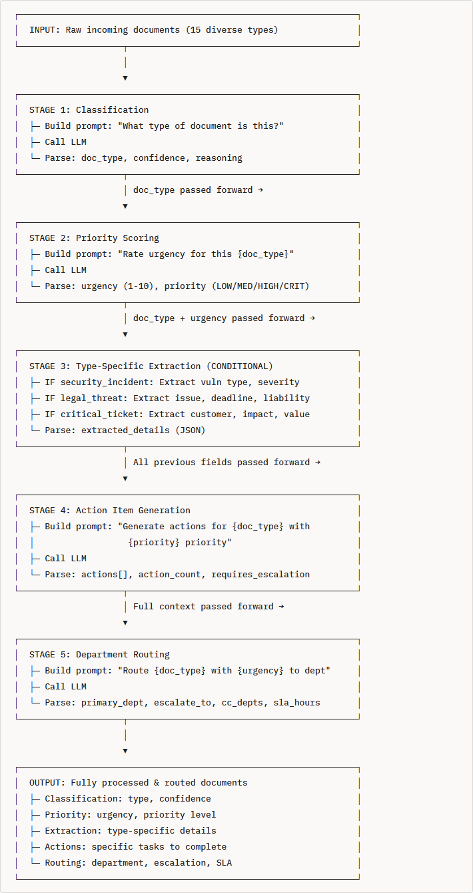
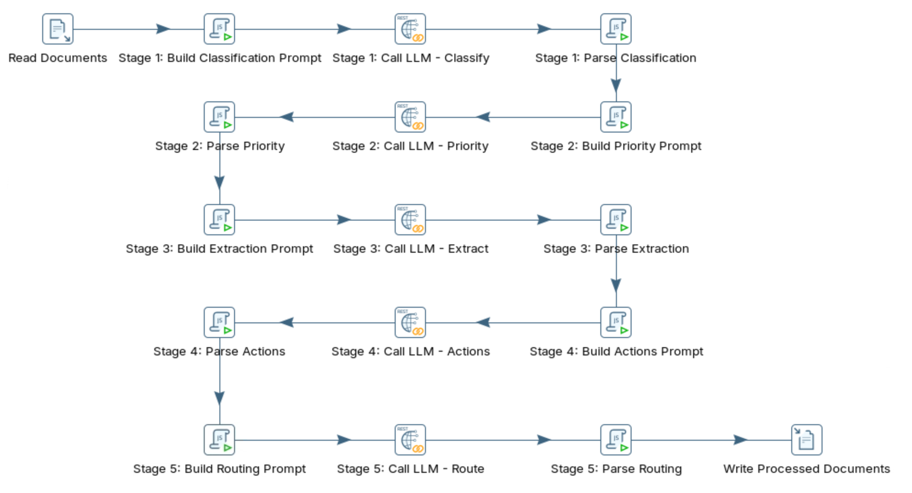

# Multi-staged

> **Warning:**
>
> #### Workshop - Multi-staged
> 
> This workshop teaches the most advanced LLM-ETL pattern: **multi-stage pipelines** where multiple LLM calls are chained sequentially in PDI, with each stage building on the outputs of previous stages.
> 
> In this workshop, you build a `.ktr` transformation in Spoon that chains several local Ollama LLM calls into a single intelligent document router.
> 
> **What you'll do**
> 
> * Verify your local Ollama installation is responding
> * Chain multiple LLM calls sequentially so each stage builds on previous outputs
> * Apply conditional logic that adapts processing based on an earlier classification
> * Use specialized, focused prompts so each stage performs one task
> * Add error isolation so a failure in one stage doesn't break the pipeline
> * Track decisions at each stage for auditability
> 
> **Prerequisites:** Ollama running locally and Pentaho Data Integration (Spoon) installed.
> 
> **Estimated time:** 45 minutes

**Workflow**

<figure><figcaption><p>multi_staged_optimized</p></figcaption></figure>

1. Verify Ollama Installation

```bash
# Check if Ollama is responding
curl http://localhost:11434/api/tags
```

2. Run through the following steps to build `multi_staged_optimized.ktr`:

:::: tabs

### 1. Multi-staged LLM

> **Note:**
>
> #### What is a Multi-Stage Pipeline?
> 
> A **multi-stage pipeline** is an AI orchestration pattern where multiple LLM calls are chained together sequentially, with each stage performing a focused task and passing enriched data to the next stage.
> 
> Think of it like an assembly line in a factory:
> 
> * **Stage 1**: Worker identifies the type of product (Classification)
> * **Stage 2**: Worker assesses quality and priority (Scoring)
> * **Stage 3**: Worker extracts specific components based on type (Conditional Extraction)
> * **Stage 4**: Worker creates assembly instructions (Action Generation)
> * **Stage 5**: Worker routes to appropriate department (Routing)
> 
> Each worker (LLM call) specializes in ONE task and has ALL the information gathered by previous workers.

> **Note:**
>
> #### Real-World Example: Intelligent Support Ticket Routing
> 
> **Scenario**: Your company receives 1,000 support tickets per day via email, chat, and web forms. You need to:
> 
> 1. Categorize each ticket (bug report, feature request, billing issue, etc.)
> 2. Determine urgency (critical issues need immediate attention)
> 3. Extract relevant details (customer info, account value, issue description)
> 4. Generate action items for the assigned team
> 5. Route to the correct department with proper escalation

**Single-Stage Approach** (❌ What NOT to do):

```
Prompt: "Analyze this support ticket and provide:
- Category (bug/feature/billing/complaint)
- Urgency score 1-10
- Customer name, account value, issue summary
- Action items to resolve
- Department to route to
- Escalation path
All in JSON format."
```

> **Note:** **Problems:**
> 
> ❌ 200+ token prompt (expensive and slow)
> 
> ❌ LLM tries to do 6 different tasks at once (lower accuracy)
> 
> ❌ Can't handle conditional logic (different ticket types need different extraction)
> 
> ❌ If extraction fails, you lose everything
> 
> ❌ No intermediate validation
> 
> ❌ Difficult to debug which part failed

**Multi-Stage Approach** (✅ What we'll build):

```
Stage 1: "What category is this ticket?" → "bug_report"
Stage 2: "Rate urgency for a bug_report" → urgency: 8, priority: HIGH
Stage 3: "Extract bug-specific details" → {error_message, steps_to_reproduce, ...}
Stage 4: "Generate actions for HIGH priority bug" → ["Assign to senior engineer", "Contact customer within 2h"]
Stage 5: "Route HIGH priority bug" → Engineering Team, escalate to VP Engineering
```

> **Note:** **Advantages:**
> 
> ✅ Focused prompts (40-80 tokens each, faster & cheaper)
> 
> ✅ Higher accuracy (each LLM call does ONE thing well)
> 
> ✅ Conditional logic (Stage 3 adapts based on Stage 1 result)
> 
> ✅ Graceful degradation (if Stage 3 fails, you still have Stages 1-2)
> 
> ✅ Auditable (see decision at each stage)
> 
> ✅ Easy to debug (know exactly which stage failed)

***

> **Note:**
>
> #### Core Principles of Multi-Stage Pipelines
> 
> **1. Single Responsibility Per Stage**
> 
> Each stage has ONE job:
> 
> * **Stage 1**: Classification ONLY
> * **Stage 2**: Priority scoring ONLY
> * **Stage 3**: Information extraction ONLY
> * **Stage 4**: Action generation ONLY
> * **Stage 5**: Routing ONLY
> 
> **Why?** Focused prompts produce better results than complex multi-task prompts.
> 
> **2. Sequential Execution with Context Passing**
> 
> Stages run in order, and each stage receives:
> 
> * Original input data
> * ALL outputs from previous stages
> 
> **Example Context Flow:**
> 
> ```
> After Stage 1: {doc_type: "security_incident"}
> After Stage 2: {doc_type: "security_incident", urgency: 10, priority: "CRITICAL"}
> After Stage 3: {doc_type: "security_incident", urgency: 10, priority: "CRITICAL", vuln_type: "SQL injection", severity: "Critical"}
> After Stage 4: {... all previous ..., actions: ["Alert security team", "Patch within 48h"]}
> After Stage 5: {... all previous ..., route_to: "Security", escalate_to: "CTO"}
> ```
> 
> **Why?** Each stage makes BETTER decisions with full context from previous stages.
> 
> **3. Conditional Branching**
> 
> Different document types require different processing:
> 
> ```javascript
> // Stage 3: Type-Specific Extraction (CONDITIONAL LOGIC)
> if (doc_type == "security_incident") {
>   prompt = "Extract: vulnerability type, severity, affected systems, disclosure timeline";
> 
> } else if (doc_type == "legal_threat") {
>   prompt = "Extract: legal issue, deadline, potential liability, threatening party";
> 
> } else if (doc_type == "critical_ticket") {
>   prompt = "Extract: customer name, account value, business impact, issue summary";
> 
> } else {
>   prompt = "Extract: generic summary and key points";
> }
> ```
> 
> **Why?** A security incident needs different information than a billing complaint.
> 
> **4. Error Isolation & Recovery**
> 
> Each stage has fallback logic:
> 
> ```javascript
> try {
>   doc_type = parseStage1Response(response);
> } catch (error) {
>   doc_type = "general_inquiry"; // Safe default
>   log("Stage 1 classification failed, defaulting to general_inquiry");
> }
> // Pipeline continues with default value!
> ```

**Why?** One stage failure doesn't break the entire pipeline.

**Comparison: Single-Stage vs Multi-Stage**

<table data-full-width="true"><thead><tr><th>Aspect</th><th width="277.5">Single-Stage</th><th width="323">Multi-Stage</th></tr></thead><tbody><tr><td><strong>Prompt Length</strong></td><td>200+ tokens</td><td>40-80 tokens per stage</td></tr><tr><td><strong>Accuracy</strong></td><td>65-75% (trying to do too much)</td><td>85-95% (focused tasks)</td></tr><tr><td><strong>Processing Time</strong></td><td>60-90 seconds</td><td>50-70 seconds (5 calls @ 10-14s each)</td></tr><tr><td><strong>Cost per Document</strong></td><td>High (long prompt)</td><td>Lower (multiple short prompts)</td></tr><tr><td><strong>Conditional Logic</strong></td><td>❌ Not possible</td><td>✅ Full support</td></tr><tr><td><strong>Error Handling</strong></td><td>❌ All-or-nothing</td><td>✅ Per-stage recovery</td></tr><tr><td><strong>Debugging</strong></td><td>❌ Hard to isolate issues</td><td>✅ Know exactly which stage failed</td></tr><tr><td><strong>Auditability</strong></td><td>❌ Black box decision</td><td>✅ Track reasoning at each stage</td></tr><tr><td><strong>Extensibility</strong></td><td>❌ Hard to add features</td><td>✅ Easy to add new stages</td></tr></tbody></table>

> **Note:**
>
> #### When to Use Multi-Stage Pipelines
> 
> **Use Multi-Stage Pipelines When:**
> 
> ✅ You need conditional processing (different types → different handling)
> 
> ✅ You need to make sequential decisions (Stage 2 depends on Stage 1)
> 
> ✅ You need auditability (track decision-making process)
> 
> ✅ You need high accuracy (focused prompts perform better)
> 
> ✅ You're building production systems (error isolation critical)
> 
> ✅ Documents vary significantly in type/structure
> 
> **Use Single-Stage When:**
> 
> ✅ Task is simple and uniform (all documents processed identically)
> 
> ✅ Minimal conditional logic needed
> 
> ✅ Low-stakes application (errors acceptable)
> 
> ✅ Prototyping/testing (faster to build initially)

***

**5-stage intelligent document router**

Build the document router in 5 stages. Run stages in order. Pass outputs forward.

**Step 1.** **Stage 1: Classify the document**

Identify what you are processing.

* Input: raw document text
* Output: `doc_type` (for example, `security_incident`, `legal_threat`, `critical_ticket`), `confidence`
* Typical duration: 10–15 seconds

**Step 2.** **Stage 2: Score urgency and priority**

Decide how quickly to act. Use the `doc_type` to score appropriately.

* Input: raw text + `doc_type` from Stage 1
* Output: `urgency` (1–10), `priority` (LOW/MEDIUM/HIGH/CRITICAL)
* Typical duration: 10–15 seconds

**Step 3.** **Stage 3: Extract type-specific details**

Extract only the fields that matter for the `doc_type`. Use conditional branching here.

* Input: raw text + `doc_type` + `urgency`
* Output: `extracted_details` (JSON; varies by type)
* Typical duration: 10–15 seconds

**Step 4.** **Stage 4: Generate action items**

Generate concrete tasks. Use full context from Stages 1–3.

* Input: all previous context
* Output: `actions[]`, `action_count`, `requires_escalation`
* Typical duration: 10–15 seconds

**Step 5.** **Stage 5: Route to the right department**

Assign ownership. Set the escalation path and SLA.

* Input: all previous context
* Output: `primary_dept`, `escalate_to`, `cc_depts`, `sla_hours`
* Typical duration: 10–15 seconds

**Total processing time:** 50–75 seconds per document (5 sequential LLM calls)

***

**How Context Accumulation Works**

Let's trace a real document through the pipeline:

**Input Document:**

```
Subject: Security Vulnerability Report
From: security-researcher@whitehat.com

Found SQL injection vulnerability in your login form.
Severity: Critical. Affects all users. Can extract password hashes.
Timeline for public disclosure: 90 days from today.
```

**Stage 1 Output:**

```json
{
  "doc_type": "security_incident",
  "confidence": 0.95,
  "reasoning": "Document reports a security vulnerability with severity and disclosure timeline"
}
```

**Stage 2 Output** (knows it's a security\_incident):

```json
{
  "urgency": 10,
  "priority": "CRITICAL",
  "reasoning": "Critical severity vulnerability affecting all users with 90-day disclosure deadline"
}
```

**Stage 3 Output** (conditional extraction for security\_incident):

```json
{
  "vuln_type": "SQL injection",
  "severity": "Critical",
  "affected_systems": "login form",
  "disclosure_days": 90
}
```

**Stage 4 Output** (knows: security + critical + SQL injection + 90 days):

```json
{
  "actions": [
    "Alert security team immediately",
    "Patch SQL injection vulnerability within 48 hours",
    "Notify legal and PR teams of upcoming disclosure",
    "Prepare disclosure statement for responsible disclosure"
  ],
  "action_count": 4,
  "requires_escalation": true
}
```

**Stage 5 Output** (knows: critical security incident requiring escalation):

```json
{
  "primary_dept": "Security",
  "escalate_to": "CTO",
  "cc_depts": ["Legal", "PR"],
  "sla_hours": 2
}
```

> **Note:** **Final Enriched Document** has ALL this intelligence:
> 
> * Original text preserved
> * Classified as security\_incident (95% confidence)
> * Rated CRITICAL with urgency 10/10
> * SQL injection in login form, 90-day disclosure
> * 4 specific action items generated
> * Routed to Security → CTO, CC Legal & PR, 2-hour SLA
> 
> **Total Time**: \~55 seconds (5 LLM calls)

> **Note:**
>
> #### Key Benefits Demonstrated
> 
> 1. **Contextual Intelligence**: Stage 2 knows it's a security\_incident (from Stage 1), so it applies appropriate urgency heuristics
> 2. **Conditional Processing**: Stage 3 extracts vulnerability-specific details because Stage 1 identified it as security\_incident
> 3. **Compound Context**: Stage 4 generates security-specific actions because it knows type + urgency + vulnerability details
> 4. **Intelligent Routing**: Stage 5 routes to Security + CTO because it knows: CRITICAL + security + requires\_escalation
> 
> **Without multi-stage?** You'd get generic results. With multi-stage? You get specialized, context-aware intelligence at every step.

***

**Common Multi-Stage Patterns**

**Pattern 1: Classification → Conditional Processing**

```
Classify document → IF legal THEN extract legal details
                  → IF technical THEN extract tech details
```

**Pattern 2: Scoring → Priority-Based Routing**

```
Score urgency → IF urgent >= 9 THEN escalate to executives
              → IF urgent < 5 THEN route to junior team
```

**Pattern 3: Extract → Validate → Enrich**

```
Extract fields → Validate completeness → IF incomplete THEN request more info
                                       → IF complete THEN enrich with external data
```

**Pattern 4: Analyze → Recommend → Execute**

```
Analyze problem → Generate recommendations → Auto-execute low-risk actions
                                           → Route high-risk to human approval
```

***

**Real-World Applications**

**1. Customer Support Automation**

* Classify ticket type
* Score urgency based on type
* Extract customer info & issue
* Generate resolution steps
* Route to appropriate team with SLA

**2. Contract Review Pipeline**

```
Classify contract type → Score risk level → Extract key terms (conditional) →
Identify red flags → Route to legal review (if risky)
```

**3. Content Moderation**

```
Detect content type → Score toxicity → Extract violations (if toxic) →
Generate moderation action → Route to human review (if borderline)
```

**4. Resume Screening**

```
Extract candidate info → Score qualifications → Assess culture fit →
Generate interview questions → Route to hiring manager (if qualified)
```

**5. Financial Document Processing**

```
Classify doc type (invoice/receipt/PO) → Extract amounts & dates →
Validate against rules → Flag anomalies → Route to AP/AR/Audit
```

***

> **Note:**
>
> #### Performance Considerations
> 
> **Sequential Processing Tradeoff:**
> 
> * **Pro**: Each stage makes better decisions with accumulated context
> * **Con**: Slower than single-stage (5 calls vs 1 call)
> * **Mitigation**: Each call is faster (shorter prompts), net time comparable
> 
> **Optimal Pipeline Length:**
> 
> * **3-5 stages**: Sweet spot for most use cases
> * **2 stages**: Usually better as single-stage
> * **6+ stages**: Consider if all are necessary (diminishing returns)
> 
> **When to Parallelize:**
> 
> * Parallel processing WITHIN stages (4 copies of Stage 1 for 4 documents)
> * NOT between stages (Stage 2 needs Stage 1 output)

> **Note:**
>
> #### Key Takeaways
> 
> 1. **Multi-stage pipelines chain LLM calls** where each stage builds on previous outputs
> 2. **Context accumulation** enables smarter decisions at each stage
> 3. **Conditional logic** allows different processing paths for different document types
> 4. **Error isolation** prevents cascade failures
> 5. **Single responsibility** per stage improves accuracy
> 6. **Production-grade** pattern used by companies processing millions of documents
> 7. **Auditability** tracks decision-making at every step

### 2. API Endpoint

x

### 3. Transformation

> **Note:**
>
> #### PDI Transformation

<figure><figcaption><p>multi-staged</p></figcaption></figure>







***

Run through the following steps to build `multi_staged_optimized.ktr`

::: tabs

### First Tab

x

### Second Tab

x

:::

x

### 4. RUN

> **Note:**
>
> #### RUN

x

x

::::

