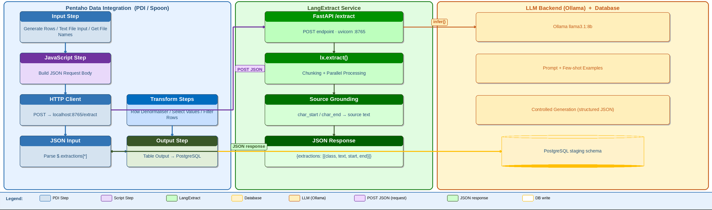

# LangExtract

> **Success:** LangExtract lets PDI turn free-form text into structured rows.
> 
> Use it when regex rules are too brittle and full model training is too heavy.
> 
> Each extraction includes source offsets, so you can trace values back to the original text.



**Before you start**

Complete [LangExtract setup](/pentaho-data-integration/setup/use-cases/langextract.md).

This page assumes:

* the LangExtract API is running on `http://localhost:8765`
* Ollama is available locally
* the API endpoint is `POST /extract`

**Choose an integration pattern**

Use one pattern per transformation.

**Recommended: REST service**

Best for reusable and production-ready pipelines.

Flow:

`PDI input → REST Client → JSON Input → transform → output`

**Optional: Shell step**

Best for quick local experiments.

Use it only when you do not need a shared service.

**Local Ollama backend**

Use this when data must stay on-premises.

This is already covered by the setup pattern on the linked setup page.

> **Note:** This page uses the REST service pattern throughout.

**API contract**&#x20;

**Request**

```json
{
  "text": "source text",
  "prompt": "what to extract",
  "examples": [
    {
      "text": "example text",
      "extractions": [
        {
          "extraction_class": "field_name",
          "extraction_text": "example value"
        }
      ]
    }
  ],
  "model_id": "llama3.1:8b",
  "max_char_buffer": 1200,
  "overlap": 100,
  "extraction_passes": 2
}
```

**Response**

```json
{
  "extractions": [
    {
      "class": "field_name",
      "text": "value found",
      "start": 0,
      "end": 10
    }
  ]
}
```

> **Warning:** The endpoint is `POST /extract`.
> 
> Parse response fields as `class`, `text`, `start`, and `end`.

***

## Workshops

* **Support Tickets** — extract structured fields from free-form support tickets.
* **Clinical Notes** — extract entities from unstructured clinical notes.
* **Contract Documents** — pull key terms from contract text.

***

## Troubleshooting

> **Warning:** Common issues:
>
> * **Connection refused on `8765`**\
>   Start the LangExtract API and verify `curl http://localhost:8765/docs`.
> * **Empty extractions**\
>   Tighten the prompt and improve few-shot examples.
> * **Wrong JSON paths**\
>   Parse `class`, `text`, `start`, and `end`.
> * **Weak long-document recall**\
>   Increase `extraction_passes` or add `overlap`.
> * **Too many duplicates**\
>   Deduplicate before final load.
