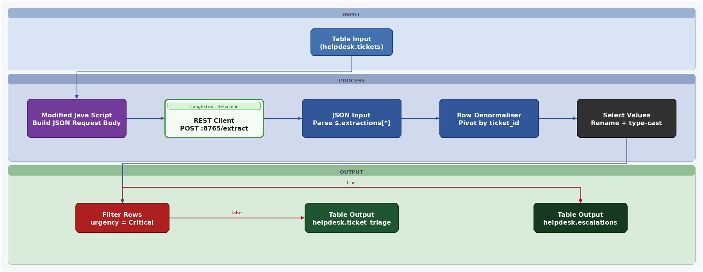
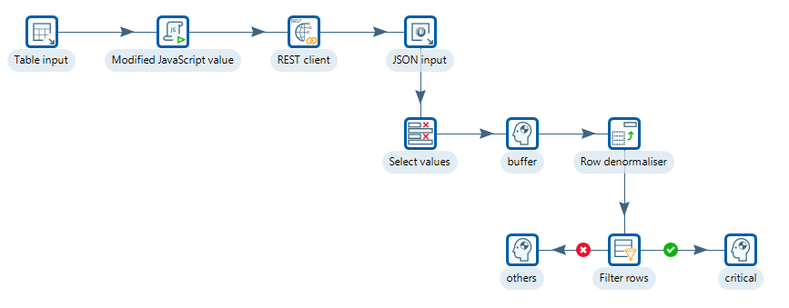
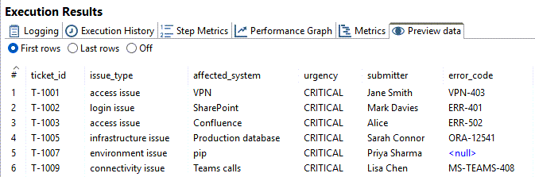

# Support Tickets

> **Warning:**
>
> #### Workshop - Support Tickets
> 
> Use LangExtract to classify and route free-form helpdesk tickets. This pattern reduces manual triage and catches urgent cases earlier.
> 
> In this workshop, you build a PDI transformation that reads unprocessed tickets, calls the LangExtract REST service to extract structured fields, and writes triage rows to the database while routing critical cases to escalations.
> 
> **What you'll do**
> 
> * Read unprocessed tickets with Table Input
> * Build the extraction request and call the LangExtract REST service
> * Parse the response and pivot extracted fields into one row per ticket
> * Route critical tickets to escalations with Filter Rows
> * Write triage and escalation rows with Table Output
> 
> **Prerequisites:** Understanding of basic transformation concepts (steps, hops, preview) and a running LangExtract REST service on `http://localhost:8765`.
> 
> **Estimated time:** 40 minutes



> **Note:**
>
> ### Business case
> 
> GlobalServ Technologies supports 12,000 end users.
> 
> The service desk receives 1,400 free-form tickets per day.
> 
> Analysts spend about five minutes reading and routing each ticket.
> 
> Misrouting happens on roughly 23% of first passes.

**Verify the API**

```bash
# Start service
uvicorn app:app --host 0.0.0.0 --port 8765

# Verify it is up:
curl http://localhost:8765/docs
```

Test the extraction endpoint:

```bash
curl -X POST http://localhost:8765/extract \
  -H "Content-Type: application/json" \
  -d '{
    "text": "Jane Smith cannot log into the VPN. Error code VPN-403. This is urgent.",
    "prompt": "Extract issue_type, system, urgency, user, and error_code.",
    "examples": [
      {
        "text": "Raj Patel cannot access SAP. Error code ERP-991. Critical issue.",
        "extractions": [
          {"extraction_class": "user", "extraction_text": "Raj Patel"},
          {"extraction_class": "system", "extraction_text": "SAP"},
          {"extraction_class": "error_code", "extraction_text": "ERP-991"},
          {"extraction_class": "urgency", "extraction_text": "Critical"}
        ]
      }
    ],
    "model_id": "llama3.1:8b",
    "max_char_buffer": 1200,
    "extraction_passes": 2
  }'
```

**Sample tickets**

```
Ticket T-1001:
  Hi, I can't log into the VPN since this morning. Error code: VPN-403.
  My laptop is a Dell XPS running Windows 11. This is blocking me from working.
  — Jane Smith, Finance

Ticket T-1002:
  The ERP system (SAP S/4HANA) is throwing DUMP errors for our whole team.
  Short dump: DYNPRO_SEND_IN_BACKGROUND. Production is affected. Critical!
  — Raj Patel, Supply Chain

Ticket T-1003:
  Outlook keeps crashing when I open attachments. ERR_OUTLOOK_0x800CCC0F.
  Not urgent, just annoying. Running Office 365 on Windows 10.
  — Tom Green, Marketing
```

**Target output**

Write one row per ticket to `helpdesk.ticket_triage`.

Expected columns:

* `ticket_id`
* `issue_type`
* `affected_system`
* `urgency`
* `submitter`
* `error_code`

Optionally route critical rows to `helpdesk.escalations`.

***

**Transformation design**

<figure><figcaption><p>ticket_triage.ktr</p></figcaption></figure>



Build `ticket_triage.ktr`.

1. **Table Input**\
   Read unprocessed tickets.
2. **Modified JavaScript Value**\
   Build `request_json`.
3. **REST Client**\
   Call `POST http://localhost:8765/extract`.
4. **JSON Input**\
   Parse one row per extraction.
5. **Select values**\
   Select the required fields.
6. **Dummy**\
   I/O buffer.
7. **Row Denormaliser**\
   Pivot extracted fields into one row per ticket.
8. **Filter Rows**\
   Route `Critical` tickets to escalations.
9. **Table Output**\
   Write triage rows and escalation rows.

***

**Step 1: Table Input**

Use:

```sql
SELECT ticket_id, ticket_text
FROM helpdesk.tickets
WHERE processed = 0
ORDER BY created_at ASC
```

**Step 2: Build** `request_json`

Use **Modified JavaScript Value**.

```javascript
var prompt = 'Extract issue_type, system, urgency, user, and error_code. ' +
        'For urgency use only one of: CRITICAL, HIGH, MEDIUM, LOW. ' +
        'If a field cannot be found in the text, omit it from the output entirely. ' +
        'Do not use placeholder values such as "none", "N/A", or "none mentioned".';
var few_shot = [{
  text: 'Cannot access Confluence. Error ERR-502. Urgent! — Alice, DevOps',
  extractions: [
    { extraction_class: 'issue_type', extraction_text: 'access issue' },
    { extraction_class: 'system', extraction_text: 'Confluence' },
    { extraction_class: 'urgency', extraction_text: 'Urgent' },
    { extraction_class: 'user', extraction_text: 'Alice' },
    { extraction_class: 'error_code', extraction_text: 'ERR-502' }
  ]
}];

var request_json = JSON.stringify({
  text: ticket_text + '',
  prompt: prompt,
  examples: few_shot,
  model_id: 'llama3.1:8b',
  max_char_buffer: 1200,
  extraction_passes: 2
});
```

**Step 3: REST Client**

Set:

* **URL:** `http://localhost:8765/extract`
* **Method:** `POST`
* **Body field:** `request_json`
* **Result field:** `response_json`
* **Content-Type:** `JSON`
* **Connection timeout:** `30000`
* **Socket timeout:** `60000`

**Step 4: Parse the response**

Use **JSON Input** with source field `response_json`.

Parse these paths:

* `$.extractions[*].class` → `class`
* `$.extractions[*].text` → `text`
* `$.extractions[*].start` → `start`
* `$.extractions[*].end` → `end`

> **Note:** The response field names are generic by design.
> 
> Use the `class` field to map values into ticket-specific columns.

**Step 5: Select required fields**

Use **Select values**.

Under Select & Alter tab:

Fieldname:

* ticket\_id
* class
* text

**Step 6: Buffer**

Use **Dummy**.

Nothing to configure. If `ticket_id` is already ordered ascending from Table Input - `ORDER BY created_at ASC`), and the REST Client processes rows sequentially (single copy, no parallelism), then the extractions coming out of JSON Input will already be grouped by `ticket_id`.&#x20;

In that case you can replace Sort Rows with a **Dummy** step and the Row Denormaliser will work correctly because consecutive rows for the same `ticket_id` are already contiguous.

**Step 7: Pivot extracted fields**

Use **Row Denormaliser**.

Set:

* **Key field:** `class`
* **Value field:** `text`
* **Group field:** `ticket_id`

Map these values:

* `issue_type` → `issue_type`
* `system` → `affected_system`
* `urgency` → `urgency`
* `user` → `submitter`
* `error_code` → `error_code`

**Step 6: Route critical tickets**

Use **Filter Rows**.

Condition:

```
urgency = CRITICAL
```

Send:

* `true` → `Insert Escalations`
* `false` → `Insert Ticket Triage`

**Step 7: Write results**

Write standard rows to `helpdesk.ticket_triage`.

Write critical rows to `helpdesk.escalations`.

<figure><figcaption><p>CRITICAL</p></figcaption></figure>

***

**Quick validation**

Check results after the run:

```sql
SELECT ticket_id, issue_type, affected_system, urgency, submitter, error_code
FROM helpdesk.ticket_triage
ORDER BY ticket_id;
```

Critical escalations:

```sql
SELECT ticket_id, urgency
FROM helpdesk.escalations
ORDER BY ticket_id;
```

<details>

<summary>Optional alternative: call a local Python wrapper with a Shell step</summary>

Use this only for local prototyping.

Pass `request_json` into a wrapper script on stdin.

Capture stdout into `response_json`.

Keep the downstream JSON Input and pivot steps unchanged.

</details>
