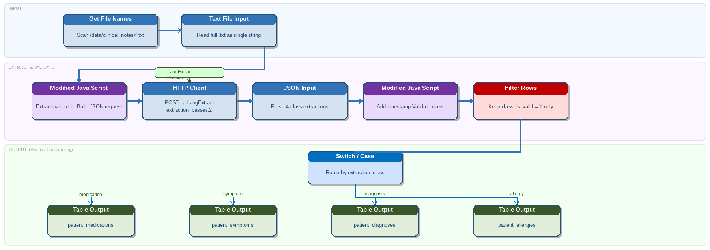

# Clinical Notes

> **Warning:**
>
> #### Workshop - Clinical Notes
> 
> Use LangExtract to turn narrative clinical notes into structured medical facts. This helps with coding, reconciliation, and downstream review workflows.
> 
> In this workshop, you build a PDI transformation that reads narrative notes, calls LangExtract, and writes structured medical facts to a staging table.
> 
> **What you'll do**
> 
> * Read clinical note files with Get File Names and Text File Input
> * Build a LangExtract request with Modified JavaScript Value
> * Call LangExtract through the REST Client step
> * Parse extraction rows with JSON Input
> * Validate classes with Filter Rows and load Table Output
> 
> **Prerequisites:** Understanding of basic transformation concepts (steps, hops, preview). A running LangExtract service at `http://localhost:8765/extract`.
> 
> **Estimated time:** 35 minutes



> **Note:**
>
> ### Business case
> 
> Northbridge NHS Foundation Trust runs eight hospitals and 34 outpatient clinics.
> 
> Clinical staff produce about 3,200 encounter notes per day.
> 
> Key facts such as medications, diagnoses, symptoms, and allergies are buried in narrative text.

**Sample clinical note**

```
Patient: Mary Johnson   DOB: 12/03/1965   MRN: NB-004821
Visit Date: 15/11/2024   Attending: Dr. Samuel Lee, Internal Medicine

Chief Complaint:
Patient presents with persistent fatigue, shortness of breath on exertion, and
occasional chest tightness over the past three weeks.

Medical History:
Known Type 2 Diabetes Mellitus diagnosed 2014, Hypertension since 2018,
Hyperlipidaemia. Non-smoker. Occasional alcohol.

Allergies:
Penicillin — rash and urticaria. Sulfa drugs — anaphylaxis.

Current Medications:
Metformin 1000mg twice daily with meals.
Lisinopril 10mg once daily in the morning.
Atorvastatin 40mg at bedtime.
Aspirin 81mg once daily.
```

**Target output**

Write one row per extraction to `staging.patient_extractions`.

Expected columns:

* `patient_id`
* `class`
* `text`
* `start`
* `end`
* `extracted_at`

Common classes:

* `medication`
* `symptom`
* `diagnosis`
* `allergy`

***

**Transformation design**

Build `clinical_notes.ktr`.

1. **Get File Names**\
   Read all note files from `/data/clinical_notes/`.
2. **Text File Input**\
   Read each file into `note_text`.
3. **Modified JavaScript Value**\
   Build `request_json`.
4. **REST Client**\
   Call LangExtract.
5. **JSON Input**\
   Parse extraction rows.
6. **Modified JavaScript Value**\
   Add `patient_id` and validation flags.
7. **Filter Rows**\
   Drop unknown classes.
8. **Table Output**\
   Write to `staging.patient_extractions`.

**Step 1: Get file names**

**Step 2: Text file input**

**Step 3: Build** `request_json`

```javascript
var patient_id = (short_filename + '').replace('.txt', '');

var few_shot = [{
  text: 'Patient takes Ramipril 5mg daily. Dizziness. CKD Stage 3. Allergic to NSAIDs.',
  extractions: [
    { extraction_class: 'medication', extraction_text: 'Ramipril 5mg daily' },
    { extraction_class: 'symptom', extraction_text: 'dizziness' },
    { extraction_class: 'diagnosis', extraction_text: 'CKD Stage 3' },
    { extraction_class: 'allergy', extraction_text: 'NSAIDs' }
  ]
}];

var request_json = JSON.stringify({
  text: note_text + '',
  prompt: 'Extract medications with dosage, symptoms, diagnoses, and allergies with reactions where present.',
  examples: few_shot,
  model_id: 'llama3.1:8b',
  max_char_buffer: 1200,
  extraction_passes: 2
});
```

**Step 4: REST Client settings**

Set:

* **URL:** `http://localhost:8765/extract`
* **Method:** `POST`
* **Body field:** `request_json`
* **Result field:** `response_json`
* **Content-Type:** `application/json`
* **Connection timeout:** `30000`
* **Socket timeout:** `120000`

**Step 5: JSON Input paths**

Parse from `response_json`:

* `$.extractions[*].class` → `class`
* `$.extractions[*].text` → `text`
* `$.extractions[*].start` → `start`
* `$.extractions[*].end` → `end`

**Step 6:**&#x20;

**Step 7: Validate classes**

After parsing, keep only expected classes:

* `medication`
* `symptom`
* `diagnosis`
* `allergy`

Use a **Filter Rows** step to discard anything else or route it to review.

### Example load table

Use a staging table like this:

```sql
CREATE TABLE staging.patient_extractions (
  id SERIAL PRIMARY KEY,
  patient_id VARCHAR(20),
  class VARCHAR(30),
  text TEXT,
  start INT,
  end INT,
  extracted_at TIMESTAMP DEFAULT NOW()
);
```

### Quick validation

```sql
SELECT patient_id, class, text
FROM staging.patient_extractions
ORDER BY patient_id, class;
```

> **Warning:** Clinical notes often contain repeated facts.
> 
> If you see duplicates, deduplicate on `patient_id + class + text + start + end`.
