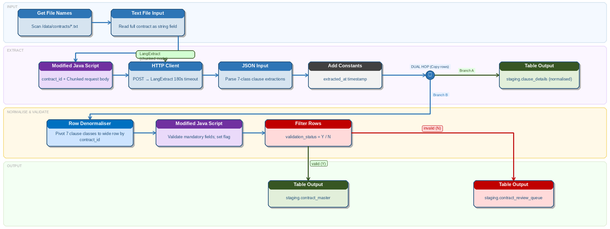

# Contract Documents

> **Warning:**
>
> #### Workshop - Contract Documents
> 
> Use LangExtract to pull critical legal and commercial terms from long contracts. This is useful for due diligence, review queues, and clause indexing.
> 
> In this workshop, you build a PDI transformation that reads contract files, calls LangExtract to extract key clauses, and writes both normalized clause rows and a wide contract master row to staging.
> 
> **What you'll do**
> 
> * Read contract `*.txt` files and load each into a `contract_text` field
> * Build a `request_json` payload with few-shot examples and multiple extraction passes
> * Call LangExtract with the REST Client step and parse the response with JSON Input
> * Write normalized clause rows to `staging.clause_details`
> * Pivot extracted classes into a wide row and route valid contracts to `staging.contract_master`
> 
> **Prerequisites:** Working knowledge of PDI transformations (steps, hops, preview) and a running LangExtract service.
> 
> **Estimated time:** 35 minutes



### Business case

Meridian Capital Partners reviews about 220 contracts per quarter.

Documents range from 8 to 140 pages.

Key terms such as liability caps and governing law appear in inconsistent locations.

### Sample contract text

```
SERVICE AGREEMENT

This Service Agreement ("Agreement") is entered into as of 1st January 2025
("Effective Date") by and between:

Acme Corporation Ltd ... ("Service Provider")
and
GlobalTech Holdings PLC ... ("Client").

The Service Provider shall provide software development and consultancy services.
This Agreement shall commence on the Effective Date and continue for 24 months.
```

### Target outputs

Use two outputs:

#### Branch A: clause details

Write one row per extraction to `staging.clause_details`.

Columns:

* `contract_id`
* `class`
* `text`
* `start`
* `end`
* `extracted_at`

#### Branch B: contract master

Write one wide row per contract to `staging.contract_master`.

Columns:

* `contract_id`
* `party_a`
* `party_b`
* `effective_date`
* `termination`
* `payment_terms`
* `liability_cap`
* `governing_law`
* `validation_status`
* `extracted_at`

### Transformation design

Build `langextract_contracts.ktr`.

1. **Get File Names**\
   Read all `*.txt` contracts from `/data/contracts/`.
2. **Text File Input**\
   Load each file into `contract_text`.
3. **Modified JavaScript Value**\
   Build `request_json`.
4. **REST Client**\
   Call LangExtract.
5. **JSON Input**\
   Parse clause rows.
6. **Add Constants**\
   Stamp `extracted_at`.
7. **Table Output**\
   Write normalized clause rows.
8. **Row Denormaliser**\
   Pivot target classes into a wide contract row.
9. **Modified JavaScript Value**\
   Validate required fields.
10. **Filter Rows**\
    Route valid rows to master and invalid rows to review.

### Build `request_json`

```javascript
var contract_id = (short_filename + '').replace('.txt', '');

var few_shot = [{
  text: 'Agreement between Acme Ltd and BetaCorp PLC as of 1 March 2024. Terminate with 60 days notice. Payment within 30 days. Liability capped at £250,000. Governed by laws of England.',
  extractions: [
    { extraction_class: 'party_a', extraction_text: 'Acme Ltd' },
    { extraction_class: 'party_b', extraction_text: 'BetaCorp PLC' },
    { extraction_class: 'effective_date', extraction_text: '1 March 2024' },
    { extraction_class: 'termination', extraction_text: '60 days notice' },
    { extraction_class: 'payment_terms', extraction_text: 'Payment within 30 days' },
    { extraction_class: 'liability_cap', extraction_text: '£250,000' },
    { extraction_class: 'governing_law', extraction_text: 'laws of England' }
  ]
}];

var request_json = JSON.stringify({
  text: contract_text + '',
  prompt: 'Extract party_a, party_b, effective_date, termination, payment_terms, liability_cap, and governing_law.',
  examples: few_shot,
  model_id: 'llama3.1:8b',
  max_char_buffer: 1500,
  overlap: 200,
  extraction_passes: 2
});
```

### REST Client settings

Set:

* **URL:** `http://localhost:8765/extract`
* **Method:** `POST`
* **Body field:** `request_json`
* **Result field:** `response_json`
* **Content-Type:** `application/json`
* **Connection timeout:** `30000`
* **Socket timeout:** `180000`

### JSON Input paths

Parse from `response_json`:

* `$.extractions[*].class` → `class`
* `$.extractions[*].text` → `text`
* `$.extractions[*].start` → `start`
* `$.extractions[*].end` → `end`

### Pivot classes into contract columns

Use **Row Denormaliser** with:

* **Key field:** `class`
* **Value field:** `text`
* **Group field:** `contract_id`

Map:

* `party_a` → `party_a`
* `party_b` → `party_b`
* `effective_date` → `effective_date`
* `termination` → `termination`
* `payment_terms` → `payment_terms`
* `liability_cap` → `liability_cap`
* `governing_law` → `governing_law`

### Validate required fields

Set `validation_status = 'Y'` only when these fields exist:

* `party_a`
* `party_b`
* `effective_date`
* `governing_law`

Route everything else to `staging.contract_review_queue`.

### Example staging tables

```sql
CREATE TABLE staging.clause_details (
  id SERIAL PRIMARY KEY,
  contract_id VARCHAR(50),
  class VARCHAR(50),
  text TEXT,
  start INT,
  end INT,
  extracted_at TIMESTAMP DEFAULT NOW()
);

CREATE TABLE staging.contract_master (
  contract_id VARCHAR(50) PRIMARY KEY,
  party_a TEXT,
  party_b TEXT,
  effective_date VARCHAR(100),
  termination TEXT,
  payment_terms TEXT,
  liability_cap TEXT,
  governing_law TEXT,
  validation_status CHAR(1) DEFAULT 'Y',
  extracted_at TIMESTAMP DEFAULT NOW()
);
```

### Quick validation

Normalized clause rows:

```sql
SELECT contract_id, class, text
FROM staging.clause_details
ORDER BY contract_id, class;
```

Wide contract rows:

```sql
SELECT contract_id, party_a, party_b, effective_date, liability_cap, governing_law
FROM staging.contract_master
ORDER BY contract_id;
```

> **Warning:** Long contracts need chunk overlap.
> 
> If clauses are split at boundaries, increase `overlap` before raising model size.
