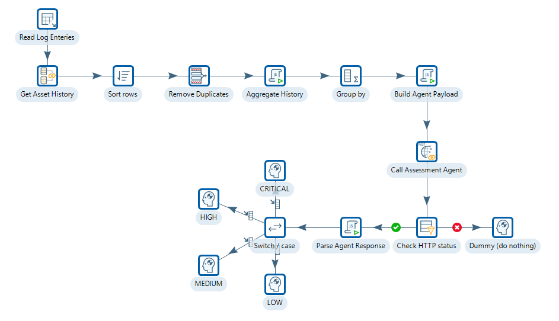

# Agent-as-a-Service

> **Success:**
>
> #### Overview
> 
> This workshop introduces the architectural boundary between LLM-enriched ETL and a genuine AI agent. Previous workshops in this series called an LLM directly from a PDI REST Client step - one prompt in, one JSON response out. That is a pure function: no external state, no mid-reasoning decisions.
> 
> This workshop is different. PDI calls a deployed Python agent that uses the LLM's intermediate output to decide what external data to retrieve before producing its final answer. The lookup target is not known until after the first LLM call completes. PDI cannot replicate this in the transformation canvas - the sequence requires a reasoning loop that only the agent can own.

The test for whether something is an agent is simple: can PDI replicate the behaviour by adding more steps to the canvas? &#x20;

Here's summary of the different approaches:

<table data-full-width="false"><thead><tr><th width="204" valign="top"></th><th width="279" valign="top">Direct LLM Call / Multi-Stage</th><th width="269" valign="top">LangExtract</th><th width="388" valign="top">Agent as a Service</th></tr></thead><tbody><tr><td valign="top">What it does</td><td valign="top">Sends one prompt per row, returns structured JSON for that row</td><td valign="top">Extracts named entities with char offsets from a single text; returns one row per entity</td><td valign="top">Reads current entry plus retrieved history, reasons across all texts, returns one assessment</td></tr><tr><td valign="top">Input to the service</td><td valign="top">Single text field from the PDI row</td><td valign="top">Single text field + prompt + few-shot examples</td><td valign="top">Current log text + N history entries (retrieved by PDI before calling the agent)</td></tr><tr><td valign="top">Output shape</td><td valign="top">One row in, one enriched row out</td><td valign="top">One row in, N entity rows out (one per extraction); pivoted by Row Denormaliser</td><td valign="top">One row in, one assessment row out</td></tr><tr><td valign="top">LLM calls per row</td><td valign="top">1 (or N fixed stages)</td><td valign="top">1 per extraction pass (typically 2 passes over chunked text)</td><td valign="top">1 - reads all texts together in a single context</td></tr><tr><td valign="top">Requires history from other records?</td><td valign="top">No - processes each row in isolation</td><td valign="top">No - processes each document in isolation</td><td valign="top">Yes - history retrieved by PDI via Database Join is essential to the assessment</td></tr><tr><td valign="top">Decision grounded in</td><td valign="top">LLM inference on current text only</td><td valign="top">LLM extraction from current text only; char offsets trace back to source</td><td valign="top">LLM reasoning across current text AND verified historical records from the database</td></tr><tr><td valign="top">Can PDI replicate it?</td><td valign="top">Yes - multi-stage MJV + REST Client pattern</td><td valign="top">Partially - regex/rules cover known entity formats; LangExtract handles novel/variable ones</td><td valign="top">No - cross-text pattern reasoning is not encodable as PDI steps</td></tr><tr><td valign="top">Use when</td><td valign="top">Classifying, enriching, or summarising individual records</td><td valign="top">Extracting typed fields from free-form text where regex rules are too brittle</td><td valign="top">Assessment depends on what previous records say, not just the current one</td></tr></tbody></table>

> **Success:** A maintenance team logs fault observations as free-text entries against industrial assets. Each entry is a single paragraph written by an engineer in the field — no fixed schema, no controlled vocabulary. PDI reads these entries from a database table and must produce a structured priority assessment for each one.
> 
> A complete assessment requires three things:
> 
> * What fault is being described in this entry? (classification)
> * What has happened to this asset previously? (history retrieval)
> * Does the current entry represent a new fault, an acceleration of a known pattern, or normal operating variation - given what has happened before? (pattern reasoning)&#x20;

<figure><figcaption>
maintenance assessment agent
</figcaption></figure>

***

## Workshops

* **Deploy & Run the Agent** — start the agent service, wire it into a PDI transformation, run it, and review performance.
