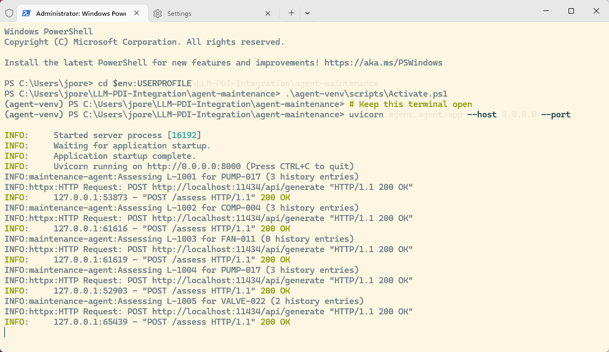

# Deploy & Run the Agent

::: tabs

### Start Agent

**One-time setup** - the agent ships with this lab ([agent.py](./files/agent-maintenance/agent/agent.py), [requirements.txt](./files/agent-maintenance/requirements.txt), sample SQLite data in `data/`). Copy it out of the guide's content folder and install its dependencies:

**Windows (PowerShell)**

```powershell
Copy-Item "$env:APPDATA\com.pentaho.content-manager\content\17-agent-deploy\files\agent-maintenance" "$env:USERPROFILE\agent-maintenance" -Recurse
cd $env:USERPROFILE\agent-maintenance
python -m venv .venv
.\.venv\Scripts\pip install -r requirements.txt
```

**macOS / Linux** (lab VMs have the agent pre-installed at `/opt/agent-maintenance`)

```bash
cp -r ~/.local/share/com.pentaho.content-manager/content/17-agent-deploy/files/agent-maintenance ~/agent-maintenance
cd ~/agent-maintenance
python3 -m venv .venv && .venv/bin/pip install -r requirements.txt
```

***

**Start the agent**

**Windows (PowerShell)**

```powershell
cd $env:USERPROFILE\agent-maintenance
.\.venv\Scripts\Activate.ps1
```

```powershell
# Keep this terminal open
uvicorn agent.agent:app --host 0.0.0.0 --port 8000
```

**macOS / Linux**

```bash
cd ~/agent-maintenance   # lab VM: /opt/agent-maintenance
source .venv/bin/activate   # lab VM: source agent-venv/bin/activate
```

```bash
# Keep this terminal open
uvicorn agent.agent:app --host 0.0.0.0 --port 8000
```

```
Expected output:
INFO:     Started server process [xxxxx]
INFO:     Waiting for application startup.
INFO:     Application startup complete.
INFO:     Uvicorn running on http://0.0.0.0:8000 (Press CTRL+C to quit)
...
```

> **Note:** Leave this terminal open while running the PDI pipeline. The agent process must remain running to serve assessment requests.

**Verify the setup**

Run the checks that match your platform.

**Windows (PowerShell)**

```powershell
Test-Path .\data\asset_history.db
curl.exe http://localhost:11434
curl.exe http://localhost:8000/docs
```

**macOS / Linux**

```bash
test -f data/asset_history.db && echo "Database OK"
curl http://localhost:11434
curl http://localhost:8000/docs
```

Success means:

* `data/asset_history.db` exists
* Ollama responds on `localhost:11434`
* The agent starts without import errors
* FastAPI responds on port `8000`

```
Windows PowerShell
Copyright (C) Microsoft Corporation. All rights reserved.

Install the latest PowerShell for new features and improvements! https://aka.ms/PSWindows

PS C:\Users\jpore> curl http://localhost:8000/health

Security Warning: Script Execution Risk
Invoke-WebRequest parses the content of the web page. Script code in the web page might be run when the page is
parsed.
      RECOMMENDED ACTION:
      Use the -UseBasicParsing switch to avoid script code execution.

      Do you want to continue?

[Y] Yes  [A] Yes to All  [N] No  [L] No to All  [S] Suspend  [?] Help (default is "N"): Y

StatusCode        : 200
StatusDescription : OK
Content           : {"status":"ok","model":"llama3.1:8b"}
RawContent        : HTTP/1.1 200 OK
                    Content-Length: 37
                    Content-Type: application/json
                    Date: Wed, 08 Apr 2026 13:52:08 GMT
                    Server: uvicorn

                    {"status":"ok","model":"llama3.1:8b"}
Forms             : {}
Headers           : {[Content-Length, 37], [Content-Type, application/json], [Date, Wed, 08 Apr 2026 13:52:08 GMT],
                    [Server, uvicorn]}
Images            : {}
InputFields       : {}
Links             : {}
ParsedHtml        : mshtml.HTMLDocumentClass
RawContentLength  : 37

PS C:\Users\jpore>
```

### Boundary Argument

> **Note:**
>
> #### Boundary Argument
> 
> PDI handles the complexity of structured data with remarkable flexibility. There are steps that mimic the actions of an AI agent - RegEx, Fuzzy matching, Rule Executor and so on. Together these provide a powerful framework that provides similarity but not semantic equivalence - inference - on unstructured data.&#x20;

<table><thead><tr><th valign="top">Task</th><th valign="top">PDI Step(s)</th><th valign="top">Capability</th><th valign="top">Verdict</th></tr></thead><tbody><tr><td valign="top">Extract structured asset ID (e.g. ASSET-0042)</td><td valign="top">Regex Evaluation</td><td valign="top">Extracts fixed-format patterns reliably</td><td valign="top">PDI handles this</td></tr><tr><td valign="top">Look up asset history rows by asset_id</td><td valign="top">Database Lookup Database Join</td><td valign="top">Exact key match, returns all history rows</td><td valign="top">PDI handles this</td></tr><tr><td valign="top">Classify fault type from known keywords ("bearing", "temperature")</td><td valign="top">Rule Executor (Drools) Regex Evaluation + MJV</td><td valign="top">IF/THEN rules on keyword presence</td><td valign="top">PDI handles known, enumerated faults</td></tr><tr><td valign="top">Fuzzy-match current description against a known fault library</td><td valign="top">Fuzzy Match step</td><td valign="top">Levenshtein / Jaro-Winkler on string pairs</td><td valign="top">PDI handles surface similarity; not semantic equivalence</td></tr><tr><td valign="top">Assign final priority once fault type is known</td><td valign="top">Filter Rows Switch/Case MJV</td><td valign="top">Pure deterministic routing on field values</td><td valign="top">PDI handles this completely</td></tr></tbody></table>

> **Note:**
>
> #### Why Regex fails
> 
> "bearing noise getting worse" and "intermittent vibration on startup since maintenance" both indicate bearing degradation. They share no common n-gram, no common keyword sequence, and no pattern a regex can match. The semantic equivalence exists at the meaning level, not the surface level. Regex operates only on surface form.

> **Note:**
>
> #### Why Rule Executor (Drools) fails
> 
> A rule can fire on the keyword "bearing" in the current entry. But the rule cannot say: "this entry, combined with two previous entries that mention vibration and one bearing replacement 18 months ago, indicates recurrence of the same root cause rather than a new fault." That conclusion requires reading and integrating four separate natural-language texts. A Drools rule operates on field values in the current row - it does not read and synthesise multiple text fields from a joined history set.
> 
> You could try to flatten the history into a single concatenated field and write a rule against that. But the rule would still operate on keyword presence, not meaning. "No unusual noise but slight vibration" contains the word "vibration" - a keyword rule would flag it identically to "severe vibration on every startup". The negation and qualifier ("slight", "no unusual") change the meaning completely. Rules cannot parse that.

> **Note:**
>
> #### Why Fuzzy Match fails
> 
> The Fuzzy Match step finds strings with high character-level similarity. "Bearing noise" and "audible roughness in drive shaft" have low character similarity but identical diagnostic meaning. Conversely, "bearing temperature normal" and "bearing temperature elevated" have very high character similarity but opposite meanings. Fuzzy matching on maintenance log text produces both false positives and false negatives at an unacceptable rate for safety-relevant prioritisation.

> **Note:**
>
> #### Why MJV (JavaScript) fails
> 
> MJV can implement any algorithm expressible in JavaScript. A skilled developer could write a JavaScript function that: (1) concatenates history entries, (2) counts keyword occurrences, (3) applies weighted scoring. This is a rules system with extra steps. It fails on the same cases rules fail on - novel descriptions, combined symptoms, qualified negations, and cross-entry pattern inference. It does not understand language; it manipulates strings.

***

Given these four history entries for asset PUMP-017:

```
2025-09-12: slight rumble on startup, clears after 2 minutes, logged for monitoring
2025-11-03: intermittent vibration under load, no temperature anomaly, bearing checked ok
2026-01-18: bearing replaced (scheduled maintenance)
2026-03-29: rougher than usual on startup, louder than before the January maintenance
```

> **Note:** The correct assessment is: RECURRENCE - bearing degradation has restarted 10 weeks post-replacement, which is abnormally fast and indicates either incorrect installation or an underlying cause not addressed in the January maintenance. Priority: HIGH.
> 
> No PDI step produces this assessment.&#x20;
> 
> The Database Lookup returns the four history rows as data. MJV can concatenate them. No step can read them together and conclude that the current entry matches the pre-January pattern and that pattern recurrence within 10 weeks of a replacement is abnormal.

> **Success:** This cannot be replicated by any combination of PDI transformation steps.
> 
> Read multiple unstructured natural-language history entries alongside a new unstructured entry and reason about whether they collectively describe a known degradation pattern, a recurrence, or a new fault mode.
> 
> This is the task the agent owns. PDI retrieves the history as structured rows. The agent reads the history text and the current entry together and reasons about what they collectively indicate. PDI cannot do this. The agent can.
> 
> That is the boundary. Everything else in the pipeline is PDI.

### Pipeline Test

> **Note:**
>
> #### Pipeline Overview
> 
> The scenario uses one LLM call - and that is intentional. Here, PDI already knows the asset\_id and retrieves the history as structured rows before calling the agent.&#x20;
> 
> The agent receives everything it needs in one payload. One call is cleaner, faster, and easier to reason about. The single call is also the hardest part - reading multiple texts and synthesising a cross-entry assessment is more genuinely difficult than two sequential single-task calls.

```
PDI Transformation
  [Table Input: maintenance_log]
       |
  [Regex Evaluation]  ← PDI extracts asset_id from log_text
       |
  [Database Join: asset_history]  ← PDI retrieves history rows
       |
  [MJV: Build agent payload]  ← PDI assembles request
       |
  [REST Client  POST /assess]  ───────────────────────────────┐
       |                                                      │
  [MJV: Parse response]       Agent (FastAPI / venv)          │
       |                        POST /assess                  │
  [Switch/Case: priority]       ├─ Read log_text + history    │
       |                        ├─ [LLM] Reason across texts  │
  CRITICAL → alerts_table       └─ Return assessment JSON  ◄──┘
  HIGH     → priority_queue
  MEDIUM   → standard_queue
  LOW      → log_archive
```

<table><thead><tr><th width="180" valign="top"></th><th valign="top">PDI Transformation</th><th valign="top">Maintenance Assessment Agent</th></tr></thead><tbody><tr><td valign="top">Owns</td><td valign="top">All data flow, retrieval, routing, and persistence</td><td valign="top">Language understanding and cross-text reasoning</td></tr><tr><td valign="top">Reads</td><td valign="top">Structured rows from maintenance_log and asset_history tables</td><td valign="top">Unstructured text: current log entry + N history entries as text</td></tr><tr><td valign="top">Produces</td><td valign="top">Structured rows with priority, fault_type, assessment fields</td><td valign="top">A single structured JSON assessment per request</td></tr><tr><td valign="top">Uses</td><td valign="top">Regex, Database Join, MJV, REST Client, Switch/Case</td><td valign="top">One LLM call with history context; no tool calls needed</td></tr><tr><td valign="top">Can be replaced by rules?</td><td valign="top">Yes - all PDI logic is deterministic</td><td valign="top">No - language reasoning is not encodable as rules</td></tr></tbody></table>

***

Let's run some tests:

**Windows (Powershell)**

```powershell
@"
{
  "log_id": "TEST-001",
  "asset_id": "PUMP-017",
  "log_text": "Rougher than usual on startup, louder than before January maintenance",
  "history": [
    {"logged_at": "2025-09-12", "log_text": "slight rumble on startup"},
    {"logged_at": "2025-11-03", "log_text": "intermittent vibration under load"},
    {"logged_at": "2026-01-18", "log_text": "bearing replaced, WO-4412"}
  ]
}
"@ | Out-File -Encoding utf8 test.json

curl.exe -s -X POST http://localhost:8000/assess `
  -H "Content-Type: application/json" `
  -d "@test.json"
```

**Linux / macOS**

```json
curl -s -X POST http://localhost:8000/assess \
  -H "Content-Type: application/json" \
  -d '{
    "log_id": "TEST-001",
    "asset_id": "PUMP-017",
    "log_text": "Rougher than usual on startup, louder than before January maintenance",
    "history": [
      {"logged_at": "2025-09-12", "log_text": "slight rumble on startup"},
      {"logged_at": "2025-11-03", "log_text": "intermittent vibration under load"},
      {"logged_at": "2026-01-18", "log_text": "bearing replaced, WO-4412"}
    ]
  }'
```

Response:

```json
{
  "log_id":     "TEST-001",
  "asset_id":   "PUMP-017",
  "priority":   "HIGH",
  "fault_type": "intermittent_vibration_under_load",
  "pattern":    "RECURRENCE",
  "assessment": "The pump's performance has worsened since the last maintenance, 
                 indicating a potential issue with the replacement bearing.",
  "confidence": 80
}
```

> **Note:** The agent is working correctly:
> 
> * **priority: HIGH** - the model recognises this needs same-day attention, which is correct given the history
> * **fault\_type: intermittent\_vibration\_under\_load** - picked up the dominant symptom from the history
> * **pattern: RECURRENCE** - correctly identified that this has happened before (pre-January bearing issues)
> * **assessment** - the model has read the history and connected the dots: bearing was replaced in January and symptoms are returning
> * **confidence: 80** - reasonably high, consistent with a clear pattern in the history

### Transformation

> **Note:**
>
> #### Maintenance Agent
> 
> The maintenance\_assessment.ktr has all the steps in a single pipeline to illustrate the workflow. The MJV approach works for this workshop because the dataset is small and runs single-copy. In production with thousands of rows and STEP\_COPIES > 1, the accumulator pattern would break and you would need the sub-transformation approach instead.
> 
> So, a cleaner alternative that avoids the MJV accumulator entirely is to use a **sub-transformation via Transformation Executor**. For each log entry, a child transformation queries the history database and builds the JSON array, returning one row with the complete payload. This is stateless, parallelism-safe, and easier to reason about.

**Sample Maintenance Logs**

```
log_id | asset_id  | logged_at           | engineer | log_text
-------|-----------|---------------------|----------|------------------------------------------
L-1001 | PUMP-017  | 2026-04-07 08:14:00 | J.Walsh  | Rougher than usual on startup, louder
       |           |                     |          | than before the January maintenance.
       |           |                     |          | Vibration settling after ~3 minutes.
L-1002 | COMP-004  | 2026-04-07 09:02:00 | S.Okafor | High temperature alarm triggered at
       |           |                     |          | 09:00. Reading: 94C. Limit is 85C.
       |           |                     |          | No prior warnings this shift.
L-1003 | FAN-011   | 2026-04-07 10:31:00 | T.Marsh  | Fan running normally. Slight hum noted
       |           |                     |          | but within normal range. No action.
L-1004 | PUMP-017  | 2026-04-07 11:45:00 | J.Walsh  | Vibration increased since this morning.
       |           |                     |          | Getting worse through the shift.
L-1005 | VALVE-022 | 2026-04-07 13:10:00 | R.Nkosi  | Valve sticking on close. Takes 3-4
       |           |                     |          | attempts. Never seen this before.
```

**Asset History**

```
PUMP-017 history:
  2025-09-12: slight rumble on startup, clears after 2 minutes, logged for monitoring
  2025-11-03: intermittent vibration under load, no temperature anomaly, bearing checked ok
  2026-01-18: bearing replaced (scheduled maintenance, work order WO-4412)

COMP-004 history:
  2025-10-05: temperature running slightly high (82C) on hot days, within tolerance
  2025-12-14: cooling fan filter cleaned, temperature returned to normal range
  2026-02-28: temperature normal, no issues logged

FAN-011 history:
  (no entries in last 12 months)

VALVE-022 history:
  2025-08-20: valve serviced, seals replaced
  2026-01-09: operating normally, no issues

```

***

**Transformation design**

<figure><figcaption></figcaption></figure>

<table><thead><tr><th width="212" valign="top">Step Name</th><th width="212" valign="top">Type</th><th valign="top">What PDI does here</th></tr></thead><tbody><tr><td valign="top">Read Log Entries</td><td valign="top">Table Input</td><td valign="top">SELECT unprocessed rows from maintenance_log</td></tr><tr><td valign="top">Retrieve Asset History</td><td valign="top">Database Join</td><td valign="top">LEFT JOIN asset_history ON asset_id, concat history rows into JSON array field</td></tr><tr><td valign="top">Sort rows</td><td valign="top">Sort rows</td><td valign="top">Keeps the rows in chronological order</td></tr><tr><td valign="top">Remove duplicates</td><td valign="top">Unique rows</td><td valign="top">Just in case ..</td></tr><tr><td valign="top">Aggregate History</td><td valign="top">Modified JavaScript Value</td><td valign="top">PDI stream is row based, need to  aggregate all the records for asset.</td></tr><tr><td valign="top"></td><td valign="top">Group by</td><td valign="top"></td></tr><tr><td valign="top">Build Agent Payload</td><td valign="top">Modified JavaScript Value</td><td valign="top">JSON.stringify the full request including history array</td></tr><tr><td valign="top">Call Assessment Agent</td><td valign="top">REST Client</td><td valign="top">POST ${AGENT_URL}/assess — socket timeout 180000ms</td></tr><tr><td valign="top">Check HTTP Status</td><td valign="top">Filter Rows</td><td valign="top">Route non-200 to error log</td></tr><tr><td valign="top">Parse Agent Response</td><td valign="top">Modified JavaScript Value</td><td valign="top">Extract priority, fault_type, pattern, assessment, confidence</td></tr><tr><td valign="top">Route by Priority</td><td valign="top">Switch / Case</td><td valign="top">Fan out on priority field</td></tr><tr><td valign="top">Write CRITICAL</td><td valign="top">Table Output</td><td valign="top">assessed_log with alert flag set</td></tr><tr><td valign="top">Write HIGH</td><td valign="top">Table Output</td><td valign="top">assessed_log</td></tr><tr><td valign="top">Write MEDIUM</td><td valign="top">Table Output</td><td valign="top">assessed_log</td></tr><tr><td valign="top">Write LOW</td><td valign="top">Table Output</td><td valign="top">assessed_log</td></tr><tr><td valign="top">Write Errors</td><td valign="top">Text File Output</td><td valign="top">HTTP failures for investigation</td></tr></tbody></table>

This section walks through building maintenance\_assessment.ktr step by step in Spoon. Every dialog tab, field name, and script is given in full. Build the steps in order — each one depends on output fields from the previous.

**Step 1: Set transformation properties**

Double-click anywhere on the empty canvas to open Transformation Properties. Click the Parameters tab.

<table><thead><tr><th width="205" valign="top">Parameter</th><th width="213" valign="top">Default Value</th><th valign="top">Description</th></tr></thead><tbody><tr><td valign="top">AGENT_URL</td><td valign="top">http://localhost:8000</td><td valign="top">Base URL of the assessment agent</td></tr><tr><td valign="top">DB_CONNECTION</td><td valign="top">path to / maintenance_log</td><td valign="top">Set path to maintenance_log.db</td></tr><tr><td valign="top">STEP_COPIES</td><td valign="top">2</td><td valign="top">Parallel REST Client copies</td></tr><tr><td valign="top">HISTORY_LIMIT</td><td valign="top">10</td><td valign="top">Max history rows per asset</td></tr></tbody></table>

> **Note:** Add each parameter using the + button. Enter the parameter name in the first column and the default value in the third column (Default value).
> 
> Click OK to save. Parameters are accessible as ${PARAM\_NAME} in step configuration fields and via getVariable("PARAM\_NAME","default") in MJV scripts.

**Step 2: Create a database connection**

The Table Input and Database Join steps both need a named connection to the SQLite database. Create it once and both steps will share it.

&#x20;1\.    View > Connections > New

2\.    Connection name: maintenance\_log\_db

3\.    Connection type: SQLite

4\.    Database name (file path): browse to `agent-maintenance\data\maintenance_log.db` in your home folder (`/opt/agent-maintenance/data/maintenance_log.db` on the lab VM)

5\.    Click Test — should return "Connection to database \[MAINTENANCE\_DB] is OK"

6\.    Click OK

> **Note:** SQLite stores the entire database in a single file. The Database Join step will query asset\_history from the same file if you ATTACH it, or you can create a second connection named HISTORY\_DB pointing to data/asset\_history.db.
> 
> For this workshop, use separate connection objects for clarity.

**Step 3: Table Input: Read Log Entries**

**Add the step**

1. In the Design pane, expand the Input category
2. Drag Table Input onto the canvas
3. Double-click the step to open configuration

&#x20;**Configuration**

<table><thead><tr><th width="236" valign="top">Field</th><th valign="top">Value</th></tr></thead><tbody><tr><td valign="top">Step name</td><td valign="top">Read Log Entries</td></tr><tr><td valign="top">Connection</td><td valign="top">maintenanace_log_db</td></tr><tr><td valign="top">SQL</td><td valign="top">See query below</td></tr><tr><td valign="top">Enable lazy conversion</td><td valign="top">No (unchecked)</td></tr><tr><td valign="top">Replace variables</td><td valign="top">Yes (checked) - required for ${HISTORY_LIMIT}</td></tr></tbody></table>

&#x20;**SQL query**

```sql
SELECT
    log_id,
    asset_id,
    logged_at,
    engineer,
    log_text
FROM maintenance_log
WHERE processed = 0
ORDER BY logged_at ASC
```

> **Note:** The processed = 0 filter ensures each log entry is only assessed once.
> 
> After a successful run, update processed = 1 in a downstream Table Output
> 
> step or via a post-processing Execute SQL Script step in a wrapping Job.

**Step 4: Database Join: Retrieve Asset History**

The Database Join step executes a parameterised SQL query once per input row, using the asset\_id field from the stream as the ? parameter.

It appends all matching history rows to the stream - one output row per history entry. The subsequent MJV step then aggregates those rows back into a single JSON array field.

**Configuration**

> **Warning:** You will need to define a connection to the assets\_history.db located in the ../data folder.

<table><thead><tr><th width="245" valign="top">Field</th><th valign="top">Value</th></tr></thead><tbody><tr><td valign="top">Step name</td><td valign="top">Get Asset History</td></tr><tr><td valign="top">Connection</td><td valign="top">asset_history_db</td></tr><tr><td valign="top">SQL</td><td valign="top">See query below</td></tr><tr><td valign="top">Outer join</td><td valign="top">Yes (checked) - ensures assets with no history still produce a row</td></tr><tr><td valign="top">Number of rows to return</td><td valign="top">${HISTORY_LIMIT}  (resolves to 10)</td></tr><tr><td valign="top">Use variable substitution</td><td valign="top">Yes (checked)</td></tr></tbody></table>

&#x20;**SQL query**

```sql
SELECT
    logged_at  AS hist_logged_at,
    log_text   AS hist_log_text
FROM asset_history
WHERE asset_id = ?
ORDER BY logged_at ASC
```

**Parameters tab**

Click the Parameters tab. Add one row to bind the ? placeholder to the stream field:&#x20;

<table><thead><tr><th valign="top">Field (from stream)</th><th valign="top">Type</th></tr></thead><tbody><tr><td valign="top">asset_id</td><td valign="top">String</td></tr></tbody></table>

> **Warning:** Outer join = Yes is critical. Without it, assets with no history rows (like FAN-011) would be silently dropped from the stream.
> 
> With Outer join enabled, the step outputs one row with NULL values for hist\_logged\_at and  hist\_log\_text when no history exists. The next MJV step handles the NULL case by defaulting history\_json to "\[]".

> **Note:** The Database Join step produces one output row per history entry matched.
> 
> For PUMP-017 (3 history rows), it produces 3 output rows — all carrying the original log entry fields (log\_id, asset\_id, log\_text, etc.).
> 
> Step (Aggregate History) collapses those back to one row per log entry.

**Step 5: Aggregate History into JSON Array**

The Database Join expanded each log entry into N rows (one per history entry). This MJV step runs after a Group By step to collapse them back into one row per log entry, with the history encoded as a JSON array string in a new field history\_json.

**Sort rows**

Sort on two fields:&#x20;

<table><thead><tr><th valign="top">Field name</th><th valign="top">Ascending</th><th valign="top">Case sensitive</th></tr></thead><tbody><tr><td valign="top">log_id</td><td valign="top">Yes</td><td valign="top">No</td></tr><tr><td valign="top">hist_logged_at</td><td valign="top">Yes</td><td valign="top">No</td></tr></tbody></table>

**Modified JavaScript Value**

Step name: Aggregate History

Copy & Paste the following script into the script editor:

```javascript
// ==========================================================================
// AGGREGATE HISTORY ROWS INTO A JSON ARRAY
// ==========================================================================
// The Database Join produced N rows per log entry (one per history record).
// This script accumulates those rows and — on the last row for each log_id —
// emits a single row with the full history encoded as a JSON array string.
//
// PDI runs all step instances in parallel threads. Because Sort Rows has
// sorted by log_id ASC, all rows for the same log_id are contiguous.
// We use a static accumulator array to collect them.
//
// Static variables (declared with var in the first script block) persist
// across rows within a single step execution.
// ==========================================================================

// Initialise accumulators on first row
if (typeof history_buffer === "undefined") {
    var history_buffer = [];
    var current_log_id = null;
}

// If this is a new log_id, flush the previous buffer first
if (current_log_id !== null && current_log_id !== log_id + "") {
    // This should not happen after Sort Rows — included as a safety guard
    history_buffer = [];
}

current_log_id = log_id + "";

// Accumulate this history row (skip NULL entries from Outer Join)
if (hist_logged_at !== null && hist_log_text !== null) {
    history_buffer.push({
        "logged_at": hist_logged_at + "",
        "log_text":  hist_log_text  + ""
    });
}

// Use a Group By step downstream to get the final row per log_id.
// Set history_json as the output field from this script.
var history_json = JSON.stringify(history_buffer);
```

**Add output fields in the Fields tab**

In the Fields tab at the bottom of the MJV dialog, click Get variables and then add:

<table><thead><tr><th width="140" valign="top">Fieldname</th><th width="131" valign="top">Type</th><th valign="top">Notes</th></tr></thead><tbody><tr><td valign="top">history_json</td><td valign="top">String</td><td valign="top">JSON array of history objects, or "[]" if no history</td></tr></tbody></table>

**Group By step to keep only the last row per log\_id**

Group field:&#x20;

<table><thead><tr><th width="290" valign="top">Group by field</th><th valign="top">Notes</th></tr></thead><tbody><tr><td valign="top">log_id</td><td valign="top">Primary key — one output row per log entry</td></tr><tr><td valign="top">asset_id</td><td valign="top">Carry-through field</td></tr><tr><td valign="top">logged_at</td><td valign="top">Carry-through field</td></tr><tr><td valign="top">engineer</td><td valign="top">Carry-through field</td></tr><tr><td valign="top">log_text</td><td valign="top">Carry-through field</td></tr></tbody></table>

&#x20;Aggregation (to retain the last history\_json value per group):&#x20;

<table><thead><tr><th valign="top">Name</th><th valign="top">Subject</th><th valign="top">Type</th></tr></thead><tbody><tr><td valign="top">history_json</td><td valign="top">history_json</td><td valign="top">Last non-null value</td></tr></tbody></table>

> **Note:** The LAST aggregation type returns the last non-NULL value for history\_json within the group. Because the MJV accumulates entries into the buffer as rows arrive, and Sort Rows guarantees chronological order within each log\_id, the LAST row for each log\_id carries the complete history array.

**Step 6: MJV: Build Agent Payload**

Step name: Build Agent Payload

```javascript
// ==========================================================================
// BUILD THE AGENT REQUEST PAYLOAD
// ==========================================================================
// This step takes the accumulated history_json array string produced by
// the Aggregate History step and constructs the complete JSON payload
// for a POST request to the agent's /assess endpoint.
//
// Input fields expected from the stream:
//   log_id       — unique identifier for this log entry
//   asset_id     — asset identifier extracted by Regex Evaluation
//   log_text     — the raw engineer observation text
//   history_json — JSON array string from Aggregate History + Group By
//
// Output field:
//   agent_payload — serialised JSON string ready for the REST Client body
// ==========================================================================

// 1. Sanitise log_text to prevent JSON serialisation errors.
//    Engineers enter free text — quotes and newlines are common.
var safe_text = (log_text + "")
    .replace(/\\/g, "\\\\")   // escape backslashes first
    .replace(/"/g,  '\\"')      // escape double quotes
    .replace(/\n/g, " ")         // replace newlines with space
    .replace(/\r/g, "");         // remove carriage returns

// 2. Parse the history JSON array.
//    history_json arrives as a string: '[{"logged_at":"...","log_text":"..."}]' 
//    It may be "[]" for assets with no history (FAN-011).
//    It may be null if the Group By produced no value — handle defensively.
var history_arr = [];
try {
    var raw = history_json + "";
    if (raw && raw !== "null" && raw.length > 2) {
        history_arr = JSON.parse(raw);
    }
} catch(e) {
    history_arr = [];  // default to empty — agent handles gracefully
}

// 3. Build the complete request object and serialise it.
var agent_payload = JSON.stringify({
    "log_id":   log_id   + "",
    "asset_id": asset_id + "",
    "log_text": safe_text,
    "history":  history_arr
});

```

**Fields tab - output fields**&#x20;

<table><thead><tr><th width="169" valign="top">Fieldname</th><th width="134" valign="top">Type</th><th valign="top">Notes</th></tr></thead><tbody><tr><td valign="top">agent_payload</td><td valign="top">String</td><td valign="top">Complete JSON payload for POST /assess</td></tr></tbody></table>

**Verify the payload**

Before connecting the REST Client, preview the output of this step and verify the agent\_payload field contains valid JSON with the correct structure:&#x20;

```
// Expected agent_payload for PUMP-017:
{
  "log_id":   "L-1001",
  "asset_id": "PUMP-017",
  "log_text": "Rougher than usual on startup, louder than before the January maintenance.",
  "history": [
    {"logged_at": "2025-09-12", "log_text": "slight rumble on startup"},
    {"logged_at": "2025-11-03", "log_text": "intermittent vibration under load"},
    {"logged_at": "2026-01-18", "log_text": "bearing replaced, WO-4412"}
  ]
}
 
// Expected agent_payload for FAN-011 (no history):
{
  "log_id":   "L-1003",
  "asset_id": "FAN-011",
  "log_text": "Fan running normally. Slight hum noted but within normal range.",
  "history": []
}
```

**Step 7: REST Client: Call the Assessment Agent**

Step name: Call Assessment Agent

**General tab**&#x20;

<table><thead><tr><th valign="top">Field</th><th valign="top">Value</th></tr></thead><tbody><tr><td valign="top">HTTP method</td><td valign="top">POST</td></tr><tr><td valign="top">URL</td><td valign="top">${AGENT_URL}/assess</td></tr><tr><td valign="top">Body field</td><td valign="top">agent_payload</td></tr><tr><td valign="top">Application type</td><td valign="top">TEXT PLAIN</td></tr><tr><td valign="top">Result field name</td><td valign="top">agent_response</td></tr><tr><td valign="top">HTTP status code field</td><td valign="top">response_code</td></tr><tr><td valign="top">Response time field</td><td valign="top">response_time_ms</td></tr></tbody></table>

&#x20;**Headers:** (leave empty - REST Client auto-adds Content-Type)

> **Note:** The actual timeout behaviour is controlled at the JVM level via `kettle.properties`, not per-step.

**Step 8: Filter Rows: Check HTTP Status**

Step name: Check HTTP Status

&#x20;**Condition**

Click inside the condition area and build the following filter:

&#x20;`response_code  =  200`

> **Note:** The Write HTTP Errors step should capture: log\_id, asset\_id, response\_code,
> 
> agent\_payload (so you can see what was sent), and response\_time\_ms.
> 
> Common non-200 codes:&#x20;
> 
> 422 = malformed payload
> 
> 502 = Ollama not running
> 
> 500 = agent parse failure (LLM returned malformed JSON after retries).

**Output hops**

Right-click the Filter Rows step. You need two output hops:

TRUE path → draw a hop to the next step (Parse Agent Response)

FALSE path → draw a hop to a Text File Output step named Write HTTP Errors

**Step 8:  MJV: Parse Agent Response**

Step name: Parse Agent Response

```javascript
// ==========================================================================
// PARSE THE AGENT RESPONSE
// ==========================================================================
// The agent returns a clean JSON object — no Ollama wrapper envelope.
// The agent_response field contains the raw HTTP response body as a string.
//
// Expected response schema:
// {
//   "log_id":     "L-1001",
//   "asset_id":   "PUMP-017",
//   "priority":   "HIGH",
//   "fault_type": "bearing_degradation",
//   "pattern":    "RECURRENCE",
//   "assessment": "Bearing degradation ...",
//   "confidence": 85
// }
//
// Error handling: if parsing fails, priority defaults to MEDIUM so the
// row is routed to the standard_queue rather than being lost.
// parse_error = "Y" flags it for manual review.
// ==========================================================================

var priority        = "MEDIUM";
var fault_type      = "unknown";
var pattern         = "NEW_FAULT";
var assessment      = "";
var confidence      = 50;
var parse_error     = "N";
var parse_error_msg = "";

try {
    var d = JSON.parse(agent_response + "");

    priority   = d.priority   ? (d.priority   + "").toUpperCase() : "MEDIUM";
    fault_type = d.fault_type ? (d.fault_type + "")               : "unknown";
    pattern    = d.pattern    ? (d.pattern    + "").toUpperCase() : "NEW_FAULT";
    assessment = d.assessment ? (d.assessment + "")               : "";
    confidence = d.confidence ? parseInt(d.confidence, 10)        : 50;

    // Clamp confidence to valid range
    if (confidence < 0)   confidence = 0;
    if (confidence > 100) confidence = 100;

} catch(e) {
    parse_error     = "Y";
    parse_error_msg = e.message ? e.message + "" : "JSON parse error";
    // All output fields retain their safe defaults above.
    // The row continues downstream with priority = MEDIUM.
}
```

**Fields tab - output fields**&#x20;

<table><thead><tr><th width="196" valign="top">Fieldname</th><th width="120" valign="top">Type</th><th valign="top">Notes</th></tr></thead><tbody><tr><td valign="top">priority</td><td valign="top">String</td><td valign="top">CRITICAL | HIGH | MEDIUM | LOW</td></tr><tr><td valign="top">fault_type</td><td valign="top">String</td><td valign="top">Short snake_case label from agent</td></tr><tr><td valign="top">pattern</td><td valign="top">String</td><td valign="top">RECURRENCE | ESCALATION | NEW_FAULT | NORMAL_VARIATION</td></tr><tr><td valign="top">assessment</td><td valign="top">String</td><td valign="top">One-to-two sentence explanation</td></tr><tr><td valign="top">confidence</td><td valign="top">Integer</td><td valign="top">0–100</td></tr><tr><td valign="top">parse_error</td><td valign="top">String</td><td valign="top">Y or N</td></tr><tr><td valign="top">parse_error_msg</td><td valign="top">String</td><td valign="top">Exception message if parse_error = Y</td></tr></tbody></table>

&#x20;**Step 9: Switch / Case: Route by Priority**

Add four Table Output steps (Output category), one for each priority path. They all write to the same assessed\_log table but can be separate tables if your schema requires it. Connect each from the corresponding Switch / Case output hop.

x

x

### RUN

> **Note:**
>
> #### RUN Transformation

**Step 1: Start the agent**

**Windows (PowerShell)**

```powershell
cd $env:USERPROFILE\agent-maintenance
.\.venv\Scripts\Activate.ps1
```

```powershell
# Keep this terminal open
uvicorn agent.agent:app --host 0.0.0.0 --port 8000
```

**macOS / Linux**

```bash
cd ~/agent-maintenance   # lab VM: /opt/agent-maintenance
source .venv/bin/activate   # lab VM: source agent-venv/bin/activate
```

```bash
# Keep this terminal open
uvicorn agent.agent:app --host 0.0.0.0 --port 8000
```

**Step 2: RUN**

1. Select Run options — leave defaults
2. Click Run

<figure><figcaption><p>Check logs</p></figcaption></figure>

> **Note:** The Preview panel opens with the Logging tab active. Watch for:
> 
> * Read Log Entries: should show 5 rows read (one per sample log entry)
> * Get Asset History: row count will be higher than 5 — this is expected (one row per history match)
> * Group By: should collapse back to 5 rows
> * Call Assessment Agent: 5 rows sent; watch response\_time\_ms
> * Route by Priority: rows distributed across CRITICAL (1), HIGH (1), MEDIUM (2), LOW (1)

CRITICAL

<table><thead><tr><th width="185">Field</th><th>Value</th></tr></thead><tbody><tr><td><strong>log_id</strong></td><td>L-1002</td></tr><tr><td><strong>asset_id</strong></td><td>COMP-004</td></tr><tr><td><strong>logged_at</strong></td><td>2026-04-07 09:02:00</td></tr><tr><td><strong>engineer</strong></td><td>S.Okafor</td></tr><tr><td><strong>log_text</strong></td><td>High temperature alarm triggered at 09:00. Reading: 94C. Limit is 85C. No prior warnings this shift.</td></tr><tr><td><strong>history_json</strong></td><td><code>[{"logged_at":"2025-10-05","log_text":"temperature running slightly high 82C, within tolerance"},{"logged_at":"2025-12-14","log_text":"cooling fan filter cleaned, temperature normal"},{"logged_at":"2026-02-28","log_text":"temperature normal, no issues"}]</code></td></tr><tr><td><strong>agent_payload</strong></td><td><code>{"log_id":"L-1002","asset_id":"COMP-004","log_text":"High temperature alarm triggered...","history":[...3 entries...]}</code></td></tr><tr><td><strong>agent_response</strong></td><td><code>{"log_id":"L-1002","asset_id":"COMP-004","priority":"CRITICAL","fault_type":"high_temperature_alarm","pattern":"RECURRENCE","assessment":"High temperature alarm triggered at 09:00 with a reading of 94C, exceeding the limit of 85C.","confidence":100}</code></td></tr><tr><td><strong>response_code</strong></td><td>200</td></tr><tr><td><strong>response_time_ms</strong></td><td>5094</td></tr><tr><td><strong>priority</strong></td><td><strong>CRITICAL</strong> ✅</td></tr><tr><td><strong>fault_type</strong></td><td><code>high_temperature_alarm</code> ✅</td></tr><tr><td><strong>pattern</strong></td><td><code>RECURRENCE</code> ✅</td></tr><tr><td><strong>assessment</strong></td><td>High temperature alarm triggered at 09:00 with a reading of 94C, exceeding the limit of 85C.</td></tr><tr><td><strong>confidence</strong></td><td>100</td></tr><tr><td><strong>parse_error</strong></td><td>N</td></tr><tr><td><strong>parse_error_msg</strong></td><td><em>(blank)</em></td></tr></tbody></table>

<table><thead><tr><th width="103">log_id</th><th width="116">priority</th><th width="220">fault_type</th><th>pattern</th></tr></thead><tbody><tr><td>L-1001</td><td>HIGH</td><td>bearing_degradation / vibration_recurrence</td><td>RECURRENCE</td></tr><tr><td>L-1002</td><td>CRITICAL</td><td>high_temperature_alarm</td><td>RECURRENCE</td></tr><tr><td>L-1003</td><td>LOW</td><td>normal_variation</td><td>NORMAL_VARIATION</td></tr><tr><td>L-1004</td><td>CRITICAL</td><td>increased_vibration / vibration_escalation</td><td>ESCALATION</td></tr><tr><td>L-1005</td><td>MEDIUM</td><td>valve_sticking</td><td>NEW_FAULT</td></tr></tbody></table>

> **Note:** KEY POINTS
> 
> 1\. The boundary is precise and provable.
> 
> &#x20;  PDI steps handle extraction, lookup, rules, and routing.
> 
> &#x20;  No PDI step reads multiple unstructured text entries together and
> 
> &#x20;  reasons about whether they collectively indicate a known pattern.
> 
> &#x20;  That is the exact and only task the agent owns.
> 
> &#x20;
> 
> 2\. PDI does more work than the agent in this pipeline.
> 
> &#x20;  Regex extracts the asset ID. Database Join retrieves the history.
> 
> &#x20;  MJV builds the payload. Switch/Case routes the result.
> 
> &#x20;  The agent does one thing: language reasoning across text.
> 
> &#x20;
> 
> 3\. One LLM call, grounded in retrieved data, is the clean pattern.
> 
> &#x20;  The history context is retrieved by PDI as structured rows,
> 
> &#x20;  formatted by MJV, and passed to the agent in a single payload.
> 
> &#x20;  The agent does not need tools because PDI already did the lookup.
> 
> &#x20;
> 
> 4\. Confidence scores surface model uncertainty for human review.
> 
> &#x20;  Entries with low history or ambiguous text should route to a
> 
> &#x20;  review queue regardless of the priority label.
> 
> &#x20;
> 
> 5\. The test for any agent pattern is: can PDI replicate it?
> 
> &#x20;  If yes with steps — use steps. Faster, simpler, deterministic.
> 
> &#x20;  If no — that is where the agent earns its place.

### Performance

> **Note:**
>
> #### Performance

History context increases prompt length compared to earlier workshops. A typical prompt for this workshop is 300–600 tokens (system instructions + up to 10 history entries + current entry). At llama3.1:8b on the 3080 12GB, expect 4–8 seconds per assessment.&#x20;

<table><thead><tr><th width="207" valign="top">Configuration</th><th width="141" valign="top">Step Copies</th><th width="160" valign="top">5 entries</th><th valign="top">Notes</th></tr></thead><tbody><tr><td valign="top">llama3.1:8b, RTX 3080 12GB, no history</td><td valign="top">1</td><td valign="top">~15-25 sec</td><td valign="top">~3-5 sec/call, short prompt</td></tr><tr><td valign="top">llama3.1:8b, RTX 3080 12GB, 5 history entries</td><td valign="top">1</td><td valign="top">~25-40 sec</td><td valign="top">~5-8 sec/call, longer prompt</td></tr><tr><td valign="top">llama3.1:8b, RTX 3080 12GB, 10 history entries</td><td valign="top">1</td><td valign="top">~30-50 sec</td><td valign="top">~6-10 sec/call</td></tr><tr><td valign="top">llama3.1:8b, RTX 3080 12GB, 10 history entries</td><td valign="top">2</td><td valign="top">~18-30 sec</td><td valign="top">Recommended starting point</td></tr><tr><td valign="top">llama3.1:8b, RTX 3080 12GB, 10 history entries</td><td valign="top">4</td><td valign="top">~14-24 sec</td><td valign="top">Try this; 7GB KV headroom supports it</td></tr></tbody></table>

:::

