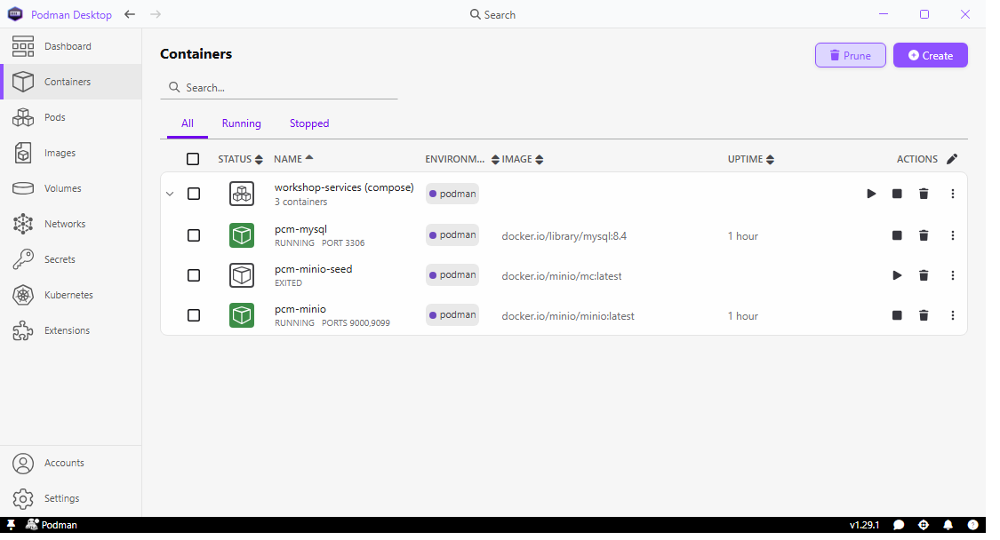

# Before You Start

> **Note:**
>
> #### Get Ready — Before You Start
>
> Before the first workshop, check that your environment is ready and
> that the workshop folders and files are in place. The course builds
> real pipelines against files, a MySQL database and object storage,
> and **none of the lab time should go on setup**: this page does it in
> advance.
>
> **What you'll do:**
>
> * Learn how the guide works: progress, copy buttons, the assistant.
> * Confirm Pentaho Data Integration starts and the services answer.
> * Check the workshop folder: *C:\Workshop-DI-Practitioner*
>
> **Prerequisites:** Familiarity with the basics of data integration.
>
> **Estimated Time:** 5 minutes on a lab VM; about 20 minutes the first
> time on your own machine.

## Meet your lab guide

This panel stays beside your tools for the whole workshop:

- **Float or dock** — drag the title bar to move the window anywhere
  (any monitor), or use the dock button to pin it to the right edge of
  the screen so maximized apps make room for it.
- **The sidebar** lists every section and lab. A <span data-icon="video"></span> badge means the lab
  includes a video; the `~15 min` tag is a time estimate.
- Use the **font-size** and **reading-mode** controls in the toolbar if
  you're on a small VM screen.

## Track your progress

Every numbered heading like this one is a **step** with a checkbox —
tick it when you're done. Your progress is saved on this machine and
survives restarts, so you can pick up exactly where you left off after
a break.

## Copy code with one click

Every code block has a **copy button** — hover over the block and click
it, then paste into your tool. Try it:

```sql
SELECT 'hello from the lab guide' AS greeting;
```

## Set up your environment

Launch your main tool straight from the guide:

<button data-launch="spoon">Start Pentaho Data Integration</button>

If it is already open from a previous session, the button focuses
the running window instead of starting a second copy.

### Do you need to set anything up?

:::: tabs

### I'm using a lab VM

Nothing to do. Everything is installed and running already, and it
starts with the machine.

If something looks wrong later, tell your instructor rather than
reinstalling anything.

### I'm installing on my own machine

Everything here is a **one-off setup** for your own laptop. Work through
the tabs in order — the panel underneath checks your machine as you go,
so you can always see what is left. The last tab is a reference card of
every port and login, for when you come back to it later.

> **Note:** Budget about 20 minutes the first time, most of it download
> time. After this, starting the workshop is a single command.

::: tabs

### 1. Container runtime

The workshop services (a writable MySQL and object storage) run as
containers, so you need a container runtime.

1. Install **Podman Desktop**. It is free (Apache 2.0) and installs
   the Podman engine for you:

   ```powershell
   winget install -e --id RedHat.Podman-Desktop
   ```

2. Bring WSL up to date. Podman runs its containers inside WSL, and
   needs a current one:

   ```powershell
   wsl --update
   ```

   WSL 3.0 changed how containers are given their resource limits, and
   Podman cannot start containers on it as shipped. The setup script in
   the next tab adjusts the Podman machine for it, once, by itself.

3. Open **Podman Desktop** from the Start menu. It is a normal desktop
   application, not a web page, so there is no address to browse to.
   Its **Containers** page lists the workshop services with their
   ports, logs and a terminal, and **Podman machine** (bottom-left) is
   where you start the machine.

There will be no containers yet — you create those in the next tab.

Once step 2 has run, the Containers page is what you should see:

<figure><figcaption><p>The workshop services in Podman Desktop</p></figcaption></figure>

The three containers are grouped under **workshop-services (compose)**.
`pcm-mysql` on port 3306 and `pcm-minio` on 9000/9099 should both say
**RUNNING**. `pcm-minio-seed` showing **EXITED** is correct and not a
failure — it is a one-shot container that creates the buckets and
uploads the sample files, then stops.

> **Important:** The Podman machine does not start itself after a
> reboot — this is the single most common workshop hiccup. Podman
> Desktop shows you at a glance that it is stopped, and starts it with
> one click. That is the main reason to install it rather than the
> command-line package alone.

<details>
<summary>Command line only</summary>

The engine is also available on its own, without the window. Every
lab works the same way; you just start the machine yourself with
`podman machine start` after each reboot:

```powershell
winget install -e --id Podman.CLI --version 6.0.2
```

</details>

<details>
<summary>Troubleshooting</summary>

**"machine did not transition into running state"** — almost always an
out-of-date WSL. Run `wsl --update`, then
`podman machine start`. WSL 2.7 or newer is required; check with
`wsl --version`.

**Every container fails with "crun: controller `pids` is not
available"** — WSL 2.9 or 3.0. Run `.\setup-services.ps1` again: it adds
a setting to the Podman machine that creates containers without
resource limits, and restarts the machine. On a shared lab VM, do not
run `wsl --update`; the lab image pins a version that works.

**"cannot connect to Podman"** — the machine exists but is not
running. Start it from **Podman machine** in Podman Desktop, or:

```powershell
podman machine start
```

**Ports are unreachable even though the containers are up.** Windows
needs mirrored networking to forward them. Create or edit
`%USERPROFILE%\.wslconfig`:

```ini
[wsl2]
networkingMode=mirrored
```

Then `wsl --shutdown` and start the machine again.

**Already using Docker Desktop?** You can leave it installed — just do
not run both engines against the same ports at once. Nothing in this
course requires you to remove it.

</details>

### 2. Start the services

1. Open PowerShell in the **`provisioning`** folder of your install.
   That is one of:

| Install type | Folder                                                         |
| ------------ | -------------------------------------------------------------- |
| Just for me  | `%LOCALAPPDATA%\Programs\Pentaho Content Manager\provisioning` |
| All users    | `C:\Program Files\Pentaho Content Manager\provisioning`        |

2. Run the setup script:

   ```powershell
   .\setup-services.ps1
   ```

3. Answer any prompts. If something from the previous tab is missing —
   Podman Desktop, the compose provider, or Node — the script offers
   to install it and waits for your answer. Press Enter to accept, or
   `n` to be given the command instead. Nothing is installed unless
   you say so.

4. Wait for it to finish. It generates the MySQL sample data from your
   own Pentaho install, starts the Podman machine, brings up the
   containers, and waits until MySQL and MinIO genuinely answer — not
   just "started". First run takes a few minutes.

Check the result against the Podman Desktop screenshot in the previous
tab: `pcm-mysql` and `pcm-minio` running, `pcm-minio-seed` exited.

5. Check PDI has the MySQL driver. PDI 11 doesn't include it, and
   every database lab needs it. The installer already downloaded it
   into the `lib` folder of the PDI it found, and the script in step 2
   does the same if you installed PDI after the course. If the
   **MySQL JDBC driver** row in the panel below is still red, run the
   driver step on its own from the same folder:

   ```powershell
   .\install-pdi-driver.ps1
   ```

   Restart Spoon if it is open. The row turns green.

> **Important:** Re-run `.\setup-services.ps1` after **every reboot** —
> the Podman machine does not start itself. It is safe to run at any
> time. `-InstallPrereqs` answers yes to every prompt, for setting up a
> room of machines.

<details>
<summary>Troubleshooting</summary>

**Asked to install Node.js.** You should not be — the sample data is
converted by a script that uses the Node the app already ships with.
If you do see this prompt, you are running the script from somewhere
other than your install's `provisioning` folder. Accept it, or install
Node yourself:

```powershell
winget install -e --id OpenJS.NodeJS.LTS
```

Either way, close and reopen PowerShell afterwards so `node` is on
your PATH, then re-run the script.

**"Could not find sampledata.script"** — the converter reads your
Pentaho install and could not find it. Point it at the right place:

```powershell
$env:PENTAHO_HOME = "C:\Pentaho"
```

**"No compose provider"** — Podman does not ship one. The script
offers to install it; to do it yourself:

```powershell
winget install -e --id Docker.DockerCompose
```

**MySQL never becomes ready.** First start imports about 10,000 rows, so
give it a couple of minutes. If it still will not come up, look at the
log:

```powershell
podman compose -f "$env:LOCALAPPDATA\Pentaho Content Manager\workshop-services\docker-compose.yml" logs mysql
```

**Starting a new cohort and want pristine data?** The CRUID labs change
Steel Wheels by design. Reset it:

```powershell
.\setup-services.ps1 -Reset
```

</details>

### 3. Check it worked

The panel below already ran this for you, but you can run it yourself at
any time:

```powershell
.\check-environment.ps1
```

It walks the prerequisites in dependency order and prints the exact
command that fixes anything missing. A red line early on usually makes
the later ones meaningless — fix from the top down.

When everything is green you are ready to start Module 1.

<details>
<summary>What it checks</summary>

| Check                    | Why the course needs it                      |
| ------------------------ | -------------------------------------------- |
| WSL 2                    | Podman runs its containers inside it         |
| Podman                   | The container engine                         |
| Compose provider         | Brings up the whole stack in one command     |
| Podman machine           | The Linux VM the containers run in           |
| MySQL `sampledata`       | Labs 12–18 and several later labs read and write it |
| MySQL JDBC driver (PDI)  | PDI 11 doesn't ship one; without it no lab can connect |
| MinIO                    | The `pvfs://` object-storage labs            |
| Pentaho Data Integration | The tool the whole course teaches. Looked for in `C:\Pentaho\design-tools\data-integration` first, then elsewhere on the machine |
| Java (for Spoon)         | Pentaho's bundled Java 21 in `C:\Pentaho\java`, or `PENTAHO_JAVA_HOME` |
| Ollama                   | Optional — powers the in-app chat assistant  |

</details>

### 4. Lab files on disk

The installer has already laid this course's lab files out under
**`C:\Workshop-DI-Practitioner`**, one folder per module, so you can
open a transformation in PDI directly instead of downloading it from
the guide first. Every lab's **Solution** section quotes its path.

The capstone is the one folder with a shape of its own:

| Folder               | What it holds                                    |
| -------------------- | ------------------------------------------------ |
| `capstone\data\`     | The source files the capstone reads — shipped    |
| `capstone\solution\` | **Your** transformations and jobs                |
| `capstone\out\`      | **Your** output — the accreditation checks look here |

> **Note:** Upgrading the app refreshes the shipped lab files and never
> touches `solution\` or `out\`. Your own work is safe, so you can
> install a new version mid-course.

<details>
<summary>The folder isn't there</summary>

It is an optional component, so a **Minimal (app only)** install, or
an unticked **Workshop lab files** box, skips it. Lay it down at any time from the same
`provisioning` folder as the services script:

```powershell
.\install-workshop.ps1
```

Safe to run whenever you want the shipped lab files back as they
shipped: it only ever adds and refreshes, and never deletes your work.

</details>

### 5. Database tool

You will want a database tool for browsing tables and running ad-hoc
SQL alongside the labs. **DBeaver Community** is free and ships with
the drivers these workshops need.

1. Install it:

   ```powershell
   winget install -e --id dbeaver.dbeaver
   ```

2. In DBeaver choose **Database → New Database Connection → MySQL**.

3. Enter these details:

   | Setting  | Value           |
   | -------- | --------------- |
   | Host     | `127.0.0.1`     |
   | Port     | `3306`          |
   | Database | `sampledata`    |
   | Username | `pentaho_admin` |
   | Password | `password`      |

4. Click **Test Connection**, then **Finish**. Expand the
   `sampledata` schema and you should see the Steel Wheels tables —
   `CUSTOMERS`, `PRODUCTS`, `ORDERS` and the rest.

These are the same credentials the labs use in their PDI database
connections, so what you see in DBeaver is exactly what your
transformations see.

**MinIO**, for the `pvfs://` labs, has a web console at
**http://127.0.0.1:9099** — sign in with `minioadmin` / `minioadmin`.

> **Caution:** Use `127.0.0.1`, not `localhost`. With WSL mirrored
> networking `localhost` can resolve to IPv6 first, and the connection
> quietly times out.

<details>
<summary>Troubleshooting</summary>

**"Public Key Retrieval is not allowed"** — on the connection's **Driver
properties** tab set `allowPublicKeyRetrieval` to `true`.

**"Communications link failure"** — the container is not up. Re-run
`.\setup-services.ps1` and check the panel below.

**Tables are missing.** You are probably connected to the wrong schema:
pick `sampledata` in the Database field, not `mysql` or `information_schema`.

</details>

### 6. Ports and logins

Everything the workshop stack exposes, in one place. All of it is
local to your machine.

| Service                         | Address           | Username        | Password     |
| ------------------------------- | ----------------- | --------------- | ------------ |
| MySQL `sampledata` — labs 12–18 | `127.0.0.1:3306`  | `pentaho_admin` | `password`   |
| MySQL — admin account           | `127.0.0.1:3306`  | `root`          | `password`   |
| MinIO S3 API — lab 19 `pvfs://` | `127.0.0.1:9000`  | `minioadmin`    | `minioadmin` |
| MinIO web console — buckets     | `127.0.0.1:9099`  | `minioadmin`    | `minioadmin` |
| Ollama — the Chat tab           | `127.0.0.1:11434` | *none*          | *none*       |

Open the MinIO console in a browser at **http://127.0.0.1:9099**.

> **Note:** MinIO's console is on **9099**, not the usual 9001 —
> Pentaho's HSQLDB already owns 9001, and MinIO refuses to start if
> the port is taken. The S3 API is on the standard 9000, which is what
> the `pvfs://` labs and the environment check use.

> **Caution:** These are throwaway workshop credentials, deliberately
> simple. Do not reuse this compose file, or these passwords, for
> anything that holds real data.

:::

The panel below probes this machine live, checking what this course's
labs need. Each row reports one of four states:

* **<span class="pcm-c-ok">Green</span>** — the check passed; that piece is present and answering.
* **<span class="pcm-c-warn">Amber</span>** — usable, but worth tidying before the session.
* **<span class="pcm-c-danger">Red</span>** — it will block a lab, and the row tells you the exact fix.
* **<span class="pcm-c-muted">Grey</span>** — skipped, because this course doesn't use it.

<div data-env-check></div>

::::

## Check the working folders

The installer lays every lab's files out under
**`C:\Workshop-DI-Practitioner`**, one folder per module and
sub-section, in the order the sidebar reads. (Module 1 is reading
only, so the numbering starts at `02`.) Each workshop's **Solution**
section quotes its own folder.

```text
C:\Workshop-DI-Practitioner
├── 02-components-concepts
│   ├── 01-components
│   │   └── 02-mod1-kettle-variables
│   └── 02-key-concepts
│       └── 03-mod2-hello-world
├── 03-data-sources
│   ├── 01-flat-files
│   │   ├── 06-mod3-text-file-input
│   │   │   ├── orders.txt                  the lab's data: open and read it
│   │   │   └── solution                    the finished answer, ready to run
│   │   │       ├── orders.txt              its own copy of the data
│   │   │       └── tr_read_text.ktr
│   │   └── 07-mod3-text-file-output ... 10-mod3-excel-writer
│   ├── 02-databases                        labs 12-18, MySQL sampledata
│   └── 03-storage                          lab 19, MinIO
├── 04-enriching-the-dataset
│   └── 01-merge, 02-joins, 03-lookups, 04-scripting
├── 05-enterprise-solution
│   └── 01-jobs, 02-metadata-injection, 03-parameters
└── capstone
    ├── data                                what the capstone reads, shipped
    ├── solution                            your transformations and jobs
    └── out                                 your output, checked for your accreditation
```

Every `solution` folder holds a **complete, working** solution: the
transformations and jobs plus their own copy of the data they read.
Open one in PDI and run it to see the expected result; your own work
at the lab root is never touched.

**Confirm the files are there**, not just the folder: open
`03-data-sources\01-flat-files\06-mod3-text-file-input` and check you
can see `orders.txt` and a `solution` folder holding
`tr_read_text.ktr`. An empty folder is the one thing worth catching now
rather than in the middle of a lab.

## Check the database

The database labs (12-18, and several in modules 4 and 5) use the Steel
Wheels sample in the MySQL container. The environment panel shows
**MySQL** green when it is up. Workshop 12 builds the connection the
others reuse, and every bundled solution connects with exactly these
details:

|                 |                    |
| --------------- | ------------------ |
| Connection name | `MySQL:sampledata` |
| Host            | `localhost`        |
| Port            | `3306`             |
| Database        | `sampledata`       |
| Username        | `pentaho_admin`    |
| Password        | `password`         |

## Ask the AI assistant

The **Chat** tab in the bottom panel answers questions about Pentaho,
grounded in the official docs — ask it anything from "what does this
step do?" to "why did my transformation fail?". It runs on a local
model, so it works even when the VM is offline.

## How this course is organised

Each section starts with an **overview page** (<span data-icon="page"></span> — background reading,
no checkboxes) followed by **hands-on workshops** (<span data-icon="workshop"></span> — tracked steps).
The bigger sections group their workshops into **sub-sections** — Data
Sources, for instance, splits into Flat Files, Databases and Storage.
Click a heading to open that section's page, or the chevron beside it to
expand the workshops underneath.

## The exam and your course accreditation

When you have worked through the sections, the **Practitioner Exam** in
the sidebar draws 40 questions from a larger pool. It is open-book — take
your time, browse any module to refresh your memory, or ask the
assistant. Your answers are saved as you go, so leaving the page to look
something up is fine, and the explanations show afterwards so you can
learn from anything you missed. The pass mark is **80%**.

You are asked for your name, email and organisation before you begin
(and your Partner ID, if you are taking it as part of the Pentaho Partner
Program); those are what your accreditation is made out to. Complete the
capstone project and pass the exam, and your **Pentaho Data Integration
Developer - Practitioner Level** course accreditation appears on the
results screen to download. It is valid for two years, and you can come
back for it later from the same screen.

Head to the first section whenever you're ready.

---

> **Tip:** You can revisit this lab any time from the sidebar.
