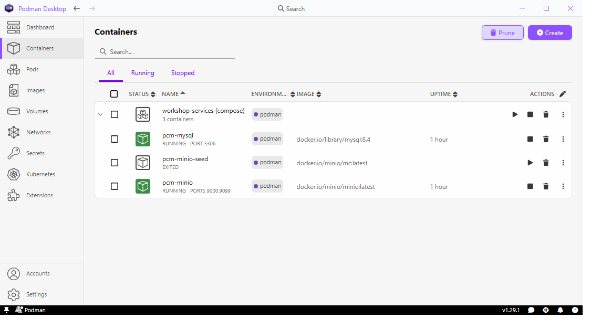

# Getting Started

> **Note:**
>
> ### Welcome!
 
> This page highlights how to get the best user experience using this lab guide.
> Five minutes here makes every later lab smoother.

## Meet your lab guide

This panel stays beside your tools for the whole workshop:

- **Float or dock** — drag the title bar to move the window anywhere
  (any monitor), or use the dock button to pin it to the right edge of
  the screen so maximised apps make room for it.
- **The sidebar** lists every section and lab. A ▶ badge means the lab
  includes a video; the `~15 min` tag is a time estimate.
- Use the **font-size** and **reading-mode** controls in the toolbar if
  you're on a small VM screen.

## Track your progress

Every numbered heading like this one is a **step** with a checkbox —
tick it when you're done. Your progress is saved on this machine and
survives restarts, so you can pick up exactly where you left off after
a break.

## Copy code with one click

Every code block has a **copy button** — hover over the block and click
it, then paste into your tool. Try it:

```sql
SELECT 'hello from the lab guide' AS greeting;
```

## Set up your environment

Launch your main tool straight from the guide:

<button data-launch="spoon">Start Pentaho Data Integration</button>

If it is already open from a previous session, the button focuses
the running window instead of starting a second copy.

### Do you need to set anything up?

:::: tabs

### I'm using a lab VM

Nothing to do. Everything is installed and running already, and it
starts with the machine.

If something looks wrong later, tell your instructor rather than
reinstalling anything.

### I'm installing on my own machine

Everything here is a **one-off setup** for your own laptop. Work through
the tabs in order — the panel underneath checks your machine as you go,
so you can always see what is left. The last tab is a reference card of
every port and login, for when you come back to it later.

> **Note:** Budget about 20 minutes the first time, most of it download
> time. After this, starting the workshop is a single command.

::: tabs

### 1. Container runtime

The workshop services (a writable MySQL and object storage) run as
containers, so you need a container runtime. Install **Podman
Desktop** — free (Apache 2.0), and it installs the Podman engine for
you:

```powershell
winget install -e --id RedHat.Podman-Desktop
```

Podman runs its containers inside WSL, and it needs a **current** WSL
to do it:

```powershell
wsl --update
```

Then open **Podman Desktop** from the Start menu. It is a normal
desktop application, not a web page, so there is no address to browse
to. Its **Containers** page lists the workshop services with their
ports, logs and a terminal, and **Podman machine** (bottom-left) is
where you start the machine.

Once step 2 has run, the Containers page is what you should see:

<figure><figcaption><p>The workshop services in Podman Desktop</p></figcaption></figure>

The three containers are grouped under **workshop-services (compose)**.
`pcm-mysql` on port 3306 and `pcm-minio` on 9000/9099 should both say
**RUNNING**. `pcm-minio-seed` showing **EXITED** is correct and not a
failure — it is a one-shot container that creates the buckets and
uploads the sample files, then stops.

> **Important:** The Podman machine does not start itself after a
> reboot — this is the single most common workshop hiccup. Podman
> Desktop shows you at a glance that it is stopped, and starts it with
> one click. That is the main reason to install it rather than the
> command-line package alone.

<details>
<summary>Command line only</summary>

The engine is also available on its own, without the window. Every
lab works the same way; you just start the machine yourself with
`podman machine start` after each reboot:

```powershell
winget install -e --id Podman.CLI --version 6.0.2
```

</details>

<details>
<summary>Troubleshooting</summary>

**"machine did not transition into running state"** — almost always an
out-of-date WSL. Run `wsl --update`, then
`podman machine start`. WSL 2.7 or newer is required; check with
`wsl --version`.

**"cannot connect to Podman"** — the machine exists but is not
running. Start it from **Podman machine** in Podman Desktop, or:

```powershell
podman machine start
```

**Ports are unreachable even though the containers are up.** Windows
needs mirrored networking to forward them. Create or edit
`%USERPROFILE%\.wslconfig`:

```ini
[wsl2]
networkingMode=mirrored
```

Then `wsl --shutdown` and start the machine again.

**Already using Docker Desktop?** You can leave it installed — just do
not run both engines against the same ports at once. Nothing in this
course requires you to remove it.

</details>

### 2. Start the services

Open PowerShell in the **`provisioning`** folder of your install and run:

```powershell
.\setup-services.ps1
```

That one command checks your prerequisites, generates the MySQL sample
data from your own Pentaho install, starts the Podman machine, brings up
the containers, and waits until MySQL and MinIO genuinely answer — not
just "started".

If anything from step 1 is missing it **offers to install it for you**
— Podman Desktop, the compose provider, or Node — and waits for your
answer before touching your machine. Press Enter to accept, or `n` to
be given the command instead. Nothing is installed without you saying
so. `-InstallPrereqs` answers yes to all of them, for setting up a
room of machines.

Your install folder is one of:

| Install type | Folder                                            |
| ------------ | ------------------------------------------------- |
| Just for me  | `%LOCALAPPDATA%\Programs\Pentaho Content Manager` |
| All users    | `C:\Program Files\Pentaho Content Manager`        |

> **Important:** Re-run this same command after **every reboot** — the
> Podman machine does not start itself. It is safe to run at any time.

<details>
<summary>Troubleshooting</summary>

**Asked to install Node.js.** The sample data is converted from your
local Pentaho install the first time only, and that converter needs
Node. Accept the prompt, or install it yourself:

```powershell
winget install -e --id OpenJS.NodeJS.LTS
```

Either way, close and reopen PowerShell afterwards so `node` is on
your PATH, then re-run the script.

**"Could not find sampledata.script"** — the converter reads your
Pentaho install and could not find it. Point it at the right place:

```powershell
$env:PENTAHO_HOME = "C:\Pentaho"
```

**"No compose provider"** — Podman does not ship one. The script
offers to install it; to do it yourself:

```powershell
winget install -e --id Docker.DockerCompose
```

**MySQL never becomes ready.** First start imports about 10,000 rows, so
give it a couple of minutes. If it still will not come up, look at the
log:

```powershell
podman compose -f "$env:LOCALAPPDATA\Pentaho Content Manager\workshop-services\docker-compose.yml" logs mysql
```

**Starting a new cohort and want pristine data?** The CRUID labs change
Steel Wheels by design. Reset it:

```powershell
.\setup-services.ps1 -Reset
```

</details>

### 3. Check it worked

The panel below already ran this for you, but you can run it yourself at
any time:

```powershell
.\check-environment.ps1
```

It walks the prerequisites in dependency order and prints the exact
command that fixes anything missing. A red line early on usually makes
the later ones meaningless — fix from the top down.

When everything is green you are ready to start Module 1.

<details>
<summary>What it checks</summary>

| Check                    | Why the course needs it                      |
| ------------------------ | -------------------------------------------- |
| WSL 2                    | Podman runs its containers inside it         |
| Podman                   | The container engine                         |
| Compose provider         | Brings up the whole stack in one command     |
| Podman machine           | The Linux VM the containers run in           |
| MySQL `sampledata`       | Labs 12–18 write to it (HSQLDB is read-only) |
| MinIO                    | The `pvfs://` object-storage labs            |
| Pentaho Data Integration | The tool the whole course teaches            |
| Ollama                   | Optional — powers the in-app chat assistant  |

</details>

### 4. Database tool

You will want a database tool for browsing tables and running ad-hoc SQL
alongside the labs. **DBeaver Community** is free and ships with the
drivers these workshops need:

```powershell
winget install -e --id dbeaver.dbeaver
```

In DBeaver choose **Database → New Database Connection → MySQL**, then
enter:

| Setting  | Value           |
| -------- | --------------- |
| Host     | `127.0.0.1`     |
| Port     | `3306`          |
| Database | `sampledata`    |
| Username | `pentaho_admin` |
| Password | `password`      |

These are the same credentials the labs use in their PDI database
connections, so what you see in DBeaver is exactly what your
transformations see.

**MinIO**, for the `pvfs://` labs, has a web console at
**http://127.0.0.1:9099** — sign in with `minioadmin` / `minioadmin`.

> **Caution:** Use `127.0.0.1`, not `localhost`. With WSL mirrored
> networking `localhost` can resolve to IPv6 first, and the connection
> quietly times out.

<details>
<summary>Troubleshooting</summary>

**"Public Key Retrieval is not allowed"** — on the connection's **Driver
properties** tab set `allowPublicKeyRetrieval` to `true`.

**"Communications link failure"** — the container is not up. Re-run
`.\setup-services.ps1` and check the panel below.

**Tables are missing.** You are probably connected to the wrong schema:
pick `sampledata` in the Database field, not `mysql` or `information_schema`.

</details>

### 5. Ports and logins

Everything the workshop stack exposes, in one place. All of it is
local to your machine.

| Service                         | Address           | Username        | Password     |
| ------------------------------- | ----------------- | --------------- | ------------ |
| MySQL `sampledata` — labs 12–18 | `127.0.0.1:3306`  | `pentaho_admin` | `password`   |
| MySQL — admin account           | `127.0.0.1:3306`  | `root`          | `password`   |
| MinIO S3 API — lab 19 `pvfs://` | `127.0.0.1:9000`  | `minioadmin`    | `minioadmin` |
| MinIO web console — buckets     | `127.0.0.1:9099`  | `minioadmin`    | `minioadmin` |
| Ollama — the Chat tab           | `127.0.0.1:11434` | *none*          | *none*       |

Open the MinIO console in a browser at **http://127.0.0.1:9099**.

> **Note:** MinIO's console is on **9099**, not the usual 9001 —
> Pentaho's HSQLDB already owns 9001, and MinIO refuses to start if
> the port is taken. The S3 API is on the standard 9000, which is what
> the `pvfs://` labs and the environment check use.

> **Caution:** These are throwaway workshop credentials, deliberately
> simple. Do not reuse this compose file, or these passwords, for
> anything that holds real data.

:::

<div data-env-check></div>

::::

## Ask the AI assistant

The **Chat** tab in the bottom panel answers questions about Pentaho,
grounded in the official docs — ask it anything from "what does this
step do?" to "why did my transformation fail?". It runs on a local
model, so it works even when the VM is offline.

## How this course is organised

Each section starts with an **overview page** (📄 — background reading,
no checkboxes) followed by **hands-on workshops** (🧪 — tracked steps).
Head to the first section whenever you're ready.

---

> **Tip:** You can revisit this lab any time from the sidebar.
